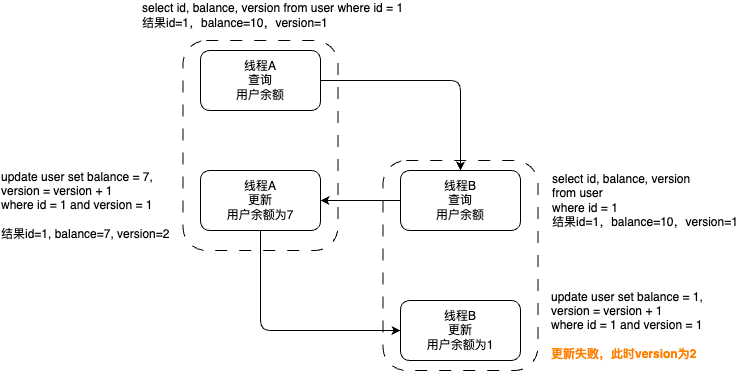

MySQL锁机制揭秘：从行锁到表锁，共享锁到排他锁，悲观锁到乐观锁的全面解读


<!-- more -->

# MySQL有哪些锁

## 1、按照锁的粒度划分

### 行锁

是最低粒度的的锁，锁住指定行的数据，加锁的开销较大，加锁较慢，可能会出现死锁的情况，锁的竞争度会较低，并发度相对较高。但是如果where条件里的字段没有加索引，则加的行锁会自动升级为表锁，因为行锁是基于索引去进行操作的，所以想要加行锁，就一定要在条件字段为索引的基础上进行操作。

### 表锁

锁住指定的表，粒度较大，但是加锁的开销小，加锁快，不会出现死锁，且锁的竞争度会较为激烈，并发度比行锁要低很多。

### 全局锁

粒度最大的锁，会锁住整个库，所有的表都不能进行更新插入操作，只能读。

全局锁命令如下：

```sql
flush tables with read lock;
```

### 页锁（仅了解即可，几乎用不到）

是仅在BDB（Blackhole黑洞）引擎上所支持的一种锁。页锁就是在数据页上，以页为维度进行锁定的，一页里面会有多行数据。页锁的开销是介于行锁和表锁之间的，并发度一般。


## 2、按照互斥性划分

### 共享锁（读锁）

一个事务给某行数据加上共享锁之后，其他事务就不能再加拍排他锁，但是可以加共享锁。因为读操作不会去改变数据信息，所以可以允许多个事务去共享同一个共享锁，并行去读取数据，而不会互相影响。

### 排他锁（写锁）

一个事务给某行数据加上排他锁之后，其他事务就不能再给这行数据加任何锁，即不允许写，也不允许读。所以排他锁可以确保在同一时刻，一个被加上锁的资源只会有一个事务去进行更新操作，有效避免了多个事务同时对一条数据进行修改，导致最终出现数据不一致问题。


## 3、按照性能划分

> 注意：乐观锁、悲观锁、意向锁都不是mysql里实际上真正的锁，而是由开发人员定义出来区分两种类型锁的设计思想。


### 悲观锁（PCC）

悲观锁（Pessimistic Concurrency Control）的思想是，持有一种很悲观消极的态度，默认为在数据资源被外部访问时，一定会出现冲突，所以在一个线程在数据处理的过程中都会持有锁资源，保证在同一时刻，只有一个线程可以访问到这个数据，具有排他性。

一般悲观锁都是直接使用mysql数据库的行锁和表锁去实现。


### 乐观锁（OCC）

乐观锁（Optimistic Concurrency Control）的思想是，持有一种乐观的态度，认为即使是在并发的场景下，对于数据资源的访问，也不会出现冲突，所以不会去加锁，而是在数据进行提交更新操作的时候，才会去判断此次提交是否存在冲突，如果冲突了，便在代码逻辑层面去处理冲突之后的处理方案，是直接结束本次更新操作，还是重新再去尝试更新。


**例如**

user表有数据id为1，balance余额为10。

现在想实现在并发的场景下，去修改余额（线程A请求，需要扣减余额3，线程B请求，需要扣减余额9），需要避免出现余额为负数。

实现方案，给user表加一个版本号字段version，每次更新数据时，数据更新行的version版本号要加1，且在执行更新操作的时候，where条件里需要带上版本号。

**操作流程**



**详细过程解析**

线程A和线程B同时获取到用户的余额为10，数据版本为1。

然后线程A先执行了更新操作，将用户的余额改成了7（线程A要扣减余额3），数据版本也变成了2。

紧接着线程B也来执行更新操作了，但是因为线程B查询用户余额时，线程A还没有更新数据，所以线程B要将用户的余额改成1（线程B要扣减余额9）。

但是在更新时，因为线程B拿到的数据版本是1，而此时的数据版本已经成为了2，所以线程B的更新操作失败了。

此时线程B接收到更新操作失败的结果后，可以选择直接抛出异常给用户，或者重新查询用户余额之后（注意，重新查询用户余额的操作，只能在数据库事务隔离级别为读已提交下进行，或者重新开一个事务），再去尝试扣减余额操作。


### 意向锁（仅了解即可）

意向锁可简单理解为在操作行锁时，在表上添加了一个标识，表明这个表已经存在了共享锁或排他锁，其他事务在想加锁时，只需要到表上判断下这个标识就知道自己能否继续往下获取到锁。

深入了解可看文章 《  [MySQL的意向锁](./103.MySQL的意向锁)  》


### 间隙锁（Gap-Lock）

> 间隙锁是InnoDB在可重复读的隔离级别下，为了解决幻读而引入的一种锁机制。
>
> 间隙锁只会在数据表的隔离级别为可重复读隔离级别下才能生效。

是在索引记录之间的间隙上加的一个锁，是锁定了一个数据区间，比如一数据表的字段a数据为[1, 2, 5, 9]，如果sql如下

```sql
select * from tablename where a = 3 for update;
```

，则加的间隙锁就是[2, 5]，间隙的范围是根据检索条件向下寻找最靠近检索条件的记录值A，用于作为左区间，向上寻找最靠近检索条件的记录值B，用于作为右区间，即锁定的间隙为（A，B）。加上了间隙锁，则[2, 5]区间的数据都不能再进行操作，直到锁释放。


## 4、加锁方式

查询语句加共享锁

```sql
# 如果id有索引，则是加的行级共享锁，如果id没有索引，则加的是表级共享锁
select * from tablename where id = 'xxxx' lock in share mode;
```

查询语句加排他锁

```sql
# 如果id有索引，则是加的行级排他锁，如果id没有索引，则加的是表级排他锁
select * from tablename where id = 'xxxx' for update
```

在操作delete、update、insert语句时，数据库会自动加上排他锁（如果条件有索引，则是加的行级锁，如果条件没有索引，则加的是表级锁）。