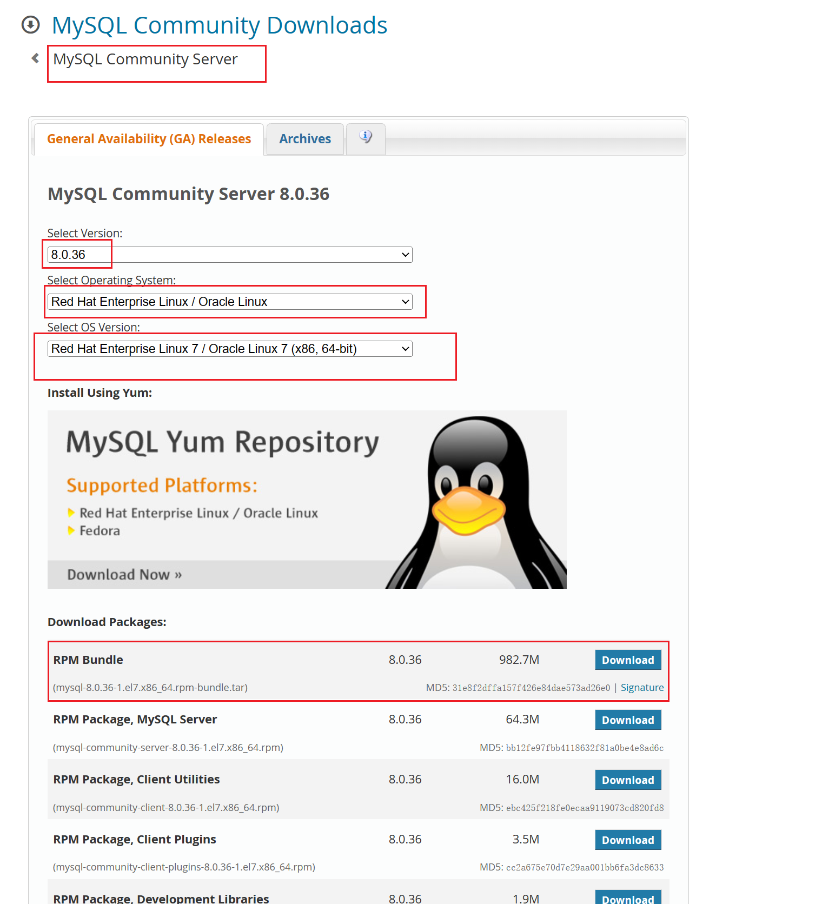
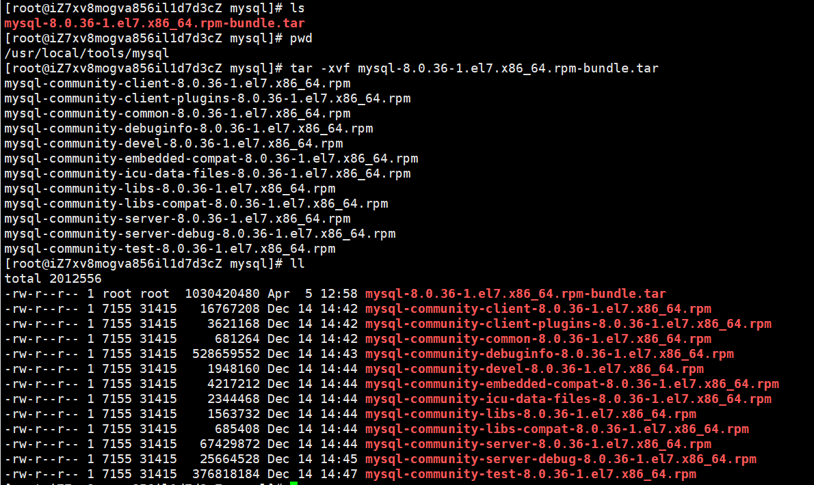
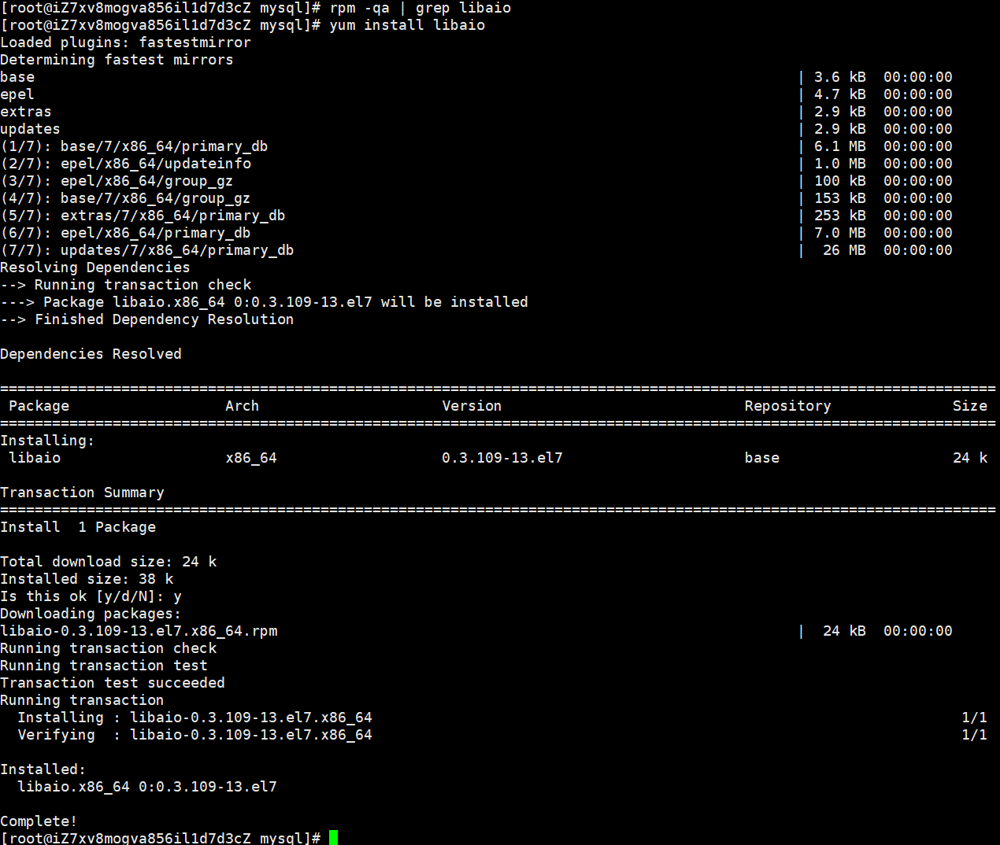
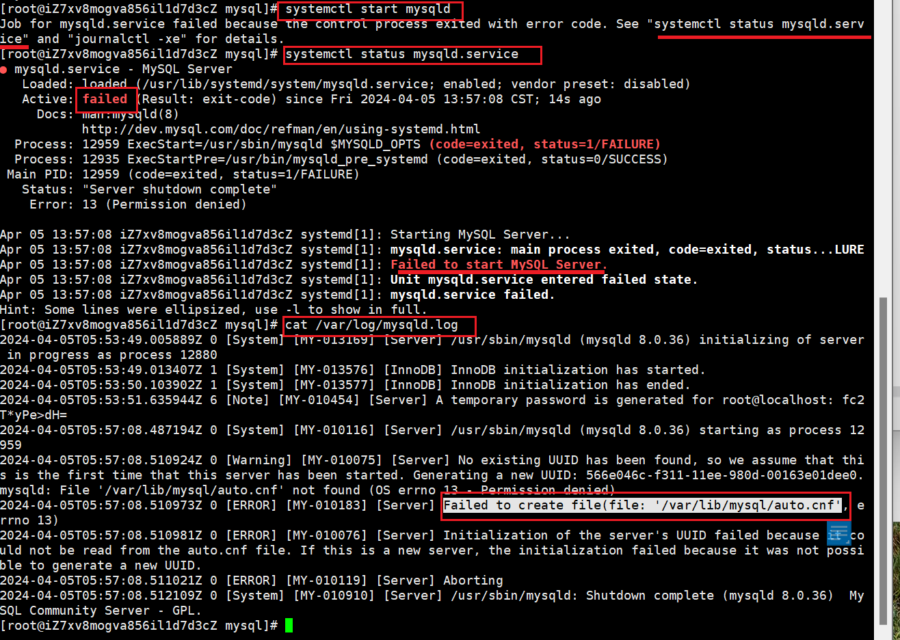
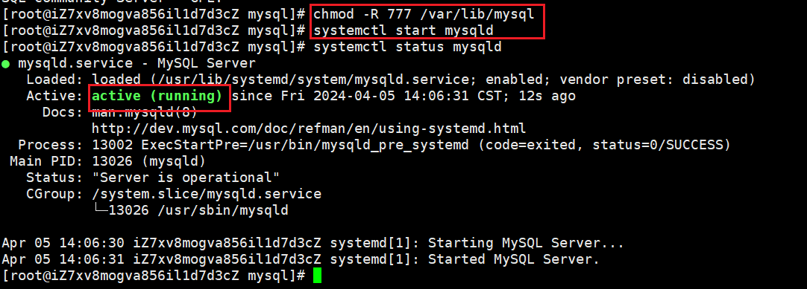
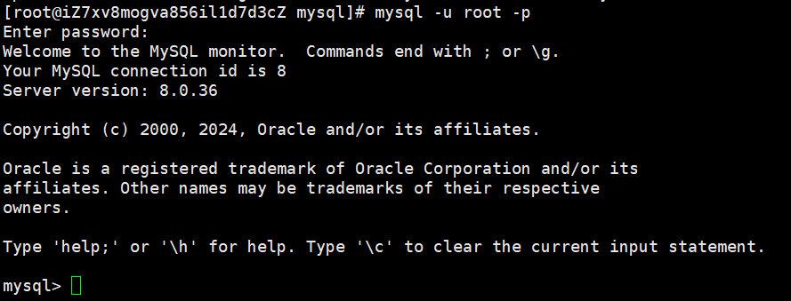

包含Linux和Windows系统两个版本下MySQL数据库的详细安装步骤。

<!-- more -->

# MySQL数据库安装部署

> 如果是云服务器，记得在安全组/防火墙里开放3306端口

## MySQL下载

下载地址：https://dev.mysql.com/downloads/mysql/


## Linux系统安装步骤

> 系统：CentOS7
>
> 安装包下载时选择Red Had Enterprise Linux操作系统，Liunux 7的x86， 64-bit版本
>
> 然后下载RPM Bundle（rpm的所有安装包）




### 1. 解压rpm-bundle压缩包

```shell
tar -xvf mysql-8.0.36-1.el7.x86_64.rpm-bundle.tar
```




可删除用不到的包，保留6个有需要的包


### 2. 检查环境

检查libaio环境

```
rpm -qa | grep libao
```

检查是否有打印如下信息


如果没有打印，则需要执行如下命令去安装

```
yum install libaio
```




检查net-tools环境

```
rpm -qa | grep net-tools
```

检查是否有打印如下信息


如果没有打印，则需执行如下命令

```
yum install net-tools
```

### 3. 按顺序依次安装rpm包

#### 1. mysql-community-common

执行命令：

   ```
rpm -ivh mysql-community-common-8.0.36-1.el7.x86_64.rpm
   ```

效果：

#### 2. mysql-community-client-plugins

执行命令：

   ```
rpm -ivh mysql-community-client-plugins-8.0.36-1.el7.x86_64.rpm
   ```

效果：


#### 3. mysql-community-libs

执行命令：

   ```
rpm -ivh mysql-community-libs-8.0.36-1.el7.x86_64.rpm
   ```

可能会报错：


需要执行如下命令来移除系统自带的依赖：

   ```
yum remove mysql-libs
   ```

效果如下：


然后重新执行rpm包安装命令

   ```
rpm -ivh mysql-community-libs-8.0.36-1.el7.x86_64.rpm
   ```

效果：


#### 4. mysql-community-client

执行命令：

   ```shell
rpm -ivh mysql-community-client-8.0.36-1.el7.x86_64.rpm
   ```

效果：


#### 5. mysql-community-icu-data-files

执行命令：

```
rpm -ivh mysql-community-icu-data-files-8.0.36-1.el7.x86_64.rpm
```

效果：


#### 6. mysql-community-server

执行命令：

```
rpm -ivh mysql-community-server-8.0.36-1.el7.x86_64.rpm
```

效果：


### 4. 检查是否安装成功

执行命令

```
[root@iZ7xv8mogva856il1d7d3cZ mysql]# rpm -qa | grep -i mysql
[root@iZ7xv8mogva856il1d7d3cZ mysql]# mysql --version
```


### 5. 初始化MySQL

执行以下命令，并记录生成的用户密码root的随机密码

   ```
[root@iZ7xv8mogva856il1d7d3cZ mysql]# mysqld --initialize --console
   ```

查看随机密码

随机密码在mysql的日志文件里有打印，日志文件在 /var/log/mysqld.log

```
[root@iZ7xv8mogva856il1d7d3cZ mysql]# cat /var/log/mysqld.log 
```


从日志里可以看到随机密码为 `fc2T*yPe>dH=`


### 6. 启动MySQL服务

执行命令

```
systemctl start mysqld
```

可能出现如下异常


按照他的提示去执行命令，看看服务状态

```
systemctl status mysqld.service
```

发现服务启动失败了，再去mysql的日志里看看详细的异常情况

```
cat /var/log/mysqld.log
```

发现 /var/lib/mysql 目录下创建文件 auto.cnf 失败



解决方案，给 /var/lib/mysql 目录加权限

执行命令：

```
chmod -R 777 /var/lib/mysql
```

然后重新执行启动命令

```
systemctl start mysqld
```

启动后，可执行命令查看下服务的状态

```
  systemctl status mysqld
```



状态为 `active (running)` 则代表mysql服务启动成功

### 7. 访问MySQL数据库

> **密码为第5步初始化mysql时生成的随机密码**

   ```
mysql -u root -p
   ```




### 8. 修改MySQL密码

   ```
alter user 'root'@'localhost' identified by '新密码';
   ```


   ```
mysql> alter user 'root'@'localhost' identified by '新密码';
Query OK, 0 rows affected (0.02 sec)
   ```


### 9. 刷新权限使修改的密码生效

   ```
flush privileges;
   ```


   ```
mysql> flush privileges;
Query OK, 0 rows affected (0.02 sec)
   ```


### 10. 设置用户远程访问权限

   ```
RENAME USER `root`@`localhost` TO `root`@`%`;
   ```


   ```
mysql> RENAME USER `root`@`localhost` TO `root`@`%`;
Query OK, 0 rows affected (0.01 sec)
   ```


### FAQ

1. CentOS系统里部署的mysql，其日志文件一般都在/var/log/mysqld.log

2. 可以使用 `locate my.cnf` 命令查询mysql的配置文件 `my.cnf`的地址

   

   如果提示locate命令不存在，则可执行如下命令安装 `locate` 之后再去查询 `my.cnf` 配置文件的地址

   ```
   [root@iZ7xv8mogva856il1d7d3cZ ~]# yum install mlocate
   [root@iZ7xv8mogva856il1d7d3cZ ~]# updatedb
   ```


3. 查看MySQL默认读取my.cnf的目录

   > 如果没有设置使用指定目录的my.cnf，mysql启动时会读取安装目录根目录及默认目录下的my.cnf文件。

   查看mysql启动时读取配置文件的默认目录方式

   执行命令：

   ```
   mysql --help | grep 'my.cnf'
   ```

   

   会优先读取 `/etc/my.cnf` 配置文件

4. mysql的重启命令

   ```
   service mysqld restart
   ```


5.


## Windows系统安装步骤

> 安装包可以选择下载msi或zip，以下为zip模式安装步骤
>
> 下载了mysql的zip安装包之后解压即可；

### 1. 初始化MySQL

在mysql安装包的bin目录下使用cmd执行以下命令，并记录生成的用户密码root的随机密码

   ```
mysqld --initialize --console
   ```


   ```
E:\apply\mysql\mysql-8.0.31-winx64\bin>mysqld --initialize --console
2023-07-13T14:18:28.825887Z 0 [System] [MY-013169] [Server] E:\apply\mysql\mysql-8.0.31-winx64\bin\mysqld.exe (mysqld 8.0.31) initializing of server in progress as process 22544
2023-07-13T14:18:28.852772Z 1 [System] [MY-013576] [InnoDB] InnoDB initialization has started.
2023-07-13T14:18:29.427576Z 1 [System] [MY-013577] [InnoDB] InnoDB initialization has ended.
2023-07-13T14:18:30.032669Z 6 [Note] [MY-010454] [Server] A temporary password is generated for root@localhost: .Ri0?lW#g,w0
   ```


### 2. 安装MySQL服务

   ```
mysqld --install
   ```


   ```
E:\apply\mysql\mysql-8.0.31-winx64\bin>mysqld --install
Service successfully installed.
   ```


### 3. 启动MySQL服务

   ```
net start mysql
   ```


   ```
E:\apply\mysql\mysql-8.0.31-winx64\bin>net start mysql
MySQL 服务正在启动 .
MySQL 服务已经启动成功。
   ```


### 4. 访问MySQL数据库

> **密码为第一步初始化mysql生成的随机密码**

   ```
mysql -u root -p
   ```


   ```
E:\apply\mysql\mysql-8.0.31-winx64\bin>mysql -u root -p
Enter password: ************
Welcome to the MySQL monitor.  Commands end with ; or \g.
Your MySQL connection id is 9
Server version: 8.0.31

Copyright (c) 2000, 2022, Oracle and/or its affiliates.

Oracle is a registered trademark of Oracle Corporation and/or its
affiliates. Other names may be trademarks of their respective
owners.

Type 'help;' or '\h' for help. Type '\c' to clear the current input statement.

mysql>
   ```


### 5. 修改MySQL密码

   ```
alter user 'root'@'localhost' identified by '新密码';
   ```


   ```
mysql> alter user 'root'@'localhost' identified by '新密码';
Query OK, 0 rows affected (0.02 sec)
   ```


### 6. 刷新权限使修改的密码生效

   ```
flush privileges;
   ```


   ```
mysql> flush privileges;
Query OK, 0 rows affected (0.02 sec)
   ```


### 7. 设置用户远程访问权限

   ```
RENAME USER `root`@`localhost` TO `root`@`%`;
   ```


   ```
mysql> RENAME USER `root`@`localhost` TO `root`@`%`;
Query OK, 0 rows affected (0.01 sec)
   ```

  