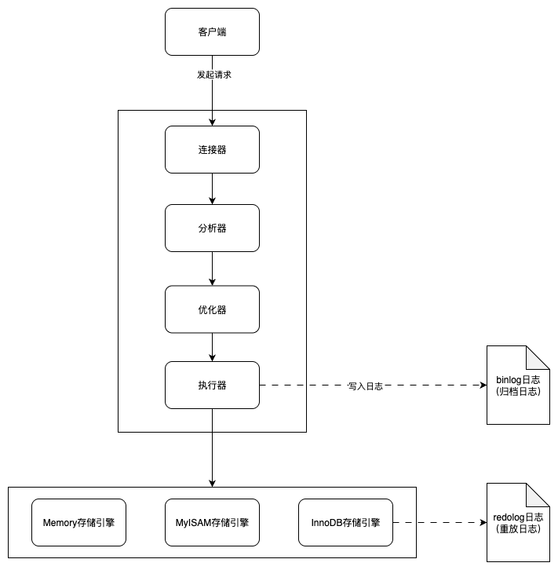

MySQL的核心由Server层、存储引擎、持久化数据物理文件组成。

又由binlog日志、undolog日志、redolog日志为数据安全和稳定提供保障。

<!-- more -->

## Server层

由连接器-->分析器-->缓存（mysql5.8之后被弃用，不再深入了解）-->优化器-->执行器组成

**连接器：** 主要负责访问权限校验

```sql
# 可使用该命令查看数据库的所有连接状态，如果存在大量sleep连接，这需要及时清理，避免数据库连接资源紧张
show processlist;
```

建立连接的过程较为复杂且耗时，所以尽量使用长连接，也就是我们常用的连接池模式，一个长连接一个线程使用完后不断开，继续由其他线程使用，这样几乎就相当于省略了创建连接的过程。

**分析器：** 分析关键字和sql语法是否正确

**优化器：** 确认SQL执行先后顺序（确认是大表驱动小表还是小表驱动大表）、以及选择最优的索引，从而生成最终的执行方案。

**执行器：** 操作具体的存储引擎，并返回执行结果


> Server层负责处理、解析、优化执行的SQL语句。
>
> 负责访问者权限的认证。
>
> 各类SQL函数以及存储过程功能，也都是由Server层提供的。
>
> 数据的复制、备份、恢复功能也是Server层提供的。
>
> 其中恢复功能所依赖的binlog日志，就是Server层的日志系统。





### binlog日志（归档日志）

#### binlog日志里记录了些什么数据？

binlog日志里主要记录所有会修改数据库数据的SQL语句，也就是INSERT、UPDATE、DELETE等SQL语句。

例如SELECT语句，只是查询数据，并没有对数据库数据进行修改，所以，binlog 日志里不会记录SELECT语句。


#### binlog日志主要用来做什么的？

binlog日志属于是MySQL的归档日志，主要用于数据复制和恢复。

例如MySQL的主从架构，从节点的数据就是从主节点的binlog日志来的。

例如数据库服务出现异常，则可以根据binlog日志来进行数据恢复（结合redo log日志一起进行恢复）。所以生产环境一般都建议开启binlog日志，但是需要注意binlog日志的大小，要注意设置合理的binlog日志的留存时间，否则会出现binlog日志占满服务器磁盘空间，最终导致服务不可用的情况。


## 存储引擎层

存储引擎：主要负责存储数据和磁盘进行交互，以及向外（执行器）提供ibd磁盘文件数据的读写操作接口。

存储引擎MyISAM不支持事务。

存储引擎里innodb是mysql5.7之后才有的，是MySQL的默认存储引擎，支持事务， **事务隔离级别是可重复读** ，拥有行级锁，以及属于自己的日志系统，redo log日志和undo log日志。

存储引擎里有个BufferPool缓冲池，主要用来缓存SQL操作所设计到的数据所在的数据页（一个数据页里存在多条数据），如果BufferPool里不存在数据，则存储引擎会先从磁盘文件里将涉及到数据的数据页，读取到BufferPool里，然后再去进行操作。


### undo log日志（回滚日志）

#### undo log日志里记录了些什么数据？

记录了数据修改前的数据镜像。

如：

insert语句，就会记录插入行数据的主键Id（用于回滚时删除）。

update语句，会记录执行update修改数据前的旧数据（用于回滚时恢复旧数据）。

delete语句，会记录被删除数据行的完善数据（用于回滚时重新插入）。


> undo log日志里除了会记录更新等操作的数据以外，还会记录以下即可基本的数据。
>
> 事务id（trx_id）：就是表明这一行undolog数据是属于哪个事务的，是哪个事务进行的操作。
>
> 回滚指针（roll_pointer）：用于指向上一个版本的undo log日志记录。具体示例可参考《 [MVCC机制解析](104.MVCC机制解析：提升数据库并发性能的关键.md) 》。


#### undo log日志主要用来做什么的？

主要用于支持 `事务的原子性` （一个事务中所有的操作，要么都执行，要么都不执行）和 `MVCC多版本并发控制` （《 [MVCC机制解析](104.MVCC机制解析：提升数据库并发性能的关键.md) 》），提供数据回滚所需的历史数据依据。


### redo log日志（重做日志）

#### redo log日志里记录了些什么数据？

记录了所有对innodb存储引擎表的数据页的修改更新操作。但是和binlog日志不同，redo log日志记录的是数据页的物理变化，而不是向binlog日志一样记录的SQL语句。且redo log日志是 **顺序写入** （性能要高于随机I/O）（binlog日志是 **追加写入** ），空间大小是固定的，写满后会循环覆盖。

#### redo log日志主要用来做什么的？

主要用来数据库突然崩溃后恢复数据的。


## 持久化数据物理文件

innodb存储引擎的物理文件为 表名.ibd

MyISAM存储引擎的物理文件为 表名.myd（数据文件）、表名.myi（索引文件）


## MySQL的执行过程


