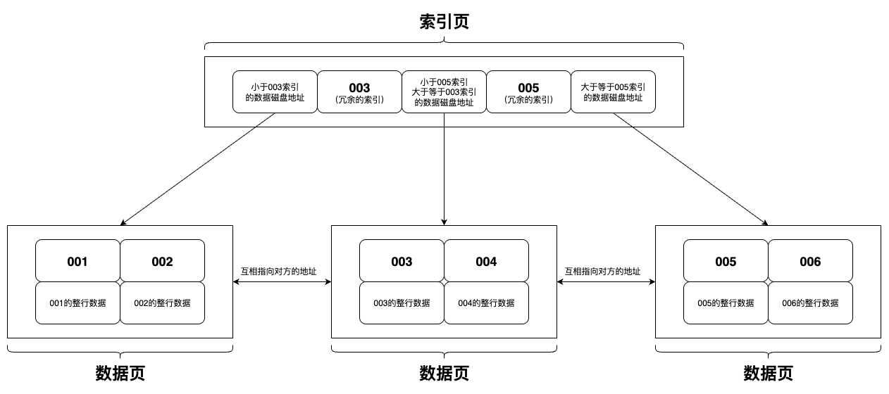
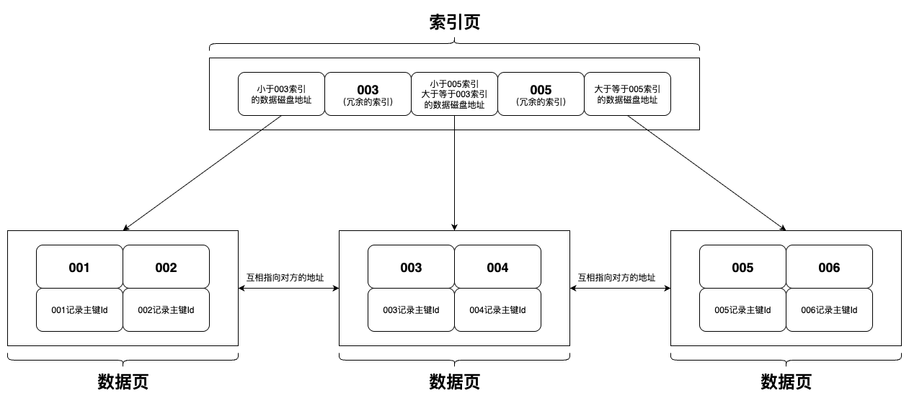
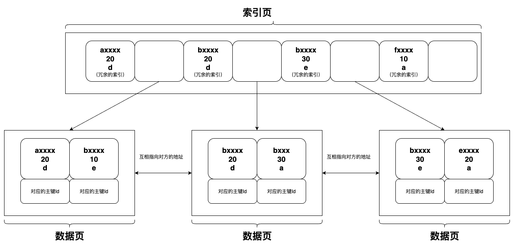
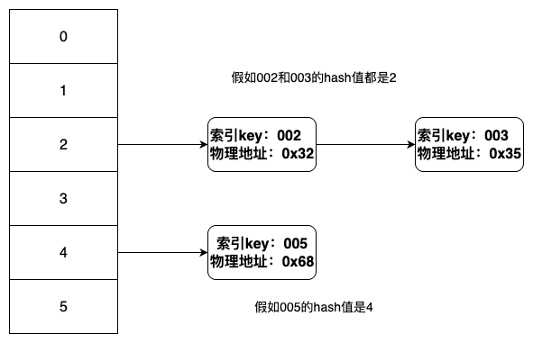

索引的本质是排好序的数据结构。

MySQL的主键索引是B+树的改良版，非组件索引可以是B+树，也可以是Hash结构。

MySQL的主键Id推荐自增主键，或雪花Id这类有序递增的。

<!-- more -->


## 为什么推荐自增主键？

自增主键是有序递增的，非常符合索引的本质特性，在构建索引数据结构时，效率会高很多，例如由字符串id去构建索引，极端情况下需要比较 字符串id 的每个字符，才能确定最终的先后顺序，而使用自增主键，则只是两个数字进行大小比较，会方便快捷很多。


## B树和B+树的区别


| 比较点           | B树                                                          | B+树                                                         |
| ---------------- | ------------------------------------------------------------ | ------------------------------------------------------------ |
| 索引元素重复     | 不重复                                                       | 会有冗余索引数据                                             |
| 完整数据存储方式 | 每个索引节点都会存储完整的数据                               | 只有最底层的叶子节点才会存储完整的数据，<br />上层的非叶子节点都是只有索引数据，<br />为了一页物理存储地址里可以存放更多的索引。<br />（非主键的二级索引不会存储完整数据，<br />整个innodb引擎表里只有主键索引是聚集索引，<br />存储完整数据。非主键索引的叶子节点存放的<br />是主键Id） |
| 节点是否有序     | 从左到右递增排序                                             | 从左到右递增排序                                             |
| 叶子节点是否连接 | 不连接<br />（所以在进行区间查找时，如果跨<br />页，则需要重新从根结点重新查<br />找，所以效率会低于B+树） | 连接，B+树的叶子节点都有用指针连接<br />（所以B+树的区间范围查询性能要比B树好）<br />（MySQL对B+树进行了调整， 两个叶子节<br />点会互相连接，存储对方的指针） |


> 数据结构还有二叉查找树、平衡二叉树、红黑树、B树，那为什么最终选择了B+树呢？
>
> MySQL数据库选择使用B+树作为底层数据结构的分析可参考
>
> 《 [MySQL选择B+树作为索引数据结构的原因分析](109.MySQL选择B+树作为索引数据结构的原因分析.md) 》


## 索引类别

### 什么是聚集索引和非聚集索引？

聚集索引可以理解是MySQL的主键索引，索引形成的数据结构里，叶子节点会存储完整的数据。

非聚集索引是MySQL的普通索引，索引形成的数据结构里不会存储完整数据，存储的是数据的主键Id。

聚集索引的效率要比非聚集索引要高，因为非聚集索引还需要那主键Id去查询聚集索引，需要查两个文件，就是回表操作。

> MyISAM存储引擎就是非聚集的，他的索引文件和数据文件是分开的。


### 为什么非主键索引结构的叶子节点存储的是主键而不存储完整的数据？

1. 非常的占用磁盘空间，有多少索引，容量就膨胀多少倍，存储量级会非常夸张。
2. 一致性，需要保证所有索引的叶子节点的数据一致。


### 聚集索引

主键索引（聚集索引）B+树数据结构示意图




### 非聚集索引

非主键索引（非聚集索引）B+树数据结构示意图



非主键索引的叶子节点里不会存储完整的数据，只存储该行数据的主键Id，拿数据时，是需要再回表去主键索引里获取的。


查询innodb存储引擎物理数据页的大小

```sql
show global status like 'Innodb_page_size';
```

默认为16KB。

也就是说，索引页，一页有可以存储（16KB / (索引数据大小+磁盘地址大小)）条数据（大概1170个），如果数据索引形成的B+树的高度是3，完成的一条业务数据有1KB，则数据页是一页可存储16条数据，3层的B+树就可以存储1170 * 1170 * 16 =21,902,400 条数据。

树的层数（高度）少了，也就代表则查询比较的次数少，获取数据的效率就快。


## 联合索引（复合索引）

### 创建联合索引语句

```sql
ALTER TABLE table_name
ADD INDEX ix_index_name (字段1 ASC, 字段2 ASC, 字段3 DESC) USING BTREE;
```

### 理解分析

可以理解为联合索引会先按照第一个字段进行排序，然后在第一个字段排好序的基础上，再根据第二个字段进行排序，第三个字段则在上述基础上进行最后排序。

所以这样构成的一个索引数据结构，按照第一个字段-->第二个字段-->第三个字段这个顺序去查询，就是有序且快速的，也可以进行区间范围查找。

但如果跳过第一个字段，直接按照第二个字段或第三个字段去查询，那就会发现，单独的第二个字段和第三个字段，在这个索引数据结构里是无序的，没有办法去进行区间范围查找。

这也就是我们常说的 <u>**最左前缀原则**</u> 。

### 数据结构示意图




## 扩展

索引除了有B+树的结构，还存在Hash结构

就是对索引的key进行一个hash计算，然后根据计算得到的hash插入到一个hash数组里，如果hash冲突了，则会由该节点的第一个数据会指向第二个数据的地址。

在某些情况下，Hash结构比B+树的性能要高，但是也存在很多的缺点，也就是因为这些缺点，几乎不使用Hash的数据结构。

### 缺点

1. 无法进行区间范围查询，仅支持“=”和“in”。

2. 数据量大的情况下，会存在大量hash冲突的问题，这也就会导致一个节点下面挂载着很多的数据，会使查询操作时的比较次数不可控。


### Hash结构示意图


