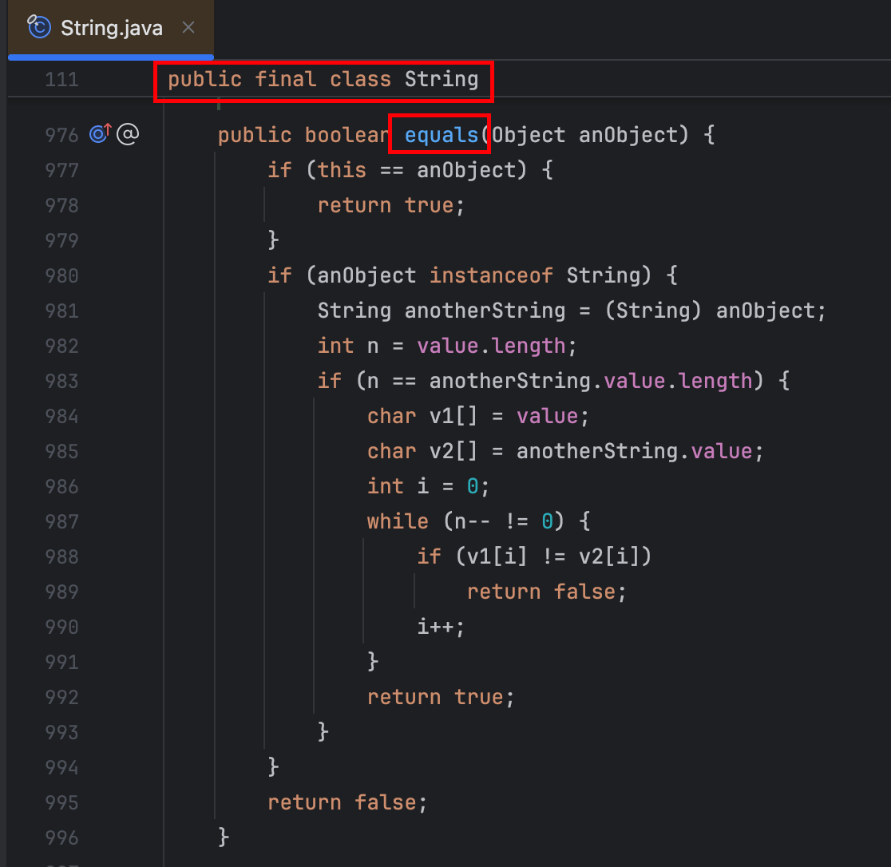

本文深入探讨了Java编程语言中用于对象比较的两种主要方式—— `==` 运算符和 `equals() `方法之间的区别。首先，文章解释了 `==` 运算符是如何用于比较两个变量是否引用同一个对象的内存地址。接着，详细分析了 `equals() `方法的设计目的及其默认实现，以及它如何用于比较两个对象的内容是否相等。此外，本文通过示例代码演示了在不同场景下应如何正确选择使用 `==` 或 `equals() `方法，并探讨了重写 `equals()` 方法时的最佳实践。对于准备Java面试的技术人员而言，本文提供了一个清晰的理解框架，帮助在实际开发中做出正确的选择。

<!-- more -->

# equals()和==的区别

在Java面试中，经常会被问到 `== `运算符和 `equals()` 方法的区别。这个问题不仅考察了候选人对Java基础知识的理解，也反映了他们对面向对象编程原则的掌握程度。本文将详细探讨这两者的区别，并提供一些实用的指导原则。

## 什么是==

`==` 运算符用于比较两个变量是否指向内存中的同一个位置，也就是说，它们是否引用同一个对象。对于基本数据类型（如int、char、string等），`==` 比较的是它们的值是否相等。而对于引用数据类型（如String、Object等），`==` 比较的是它们的引用地址是否相同。

**示例代码：**

```java
String str1 = new String("hello");
String str2 = new String("hello");
System.out.println(str1 == str2); // 输出 false
```

在这个例子中，尽管 `str1` 和 `str2` 包含相同的字符串内容，但由于它们指向的是不同的内存地址，所以 `==` 的结果为 `false` 。

## 什么是equals()

`equals()` 方法则是用来比较两个对象的内容是否相等。它定义在 `java.lang.Object` 类中，所有Java类默认继承了这个类，因此都有一个默认的 `equals()` 实现。

然而，默认实现仅比较对象的引用地址，因此在大多数情况下，我们需要重写 `equals()` 方法以实现内容的比较。

例如String类，String类虽然是引用类型，但是String在类里面重写了equals()方法，在方法内部比较的是字符串中各个字符是否全部相等。



**示例代码：**

```java
String str1 = new String("hello");
String str2 = new String("hello");
System.out.println(str1.equals(str2)); // 输出 true
```

在这个例子中， `equals()` 方法比较的是两个字符串的内容，由于它们的内容相同，所以返回 `true` 。


## 如何正确使用？

正确使用 `==` 和 `equals()` 取决于你的需求。如果你关心的是对象的引用而不是内容，那么应该使用 `==` 。如果你需要比较对象的内容是否一致，则应该调用 `equals()` 方法。

在重写 `equals()` 方法时，还需要注意以下几点：

1. 对称性：如果 `a.equals(b)` 返回 `true` ，那么 `b.equals(a)` 也应该返回 `true` 。
2. 反身性：任何非空引用 `x` ， `x.equals(x) `应该返回 `true `。
3. 传递性：如果 `a.equals(b)` 返回 `true` ，并且 `b.equals(c)` 返回 `true`  ，那么  `a.equals(c)`  也应该返回 `true` 。
4. 一致性：只要对象没有改变，多次调用 `equals()` 方法都应该得到相同的结果。
5. 对 `null` 的处理： `equals()` 方法应该能够识别 `null` 值。

遵循这些原则可以帮助确保你重写的 `equals()` 方法既可靠又有效率。

------

通过以上内容，我们不仅明确了 `==` 运算符和 `equals()` 方法的区别，还了解了如何在实际开发中正确使用它们。

希望这篇文章对你在Java面试和技术实践中有所帮助！