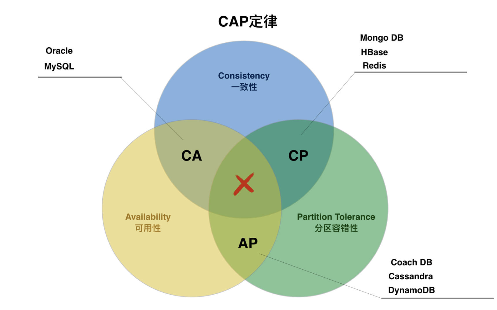

CAP理论指出，在分布式系统中，一致性（Consistency）、可用性（Availability）和分区容忍性（Partition Tolerance）这三个特性无法同时完全满足，最多只能同时实现其中的两个。本文详细解释了每个特性的含义及其在实际系统中的表现形式，再通过具体的例子说明了在不同场景下如何权衡这些特性。

<!-- more -->

当学习分布式的redis、mq等中间件时，都会看到有提到CAP。

CAP理论是学习分布式必备的一个概念知识点。

CAP理论由三个特性组成，分别是一致性（Consistency）、可用性（Availability）、分区容错性（Partition Tolerance）。

> 注意：一般的分布式的系统服务或中间件，是不能同时拥有这三个特性的，只能同时拥有其中的两个特性，要么是保证系统的一致性和分区容错性（CP），要么保证系统的可用性和分区容错性（AP）。

## 一致性（Consistency）

当一条数据更新完成之后，这个分布式系统里所有的服务节点，在同一个时间点读取同一条数据得到的信是需要完全一致的。

**例如：**

我在分布式系统里的服务A处操作更新数据，将一条数据更新为 “张三” ，当服务A响应更新成功之后，此时不管从服务A还是从服务B读取这条数据，得到的都要是 ”张三“ ，而不能是其他。

**存在的问题：**

当服务A响应数据更新成功之后，服务A是需要将更新的数据同步到服务B、服务C等其他分布式系统节点的，这个同步的过程就会导致数据的实时性存在一定的延迟。

会出现在服务A更新完成之后，数据还没有同步到其他服务节点时，有个请求需要从服务B节点读取这条数据，此时就会导致数据的不一致问题。

而为了保证数据的一致性，解决不一致的问题，就会对这个数据资源进行一个加锁操作，加锁之后，所有的请求就不得对该数据资源进行操作，请求会进入阻塞状态。

只有的等各个服务的数据同步完之后，才会释放这个资源的锁。

所以要保证分布式系统各服务之间数据的一致性，就势必会影响到整个系统的性能，对其吞吐量会有一定的影响。

## 可用性（Availability）

对于所有的读操作和写操作，系统一直处于可用的状态，且响应时间正常，不会出现超时，响应错误等不友好的情况（但是不保证获取到或操作的数据是最新数据）。

可用性呢，可以简单的理解为牺牲了一定的数据一致性，不能等到分布式系统的各个服务进行数据同步完成之后，才来响应客户的请求，为了性能需要立刻马上去响应用户的请求。

所以如果要保证系统的可用性，分布式系统的各个服务进行数据同步时，不能进行加锁阻塞用户的请求操作，只能异步的去进行数据同步写操作。

## 分区容错性（Partition Tolerance）

一个分布式系统的各个服务是分散部署在各个服务器、各个地区机房的。

当分布式系统的某一节点服务在遇到各种各样的网络、服务器故障之后，无法正常提供服务时，不会影响到整个系统，其他节点的服务依旧可以正常提供服务，这个是分布式的初衷，也是分布式系统需求具备的基本能力。

如果达不到这个能力，那这个系统都不能称为一个分布式系统。

**例如：** redis主从架构集群，被分散部署在不同的服务器、机房里面，当其中一个redis主节点挂掉宕机之后，会由被部署在其他服务器上的redis从节点顶上来，整个系统不会因为其中一个redis节点出现问题，而停止提供服务。

## 总结

分布式系统一定是要保证分区容错性的，然后就是在一致性和可用性之间进行一个取舍。

为了保证数据的一致性，就势必会因为加锁、网络波动等原因，去阻塞用户的请求，这就必然达不到可用性的要求。

而为了保证可用性，而使分布式系统的各个服务节点之间用异步操作去同步数据，就定然会在导致数据还没同步完成时，用户请求到旧数据的问题，就无法达到一致性的要求。

所以一个分布式系统只能达到CAP理论其中的两个特性，要么是保证系统的一致性和分区容错性（CP），要么保证系统的可用性和分区容错性（AP）。

## BASE理论

> BASE是基本可用（Basically Available）、软状态（Soft state）、最终一致性（Eventually consistent）。

BASE理论就是针对CAP中一致性和可用性存在冲突，而进行的一个权衡妥协的结果，是基于CAP理论和互联网系统不断实践而逐步演化而来。

BASE理论的核心是，即便无法做到数据的强一致性，系统的每个服务，都可以使用合适的方法，来达到系统数据的最终一致性。

### 基本可用（Basically Available）

分两种情况

1.  **延长响应时间：** 正常情况下，处理用户的请求只需要几百毫秒，但是在进行数据同步时，或系统出现异常情况时，用户的请求响应时间会延长到几秒。
2.  **关闭非必要功能：** 正常情况下，系统的所有功能都可以被正常使用，但是在某些场景下（如双11、新iPhone发布等），部分非必要的功能就会暂时无法使用（例如退货功能在当天就无法使用），以减轻系统压力。

### 软状态（Soft state）

分布式系统各服务之间的数据同步允许一定时间的延迟。

### 最终一致性（Eventually consistent）

分布式系统中各个服务所掌管的数据，在经过一段时间的数据同步后，最终会达到一致，系统不要求其实时性。

