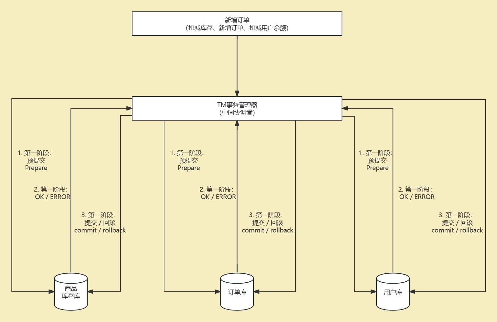
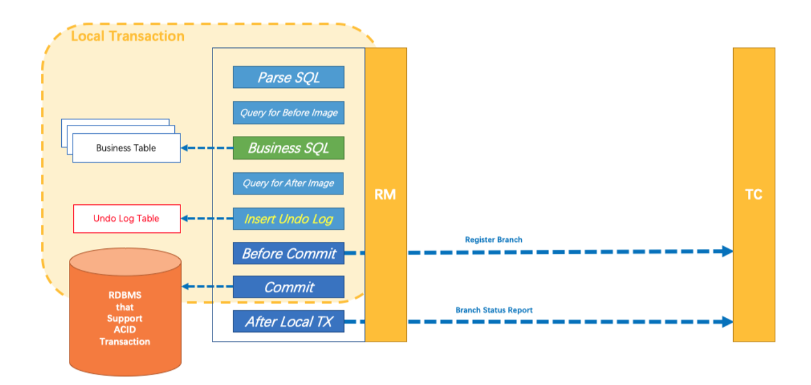
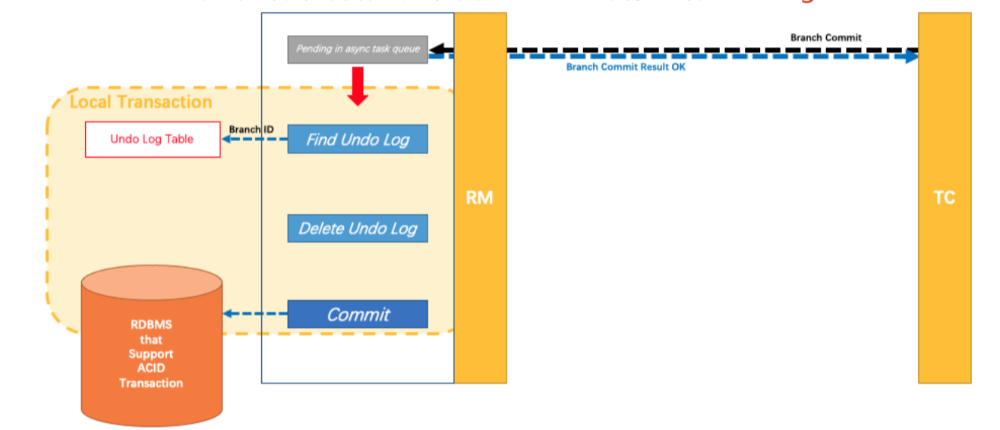
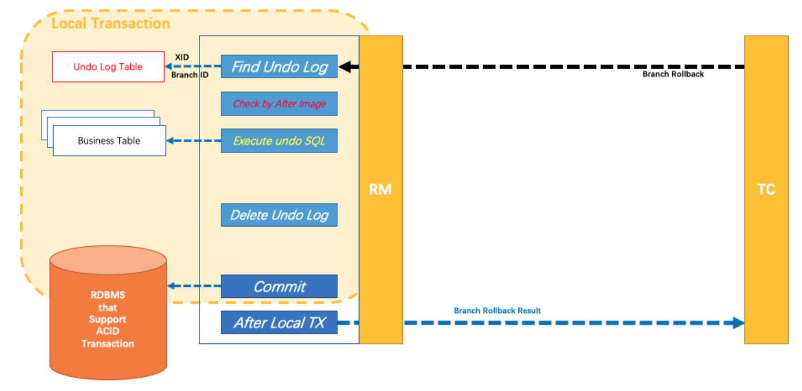

本文深入探讨了分布式事务处理中的关键挑战及其解决方案，重点介绍了Seata这一开源框架如何通过二阶段提交（2PC，Two-Phase Commit）协议来实现分布式事务的一致性。首先，文章概述了事务和分布式事务的基本概念，详细解释了二阶段提交协议的工作原理，包括准备阶段和提交阶段的具体流程。此外，本文还探讨了Seata如何优化传统的二阶段提交机制，以减少在分布式环境中可能出现的问题，如性能瓶颈和故障恢复等。

<!-- more -->


# Seata分布式事务二阶段提交机制全面解读

**下一篇： 《[Seata的安装部署与项目集成](./233.Seata的安装部署与项目集成.md) 》：** 详细讲述了Seata的安装部署和集成到项目的步骤。

## 1. 本地事务

操作单一的一个数据库，这种情况下的事务叫 `本地事务` (Local Transaction);

本地事务的ACID特性由各数据库直接提供支持；

在JDBC编程中，可以通过Connection对象来开启、关闭和提交事务；

代码示例：

只需要引入 `mysql-connector-java` 依赖即可

   ```xml
		<dependency>
            <groupId>mysql</groupId>
            <artifactId>mysql-connector-java</artifactId>
            <version>8.0.33</version>
        </dependency>
   ```


   ```sql
package com.yz.local.transaction;

import java.math.BigDecimal;
import java.sql.Connection;
import java.sql.DriverManager;
import java.sql.PreparedStatement;
import java.sql.SQLException;

/**
 * 本地事务验证
 *
 * @author yunze
 * @date 2023/11/26 0026 14:21
 */
public class LocalTransaction {

    private static final String url = "jdbc:mysql://localhost:3306/t_mall_account";
    private static final String username = "root";
    private static final String password = "123456";

    public static void main(String[] args) throws SQLException {
        String sql = "insert into t_account (id, name, cash_balance) values (?, ?, ?)";

        Connection connection = null;
        PreparedStatement preparedStatement = null;

        try {
            // 加载数据库驱动
            Class.forName("com.mysql.cj.jdbc.Driver");
            // 建立数据库连接，获得连接对象Connection
            connection = DriverManager.getConnection(url, username, password);
            connection.setAutoCommit(false);    // 关闭自动提交，也就是开启手动控制事务的提交
            // 创建和执行PreparedStatement操作
            preparedStatement = connection.prepareStatement(sql);

            // 设置参数
            preparedStatement.setLong(1, 1L);
            preparedStatement.setString(2, "王五");
            preparedStatement.setBigDecimal(3, BigDecimal.valueOf(2000));

            // 执行插入sql语句
            preparedStatement.executeUpdate();

            // 提交事务
            connection.commit();
        } catch (SQLException e) {
            e.printStackTrace();
            // 事务回滚
            assert connection != null;
            connection.rollback();
        } catch (ClassNotFoundException e) {
            throw new RuntimeException(e);
            // 事务回滚
        } finally {
            // 关闭连接资源
            if (preparedStatement != null) {
                try {
                    preparedStatement.close();
                } catch (SQLException e) {
                    e.printStackTrace();
                }
            }

            if (connection != null) {
                try {
                    connection.close();
                } catch (SQLException e) {
                    e.printStackTrace();
                }
            }
        }
    }
}
   ```


## 2. 分布式事务

在微服务架构中，想完成一个业务功能，可能需要涉及到多个服务，甚至是多个数据库，这就需要保证对于多个数据库的数据操作要么一起成功，要么一起失败，以保证多个数据库的数据一致性，这就是 `分布式事务` 所需要干的事情；


## 3. 实现思路：两阶段提交协议（2PC）

### 3.1 基础理解

理解：将一次事务的提交（commit），划分为2个阶段（Phase）；

两阶段提交里有这么两个定义，TM（事务管理器）和RM（资源管理器），一个TM下管理多个RM；

- **第一阶段：（准备提交-->可以提交）**

	TM向所有RM发出`准备提交`请求消息，通知他们准备提交自己事务分支，各个RM则会判断自己的工作是否可以被提交；

	如果可以提交，则执行任务SQL进行持久化，然后告诉TM该RM分支执行成功，执行成功后数据库服务器会将事务的状态改为 `可以提交` （此时事务并不是真正提交了，数据库里还看不到变动更新的数据）；

	如果发生了异常，不能正常提交，则会告诉TM该RM分支执行失败，需要回滚数据；

- **第二阶段：（确认提交-->提交完成）**

  TM根据第一阶段里各个RM返回的消息来决定提交事务还是回滚事务；

	如果所有的RM都返回的是成功，则TM会向所有的RM发送 `确认提交` 请求消息，通知他们正式提交事务，各分支的数据库服务器就会将事务的 `可以提交` 状态改为 `提交完成` 状态（此时事务才是真正的提交，数据库里可以看到变动更新的数据）；

	如果有RM失败了或没有收到某一RM的回应，则会认为事务失败，TM就会通知所有的RM回滚他们自己的事务分支（如果RM分支数据库服务接收不到第二阶段的 `确认提交` 请求消息，也会把处于 `可以提交` 状态的事务撤销）；

例：

> 	现在用户下了个订单，则在调接口新增订单的同时，还需要去扣减用户的余额，和扣减商品的库存，且用户、订单、库存均不在一个数据库中；则此时新增订单这个发起分布式事务的开端为TM（事务管理器），用户、订单、库存的各自事务分支为RM（资源管理器），可将其分别理解为全局事务和分支事务，全局管理各个分支；
>
> 1. TM会通知用户、订单、库存准备提交事务；
> 2. 用户、订单、库存接收到TM的消息后，会执行对应的数据更新等操作（用户扣余额、新增订单、扣减库存），并将执行结果告诉TM；
> 3. 如果用户、订单、库存全部执行成功，则TM会再次向用户、订单、库存发出`确认提交`请求；
> 4. 用户、订单、库存接收到TM的`确认提交`消息后，会正式提交各自的事务，使更新的数据生效；
> 5. 如果之前用户、订单、库存没有全部执行成功，则TM会通知用户、订单、库存回滚事务，撤回之前的数据更新操作；



###  3.2 2PC的隐患

- 数据无法保持一致

  如果第一阶段所有RM分支均提交成功，则第二阶段TM通知所有RM分支确认提交时，有一个RM分支出现网络异常，导致没有接收到确认提交的消息，则会放弃事务。而其他RM又接收到了确认提交消息，最终提交了事务，则最后会导致数据的不一致。

- 同步阻塞

  2PC里所有的参与者都是同步进行的，且是阻塞的，所有RM在第一阶段接收到请求后，都会预先锁定资源，一直到第二阶段commit或rollback之后才会释放。

- 协调者TM故障

  由于RM都是由TM协调进行工作，所以当TM出现故障，会导致已经获取了数据库资源的RM一直阻塞下去，如果在第二阶段，那么所有的RM参与者都还处于锁定事务资源状态中，而无法完成事务释放资源。

## 4. Seata

### 4.1 Seata是什么

Seata是阿里开源的一款分布式事务处理框架，致力于提供高性能和简单易用的分布式事务服务。Seata提供了AT、TCC、SAGA和XA事务模式，其中首推的是AT模式。

Seata官网地址：https://seata.io/zh-cn/

### 4.2 Seata的三大角色

Seata中一共分为3个角色，分别负责不同的工作：

- TC（Transaction Coordinator）：事务协调者

  维护全局和分支事务的状态，驱动全局事务的提交或回滚；

- TM（Transaction Manager）：事务管理器

  定义全局事务的范围，开始全局事务、提交或回滚全局事务；

- RM（Resource Manager）：资源管理器

  管理分支事务处理的资源，同TC进行交互，将分支事务注册到TC，同时报告分支事务的状态，并驱动分支事务提交或回滚；

其中，TC 为单独部署的一个服务，在这套分布式事务处理方案里属于是 Server 服务端，而 TM 和 RM 则是应用里的概念，属于是 Client 端；

### 4.3 Seata一次事务的生命周期

1. TM 请求 TC 开启一个全局事务，TC 端会生成一个 XID 作为本次全局事务的唯一标识，且这个 XID 是会在本次服务的整个调用链路中传递的，后续的分支事务也是根据 XID 关联上该全局事务。
2. RM 请求 TC 将本地事务注册为全局事务的分支事务，通过全局事务的 XID 进行关联。
3. 各 RM 分支事务告知 TM 自己是否执行成功。
4. TM 根据各 RM 分支汇报的情况判断应该提交事务还是回滚事务，然后请求 TC 告诉本次全局事务（根据XID来判断是哪个全局事务）应该提交还是回滚。
5. TC 驱动各 RM 将本次 XID 对应的分支事务（本地事务）进行提交还是回滚。


示例图：


### 4.4 Seata AT模式的设计思路

#### 4.4.1 设计思路

Seata AT模式的核心是对业务无侵入，是一种改进之后的两阶段提交；

##### 4.4.1.1 一阶段

业务数据和回滚日志记录在同一个本地事务中提交（使用AT模式，是需要到本地业务数据库中添加一个undo_log表，建表sql后文会有），释放本地锁和连接资源（此时已经可以看到业务数据已经变动，Seata（AT 模式）的默认全局隔离级别是 **读未提交**）。

##### 4.4.1.2 二阶段

成功--RM异步执行undolog日志删除操作；

失败--回滚操作为通过第一阶段记录的回滚日志记录进行反向补偿。

##### 4.4.1.3 写隔离

- 一阶段本地事务提交前，需要确保先拿到 **全局锁** 。
- 拿不到 **全局锁** ，不能提交本地事务。
- 拿 **全局锁** 的尝试被限制在一定范围内，超出范围将放弃，并回滚本地事务，释放本地锁。

以一个示例来说明：

两个全局事务 tx1 和 tx2，分别对 a 表的 m 字段进行更新操作，m 的初始值 1000。

tx1 先开始，开启本地事务，拿到本地锁，更新操作 m = 1000 - 100 = 900。本地事务提交前，先拿到该记录的 **全局锁** ，本地提交释放本地锁。 tx2 后开始，开启本地事务，拿到本地锁，更新操作 m = 900 - 100 = 800。本地事务提交前，尝试拿该记录的 **全局锁** ，tx1 全局提交前，该记录的全局锁被 tx1 持有，tx2 需要重试等待 **全局锁** 。


tx1 二阶段全局提交，释放 **全局锁** 。tx2 拿到 **全局锁** 提交本地事务。


如果 tx1 的二阶段全局回滚，则 tx1 需要重新获取该数据的本地锁，进行反向补偿的更新操作，实现分支的回滚。

此时，如果 tx2 仍在等待该数据的 **全局锁**，同时持有本地锁，则 tx1 的分支回滚会失败。分支的回滚会一直重试，直到 tx2 的 **全局锁** 等锁超时，放弃 **全局锁** 并回滚本地事务释放本地锁，tx1 的分支回滚最终成功。

因为整个过程 **全局锁** 在 tx1 结束前一直是被 tx1 持有的，所以不会发生 **脏写** 的问题。

##### 4.4.1.4 读隔离

Seata（AT 模式）的默认全局隔离级别是 **读未提交（Read Uncommitted）** ；

如果应用在特定场景下，必需要求全局的 **读已提交** ，可通过 SELECT FOR UPDATE 语句的实现。

例：

```sql
select a.name from a where a.id = 1 for update;
```


SELECT FOR UPDATE 语句的执行会申请 **全局锁** ，如果 **全局锁** 被其他事务持有，则释放本地锁（回滚 SELECT FOR UPDATE 语句的本地执行）并重试。这个过程中，查询是被 block 住的，直到 **全局锁** 拿到，即读取的相关数据是 **已提交** 的，才返回。

出于总体性能上的考虑，Seata 目前的方案并没有对所有 SELECT 语句都进行代理，仅针对 FOR UPDATE 的 SELECT 语句。

#### 4.4.2 详细过程

> Seata-AT模式相关表结构地址：
>
> TC端： https://github.com/seata/seata/blob/1.7.1/script/server/db/mysql.sql
>
> RM端：https://github.com/seata/seata/blob/1.7.1/script/client/at/db/mysql.sql

以一个示例来说明整个 AT 分支的工作过程。

业务表：product

| 字段 | 类型         | 主键 |
| ---- | ------------ | ---- |
| id   | bigint       | PRK  |
| code | varchaer(50) |      |
| name | varchaer(50) |      |

业务数据：

| id   | code      | name      |
| ---- | --------- | --------- |
| 1    | PHONE0001 | xiaomi 13 |

分支事务要执行的业务SQL：

```sql
update product set name = 'xiaomi 14 pro' where name = 'xiaomi 13';
```


##### 一阶段



1. 解析SQL（Parse SQL）：通过解析业务SQL，得到SQL的类型为（UPDATE），操作表为（product），条件（where name = 'xiaomi 13'）等相关的信息。

2. 查询前置镜像（Query for Before Image）：根据第一步解析得到的条件信息，生成查询语句，查询执行业务SQL之前该数据的信息，从而得到了前置镜像数据（用于后续回滚时反向补偿的数据依据）。

   ```sql
   select id, code, name where name = 'xiaomi 13'
   ```

   前置镜像数据如下：

   | id   | code      | name      |
      | ---- | --------- | --------- |
   | 1    | PHONE0001 | xiaomi 13 |

3. 执行业务SQL（Business SQL）：更新数据的 name 为'xiaomi 14 pro'。

4. 查询后置镜像（Query for After Image）：根据前置镜像结果的主键再次查询数据，从而得到了后置镜像数据。

   ```sql
   select id, code, name where id = 1;
   ```

   后置镜像数据如下：

   | id   | code      | name          |
      | ---- | --------- | ------------- |
   | 1    | PHONE0001 | xiaomi 14 pro |

5. 插入回滚日志（Insert Undo log）：将前置镜像、解析业务SQL得到的信息、后置镜像信息一起组成一条回滚日志记录，插入到与业务表在同一个库的 `undo_log` 日志表。

   回滚日志记录：

   ```json
   {
       "branchId": 641789253,
       "undoItems": [{
           "afterImage": {
               "rows": [{
                   "fields": [{
                       "name": "id",
                       "type": 4,
                       "value": 1
                   }, {
                       "name": "code",
                       "type": 12,
                       "value": "PHONE0001"
                   }, {
                       "name": "name",
                       "type": 12,
                       "value": "xiaomi 14 pro"
                   }]
               }],
               "tableName": "product"
           },
           "beforeImage": {
               "rows": [{
                   "fields": [{
                       "name": "id",
                       "type": 4,
                       "value": 1
                   }, {
                       "name": "code",
                       "type": 12,
                       "value": "PHONE0001"
                   }, {
                       "name": "name",
                       "type": 12,
                       "value": "xiaomi 13"
                   }]
               }],
               "tableName": "product"
           },
           "sqlType": "UPDATE"
       }],
       "xid": "xid:10001"
   }
   ```


6. 本地事务提交前请求 TC（Before Commit）：在本地事务提交之前，回滚日志记录插入之后，RM 会请求 TC 注册分支；并申请 `product` 表中，主键值为1的记录的 **全局锁** （全局写排他锁，该锁申请到之后，会一直持有到这一个全局事务结束，其他全局事务申请不到该记录的全局锁，就无法提交事务，所以才不会出现 **脏写** 的问题）。

7. 本地事务提交（Commit）：业务数据的更新操作和前面步骤中生成的 UNDO LOG 日志数据一并提交。

8. 分支事务状态报告（After Local TX）：本地事务提交之后，如果分支事务提交失败，则会向 TC 进行报告（如果分支事务提交成功， RM不会直接报告成功状态给TC，而是通过TM未接收到任何失败报告间接确认所有RM的成功状态，确认所有RM都成功之后，TC就会进行全局提交，否则会进行回滚操作）。


##### 二阶段

###### 分布式事务操作成功-提交



1. TC 通知分支提交（Pending in async queue）：TC 将分支提交任务放入一个异步的任务队列中，然后 TC 会通知各个 RM 分支进行提交，RM 接收到 TC 的通知后，会立刻响应 TC ，告知提交成功了（其实这个时候RM还啥都没开始做）。
2. RM 删除日志提交事务（Delete Undo Log and Commit）：各 RM 分支接收到 TC 的通知后会异步和批量的删除 UNDO LOG 日志数据。

> 具体实现操作如下：
>
> 	TC 在接收到 TM 的全局提交请求之后，TC 仅仅是将这个全局事务的状态改为 `GlobalStatus.AsyncCommitting` ，后续的提交是由一个定时线程池去负责调度的，每秒执行一次，会先从Seata的 `global_table` 表里获取全局事务列表信息，如果其中某一条数据的状态为 `GlobalStatus.AsyncCommitting` ，则会从 `global_table` 表里删除这一条全局事务信息，然后根据要删除的这条全局事务信息的 `XID` 在Seata的 `branch_table` 表里找到关联的分支事务信息，再删除分支事务信息数据，删除全局锁。最后向各 RM 发送请求，让 RM 自己去删除对应的 UNDO LOG 日志数据（RM自己也有定时器去清理 UNDO LOG 日志，每天执行一次，默认每次删除7天前的日志数据）。

###### 分布事事务操作失败-回滚



1. 各 RM 分支接收到 TC 的回滚请求后，RM 会开启一个本地事务，然后开始执行回滚操作。

2. 查询日志（Find Undo Log）：根据全局事务标识 XID，和当前 RM 所对应的分支事务标识 Branch ID 查询到对应的 UNDO LOG 日志数据。

3. 校验数据（Check by After Image）：根据后置镜像的数据记录，与当前的数据进行比对，检查是否一致，如果出现不同，则代表数据被当前全局事务之外的操作更新了数据（可能是其他线程或其他服务），这种意外情况需要额外去写专门的配置策略进行处理。

4. 执行数据回滚SQL（Execute undo SQL）：根据前置镜像的数据记录，生成数据回滚的SQL语句。

   ```sql
   update product set name = 'xiaomi 13' where id = 1;
   ```

5. 删除日志信息（Delete Undo Log）：执行回滚SQL语句之后，会及时删除 UNDO LOG 日志数据。

6. 提交本地事务（Commit）。

7. 上报结果（After Local TX）：本地事务提交之后， RM 会向 TC 上报该分支事务的回滚结果。

> 具体实现操作如下：
>
> 	TC 在接收到 TM 的全局回滚请求之后，TC 会先根据 XID 获取到该全局事务信息再将其事务状态改为 `GlobalStatus.Rollbacking` ，然后后续的回滚操作同全局提交一样，交由一个定时线程池去负责调度的，每秒执行一次，会先从Seata的 `global_table` 表里获取全局事务列表信息，然后找到处于 `GlobalStatus.Rollbacking`  状态的全局事务，再根据 XID 从 `branch_table` 表查询出该全局事务的所有分支事务，然后循环所有分支事务，挨个通知分支事务进行回滚（回滚成功则删除分支事务信息，失败则会一直重试），RM 接到通知后会根据 UNDO LOG 日志数据进行回滚、 UNDO LOG 日志数据删除、事务提交、向 TC 上报结果。

