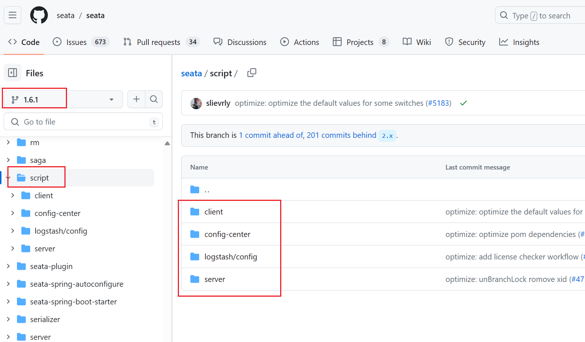
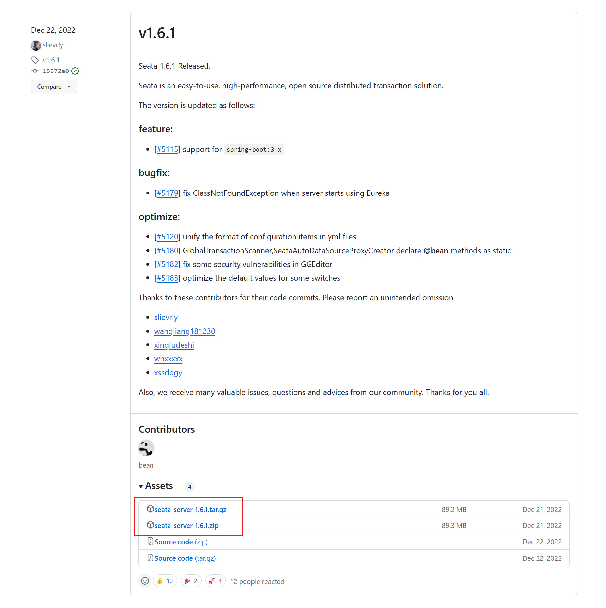
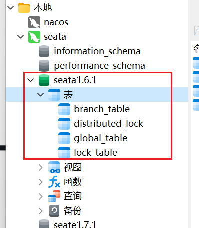
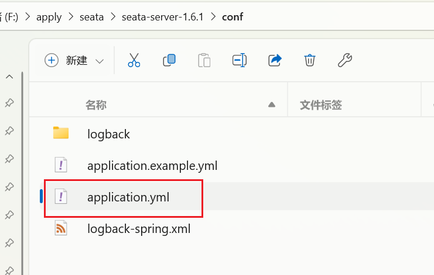
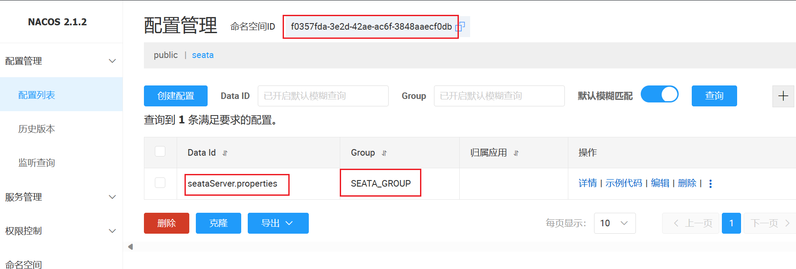
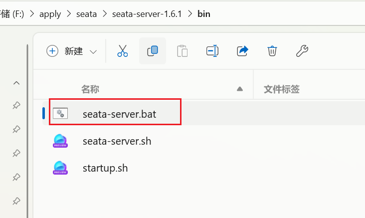
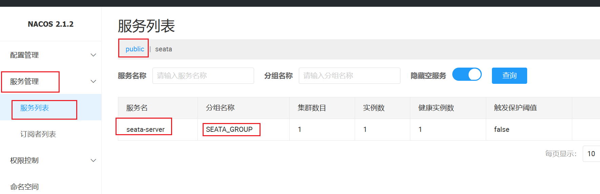
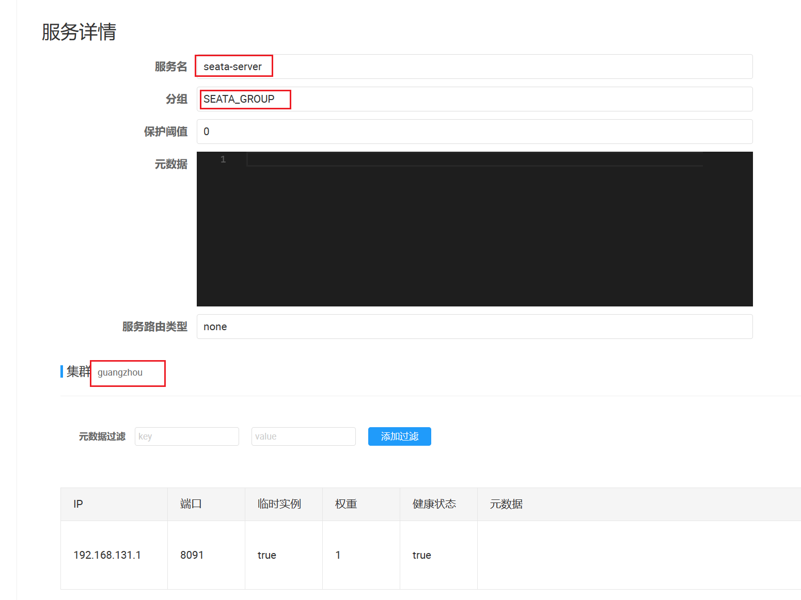
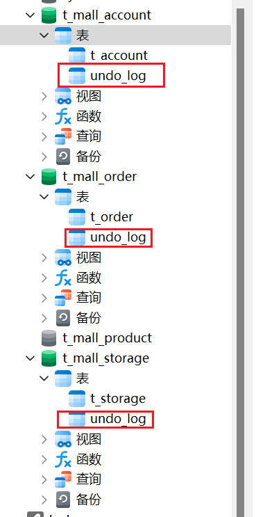

文章详细介绍了Seata的部署过程，包括环境准备、服务端与客户端组件的安装配置等关键步骤。

接着，本文深入探讨了如何将Seata集成到现有项目中，涵盖了依赖引入、配置调整以及代码改造等方面的具体操作。

最后，通过实际案例演示了Seata在分布式事务场景下的应用方法，展示了如何通过Seata实现跨服务的一致性事务处理。

无论是初学者还是有一定经验的开发者，都能从本文中获取到实用的操作指导和技术见解。

<!-- more -->


**上一篇： 《 [Seata分布式事务二阶段提交机制全面解读](./232.Seata分布式事务二阶段提交机制全面解读.md)  》：** 详细介绍了分布式事务的实现方式，以及详细讲述了Seata-AT模式的两阶段提交步骤流程。


**组件版本关系**

| 组件                 | 版本       |
| -------------------- | ---------- |
| JDK                  | 1.8.0_333  |
| Spring Boot          | 2.6.13     |
| Spring Cloud         | 2021.0.5   |
| Spring Cloud Alibaba | 2021.0.5.0 |
| Nacos                | 2.2.0      |
| Seata                | 1.6.1      |
| MySQL                | 8.0.33     |

其他版本依赖关系可以参考阿里的wiki文档：https://github.com/alibaba/spring-cloud-alibaba/wiki/%E7%89%88%E6%9C%AC%E8%AF%B4%E6%98%8E

上文 《 [Seata分布式事务二阶段提交机制全面解读](./232.Seata分布式事务二阶段提交机制全面解读.md)  》里有提到，Seata分 TC、TM 和 RM 三个角色，其中TC（Server端）为单独服务端部署，TM 和 RM（Client端）由业务系统集成。

## Seata Server（TC端）简介

Seata的server端的数据存储模式现在支持三种：`file`、`db`、`redis`

-  **file：** 适用单机模式，不支持集群高可用（HA），全局事务会话信息在内存中读写并会持久化到本地文件，性能较高。
-  **db：** 支持高可用集群模式（HA），全局事务会话信息通过数据库进行共享，但是相对性能会差一些。
-  **redis：** 支持高可用集群模式（HA），但是由于redis的数据持久化机制，会存在事务信息丢失的风险。


**本文使用db模式**，相关脚本地址：https://github.com/seata/seata/tree/1.6.1/script

client目录里面放的是业务系统集成所需的脚本（例如AT模式所需要的 `undo_log` 日志表）。

config-center目录里面放的是各类配置中心所需要导入的配置参数信息，其中 `config.txt` 文件里包含了server端和client端的通用参数信息。

server目录里面为server端也就是 TC 所需的数据库建表脚本，及各个容器的配置。




## Seata部署

采用db存储模式 + Nacos（注册中心&配置中心）方式部署Seata服务端。

### 1. 下载安装包

下载地址：https://github.com/seata/seata/releases

windows系统下载zip的包，linux系统下载tar.gz的包。



### 2. 创建seata服务端数据库表

创建seata服务端所需数据库，并执行脚本，sql脚本地址：https://github.com/seata/seata/blob/1.6.1/script/server/db/mysql.sql



### 3. 注册中心

> 什么是注册中心?注册中心可以说是微服务架构中的”通讯录“，它记录了服务和服务地址的映射关系。在分布式架构中，服务会注册到这里，当服务需要调用其它服务时，就到这里找到服务的地址，进行调用.比如Seata Client端(TM,RM),发现Seata Server(TC)集群的地址,彼此通信。

**nacos注册中心**

​	在配置Seata注册到nacos的注册中心之前，请先确保已经启动了Nacos服务。（Nacos的基本使用可参考[Nacos 快速入门](https://nacos.io/zh-cn/docs/quick-start.html)）


调整Seata Server的application.yml配置文件，使seata注册到指定的nacos（127.0.0.1:8848），指定的命名空间（namespace为空的时候，默认注册到public空间里），指定的分组（SEATA_GROUP），加入到指定的cluster集群（guangzhou）。




   ```yaml
seata:
  registry:
    # support: nacos, eureka, redis, zk, consul, etcd3, sofa
    type: nacos
    nacos:
      application: seata-server
      server-addr: 127.0.0.1:8848
      group: SEATA_GROUP
      namespace: ""
      cluster: guangzhou
      username: nacos
      password: nacos
   ```


> **Tips**：请确保此处的server端服务与下文的client端服务是注册在同一个namespace和group，不然会找不到服务。


### 4. 配置中心

> 什么是配置中心?配置中心可以说是一个"大货仓",内部放置着各种配置文件,你可以通过自己所需进行获取配置加载到对应的客户端.比如Seata Client端(TM,RM),Seata Server(TC),会去读取全局事务开关,事务会话存储模式等信息。

**nacos配置中心**

​	调整Seata Server的application.yml配置文件，使seata到指定的nacos（127.0.0.1:8848），指定的命名空间（f0357fda-3e2d-42ae-ac6f-3848aaecf0db），指定的分组（SEATA_GROUP），去读取指定的配置文件（seataServer.properties）。

   ```yaml
seata:
  config:
    # support: nacos, consul, apollo, zk, etcd3
    type: nacos
    nacos:
      server-addr: 127.0.0.1:8848
      group: SEATA_GROUP
      namespace: f0357fda-3e2d-42ae-ac6f-3848aaecf0db
      dataId: seataServer.properties
      username: nacos
      password: nacos
   ```



其中 `seataServer.properties` 的配置内容为`\seata-server-1.6.1\script\config-center\config.txt`文件的配置信息，全文复制然后修改几个关键配置即可。

nacos里调整 `seataServer.properties` 配置里的如下几个关键信息

```properties
#Transaction routing rules configuration, only for the client
#service.vgroupMapping.default_tx_group=default
service.vgroupMapping.t_mall_tx_group=guangzhou

#Transaction storage configuration, only for the server. The file, db, and redis configuration values are optional.
store.mode=db
store.lock.mode=db
store.session.mode=db

#These configurations are required if the `store mode` is `db`. If `store.mode,store.lock.mode,store.session.mode` are not equal to `db`, you can remove the configuration block.
store.db.datasource=druid
store.db.dbType=mysql
store.db.driverClassName=com.mysql.cj.jdbc.Driver
store.db.url=jdbc:mysql://127.0.0.1:3306/seata1.6.1?useUnicode=true&rewriteBatchedStatements=true&serverTimezone=Asia/Shanghai
store.db.user=seata
store.db.password=seata
```


> Tips：（注意：store.db.driverClassName）
>
> 注意上述配置里的 `store.db.driverClassName` 如果是mysql8，则一定要改为 `com.mysql.cj.jdbc.Driver`，默认的 `com.mysql.jdbc.Driver` 会导致在启动seata server启动时提示数据库连接获取失败。mysql5没有进行测试，可以自行验证一下。
>
> （数据库驱动放在目录：\seata-server-1.6.1\lib\jdbc）


> Tips：（注意：store.db.url）
>
> 当seata使用db模式时，seata是通过jdbc的executeBatch来批量插入全局锁，所以连接参数`store.db.url`中的 `rewriteBatchedStatements` 为true时，可在批量插入使，性能提升10倍有余。（在执行executeBatch，并且操作类型 为insert时，jdbc驱动会把对应的SQL优化成`insert into () values (),()`的形式来提升批量插入的性能）


**重点注意**（这一块如果暂时不理解，可与先跟着文档配，等项目跑来之后，可以自己再一点点去调整、去验证、然后理解这个配置的用途）

> Tips：（重点注意：<a id="vgroupMapping">service.vgroupMapping.t_mall_tx_group</a>）
>
> seata.service.vgroup-mapping.事务分组名=集群名称
>
> 其中"集群名称"需要和Seata Server注册到nacos的cluster配置 [seata.registry.nacos.cluster](#3. 注册中心) 以及下文中client端里配置 [seata.service.vgroup-mapping.t_mall_tx_group(事务分组名)]() 保持一致。
>
> 事务分组名称需要和下文的应用程序里集成seata的client端里配置的 `seata.tx-service-group` （[跳转查看](#4. 微服务配置application.yml添加seata相关配置信息)） 保持一致。


**注意：** 如果seata服务的application.yml配置文件里的 `seata.registry.nacos.cluster` 配置的值与nacos配置里 `service.vgroupMapping.事务分组名=集群名称` 的集群名称没有对应上，就会出现如下异常（找不到seata服务）；

```java
2023-12-23 15:51:28.137 ERROR 55552 --- [nio-8002-exec-1] o.a.c.c.C.[.[.[/].[dispatcherServlet]    : Servlet.service() for servlet [dispatcherServlet] in context with path [] threw exception [Request processing failed; nested exception is io.seata.common.exception.FrameworkException: No available service] with root cause

io.seata.common.exception.FrameworkException: No available service
...
```


### 5. 启动seata

windows系统启动双击seata-server.bat脚本即可；

linux系统启动使用seata-server.sh脚本，启动命令：

```shell
./seata-server.sh
```




启动之后可以到 nacos 上看到注册的seata服务

nacos服务地址：http://127.0.0.1:8848/nacos

seata服务地址：http://127.0.0.1:7091/#/login





> 其中分组 `SEATA_GROUP` 对应seata服务的application.yml配置文件里 `seata.registry.nacos.group` 配置；
>
> 集群 `guangzhou` 对应seata服务的application.yml配置文件里 `seata.registry.nacos.cluster` 配置；


## 事务分组与高可用

官方文档：http://seata.io/zh-cn/docs/v1.6/user/txgroup/transaction-group-and-ha


# 项目集成

完整代码示例地址：https://gitee.com/cnyunze/yz-seata.git

## 1. 环境准备

现有一个项目yz-seata，项目下有3个微服务：

yz-seata-mall-account：用户账号管理服务，负责记录账户余额；

yz-seata-mall-order：订单管理服务，负责记录用户购买商品记录信息；

yz-seata-mall-storage：库存管理服务，负责记录各商品的剩余库存量；


## 2. 微服务均引入seata依赖

   ```xml
<dependency>
	<groupId>com.alibaba.cloud</groupId>
	<artifactId>spring-cloud-starter-alibaba-seata</artifactId>
</dependency>
   ```


## 3. AT模式--创建undo_log日志表

各微服务所对应的数据库里都需要添加一个undo_log日志表，该表用于事务数据回滚；

脚本地址：https://github.com/seata/seata/blob/1.6.1/script/client/at/db/mysql.sql

```sql
-- for AT mode you must to init this sql for you business database. the seata server not need it.
CREATE TABLE IF NOT EXISTS `undo_log`
(
    `branch_id`     BIGINT       NOT NULL COMMENT 'branch transaction id',
    `xid`           VARCHAR(128) NOT NULL COMMENT 'global transaction id',
    `context`       VARCHAR(128) NOT NULL COMMENT 'undo_log context,such as serialization',
    `rollback_info` LONGBLOB     NOT NULL COMMENT 'rollback info',
    `log_status`    INT(11)      NOT NULL COMMENT '0:normal status,1:defense status',
    `log_created`   DATETIME(6)  NOT NULL COMMENT 'create datetime',
    `log_modified`  DATETIME(6)  NOT NULL COMMENT 'modify datetime',
    UNIQUE KEY `ux_undo_log` (`xid`, `branch_id`)
) ENGINE = InnoDB
  AUTO_INCREMENT = 1
  DEFAULT CHARSET = utf8mb4 COMMENT ='AT transaction mode undo table';
```



## 4. 微服务配置application.yml添加seata相关配置信息

   ```xml
seata:
  application-id: ${spring.application.name}
  # seata 服务分组，要与服务端配置service.vgroup_mapping的后缀对应
  tx-service-group: t_mall_tx_group
  service:
    vgroup-mapping:
      t_mall_tx_group: guangzhou
  registry:
    type: nacos
    nacos:
			server-addr: 127.0.0.1:8848
      application: seata-server
      group: SEATA_GROUP
  config:
    type: nacos
    nacos:
      server-addr: 127.0.0.1:8848
      namespace: f0357fda-3e2d-42ae-ac6f-3848aaecf0db
      group: SEATA_GROUP
      data-id: seataServer.properties
   ```

注意：

`seata.tx-service-group` 要与上文的服务端配置 `service.vgroup_mapping` （[跳转查看](#vgroupMapping) ）的后缀对应。

`seata.service.vgroup-mapping.事务分组名=集群名称`  也要与上文 `seataServer.properties ` 配置文件里的 `service.vgroupMapping.t_mall_tx_group=guangzhou` 保持一致。


## 5. 在代码里添加全局事务

在全局事务发起者方法上面添加@GlobalTransactional全局事务注解。

> 全局事务发起者：判断方法为，是谁最先去调用其他微服务接口的方法，就是全局事务的发起者；
>
> 例1：用户下了个订单，先请求订单服务，新增订单方法，然后新增订单方法里又去调用库存服务的扣减库存方法、用户账号服务的扣减余额方法，则新增订单方法就是全局事务的发起者；
>
> 例2：用户下了个订单，先扣减用户账号的余额，扣减余额方法又去调库存服务的扣减库存方法、订单服务的新增订单方法，则用户账号服务的扣减余额方法就是全局事务的发起者；

例：

   ```java
	/**
     * 单纯使用@Transactional注解存在如下问题：
     * 如果订单新增成功，库存扣减成功，但扣减余额的时候失败了，则扣减的余额会回滚，新增的订单信息会回滚，但是已经扣减的库存却不会再回滚
     */
	@GlobalTransactional(name = "addOrder", rollbackFor = Exception.class)
    @Override
    public TOrder saveOrder(TOrder tOrder) {
        tOrder.setId(IdUtil.getSnowflakeNextId());

        // 新增订单信息
        baseMapper.insert(tOrder);

        // 扣减库存
        stockFeignService.deduct(tOrder.getProductId(), tOrder.getNum());

        // 扣减余额
        accountFeignService.deduct(tOrder.getAccountId(), tOrder.getAmount());

        return tOrder;
    }
   ```


## 6. 测试验证分布式事务是否生效

场景1：正常下单-->扣减库存-->扣减余额-->事务成功提交

场景2：正常下单-->扣减库存-->扣减余额（失败）-->验证事务是否回滚（扣减的库存是否有还原）
