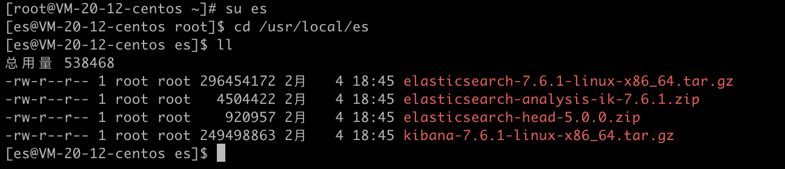
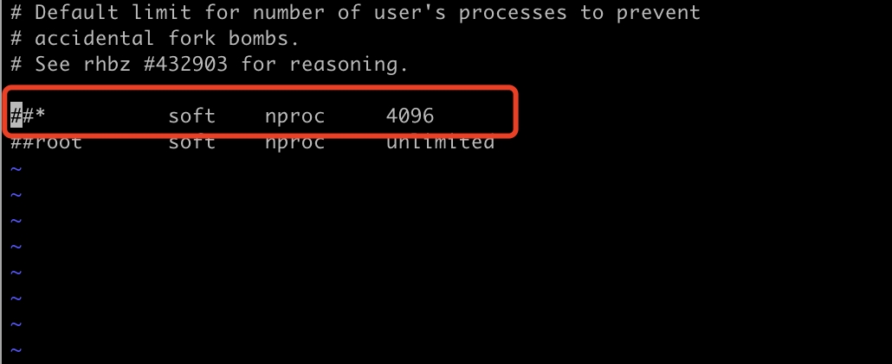
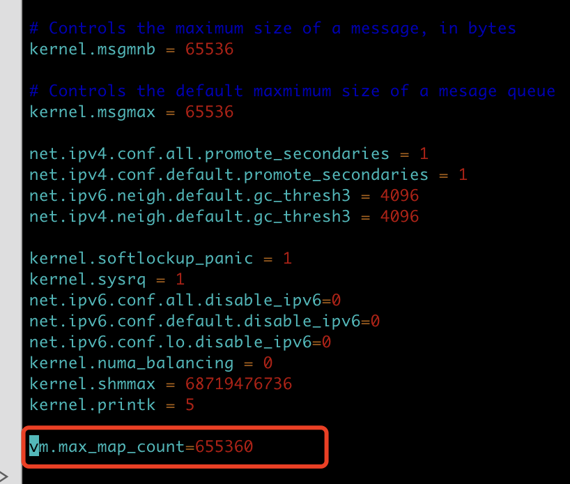
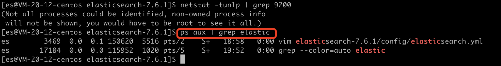
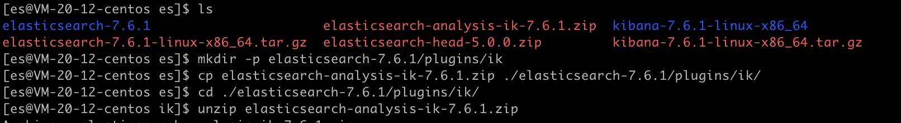
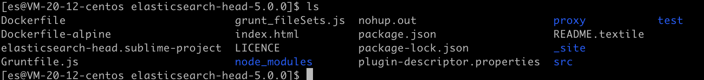
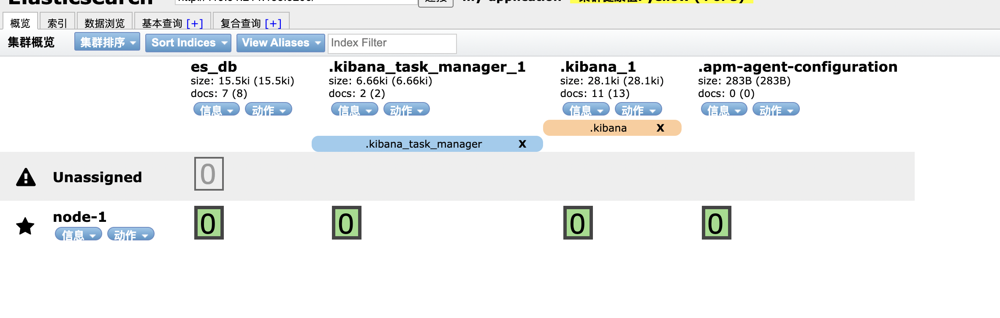

Elasticsearch 是一个分布式、RESTful 风格的搜索和数据分析引擎。当项目涉及到大数据量数据搜索，直接使用数据库进行搜索，只要不是走索引，都是非常吃力的，此时就可以用到 Elasticsearch 搜索引擎，它拥有强大的数据检索能力。下文将详细讲解 Elasticsearch 的部署过程和其相关组件Kibana、elasticsearch-head的安装步骤。

<!-- more -->

# Elasticsearch的安装部署

## Linux安装ElasticSearch

1. 先创建elasticsearch用户组，再创建用户名es密码123456的用户

```
[root@VM-20-12-centos ~]# groupadd elasticsearch
[root@VM-20-12-centos ~]# useradd es
[root@VM-20-12-centos ~]# passwd 123456
```

2. 将es用户添加到elasticsearch用户组，并创建es文件夹，并赋予es用户对改文件夹的操作权限

```
[root@VM-20-12-centos ~]# usermod -G elasticsearch es
[root@VM-20-12-centos ~]# mkdir -p /usr/local/es
[root@VM-20-12-centos ~]# chown -R es /usr/local/es
```

3. 给es设置sudo权限

```
[root@VM-20-12-centos ~]# visudo

# 在root    ALL=(ALL)       ALL一行下面加上
es      ALL=(ALL)       ALL
```

4. 切换到es用户（es必须用普通用户启动，root启动不了）

```
[root@VM-20-12-centos ~]# su es
[es@VM-20-12-centos root]$
```

5. 上传各安装包到服务器



6. 解压elasticsearch的安装包

```
[es@VM-20-12-centos es]$ tar -zvxf elasticsearch-7.6.1-linux-x86_64.tar.gz
```

7. 修改elasticsearch.yml配置文件

```
[es@VM-20-12-centos es]$ vim elasticsearch-7.6.1/config/elasticsearch.yml
```

elasticsearch.xml配置文件

```
cluster.name: my‐application
node.name: node‐1
path.data: /usr/local/es/elasticsearch-7.16.3/data
path.logs: /usr/local/es/elasticsearch-7.16.3/logs
network.host: 0.0.0.0
http.port: 9200
discovery.seed_hosts: ["192.168.0.117"]
cluster.initial_master_nodes: ["node-1"]
bootstrap.system_call_filter: false
bootstrap.memory_lock: false
http.cors.enabled: true
http.cors.allow-origin: "*"
```

8. 修改jvm.option配置

```
[es@VM-20-12-centos es]$ vim elasticsearch-7.6.1/config/jvm.options
```

jim.options配置文件里的jvm堆内存大小最小设置1g

```
-Xms1g
-Xmx1g
```

9. 修改普通用户可打开文件的最大数量限制

```
[es@VM-20-12-centos es]$ sudo vi /etc/security/limits.conf
```

在最后面添加如下内容

```
* soft nofile 65536
* hard nofile 131072
* soft nproc 4096
* hard nproc 4096
```

**此文件修改后需要退出重新登录，才会生效**

如果不修改该配置，启动es可能会有如下异常

```
max file descriptors [4096] for elasticsearch process likely too low, increase to at least [65536]
```

10. 设置普通用户启动线程数限制

CentOS7系统

```
[es@VM-20-12-centos elasticsearch-7.6.1]$ sudo vi /etc/security/limits.d/20-nproc.conf
```



将其前面的##去掉，保留

```
 * soft nproc 4096
```

如果不修改该配置，启动es可能会有如下异常

```
max number of threads [1024] for user [es] likely too low, increase to at least [4096]
```

11. 将普通用户的虚拟内存调大

```
[es@VM-20-12-centos elasticsearch-7.6.1]$ vi /etc/sysctl.conf
```

在最后面加上

```
vm.max_map_count=655360
```



修改保存之后再执行

```
sysctl ‐p
```

如果不修改该配置，启动es可能会有如下异常

```
max virtual memory areas vm.max_map_count [65530] likely too low, increase to at least [262144]
```

12. 退出重新远程连接linux，改了配置之后最好重新连接
13. 用es用户启动es服务

```
[es@VM-20-12-centos elasticsearch-7.6.1]$ ./bin/elasticsearch
```

访问路径：http://192.168.0.117:9200/


启动成功！

但是这样关掉命令窗口就会挂掉，所以可以用后台启动：

```
[es@VM-20-12-centos elasticsearch-7.6.1]$ ./bin/elasticsearch -d
```

14. 可能遇到的问题

完整的错误信息：

```
[2022-02-04T19:51:08,395][ERROR][o.e.b.ElasticsearchUncaughtExceptionHandler] [node-1] uncaught exception in thread [main]
org.elasticsearch.bootstrap.StartupException: BindTransportException[Failed to bind to [9300-9400]]; nested: BindException[无法指定被请求的地址];
	at org.elasticsearch.bootstrap.Elasticsearch.init(Elasticsearch.java:174) ~[elasticsearch-7.6.1.jar:7.6.1]
```

解决方法：

```
[es@VM-20-12-centos elasticsearch-7.6.1]$ ps aux | grep elastic
```



这个可能是因为之前启动过es，没有正确关闭，导致有遗留进程，把这个进程kill掉之后重启即可（第二个进程是grep本身产生的一条进程，可不予理会）；


## Linux安装Kibana

1. 解压kibana

```
[es@VM-20-12-centos es]$ tar -zvxf kibana-7.6.1-linux-x86_64.tar.gz
```

2. 编辑kibana的配置文件

```
[es@VM-20-12-centos es]$ vim kibana-7.6.1-linux-x86_64/config/kibana.yml
```

```
server.port: 5601
server.host: "0.0.0.0"
elasticsearch.hosts: ["http://192.168.0.117:9200"]
```

3. 启动kibana

```
./kibana-7.6.1-linux-x86_64/bin/kibana
```

访问路径：http://192.168.0.117:5601/app/kibana


后台启动

```
nohup ./kibana-7.6.1-linux-x86_64/bin/kibana &
```

查看后台启动的运行日志

```
tail -20 nohup.out
```


## 安装IK分词器

先在es文件夹的plugins文件夹下建一个ik插件的文件夹，然后将ik分词器的插件包放到ik文件夹里进行解压，然后重启es即可。

```
[es@VM-20-12-centos es]$ mkdir -p elasticsearch-7.6.1/plugins/ik
[es@VM-20-12-centos es]$ cp elasticsearch-analysis-ik-7.6.1.zip ./elasticsearch-7.6.1/plugins/ik/
[es@VM-20-12-centos es]$ cd ./elasticsearch-7.6.1/plugins/ik/
[es@VM-20-12-centos ik]$ unzip elasticsearch-analysis-ik-7.6.1.zip
```




## Linux安装elasticsearch-head

1. 安装node环境

```
curl -sL https://rpm.nodesource.com/setup_8.x | sudo bash -
```

```
sudo yum install nodejs
```

可用node --version和npm -version来查看版本

2. 解压elasticsearch-head压缩包

```
[es@VM-20-12-centos es]$ unzip elasticsearch-head-5.0.0.zip
```

3. 下载所需依赖

```
[es@VM-20-12-centos es]$ cd elasticsearch-head-5.0.0/
[es@VM-20-12-centos es]$ npm install
```



4. 修改app.js

```
[es@VM-20-12-centos elasticsearch-head-5.0.0]$ vim _site/app.js
```

进入编辑页进行搜索

```
/:9200
```

将localhost改为es服务的ip

5. 启动

```
[es@VM-20-12-centos elasticsearch-head-5.0.0]$ nohup npm run start &
```

访问路径：http://192.168.0.117:9100/

