## 微服务使用elk实现日志采集的流程说明

logback-->logstash-->elasticsearch-->kibana


## 配置logback

### 添加logback依赖

系统添加logback日志组件依赖

```xml
            <dependency>
                <groupId>ch.qos.logback</groupId>
                <artifactId>logback-classic</artifactId>
                <version>1.5.18</version>
            </dependency>

            <dependency>
                <groupId>ch.qos.logback</groupId>
                <artifactId>logback-core</artifactId>
                <version>1.5.18</version>
            </dependency>
```


### 配置logback

在服务的resources资源目录下添加logback的配置文件

logback-spring.xml

```xml
<?xml version="1.0" encoding="UTF-8"?>
<configuration debug="false">
    <!--设置存储路径变量-->
    <property name="LOG_HOME" value="./logs/"/>

    <!--控制台输出appender-->
    <appender name="console" class="ch.qos.logback.core.ConsoleAppender">
        <!--设置输出格式-->
        <encoder class="ch.qos.logback.classic.encoder.PatternLayoutEncoder">
            <!--格式化输出：%d表示日期，%thread表示线程名，%-5level：级别从左显示5个字符宽度%msg：日志消息，%n是换行符-->
            <pattern>%d{yyyy-MM-dd HH:mm:ss.SSS} [%thread] %-5level %logger{50} - %msg%n</pattern>
            <!--设置编码-->
            <charset>UTF-8</charset>
        </encoder>
    </appender>

    <!--文件输出,时间窗口滚动-->
    <appender name="timeFileOutput" class="ch.qos.logback.core.rolling.RollingFileAppender">
        <!--日志名,指定最新的文件名，其他文件名使用FileNamePattern -->
        <File>${LOG_HOME}/out.log</File>
        <!--文件滚动模式-->
        <rollingPolicy class="ch.qos.logback.core.rolling.TimeBasedRollingPolicy">
            <!--日志文件输出的文件名,可设置文件类型为gz,开启文件压缩-->
            <FileNamePattern>${LOG_HOME}/info.%d{yyyy-MM-dd}.%i.log.gz</FileNamePattern>
            <!--日志文件保留天数-->
            <MaxHistory>30</MaxHistory>
            <!--按大小分割同一天的-->
            <timeBasedFileNamingAndTriggeringPolicy class="ch.qos.logback.core.rolling.SizeAndTimeBasedFNATP">
                <maxFileSize>10MB</maxFileSize>
            </timeBasedFileNamingAndTriggeringPolicy>
        </rollingPolicy>

        <!--输出格式-->
        <encoder class="ch.qos.logback.classic.encoder.PatternLayoutEncoder">
            <!--格式化输出：%d表示日期，%thread表示线程名，%-5level：级别从左显示5个字符宽度%msg：日志消息，%n是换行符-->
            <pattern>%d{yyyy-MM-dd HH:mm:ss.SSS} [%thread] %-5level %logger{70} - %msg%n</pattern>
            <!--设置编码-->
            <charset>UTF-8</charset>
        </encoder>

    </appender>

    <!--指定基础的日志输出级别-->
    <root level="INFO">
        <!--appender将会添加到这个loger-->
        <appender-ref ref="console"/>
        <appender-ref ref="timeFileOutput"/>
    </root>
</configuration>
```


### logback记录SQL日志（可选）

如果需要记录sql日志，则需要在 `<root level="INFO">` 的上面一行加上 `logger标签配置` 具体情况如下所示，并根据项目的实际情况调整好路径。调整好 `logger` 后，还需要去调整Mybatis的配置。

```xml
<?xml version="1.0" encoding="UTF-8"?>
<configuration debug="false">
  	......
  
    <!--记录指定模块的SQL日志-->
		<logger name="com.业务服务路径.mapper" level="DEBUG"/>  
  
  	<root level="INFO">
      ......
  	</root>
</configuration>
```

在服务的application.yaml配置文件里

如果用的mybatis-plus，则使用如下配置

```yaml
mybatis-plus:
  configuration:
    log-impl: org.apache.ibatis.logging.slf4j.Slf4jImpl
```

如果用的是mybatis，则使用如下配置

```yaml
mybatis:
  configuration:
    log-impl: org.apache.ibatis.logging.slf4j.Slf4jImpl
```


配置好这些后，启动服务，logback会将服务的所有日志写入到 `./logs/out.log` 文件里。并且会自动压缩打包、自动清理30天前的日志。

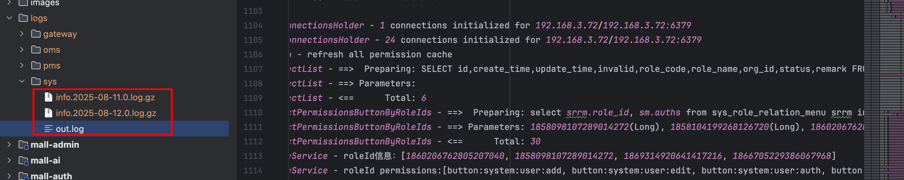


## 部署ELK

确认好服务的logback记录日志没问题之后，开始部署ELK环境。

ELK（elasticsearch、kibana、logstash）

### 本地部署

本地直接部署Elasticsearch可参考《 [Elasticsearch的安装部署](241.Elasticsearch的安装部署.md#Linux安装ElasticSearch) 》

本地直接部署kibana可参考 《[Kibana的安装部署](241.Elasticsearch的安装部署.md#Linux安装Kibana) 》

本地直接部署可参考官网 : https://www.elastic.co/docs/reference/logstash/installing-logstash

可在右侧选择版本

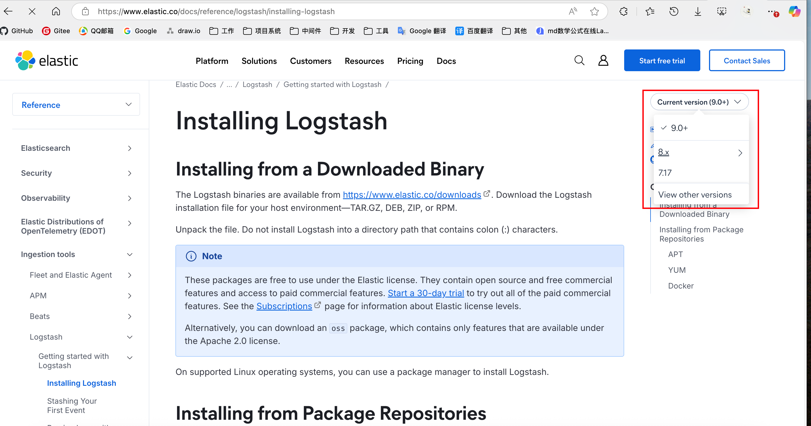


### docker-compose部署

docker-compose.yml配置

```yaml
networks:
  mall:
    driver: bridge

services:
  elasticsearch:
    image: registry.cn-guangzhou.aliyuncs.com/devyunze/elasticsearch:8.19.0
    container_name: 'elasticsearch-8.19.0'
    # 开启认证和ssl会让人崩溃
		environment:
      - discovery.type=single-node
      - ES_JAVA_OPTS=-Xms1024m -Xmx1024m
      - xpack.security.enabled=false
      - xpack.security.enrollment.enabled=false
      - xpack.security.http.ssl.enabled=false
      - xpack.security.transport.ssl.enabled=false
    ports:
      - '9200:9200'
      - '9300:9300'
    # 可选：设置重启策略（除非手动停止，否则在容器意外退出时都会自动重启）
    restart: unless-stopped
    mem_limit: 1536m
    networks:
      - mall

  kibana:
    image: registry.cn-guangzhou.aliyuncs.com/devyunze/kibana:8.19.0
    container_name: 'kibana-8.19.0'
    # es服务的地址
    environment:
      - ELASTICSEARCH_HOSTS=http://192.168.3.72:9200
    ports:
      - '5601:5601'
    depends_on:
      - elasticsearch
    networks:
      - mall

  logstash:
    image: registry.cn-guangzhou.aliyuncs.com/devyunze/logstash:8.19.0
    container_name: 'logstash-8.19.0'
    ports:
      - '4560:4560'
    environment:
      - LS_JAVA_OPTS=-Xmx512m -Xms512m
    volumes:
      - /opt/docker-dev-environment/logstash/mall-elk.conf:/usr/share/logstash/config/mall-elk.conf
      - /opt/docker-dev-environment/logstash/logstash.yml:/usr/share/logstash/config/logstash.yml
    entrypoint:
      - logstash
      - -f
      - /usr/share/logstash/config/mall-elk.conf
    logging:
      driver: "json-file"
      options:
        max-size: "30m"
        max-file: "3"
    networks:
      - mall
```


logstash.yml配置文件

/opt/docker-dev-environment/logstash/logstash.yml

```yaml
http.host: "0.0.0.0"
xpack.monitoring.elasticsearch.hosts: [ "http://192.168.3.72:9200" ]
```


logstash的运行配置mall-elk.conf

先直接使用这个配置，等整个流程通了之后，再去根据需要进行调整。

/opt/docker-dev-environment/logstash/mall-elk.conf

```conf
input {
	tcp {
		host => "0.0.0.0"
		port => "4560"
		mode => "server"
		codec => json_lines
	}
}

filter {
	
}

output {
	stdout {
		codec => rubydebug
	}
	elasticsearch {
		hosts => ["http://192.168.3.72:9200"]
		index => "%{[platform]}%{+_YYYYMMdd}"
	}
}
```


在docker-compose.yml文件同级目录下执行如下命令，运行容器

```shell
docker-compose up -d --no-recreate
```


然后便可以

通过 http://192.168.3.72:9200 访问elasticsearch

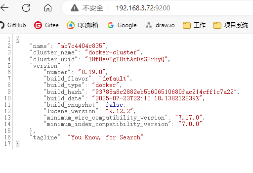

通过 http://192.168.3.72:5601 访问kibana

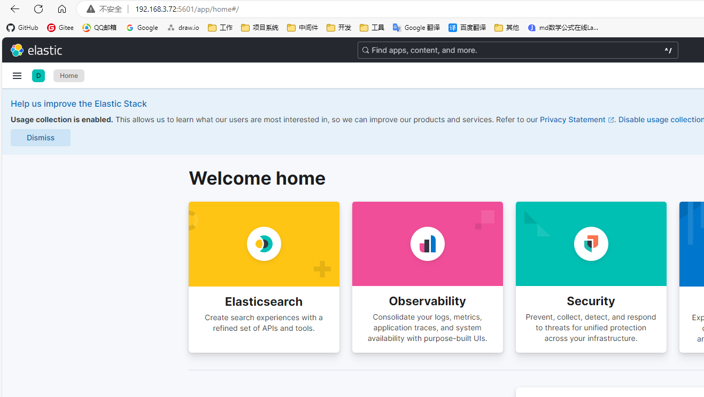

通过命令查看logstash的日志

```shell
docker logs logsstash-8.19.0
```

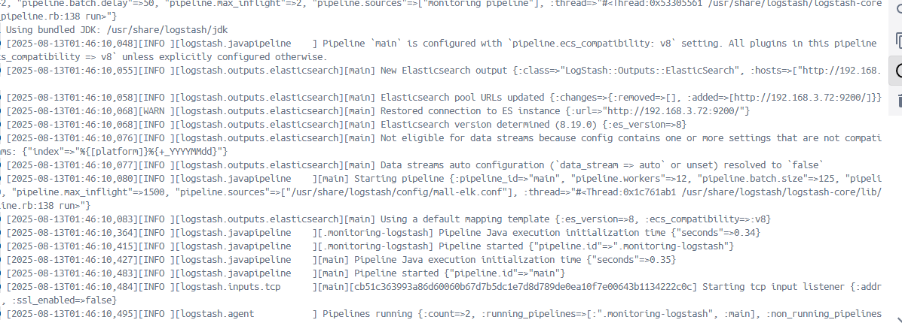


## 配置logback上传日志给logstash

### 服务添加依赖

```xml
<dependency>
    <groupId>net.logstash.logback</groupId>
    <artifactId>logstash-logback-encoder</artifactId>
	  <version>6.6</version>
</dependency>
```


### 调整logback配置

logback-spring.xml

destination配置logstash地址，端口用4560

customFields标签里的platform对应logstash的conf配置文件里 `index => "%{[platform]}%{+_YYYYMMdd}"` 这个索引里的platform。

```xml
    <appender name="logstash" class="net.logstash.logback.appender.LogstashTcpSocketAppender">
        <destination>192.168.3.72:4560</destination>
        <encoder class="net.logstash.logback.encoder.LogstashEncoder">
            <customFields>{"platform": "mall", "app_name": "mall-sys"}</customFields>
        </encoder>
    </appender>
```


完整配置如下

```xml
<?xml version="1.0" encoding="UTF-8"?>
<configuration debug="false">
    <!--设置存储路径变量-->
    <property name="LOG_HOME" value="./logs/sys/"/>

    <!--控制台输出appender-->
    <appender name="console" class="ch.qos.logback.core.ConsoleAppender">
        <!--设置输出格式-->
        <encoder class="ch.qos.logback.classic.encoder.PatternLayoutEncoder">
            <!--格式化输出：%d表示日期，%thread表示线程名，%-5level：级别从左显示5个字符宽度%msg：日志消息，%n是换行符-->
            <pattern>%d{yyyy-MM-dd HH:mm:ss.SSS} [%thread] %-5level %logger{50} - %msg%n</pattern>
            <!--设置编码-->
            <charset>UTF-8</charset>
        </encoder>
    </appender>

    <!--文件输出,时间窗口滚动-->
    <appender name="timeFileOutput" class="ch.qos.logback.core.rolling.RollingFileAppender">
        <!--日志名,指定最新的文件名，其他文件名使用FileNamePattern -->
        <File>${LOG_HOME}/out.log</File>
        <!--文件滚动模式-->
        <rollingPolicy class="ch.qos.logback.core.rolling.TimeBasedRollingPolicy">
            <!--日志文件输出的文件名,可设置文件类型为gz,开启文件压缩-->
            <FileNamePattern>${LOG_HOME}/info.%d{yyyy-MM-dd}.%i.log.gz</FileNamePattern>
            <!--日志文件保留天数-->
            <MaxHistory>30</MaxHistory>
            <!--按大小分割同一天的-->
            <timeBasedFileNamingAndTriggeringPolicy class="ch.qos.logback.core.rolling.SizeAndTimeBasedFNATP">
                <maxFileSize>10MB</maxFileSize>
            </timeBasedFileNamingAndTriggeringPolicy>
        </rollingPolicy>

        <!--输出格式-->
        <encoder class="ch.qos.logback.classic.encoder.PatternLayoutEncoder">
            <!--格式化输出：%d表示日期，%thread表示线程名，%-5level：级别从左显示5个字符宽度%msg：日志消息，%n是换行符-->
            <pattern>%d{yyyy-MM-dd HH:mm:ss.SSS} [%thread] %-5level %logger{70} - %msg%n</pattern>
            <!--设置编码-->
            <charset>UTF-8</charset>
        </encoder>

    </appender>

    <appender name="logstash" class="net.logstash.logback.appender.LogstashTcpSocketAppender">
        <destination>yunze.com:4560</destination>
        <encoder class="net.logstash.logback.encoder.LogstashEncoder">
            <customFields>{"platform": "mall", "app_name": "mall-sys"}</customFields>
        </encoder>
    </appender>

    <logger name="com.yz.mall.sys.mapper" level="DEBUG"/>

    <!--指定基础的日志输出级别-->
    <root level="INFO">
        <!--appender将会添加到这个loger-->
        <appender-ref ref="console"/>
        <appender-ref ref="timeFileOutput"/>
        <appender-ref ref="logstash"/>
    </root>
</configuration>
```


## 启动服务上传日志

重启服务后可在logstash里查看到上传的日志

```shell
docker logs logsstash-8.19.0
```

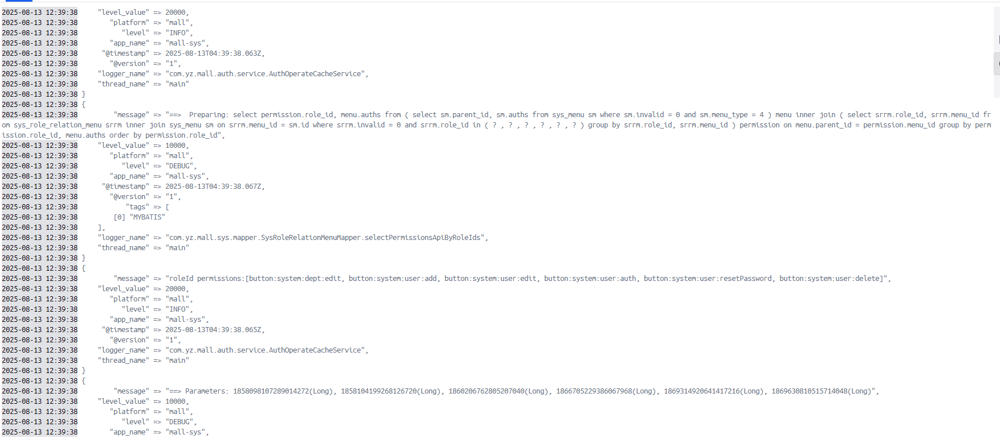


在kibana里配置视图查看日志数据

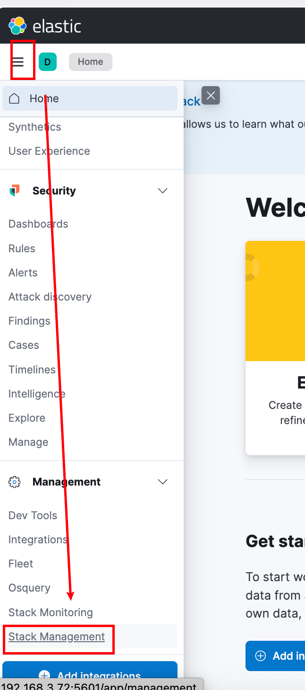

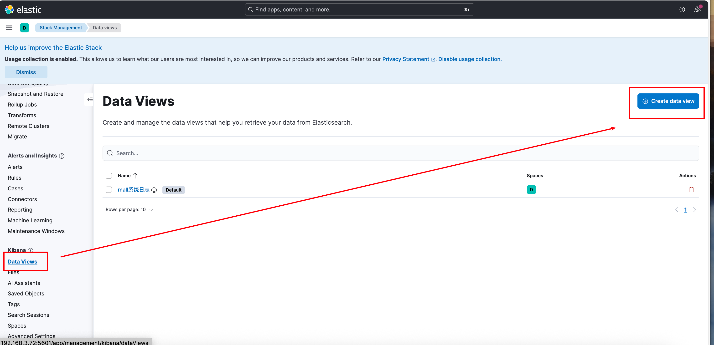

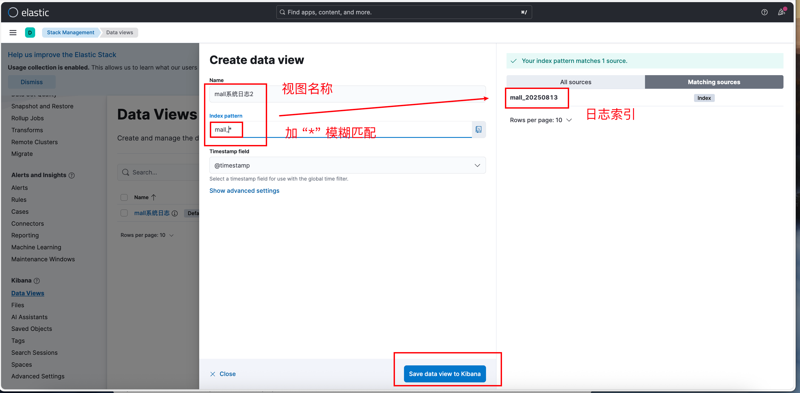

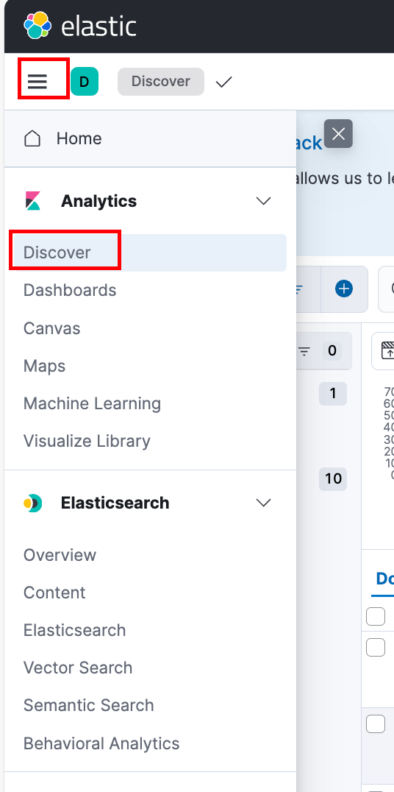

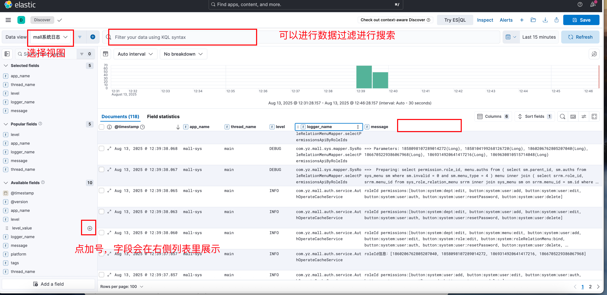
