将现有的Spring Boot + Mybatis + MySQL项目迁移到国产数据库如达梦数据库。本文档详细介绍了如何调整现有项目以兼容达梦数据库，并提供了迁移过程中遇到的一些常见问题及其解决方案。

<!-- more -->

# 国产化适配:MySQL项目适配兼容达梦数据库操作

## 项目兼容达梦数据库适配方案与常见问题解决方案

### 数据库函数替换策略

#### 1. `GROUP_CONCAT()` 函数处理
MySQL中的`GROUP_CONCAT()`用于合并分组内的值为一个字符串。在达梦数据库中，可以使用`WM_CONCAT()`函数来实现类似的功能。

**实现步骤：**
- 在达梦数据库中，使用`WM_CONCAT()`函数代替MySQL的`GROUP_CONCAT()`。
```sql
SELECT WM_CONCAT(your_field) AS concatenated_fields FROM your_table GROUP BY your_grouping_field;
```
需要注意的是，尽管`WM_CONCAT()`可以在一定程度上替代`GROUP_CONCAT()`，但两者之间存在一些差异。例如，`WM_CONCAT()`可能不支持某些高级选项（如排序、分隔符自定义等），这时需要根据具体情况决定是否继续使用SQL层面的聚合还是转到Java代码层进行处理。

**Java代码层处理示例：**
如果`WM_CONCAT()`不能满足需求，可以在Service层使用Java流（Stream）API或传统的循环结构来聚合数据。
```java
List<String> concatenatedResult = yourEntityList.stream()
    .map(YourEntity::getField)
    .collect(Collectors.joining(","));
```


#### 2. 时间计算函数的替换

针对MySQL中的`DATE_SUB(NOW(), INTERVAL 28 DAY)` 和 `DATE_ADD()`，推荐在Java代码中计算好时间之后，再通过参数传递给MyBatis Mapper。

**实现示例：**

```java
LocalDateTime now = LocalDateTime.now();
LocalDateTime dateBefore28Days = now.minusDays(28);
yourMapper.selectByDate(dateBefore28Days);
```
通过这种方式，可以更精确地控制时间计算逻辑，并且便于测试和维护。


#### 3. 聚合函数转换

将MySQL中的`count(name = '张三' or null)`转换为MySQL和达梦数据库都支持的`SUM(CASE WHEN name = '张三' THEN 1 ELSE 0 END)`格式。

**SQL语句调整：**

```sql
SELECT SUM(CASE WHEN name = '张三' THEN 1 ELSE 0 END) AS count_field FROM your_table;
```
这种做法不仅提高了SQL的可移植性，也增强了查询表达式的清晰度。


#### 4. DATE_FORMAT()函数

以 date_format 函数为例，MySQL 中的 date_format 函数可以在 DM 数据库 中使用 to_char 或 to_date 函数改写，改写后在达梦中可以达到相同的效果，

示例 如下：

```sql
-- MySQL 
select date_format(sysdate(), '%Y 年%m 月') from dual 
-- DM
select translate(to_char(sysdate, 'yyyy-mm#'),'-#','年月') from dua
-- MySQL 
select DATE_ FORMAT(C_ FIRST_TIME,'%Y-%m-%d %H') FROM DUAL; 
-- DM
select TO_CHAR(C_FIRST_TIME, 'YYYY- MM- DD HH24') FROM DUAL;
```

也可以在达梦数据库里自定义创建一个date_format函数，然后函数里面的处理逻辑用达梦的to_char、to_date，这样的好处是不需要去调整代码里的sql语句。


#### 5. CAST()函数

DM 中的 cast()函数的用法虽然和 MySQL 一致，但使用效果存在不同， MySQL 中对于数值类型的 value 转 char 类型没有限制，DM 中则存在限制，会 报“数据转换失败”等报错，可将 cast(数值类型的 valueaschar)转换为 cast(数值 类型的valueasvarchar),对于unsigned类型可以根据实际情况做对应改变或确定是 否有必要进行转换。


### SQL语法及规范注意事项

#### GROUP BY 子句遵循标准
确保在`GROUP BY`子句中包含所有非聚合字段。这符合SQL标准，并有助于提高查询的正确性和性能。

**实践建议：**
- 审查所有涉及`GROUP BY`的查询，确保其符合SQL标准。

- 使用ORM框架提供的功能自动处理这些细节，减少手动编写复杂SQL的风险。

例如：

```sql
select name, type, sum(grades) as grades_sum
from student
group by name
```

这种sql就不行，不符合数据库的常规规范，select里的非聚合字段时name、type，而 group by 里只有一个name字段，这就不兼容mysql8、人大金仓和达梦数据库等。

需要调整为

```sql
select name, type, sum(grades) as grades_sum
from student
group by name, type
```


### 其他优化点和注意事项

- **数据类型映射**：仔细检查实体类与数据库表之间的数据类型映射，特别是对于日期时间类型、布尔类型等可能存在的差异。
- **索引优化**：迁移时重新评估并优化索引设置，以适应新数据库的特点。

#### 使用mybatis的sql标签配置databaseId

当出现实在无法做到一个sql兼容多个数据库，且无法使用 java 代码的情况，可以使用myabtis提供的sql标签加databaseId配置。

| 数据库         | databaseId配置        |
| -------------- | --------------------- |
| mysql数据库    | 不用配置，默认为mysql |
| 人大金仓数据库 | kingbase              |
| 达梦数据库     | dm                    |

例如：

```sql
    <sql id="DATE_ADD_SQL">
       DATE_ADD(MAX(statistical_date), INTERVAL 1 DAY)
    </sql>
    
    <sql id="DATE_ADD_SQL" databaseId="kingbase">
        (MAX(statistical_date) + INTERVAL '1 DAY')
    </sql>
    
    <sql id="DATE_ADD_SQL" databaseId="dm">
        DATEADD(DAY, 1, MAX(statistical_date))
    </sql>
    
	<select id="get" resultType="com.business.statistical.table.entity.StatisticalTable">
        SELECT unit_id,
        (CASE WHEN MAX(statistical_date) IS NOT NULL THEN <include refid="DATE_ADD_SQL" /> ELSE MAX(statistical_date) END) statisticalDate
        FROM statistical_table
        WHERE unit_id in
        <foreach collection="ids" item="id" separator="," open="(" close=")">
            #{id}
        </foreach>
        GROUP BY unit_id
    </select>
```


## 将数据库从mysql迁移到达梦数据库方案

### 1. 客户端组件安装

先在本地安装好达梦数据库提供的客户端工具组件

工具下载地址：https://www.dameng.com/list_103.html

安装好之后可以看到如下几个工具


| 名称           | 说明                                                         |
| -------------- | ------------------------------------------------------------ |
| DM管理工具     | 相当于dbeaver，是达梦数据库专用的可视化工具。                |
| DM数据迁移工具 | 用于将其他数据库的库迁移到达梦数据库，或将达梦数据库的库迁移到其他数据库。 |
| DM控制台工具   | 没用过                                                       |
| DM审计分析工具 | 没用过                                                       |
| DM性能监视工具 | 没用过                                                       |


### 2. 初次迁库操作步骤

初次将mysql数据库的库迁移到达梦数据库的操作步骤如下：

#### 新建连接

打开 `DM管理工具` ,新建连接

****


使用运维人员提供的达梦数据库超管账号登录

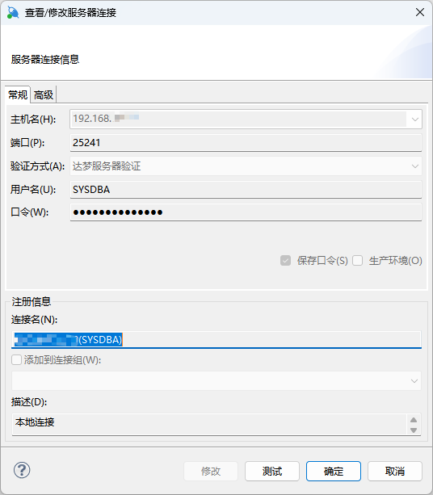

#### 创建表空间

登录之后创建表空间

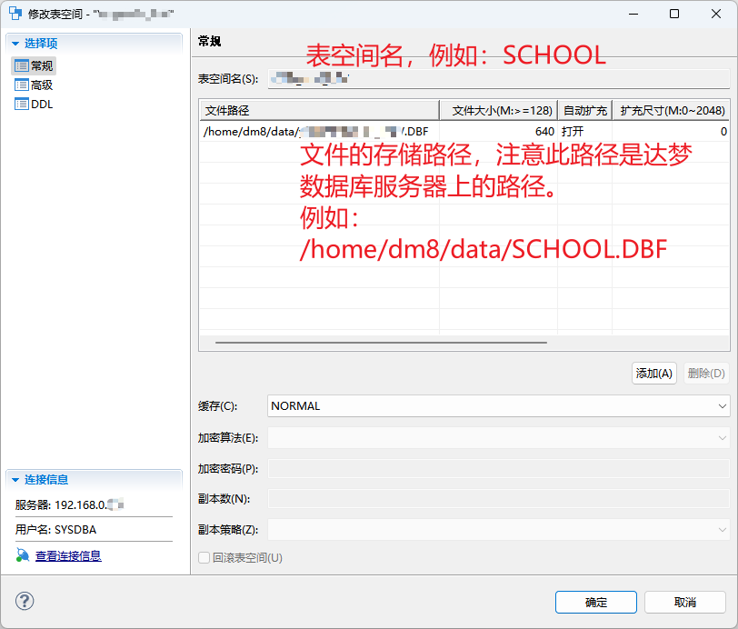


#### 创建管理用户

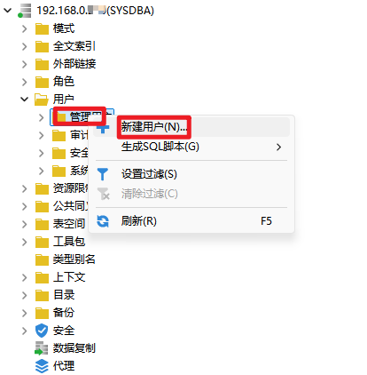

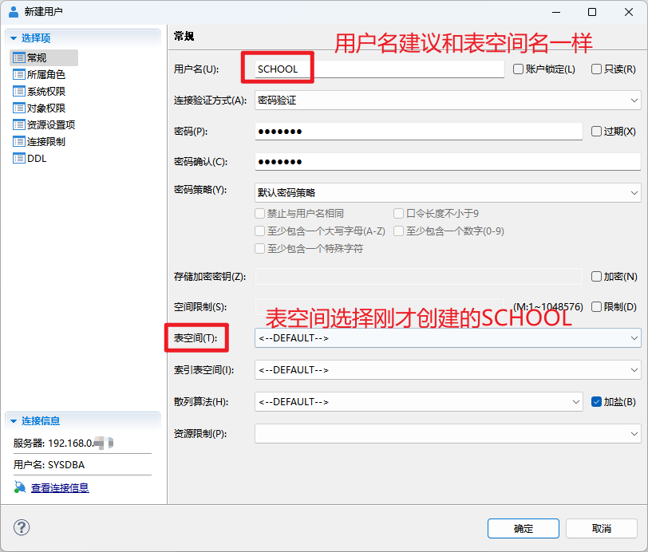

系统权限选这些

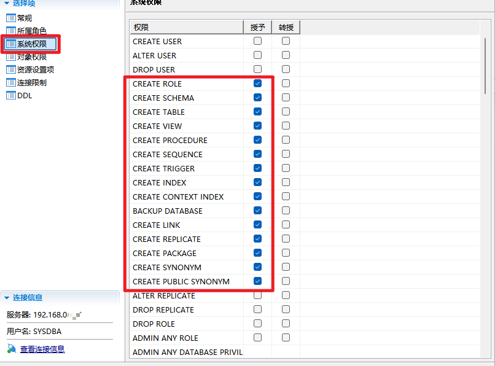


#### 创建模式

模式不需要手动创建，创建好用户之后，就会自动创建一个该用户的模式。

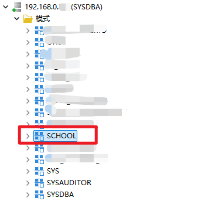


DM管理工具的操作暂时结束，接下来切换到DM数据迁移工具


#### 新建迁移任务

打开 `DM数据迁移工具` ，新建迁移任务

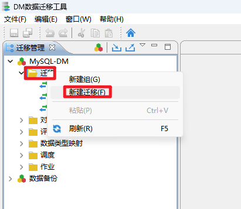


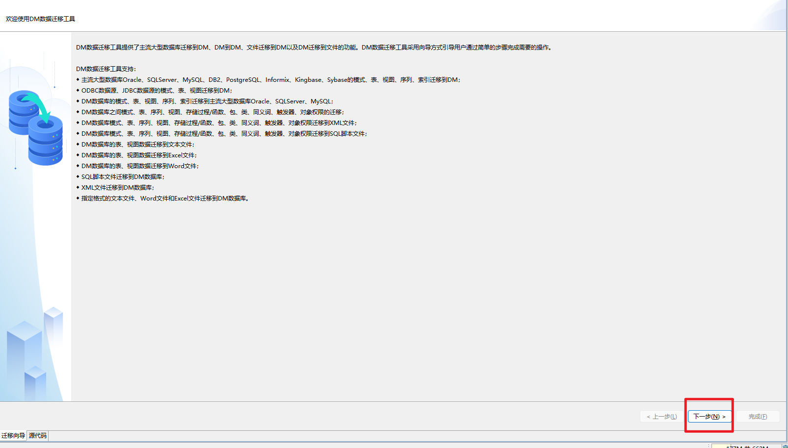

选择从mysql迁移到达梦数据库。

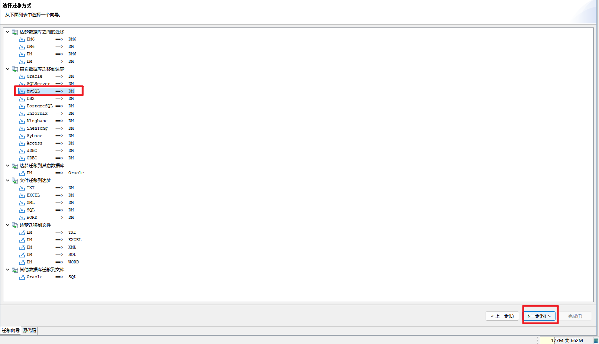

输入要迁移的mysql数据库基础信息，然后再下一步。

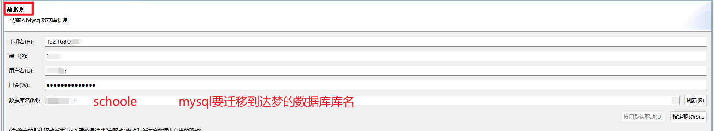

输入达梦的数据库基础信息

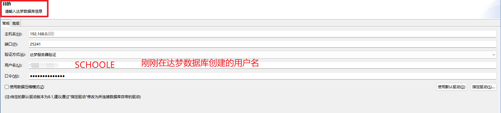


#### 选择迁移策略

建议将出错后继续执行取消掉，当出现错误的时候建议清理已经迁移的库和表数据，解决错误信息后，重新执行迁移任务。

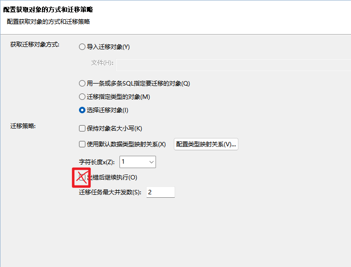

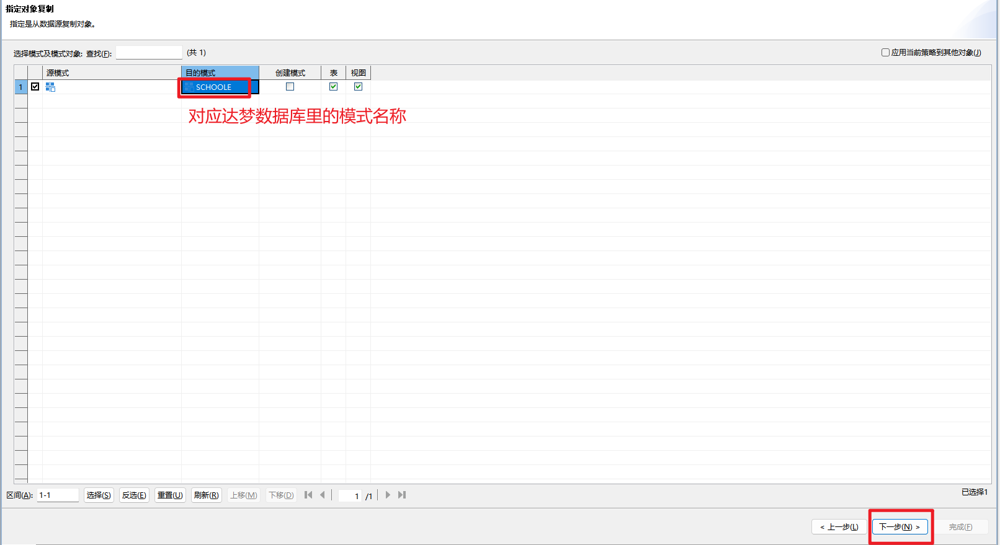

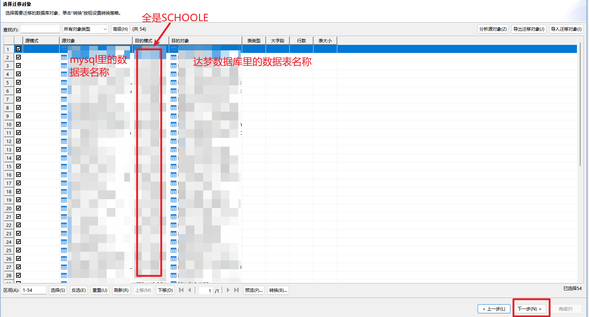


#### 开始迁移

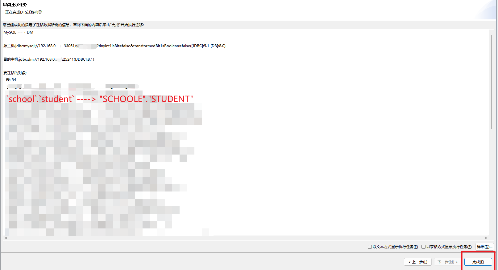


成功执行后，迁移工作结束！