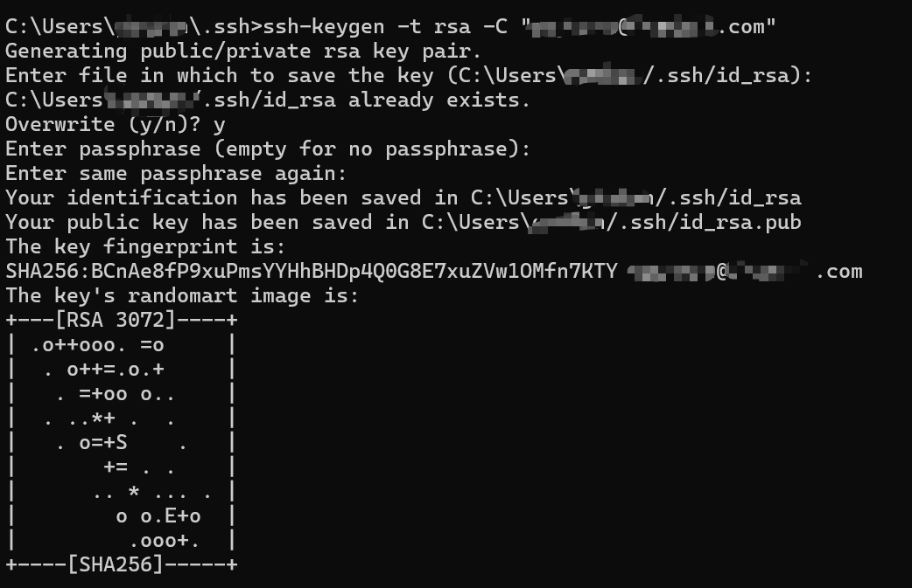

**——本地生成密钥对、访问 Linux 服务器及 GitHub**  

<!-- more -->

---


## **1. 生成 SSH 密钥对（Windows/Linux/macOS）**

### **1.1 生成 RSA 密钥对**（建议）
```bash
ssh-keygen -t rsa -C "your_email@example.com"
```
- **`-t rsa`**：指定密钥类型为 RSA。  
- **`-C "your_email@example.com"`**：注释（可选，用于标识密钥）。  

**执行后：**
1. 默认保存路径：
   - Windows: `C:\Users\<用户名>\.ssh\id_rsa`  
   - Linux/macOS: `~/.ssh/id_rsa`  
2. **建议不设置密码（直接回车两次）**，否则每次使用 SSH 需输入密码。





### **1.2 可选：生成 Ed25519 密钥（更安全）**
```bash
ssh-keygen -t ed25519 -C "your_email@example.com"
```
- Ed25519 比 RSA 更安全且更快，但部分旧系统可能不支持。


## **2. 配置 SSH 免密登录 Linux 服务器**
### **2.1 将公钥上传到 Linux 服务器**
#### **方法 1：使用 `ssh-copy-id`（推荐）**

username：对应远程服务器的用户。

server_ip：对应远程服务器的IP地址。

```bash
ssh-copy-id -i ~/.ssh/id_rsa.pub username@server_ip
```
输入服务器密码后，公钥会自动添加到 `~/.ssh/authorized_keys`。

#### **方法 2：手动复制（适用于 Windows）**
1. **查看公钥**：
   ```bash
   cat ~/.ssh/id_rsa.pub
   ```
2. **登录服务器**，将公钥追加到 `authorized_keys`：
   ```bash
   mkdir -p ~/.ssh
   echo "粘贴你的公钥" >> ~/.ssh/authorized_keys
   chmod 700 ~/.ssh
   chmod 600 ~/.ssh/authorized_keys
   ```

---

### **2.2 测试 SSH 登录**

username：对应远程服务器的用户。

server_ip：对应远程服务器的IP地址。

```shell
ssh username@server_ip
```

如果服务器使用的不是22端口，则可以使用 `-p 端口`

```bash
ssh username@server_ip -p 10010
```
如果配置正确，应直接登录，无需密码。

---

### **2.3 可选：禁用密码登录（增强安全）**
编辑 `/etc/ssh/sshd_config`：
```bash
sudo nano /etc/ssh/sshd_config
```
修改：
```ini
PasswordAuthentication no
PubkeyAuthentication yes
```
重启 SSH 服务：
```bash
sudo systemctl restart sshd
```

---

## **3. 使用 SSH 密钥连接 GitHub**
### **3.1 添加公钥到 GitHub**
1. **复制公钥**：
   ```bash
   cat ~/.ssh/id_rsa.pub
   ```
2. **登录 GitHub → Settings → SSH and GPG keys → New SSH key**  
   - **Title**: 自定义名称（如 `My Laptop`）  
   - **Key**: 粘贴 `id_rsa.pub` 内容  

### **3.2 测试 GitHub 连接**
```bash
ssh -T git@github.com
```
成功会显示：
```
Hi username! You've successfully authenticated...
```

### **3.3 使用 SSH 克隆仓库**
```bash
git clone git@github.com:username/repo.git
```
（替换 HTTPS 方式，避免每次输入密码）

---

## **4. 高级配置（可选）**
### **4.1 管理多个 SSH 密钥**
编辑 `~/.ssh/config`：
```ini
# GitHub
Host github.com
    HostName github.com
    User git
    IdentityFile ~/.ssh/id_rsa_github

# 公司服务器
Host company-server
    HostName server_ip
    User deploy
    IdentityFile ~/.ssh/id_rsa_company
```
- **使用方式**：
  ```bash
  ssh company-server  # 代替 ssh deploy@server_ip
  git clone git@github.com:user/repo.git  # 自动使用指定密钥
  ```

### **4.2 密钥加密（增加密码保护）**
生成密钥时设置密码：
```bash
ssh-keygen -t rsa -C "your_email@example.com"
```
后续可使用 `ssh-add` 缓存密码（临时免输入）：
```bash
eval $(ssh-agent)  # 启动 agent
ssh-add ~/.ssh/id_rsa  # 添加密钥（需输入密码）
```

---

## **5. 常见问题排查**
### **5.1 权限问题**
- **`.ssh` 目录权限必须为 `700`**：
  ```bash
  chmod 700 ~/.ssh
  ```
- **`authorized_keys` 权限必须为 `600`**：
  ```bash
  chmod 600 ~/.ssh/authorized_keys
  ```

### **5.2 连接失败**
- **检查 SSH 服务状态**：
  ```bash
  sudo systemctl status sshd
  ```
- **查看详细错误**：
  ```bash
  ssh -v username@server_ip
  ```

### **5.3 GitHub 认证失败**
- **确认公钥已正确添加**。
- **测试连接**：
  ```bash
  ssh -T git@github.com
  ```

---

## **6. 总结**
| **场景**               | **操作**                          |
|-----------------------|----------------------------------|
| **生成密钥对**         | `ssh-keygen -t rsa -b 4096`      |
| **上传公钥到服务器**   | `ssh-copy-id` 或手动复制          |
| **GitHub SSH 连接**    | 添加公钥到 GitHub → 测试 `ssh -T` |
| **多密钥管理**         | 配置 `~/.ssh/config`             |
| **增强安全性**         | 禁用密码登录 + 使用 Ed25519       |

通过 SSH 密钥认证，可实现：

- **免密登录 Linux 服务器**
- **安全访问 Git Hub**
-  **避免密码泄露风险**  

建议定期更换密钥（如每年一次），并妥善保管私钥！