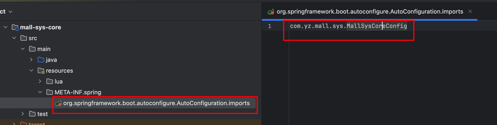
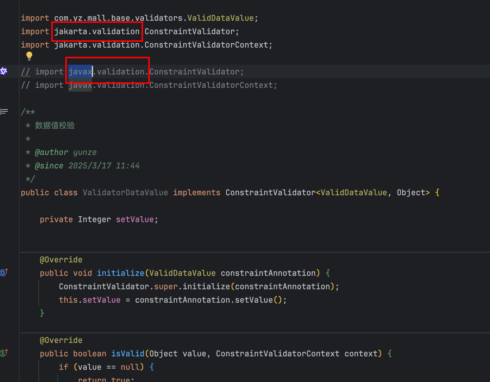
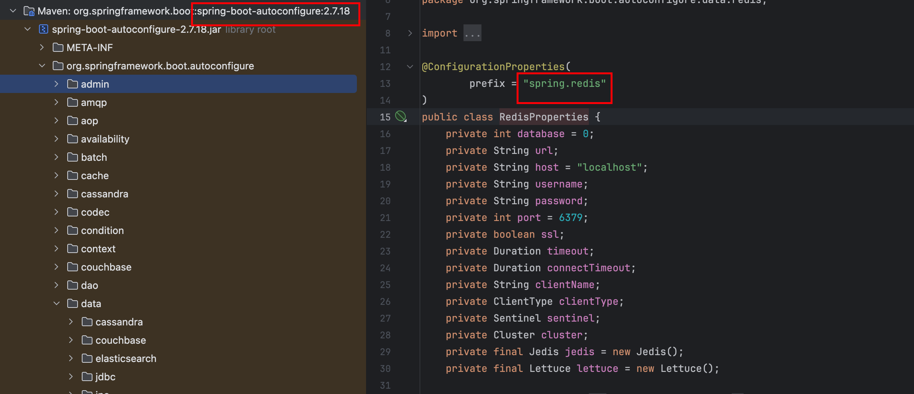
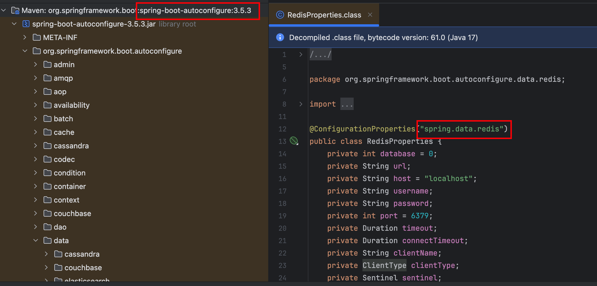

介绍spring boot2和spring boot3对应中间件的适应版本信息

<!-- more -->

## 版本说明

阿里巴巴的版本说明文档

https://github.com/alibaba/spring-cloud-alibaba/wiki/%E7%89%88%E6%9C%AC%E8%AF%B4%E6%98%8E

| 组件                                                         | SpringBoot 2系列 | Spring Boot 3系列 | 备注                                                         |
| ------------------------------------------------------------ | ---------------- | ----------------- | ------------------------------------------------------------ |
| JDK                                                          | 8                | 17                |                                                              |
| Spring Boot Version                                          |                  | 3.5.3             |                                                              |
| Spring Cloud Version                                         |                  | 2022.0.5          |                                                              |
| Spring Cloud Alibaba Version                                 |                  | 2022.0.0.2        |                                                              |
| Nacos  Version                                               |                  | 2.2.3             |                                                              |
| Seata Version                                                |                  |                   |                                                              |
| RocketMQ Version                                             |                  |                   |                                                              |
| Sentinel Version                                             |                  |                   |                                                              |
| [Mybatis Plus](https://baomidou.com/getting-started/install/) | 2.5.12           | 2.5.12            | 2里是mybatis-plus-boot-starter<br />3里是mybatis-plus-spring-boot3-starter |
| druid                                                        | 1.2.25           | 1.2.25            | 2里是druid<br />3里是druid-spring-boot-3-starter             |
| dynamic datasource                                           | 3.5.2            | 4.3.1             | 2里是dynamic-datasource-spring-boot-starter<br />3里是dynamic-datasource-spring-boot3-starter |
| sa-token                                                     |                  | 1.43.0            | 2里是sa-token-spring-boot-starter<br />3里是sa-token-spring-boot3-starter |


## SpringBoot2升级到SpringBoot3注意事项

### SPI自定义自动配置类调整

 **Spring Boot 3 已弃用 `spring.factories` ** ，改用 **`META-INF/spring/org.springframework.boot.autoconfigure.AutoConfiguration.imports`** 文件。




### javax.* 替换为 jakarta.*

jdk8里javax.* 路径下的包在jdk17里替换为了jakarta.*




### reids配置调整

redis配置从

```properties
spring.redis.XX
```

调整为了

```properties
spring.redis.data.XXX
```






 所以原先的redis配置需要从

```yaml
spring:  
  redis:
    host: 127.0.0.1
    port: 6379
    password: foobared
```

调整为

```yaml
spring:
  data:
    redis:
      host: 127.0.0.1
      port: 6379
      password: foobared
```


