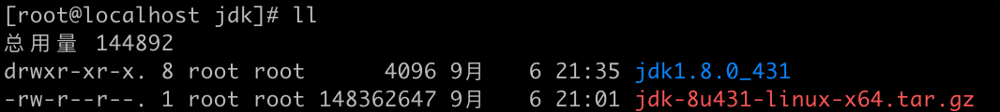
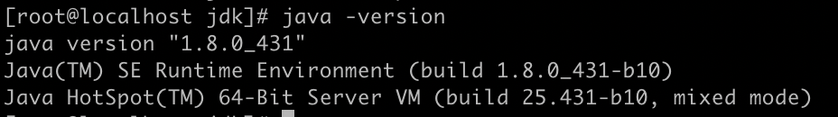

linux操作系统下安装jdk环境的操作手册

<!-- more -->

## 准备安装包

准备好jdk包 jdk-8u431-linux-x64.tar.gz

解压

```bash
tar -zxvf jdk-8u431-linux-x64.tar.gz
```




## 编辑环境变量

执行命令

```bash
vim /etc/profile
```


按 `i` 键，在最后一行添加如下信息

JAVA_HOME的地址是刚才解压出来文件夹的绝对路径。

```properties
export JAVA_HOME=/opt/tools/jdk/jdk1.8.0_431
export PATH=$JAVA_HOME/bin:$PATH
```


编辑好后，先按 `esc` 键，然后按 `:` 键，再输入 `wq` 指定，最后回车保存退出。


## 加载配置文件

执行命令

```bash
source /etc/profile
```


## 验证

