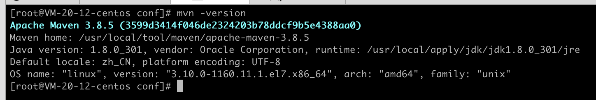

linux操作系统下安装maven环境的操作手册

<!-- more -->

1. 安装wget命令

   ```java
   yum -y install wget 
   ```

2. 下载maven安装包

   下载地址：https://mirrors.aliyun.com/apache/maven/maven-3/

   下载命令

   ```java
   wget https://mirrors.aliyun.com/apache/maven/maven-3/3.8.5/binaries/apache-maven-3.8.5-bin.tar.gz
   ```

3. 解压maven

   ```
   tar -zvxf apache-maven-3.8.5-bin.tar.gz
   ```

4. 配置maven环境变量

   ```java
   vi /etc/profile
   ```

   添加环境变量

   ```
   export MAVEN_HOME=/usr/local/tool/maven/apache-maven-3.8.5
   export PATH=$PATH:${JAVA_PATH}:$MAVEN_HOME/bin
   ```

   保存退出后执行下列命令使其生效

   ```
   source /etc/profile
   ```

5. 验证

   ```java
   mvn -version
   ```

   