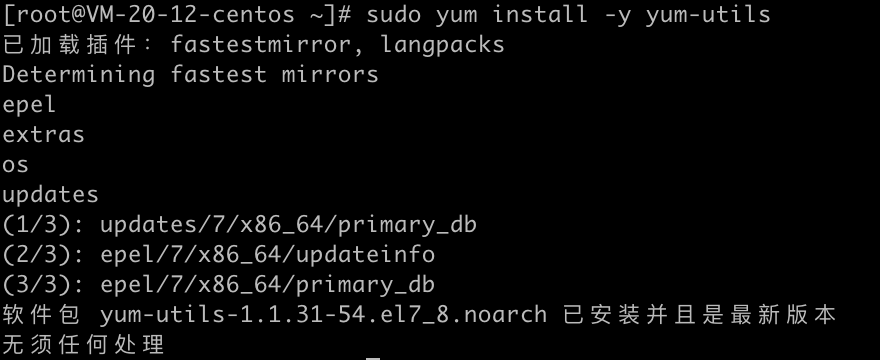
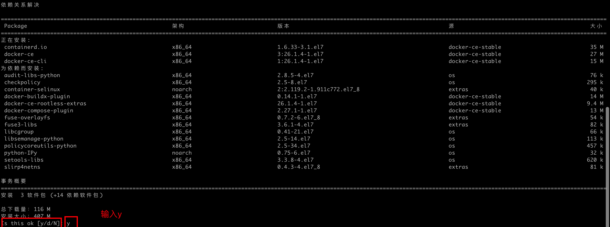
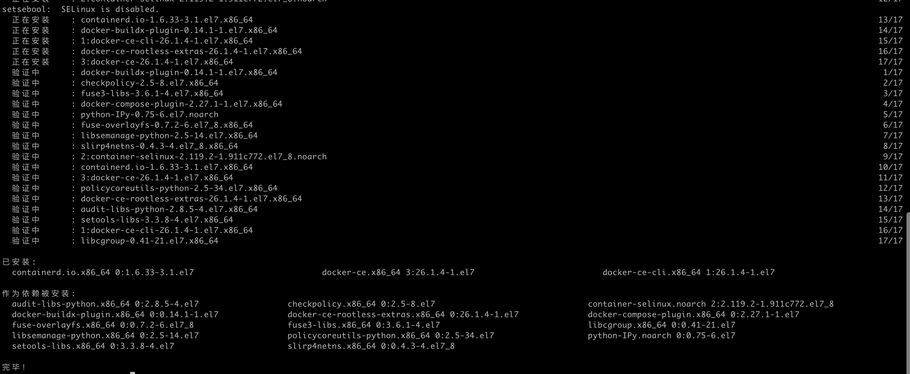
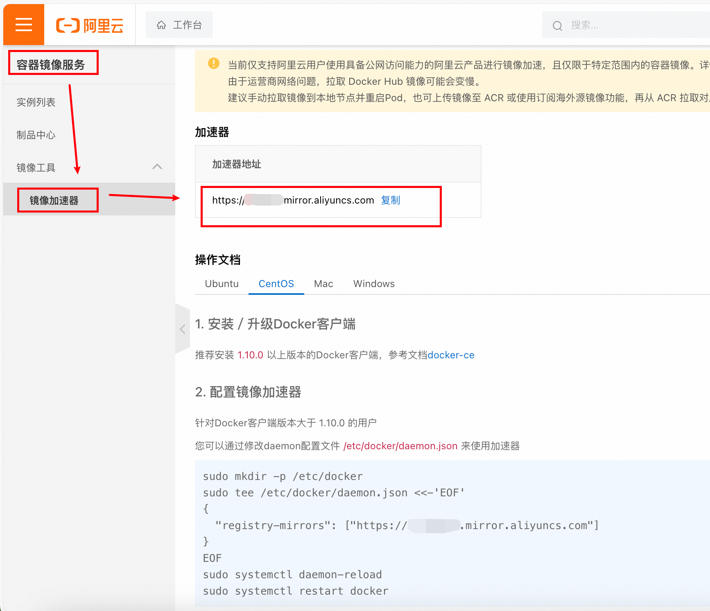

Docker的安装与常用操作命令，常用中间件的docker模式部署步骤。

<!-- more -->

# Docker安装与常用操作


## 一、CentOS系统安装Docker

### 1.准备docker所需环境

##### 执行命令清理相关环境，防止出现冲突

```shell
sudo yum remove docker     docker-client     docker-client-latest     docker-common     docker-latest     docker-latest-logrotate     docker-logrotate     docker-engine
```


##### 安装yum-utils工具包

```shell
sudo yum install -y yum-utils
```




##### 设置阿里的镜像

```shell
sudo yum-config-manager --add-repo http://mirrors.aliyun.com/docker-ce/linux/centos/docker-ce.repo
```


### 3.安装docker

```shell
sudo yum install docker-ce docker-ce-cli containerd.io
```








启动docker

```shell
sudo systemctl start docker
```


### 2.验证docker

查看docker版本

```shell
docker -v
```


设置镜像源，推荐使用阿里的

```shell
sudo tee /etc/docker/daemon.json <<EFO
{
	"registry-mirrors": [
		"https://xxxxxxx.mirror.aliyuncs.com"
	]
}
EFO
```



```shell
# 加载新配置信息
sudo systemctl daemon-reload
# 重启docker
sudo systemctl restart docker
```


docker 切换镜像

[可用] https://www.cnblogs.com/xietingfeng321/p/18451170

## 二、Docker常用操作

docker 安装redis

1. 拉取redis镜像
   ```shell
    docker pull redis:latest
   ```

2. 查看本地镜像
   ```shell
    docker images
   ```

3. 运行容器
    ```shell
    docker run -itd --name redis-dev -p 6379:6379 redis --requirepass "foobared"
    ```

4. 查看运行中的容器
    ```shell
    docker ps
    ```

5. 进入容器空间操作
    ```shell
    docker exec -it redis-dev /bin/bash
    ```

6. 关闭运行中的容器

   先使用命令 `docker ps` 查看处于运行中的容器

   ```shell
   yunze@yunzedeMacBook-Pro ~ % docker ps
   CONTAINER ID   IMAGE     COMMAND                   CREATED        STATUS        PORTS                    NAMES
   039e8dbc0fed   redis     "docker-entrypoint.s…"   40 hours ago   Up 40 hours   0.0.0.0:6379->6379/tcp   redis-dev
   ```

   然后根据运行中容器的 `CONTAINER ID` 去关闭容器

   ```shell
   yunze@yunzedeMacBook-Pro ~ % docker stop 039e8dbc0fed
   039e8dbc0fed
   ```

7. 删除容器

   ```shell
   docker rm 039e8dbc0fed # (容器ID，CONTAINER ID)
   ```

8. 删除镜像

   ```shell
   docker rmi [IMAGE ID]
   ```
9. 运行rabbitmq镜像

   ```shell
   docker run -d --name=rabbitmq -v /usr/local/docker/rabbitmq:/var/lib/rabbitmq -p 15672:15672 -p 5672:5672 -e RABBITMQ_DEFAULT_USER=admin -e RABBITMQ_DEFAULT_PASS=admin rabbitmq:management
   ```


10. 查询中间件镜像的具体版本

    ```shell
    docker image inspect redis:latest | grep -i version
    ```


## 三、镜像导入导出

### 将镜像保存为tar文件

```shell
docker save [IMAGE ID] > nacos-2.3.2.tar
```


### 将tar文件载入docker

```shell
docker load < nacos-2.3.2.tar
```


### 修改镜像的名称和TAG版本

构建一个镜像之后，发现镜像的名称和TAG为none


修改方式

```shell
# docker tag [IMAGE ID] [新的REPOSITORY]:[新的TAG]
docker tag d3063c1db2bb nacos/nacos-server:v2.3.2
```


## 四、同一镜像多个系统架构版本解决方案
```shell
docker manifest create registry.cn-hangzhou.aliyuncs.com/yunze_images_space/seata-server:latest registry.cn-hangzhou.aliyuncs.com/yunze_images_space/seata-server:arm64 registry.cn-hangzhou.aliyuncs.com/yunze_images_space/seata-server:x64
```


```shell
docker manifest push registry.cn-hangzhou.aliyuncs.com/yunze_images_space/seata-server:latest && docker manifest rm registry.cn-hangzhou.aliyuncs.com/yunze_images_space/seata-server:latest
```


```shell
docker pull --platform=linux/amd64 registry.cn-hangzhou.aliyuncs.com/yunze_images_space/seata-server:latest
```


## 五、安装docker-compose

下载docker-compose的安装包

（可以去挑选合适自己的版本 https://github.com/docker/compose/releases）

```shell
wget https://github.com/docker/compose/releases/download/v2.29.7/docker-compose-linux-x86_64
```

将安装包重命名为 **docker-compose** ，并将其移动到 **/usr/local/bin/** 目录下

```shell
mv docker-compose-linux-x86_64 /usr/local/bin/docker-compose
```

授予其可执行权限

```shell
chmod +x /usr/local/bin/docker-compose
```

验证 **docker-compose**

```shell
docker-compose --version
```


