Docker常用操作和常用中间件的部署。

<!-- more -->

# Docker无法拉取镜像文件解决方案

当下拉取镜像会出现如下异常

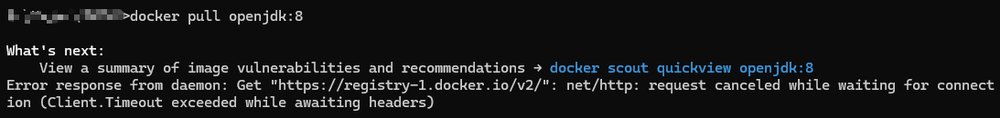


当前解决方案有两个

方案一：配置国内还可以使用的镜像源

方案二：结合github的action + 阿里云的容器镜像服务实现镜像的拉取


## 配置国内还可以使用的镜像源

### linux配置命令

```shell
sudo tee /etc/docker/daemon.json <<EFO
{
 "registry-mirrors": [
  	 "https://2a6bf1988cb6428c877f723ec7530dbc.mirror.swr.myhuaweicloud.com",
     "https://docker.m.daocloud.io",
     "https://hub-mirror.c.163.com",
     "https://mirror.baidubce.com",
     "https://your_preferred_mirror",
     "https://dockerhub.icu",
     "https://docker.registry.cyou",
     "https://docker-cf.registry.cyou",
     "https://dockercf.jsdelivr.fyi",
     "https://docker.jsdelivr.fyi",
     "https://dockertest.jsdelivr.fyi",
     "https://mirror.aliyuncs.com",
     "https://dockerproxy.com",
     "https://mirror.baidubce.com",
     "https://docker.m.daocloud.io",
     "https://docker.nju.edu.cn",
     "https://docker.mirrors.sjtug.sjtu.edu.cn",
     "https://docker.mirrors.ustc.edu.cn",
     "https://mirror.iscas.ac.cn",
     "https://docker.rainbond.cc",
     "http://hub-mirror.c.163.com"
   ]
}
EFO
```


### windows配置方式

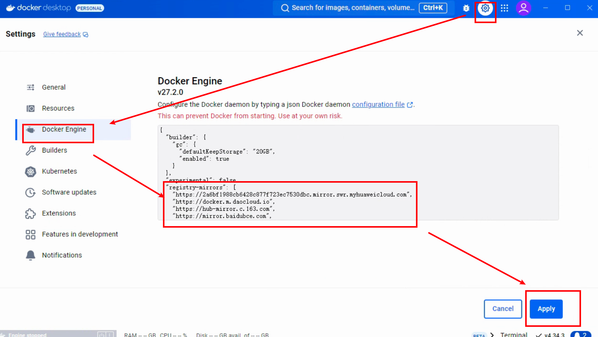

```json
{
  "builder": {
    "gc": {
      "defaultKeepStorage": "20GB",
      "enabled": true
    }
  },
  "experimental": false,
  "registry-mirrors": [
    "https://2a6bf1988cb6428c877f723ec7530dbc.mirror.swr.myhuaweicloud.com",
    "https://docker.m.daocloud.io",
    "https://hub-mirror.c.163.com",
    "https://mirror.baidubce.com",
    "https://your_preferred_mirror",
    "https://dockerhub.icu",
    "https://docker.registry.cyou",
    "https://docker-cf.registry.cyou",
    "https://dockercf.jsdelivr.fyi",
    "https://docker.jsdelivr.fyi",
    "https://dockertest.jsdelivr.fyi",
    "https://mirror.aliyuncs.com",
    "https://dockerproxy.com",
    "https://mirror.baidubce.com",
    "https://docker.m.daocloud.io",
    "https://docker.nju.edu.cn",
    "https://docker.mirrors.sjtug.sjtu.edu.cn",
    "https://docker.mirrors.ustc.edu.cn",
    "https://mirror.iscas.ac.cn",
    "https://docker.rainbond.cc",
    "http://hub-mirror.c.163.com"
  ]
}
```

配置好镜像源后，重启docker。

重启好docker之后，再重新去执行命令

```shell
docker pull openjdk:8
```

从下图可以发现开始去拉取镜像了。

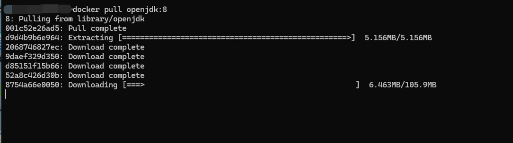

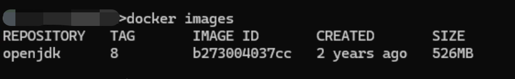


> 注意：该方法虽然可以去拉取镜像，但这些镜像源不知道可以坚持到啥时候。所以还是比较推荐使用第二种github的action结合阿里云的方法，可以一劳永逸的解决镜像的拉取问题。


## 结合GitHub Action和阿里云拉取镜像

先登录阿里云，然后再去阿里云的搜索框里搜索 `容器镜像服务` 。

然后开通他的 `个人版实例` 。

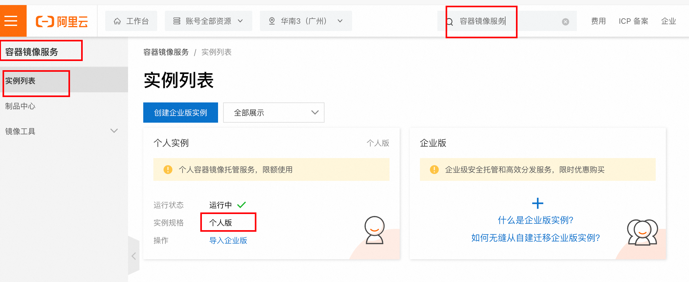

创建好后，点击个人实例模块，会进入到如下页面。

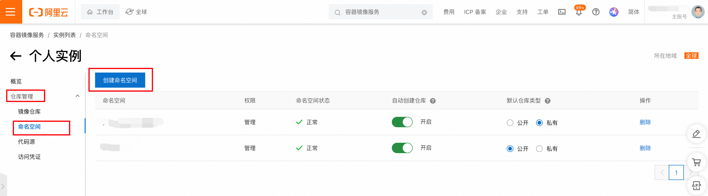

去点击创建命名空间，创建一个对自己镜像归类的空间名

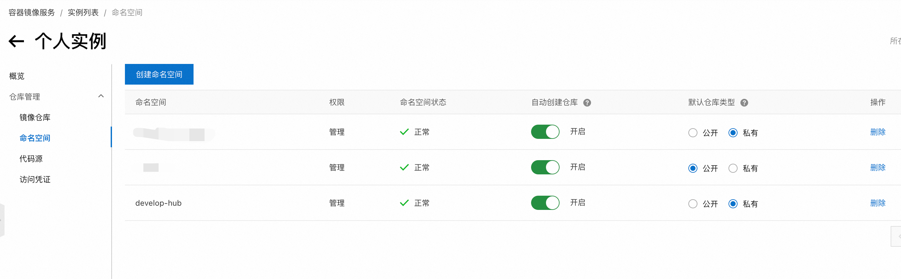


需要在阿里云里准备如下几个信息

**ALIYUN_NAME_SPACE（命名空间）** ：develop-hub

**ALIYUN_REGISTRY_USER（用户名）** ：t_xxxxxx

**ALIYUN_REGISTRY_PASSWORD（访问密码）** ：123456

**ALIYUN_REGISTRY** ：registry.cn-guangzhou.aliyuncs.com

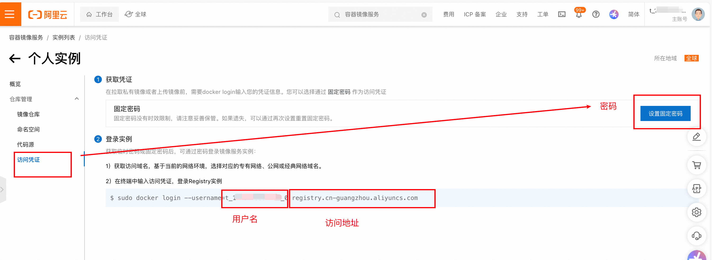

前往github搜索 **[docker_image_pusher](https://github.com/tech-shrimp/docker_image_pusher)** ，仓库地址为: https://github.com/tech-shrimp/docker_image_pusher

fork这个项目

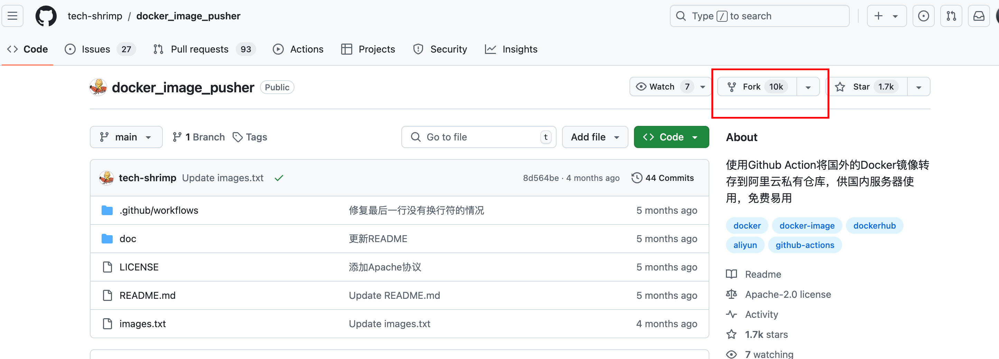

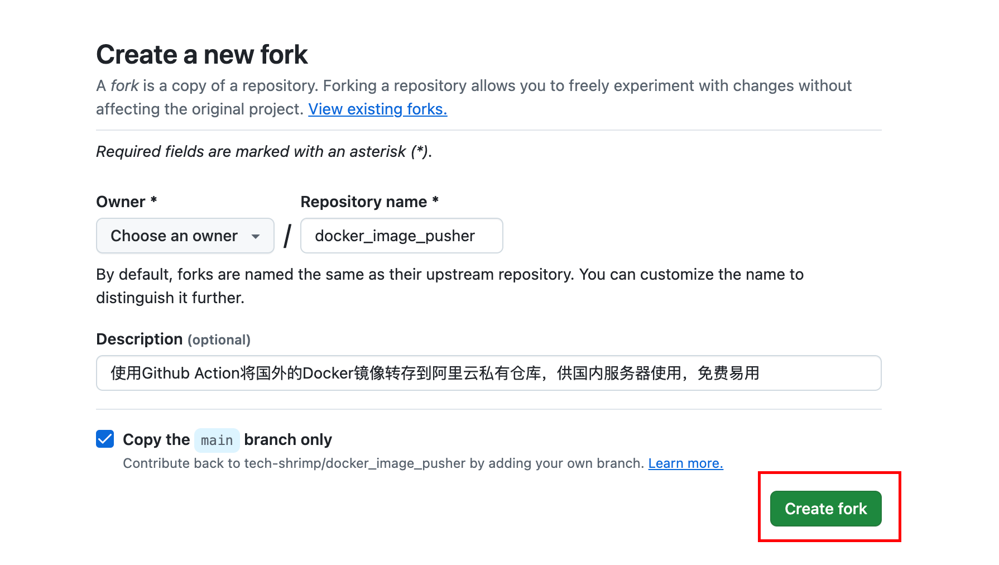

然后开启fork到自己仓库项目的 `Action`

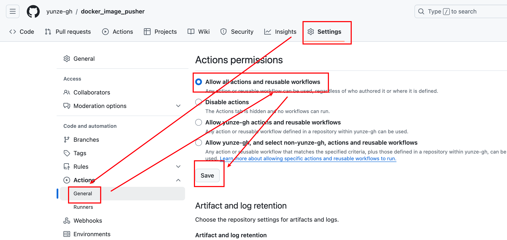


去配置环境变量

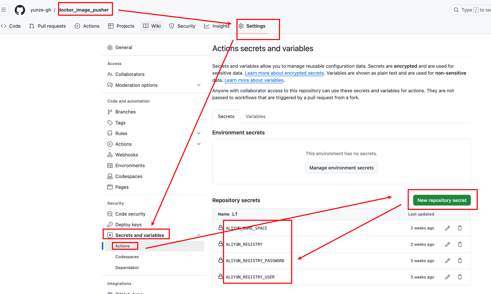

这几个变量就是上文中配置 `阿里云容器镜像服务` 时获取到的几个信息。

配置好之后就可以去添加自己需要的镜像了，操作步骤如下：

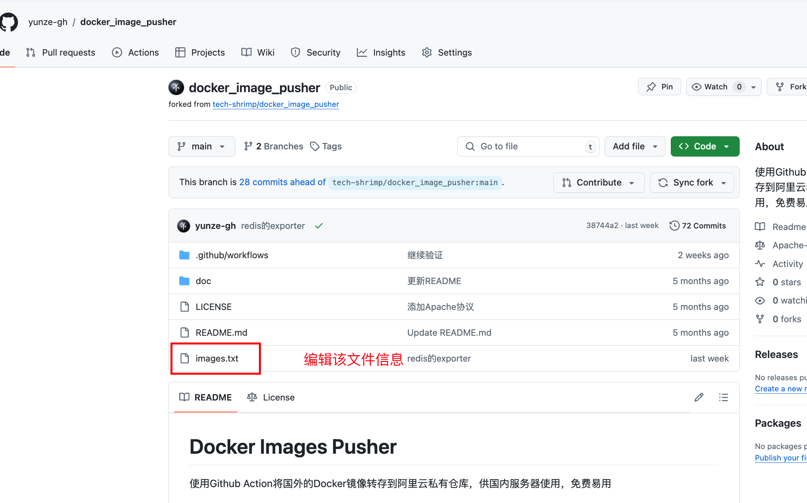

在这个文件里添加自己需要的镜像

格式为： `镜像名:tag版本`

如果不带tag版本，就是默认的 `latest`

如果需要 `指定镜像架构` ，则在镜像名前面加上--platform=linux/amd64或--platform=linux/arm64

一行一个镜像。

开头为 `#` 则表示是注释。

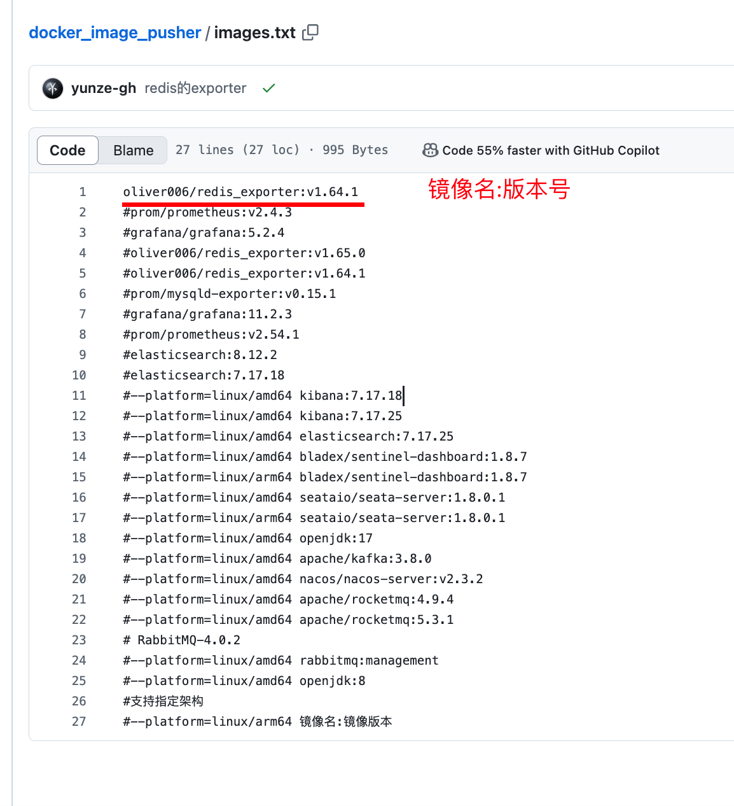

文件编辑完，提交之后，会自动进入Github Action构建，

可以看看 action 都做了些什么操作

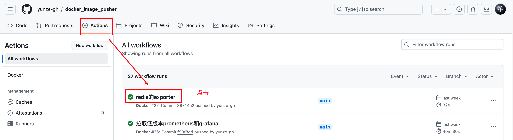

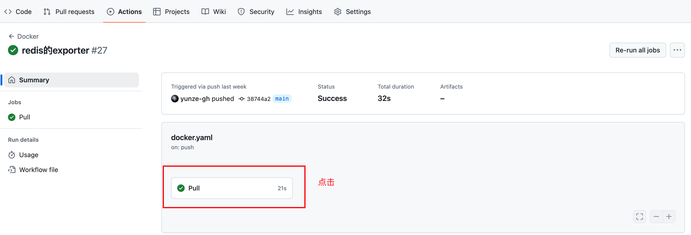

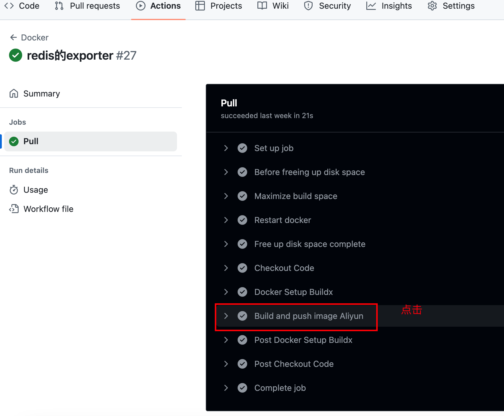

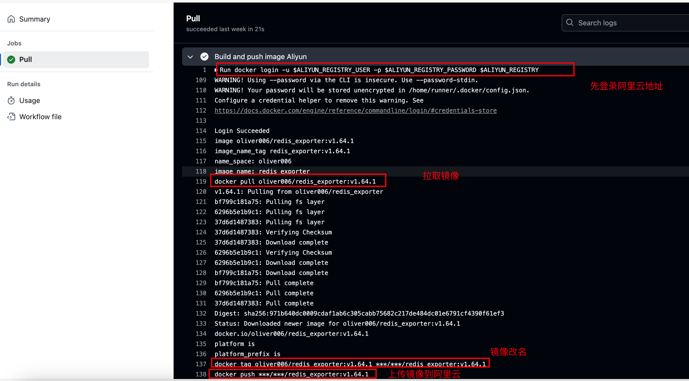


等 `Action` 执行完之后，

在阿里云的镜像仓库里就可以看到这个镜像了。

镜像的拉取方式，阿里云有详细的操作指南。

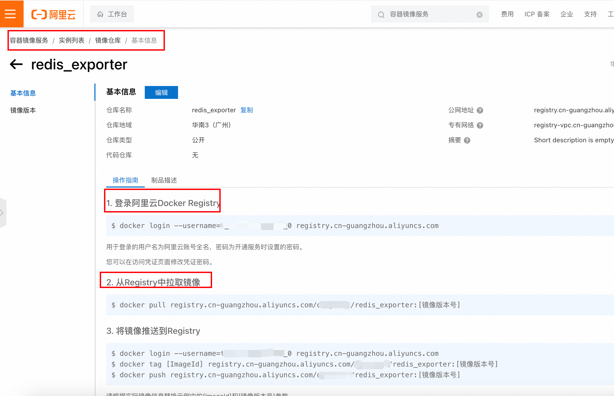

自此便实现了镜像拉取自由

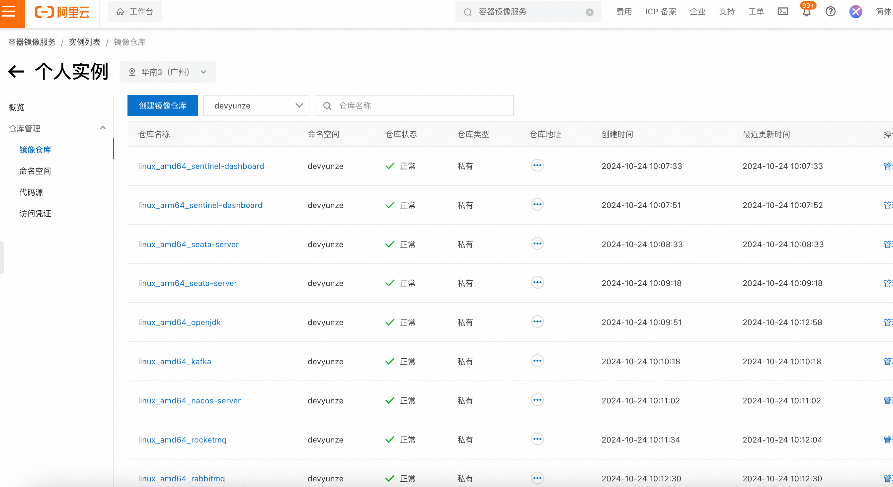