使用创建清单方式，将多架构清单合并到一个版本内，最终实现在一个版本里可以包含多个架构镜像。

<!-- more -->

# Docker合并多架构镜像到一个镜像方案

## 拉取镜像

先将不同架构的镜像拉取到本地

```shell
docker pull registry.cn-guangzhou.aliyuncs.com/devyunze/linux_amd64_nginx:1.26.3

docker pull registry.cn-guangzhou.aliyuncs.com/devyunze/linux_arm64_v8_nginx:1.26.3
```

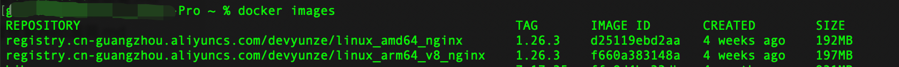


## 修改镜像名

将不同架构镜像的 repository 修改一致，在tag 标签里做版本和架构的区分。

```shell
docker image tag registry.cn-guangzhou.aliyuncs.com/devyunze/linux_amd64_nginx:1.26.3 registry.cn-guangzhou.aliyuncs.com/devyunze/nginx:1.26.3_amd64

docker image tag registry.cn-guangzhou.aliyuncs.com/devyunze/linux_arm64_v8_nginx:1.26.3 registry.cn-guangzhou.aliyuncs.com/devyunze/nginx:1.26.3_arm64
```

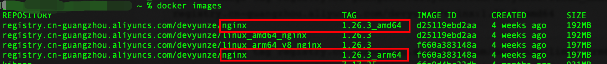


## 推送镜像

这里使用的是阿里云的容器镜像服务，但是不管使用哪家企业提供的镜像服务，其操作过程都是一样的，将本地的修改好名称的镜像推送上去。

```shell
docker push registry.cn-guangzhou.aliyuncs.com/devyunze/nginx:1.26.3_arm64

docker push registry.cn-guangzhou.aliyuncs.com/devyunze/nginx:1.26.3_amd64
```

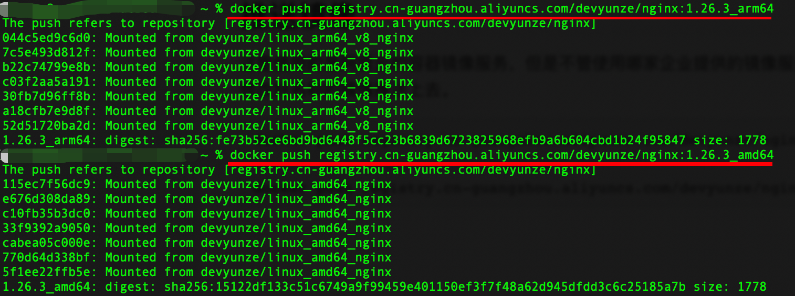

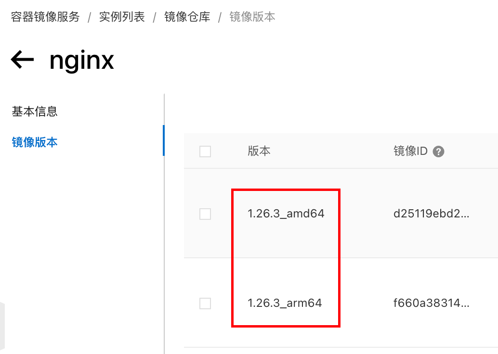


## 创建清单

```shell
docker manifest create registry.cn-guangzhou.aliyuncs.com/devyunze/nginx:1.26.3 registry.cn-guangzhou.aliyuncs.com/devyunze/nginx:1.26.3_arm64 registry.cn-guangzhou.aliyuncs.com/devyunze/nginx:1.26.3_amd64
```

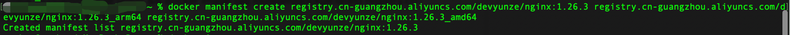


## 推送清单

```shell
docker manifest push registry.cn-guangzhou.aliyuncs.com/devyunze/nginx:1.26.3
```


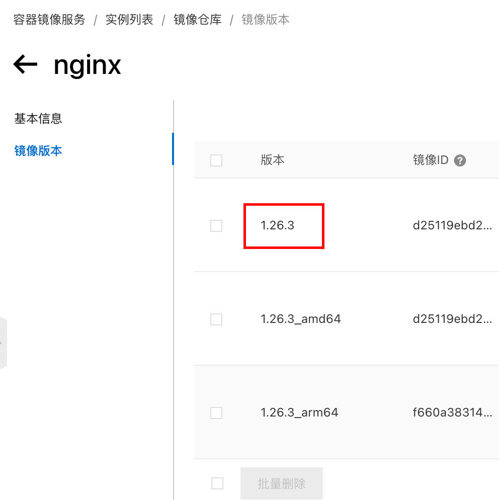


## 删除清单


```shell
docker manifest rm registry.cn-guangzhou.aliyuncs.com/devyunze/nginx:1.26.3 
```


## 验证

### arm64架构环境拉取amd64架构镜像验证

```shell
docker pull --platform linux/amd64 registry.cn-guangzhou.aliyuncs.com/devyunze/nginx:1.26.3
```

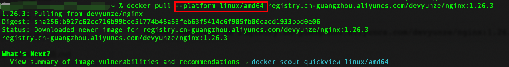

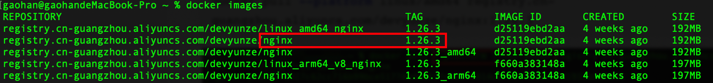

运行镜像验证

```shell
docker run -d --name=nginx-test -p 80:80 registry.cn-guangzhou.aliyuncs.com/devyunze/nginx:1.26.3 
```

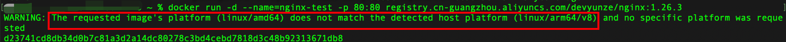

运行镜像时可以看到，已经有警告提示信息说架构不匹配了。这就证明拉取到镜像的确实是amd64架构的镜像。

### arm64架构环境拉取arm64架构镜像验证

先清理上一步测试的容器和镜像。

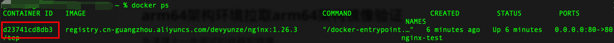

关闭并删除之前测试的容器和镜像。

```shell
docker stop d23741cd8db3

docker rm d23741cd8db3

docker rmi registry.cn-guangzhou.aliyuncs.com/devyunze/nginx:1.26.3
```

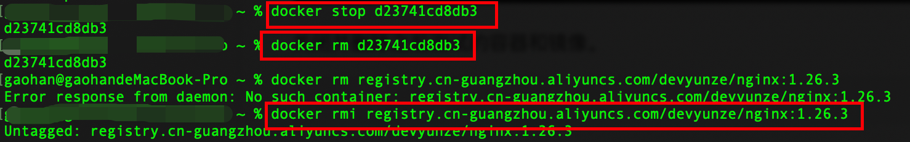

拉取arm64镜像

```shell
docker pull --platform linux/arm64 registry.cn-guangzhou.aliyuncs.com/devyunze/nginx:1.26.3
```

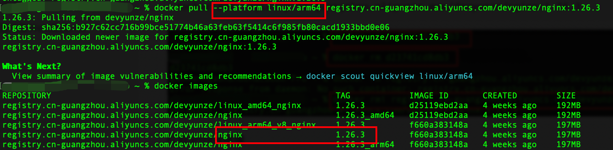

运行镜像验证

```shell
docker run -d --name=nginx-test -p 80:80 registry.cn-guangzhou.aliyuncs.com/devyunze/nginx:1.26.3 
```

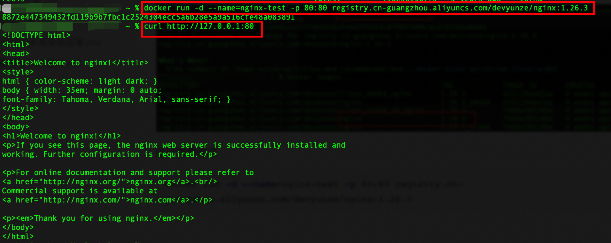

可以看到容器运行成功，并成功访问到nginx。

证明此次拉取到镜像的确实是arm64架构的镜像。

至此将多个架构镜像合并到一个镜像里的操作可以宣告成功了。
