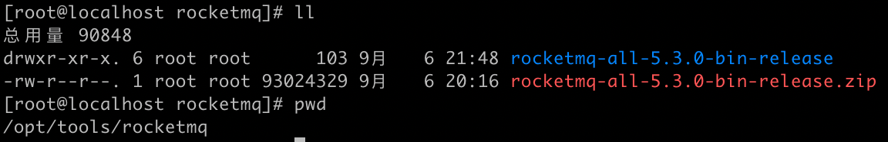
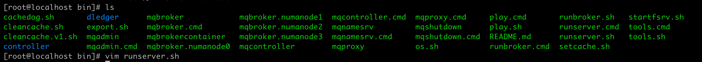
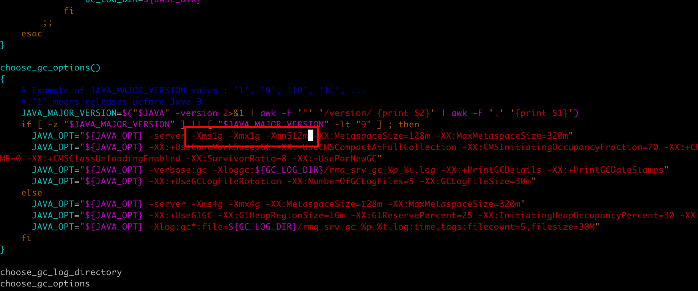
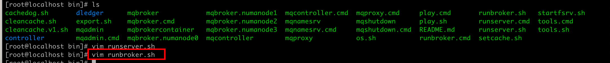
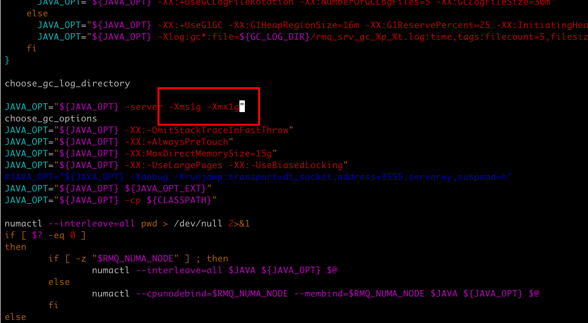
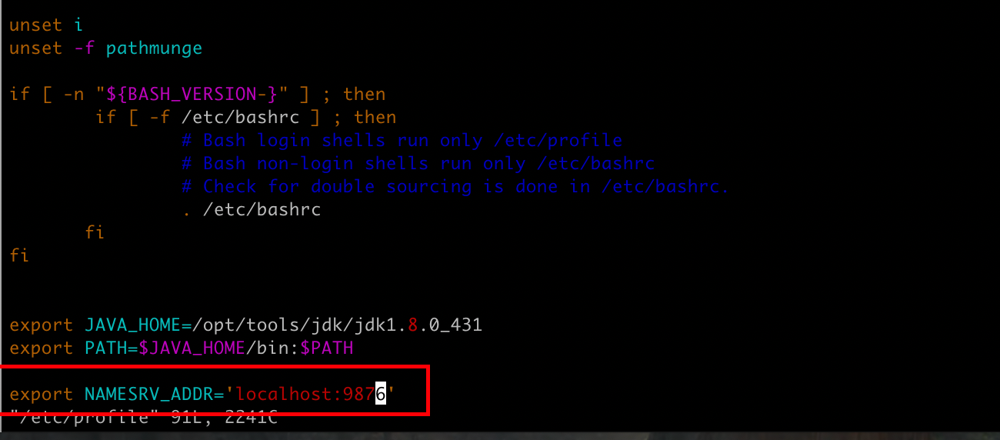
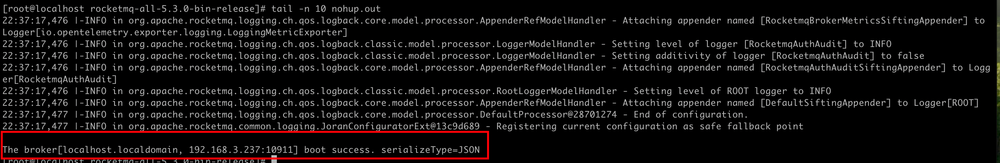
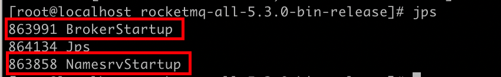
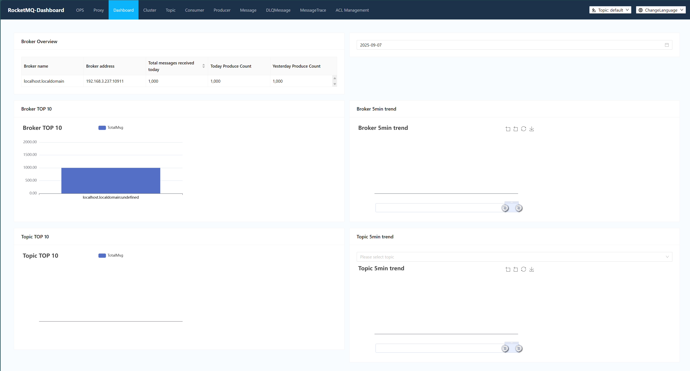
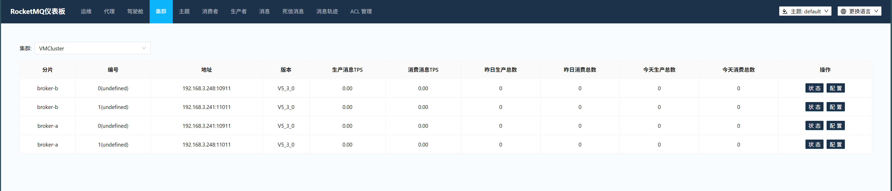

## 部署单机rocketmq

### 解压缩包




### 调整启用脚本

#### runserver.sh






#### runbroker.sh






### 启动nameserver服务

```bash
nohup bin/mqnamesrv &
```


查看日志

```bash
tail -n 10 nohup.out
```


启动成功


### 配置环境变量

```bash
# 编辑环境变量
vim /etc/profile
# 加载变量
source /etc/profile
```

添加nameserver服务的地址环境变量




### 启动broker服务

```bash
nohup bin/mqbroker &
```


查看日志

```bash
tail -n 10 nohup.out
```



启动成功





### 测试验证

发送消息

```bash
/opt/tools/rocketmq/rocketmq-all-5.3.0-bin-release/bin/tools.sh org.apache.rocketmq.example.quickstart.Producer
```

消费消息

```bash
/opt/tools/rocketmq/rocketmq-all-5.3.0-bin-release/bin/tools.sh org.apache.rocketmq.example.quickstart.Consumer
```


## 部署rocketmq-dashboard

```bash
docker run -d --name rocketmq-dashboard -e "JAVA_OPTS=-Drocketmq.namesrv.addr=192.168.3.237:9876" -p 8082:8082 -t registry.cn-guangzhou.aliyuncs.com/devyunze/rocketmq-dashboard:2.1.0
```

访问 http://ip:8082




## 升级为分部署集群

| 机器                     | 服务名称        | 备注                    |
| ------------------------ | --------------- | ----------------------- |
| 192.168.3.237（worker1） | nameserver-1    | nameserver服务集群节点1 |
| 192.168.3.237（worker1） |                 |                         |
| 192.168.3.237（worker1） |                 |                         |
| 192.168.3.241（worker2） | nameserver-2    | nameserver服务集群节点2 |
| 192.168.3.241（worker2） | broker-a-master | broker服务a节点（主）   |
| 192.168.3.241（worker2） | broker-b-slave  | broker服务b节点（从）   |
| 192.168.3.248（worker3） | nameserver-3    | nameserver服务集群节点3 |
| 192.168.3.248（worker3） | broker-b-master | broker服务b节点（主）   |
| 192.168.3.248（worker3） | broker-a-slave  | broker服务a节点（从）   |


确保此时服务器上没有正在运行的broker服务


### 调整 worker2 的  broker 配置

#### broker-a-master节点

配置路径：/opt/tools/rocketmq/rocketmq-all-5.3.0-bin-release/conf/2m-2s-async/broker-a.properties

配置信息如下

```properties
# broker集群的名称，名字一样的节点就在同一个集群内
brokerClusterName=VMCluster
# 主从节点的brokerName要保持一致，保证是同一份数据
brokerName=broker-a
# brokerId为0的节点是master节点，大于0的就是slave节点
brokerId=0
# nameServer服务地址，用“;”进行分割
namesrvAddr=192.168.3.237:9876;192.168.3.241:9876;192.168.3.248:9876
deleteWhen=04
fileReservedTime=48
# 存储路径
storePathRootDir=/opt/tools/rocketmq/store
storePathCommitLog=/opt/tools/rocketmq/store/commitlog
storePathConsumeQueue=/opt/tools/rocketmq/store/consumequeue
storePathIndex=/opt/tools/rocketmq/store/index
storeCheckpoint=/opt/tools/rocketmq/store/checkpoint
aborFile=/opt/tools/rocketmq/store/abort
# broker角色，ASYNC_MASTER为主节点，SLAVE为从节点
brokerRole=ASYNC_MASTER
flushDiskType=ASYNC_FLUSH
# 服务端口
listenPort=10911
```


#### broker-b-slave节点

配置路径：/opt/tools/rocketmq/rocketmq-all-5.3.0-bin-release/conf/2m-2s-async/broker-b-s.properties

配置信息如下

```properties
# broker集群的名称，名字一样的节点就在同一个集群内
brokerClusterName=VMCluster
# 主从节点的brokerName要保持一致，保证是同一份数据
brokerName=broker-b
# brokerId为0的节点是master节点，大于0的就是slave节点
brokerId=1
# nameServer服务地址，用“;”进行分割
namesrvAddr=192.168.3.237:9876;192.168.3.241:9876;192.168.3.248:9876
deleteWhen=04
fileReservedTime=48
# 存储路径
storePathRootDir=/opt/tools/rocketmq/storeSlave
storePathCommitLog=/opt/tools/rocketmq/storeSlave/commitlog
storePathConsumeQueue=/opt/tools/rocketmq/storeSlave/consumequeue
storePathIndex=/opt/tools/rocketmq/storeSlave/index
storeCheckpoint=/opt/tools/rocketmq/storeSlave/checkpoint
aborFile=/opt/tools/rocketmq/storeSlave/abort
# broker角色，ASYNC_MASTER为主节点，SLAVE为从节点
brokerRole=SLAVE
flushDiskType=ASYNC_FLUSH
# 服务端口
listenPort=11011
```


### 调整 worker3 的  broker 配置

#### broker-a-slave节点

配置路径：/opt/tools/rocketmq/rocketmq-all-5.3.0-bin-release/conf/2m-2s-async/broker-a.properties

配置信息如下

```properties
# broker集群的名称，名字一样的节点就在同一个集群内
brokerClusterName=VMCluster
# 主从节点的brokerName要保持一致，保证是同一份数据
brokerName=broker-a
# brokerId为0的节点是master节点，大于0的就是slave节点
brokerId=1
# nameServer服务地址，用“;”进行分割
namesrvAddr=192.168.3.237:9876;192.168.3.241:9876;192.168.3.248:9876
deleteWhen=04
fileReservedTime=48
# 存储路径
storePathRootDir=/opt/tools/rocketmq/storeSlave
storePathCommitLog=/opt/tools/rocketmq/storeSlave/commitlog
storePathConsumeQueue=/opt/tools/rocketmq/storeSlave/consumequeue
storePathIndex=/opt/tools/rocketmq/storeSlave/index
storeCheckpoint=/opt/tools/rocketmq/storeSlave/checkpoint
aborFile=/opt/tools/rocketmq/storeSlave/abort
# broker角色，ASYNC_MASTER为主节点，SLAVE为从节点
brokerRole=SLAVE
flushDiskType=ASYNC_FLUSH
# 服务端口
listenPort=11011
```


#### broker-b-master节点

配置路径：/opt/tools/rocketmq/rocketmq-all-5.3.0-bin-release/conf/2m-2s-async/broker-b-s.properties

配置信息如下

```properties
# broker集群的名称，名字一样的节点就在同一个集群内
brokerClusterName=VMCluster
# 主从节点的brokerName要保持一致，保证是同一份数据
brokerName=broker-b
# brokerId为0的节点是master节点，大于0的就是slave节点
brokerId=0
# nameServer服务地址，用“;”进行分割
namesrvAddr=192.168.3.237:9876;192.168.3.241:9876;192.168.3.248:9876
deleteWhen=04
fileReservedTime=48
# 存储路径
storePathRootDir=/opt/tools/rocketmq/store
storePathCommitLog=/opt/tools/rocketmq/store/commitlog
storePathConsumeQueue=/opt/tools/rocketmq/store/consumequeue
storePathIndex=/opt/tools/rocketmq/store/index
storeCheckpoint=/opt/tools/rocketmq/store/checkpoint
aborFile=/opt/tools/rocketmq/store/abort
# broker角色，ASYNC_MASTER为主节点，SLAVE为从节点
brokerRole=ASYNC_MASTER
flushDiskType=ASYNC_FLUSH
# 服务端口
listenPort=10911
```


### 逐步启动服务

work2 服务器上启动 broker-a-master 和 broker-b-slave

```bash
cd /opt/tools/rocketmq/rocketmq-all-5.3.0-bin-release

nohup bin/mqbroker -c ./conf/2m-2s-async/broker-a.properties &

nohup bin/mqbroker -c ./conf/2m-2s-async/broker-b-s.properties &
```


work3 服务器上启动 broker-b-master 和 broker-a-slave

```bash
cd /opt/tools/rocketmq/rocketmq-all-5.3.0-bin-release

nohup bin/mqbroker -c ./conf/2m-2s-async/broker-b.properties &

nohup bin/mqbroker -c ./conf/2m-2s-async/broker-a-s.properties &
```


