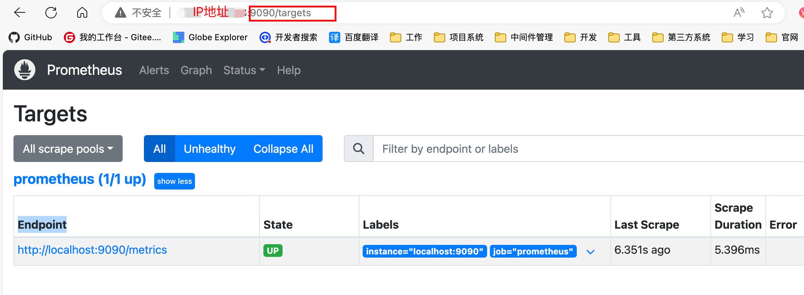

Grafana + Prometheus（普罗米修斯）实现系统性能的监控

此处讲述监控redis、mysql、java服务

<!-- more -->

# 自动化性能监控系统安装部署

## 相关工具的安装部署

服务工具分配

| 服务器     | 工具           | 端口 |
| ---------- | -------------- | ---- |
| 10.0.20.9  | grafana        | 3000 |
| 10.0.20.9  | prometheus     | 9090 |
| 10.0.20.10 | mysql          | 3306 |
| 10.0.20.10 | mysql-exporter | 9104 |
| 10.0.20.10 | redis          | 3306 |
| 10.0.20.10 | redis_exporter | 9121 |


简单介绍下上面几个工具的用途，redis和mysql就不用过多介绍了，是平常开发过程中的常用的中间件。


grafana主要是可视化展示界面，和预警通知工具，用来展示被监控的mysql和redis的性能信息，以及当被监控工具的压力过大时，通过预先设置的通知规则，通过邮件、短信、企业微信等消息通知手段通知维护人员。


prometheus主要时用来收集各个中间件的监控数据，然后存储在本地的时序数据库里，grafana展示的数据就是由prometheus提供的。


mysql-exporter是专门用来搜集mysql数据库运行性能的工具，并将收集到的数据传给prometheus。

因为mysql是专门的数据库工具，并不会主动将自己的运行数据提供给其他第三方，所以才会需要一个专门的exporter工具来进行数据收集和转发。

其他几乎所有的中间件接入到prometheus，都是需要额外去部署一个exporter工具的。

redis_exporter是专门用来搜集和转发redis的运行性能数据的工具，和mysql-exporter一样。


### 使用docker-compose安装prometheus

先拉取prometheus的镜像

```shell	
# 也可以使用docker pull prom/prometheus:v2.54.1（使用后下文配置信息里的镜像名也要跟着调整）
docker pull prom/prometheus:v2.54.1
```


在指定的目录下创建docker-compose.yml配置文件和prometheus目录


docker-compose.yml配置信息如下

```yaml
services:
  prometheus:
    image: prom/prometheus:v2.54.1 # 指定镜像文件
    container_name: 'prometheus'	# 给容器命名
    volumes:
      - ./prometheus/:/etc/prometheus/		# 映射prometheus的配置文件
      - /etc/localtime:/etc/localtime:ro	# 让容器去使用宿主机的时间，保持和宿主机的时间一致
    ports:
      - '9090:9090'	# 映射端口
```


然后在prometheus目录下创建prometheus.yml配置文件，设置抓取性能数据任务配置


prometheus.yml配置文件为

```ya
global:
  scrape_interval: 15s  # 数据抓取间隔

scrape_configs:
  - job_name: 'prometheus'
    static_configs:
      - targets: ['10.0.20.9:9090']	# 普罗米修斯的访问地址
```


启动

先回到docker-compose.ym配置文件所在的目录下


执行命令

```shell
docker-compose up -d
```


启动成功


防火墙开放端口限制之后就可以访问了

访问地址：http://10.0.20.9:9090



​

### 使用docker-compose安装grafana

拉取grafana镜像

```shell
# 也可以使用docker pull grafana/grafana:11.2.3（使用后下文配置信息里的镜像名也要跟着调整）
docker pull grafana/grafana:11.2.3
```


在指定的目录下配置docker-compose.yml配置文件和grafana目录


docker-compose.yml配置信息如下（在部署了prometheus的基础上调整）

```yaml
services:
  prometheus:
    image: prom/prometheus:v2.54.1
    container_name: 'prometheus'
    volumes:
      - ./prometheus/:/etc/prometheus/
      - /etc/localtime:/etc/localtime:ro
    ports:
      - '9090:9090'
  grafana:
    image: grafana/grafana:11.2.3
    container_name: 'grafana'
    volumes:
      - ./grafana/config/grafana.ini:/etc/grafana/grafana.ini	# 配置grafana的报警邮件发送服务
      - ./grafana/provisioning/:/etc/grafana/provisioning/	# 映射grafana的配置文件
      - /etc/localtime:/etc/localtime:ro	# 让容器去使用宿主机的时间，保持和宿主机的时间一致
    ports:
      - '3000:3000'	# 端口映射
    env_file:
      - ./grafana/config.monitoring	# 设置grafana的登录配置信息
    depends_on:
      - prometheus	# 设置grafana依赖于prometheus，需要在prometheus之后去启动
```


配置config.monitoring（grafana的认证配置）

```properties
# 设置grafana管理界面admin用户的登录密码
GF_SECURITY_ADMIN_PASSWORD=123456
# 控制grafana的管理界面不允许注册
GF_USERS_ALLOW_SIGN_UP=false
```


配置grafana的配置文件datasource.yml，用于设定其展示数据的数据来源


配置信息如下

```yaml
apiVersion: 1

deleDatasources:
  - name: Prometheus
    orgId: 1

datasources:
  - name: Prometheus
    type: prometheus
    access: proxy
    orgId: 1
    url: http://10.0.20.9:9090
    basicAuth: false
    isDefault: true
    version: 1
    editable: true
```


设置预警通知邮件配置文件grafana.ini


配置信息如下

```ini
[smtp]
# 是否开启邮件发送
enabled = true
# 发送服务器（固定的）
host = smtp.qq.com:465
# 发送者的邮箱账号（smtp账号）
user = 834363368@qq.com
# 授权码（smtp账号的授权码）
password = 66666666666
# 接收预警邮件的邮箱
from_address = 456789@qq.com
# 接收预警邮件的用户名称
from_name = 云泽
```


### 安装对应中间件的exporter向prometheus提供性能数据

#### 安装redis_exporter收集redis性能数据

拉取redis_exporter镜像

```shell
docker pull oliver006/redis_exporter:v1.64.1
```

运行redis_exporter

```shell
docker run -d -p 9121:9121 oliver006/redis_exporter:v1.64.1 --redis.addr redis://10.0.20.10:6379 --redis.password 123456
```


容器启动成功之后，访问 http://10.0.20.10:9121/metrics 打印出redis相关的信息就说明redis_exporter安装成功。


#### 安装mysql-exporter收集mysql性能数据

拉取mysql-exporter镜像

```shell
docker pull prom/mysqld-exporter:v0.15.1
```


在mysql上创建mysql-exporter专属的账号exporter，只需要查询权限即可。


然后配置mysql-exporter访问mysql数据库信息my.cnf

```shell
[client]
host=10.0.20.10
user=exporter
password=123456
```


运行mysql-exporter

```shell
docker run -d --name mysql-master-exporter -p 9104:9104 -v /opt/my.cnf:/etc/mysql/my.cnf prom/mysqld-exporter:v0.15.1 --config.my-cnf=/etc/mysql/my.cnf
```


启动之后访问http://10.0.20.10:9104/metrics

请求后打印出如下mysql相关信息就是成功


接下来去配置下prometheus，在原prometheus.yml配置文件里，追加redis的性能数据抓取任务

编辑prometheus.yml (该文件按上文所述，在/opt/docker/docker-monitor/prometheus/prometheus.yml)

```yaml
global:
  scrape_interval: 10s  # 数据抓取间隔

scrape_configs: 
  - job_name: 'prometheus'
    static_configs: 
      - targets: ['10.0.20.9:9090']
      
	- job_name: 'mysql-master'
    static_configs:
      - targets: ['10.0.20.10:9104']
        labels: 
          instance: mysql-master

  - job_name: 'redis-signle'
    static_configs:
      - targets: ['10.0.20.10:9121']
        labels:
          instance: redis-signle
```


## 重新启动Prometheus + Grafana

进入到10.0.20.9服务器的/opt/docker/docker-monitor目录，也就是docker-compose.yml配置文件所在地址


执行如下命令启动grafana和prometheus

```shell
docker-compose up --force-recreate -d
```

> --force-recreate：意思是关闭删除旧的容器，重新创建新的容器并运行


## 登录配置Grafana

访问地址：http://10.0.20.9:3000/login


导入的json文件如下

[redis-dashboard.json](https://blog.3xj.club/json/redis-dashboard.json)

[mysql-dashboard.json](https://blog.3xj.club/json/mysql-dashboard.json)

下载json文件后，逐个导入到grafana的dashboards里面即可

### mysql性能监控页面


> mysql如果想监控到MySQL Slow Queries也就是慢查询，就需要在mysql的配置文件里开启慢查询日志记录
>
> #开启慢查询日志
> slow_query_log = 1
>
> #指定慢查询日志文件的位置
> slow_query_log_file = /var/log/mysql/slow-query.log
>
> #设置慢查询的时间阈值（单位：秒）
> long_query_time = 2

### redis性能监控页面


> redis监控要看到memory usagea数据，就需要在运行redis的时候，在redis的redis.conf里面添加如下配置：
>
> #设置redis的最大内存
>
> maxmemory 1024M
