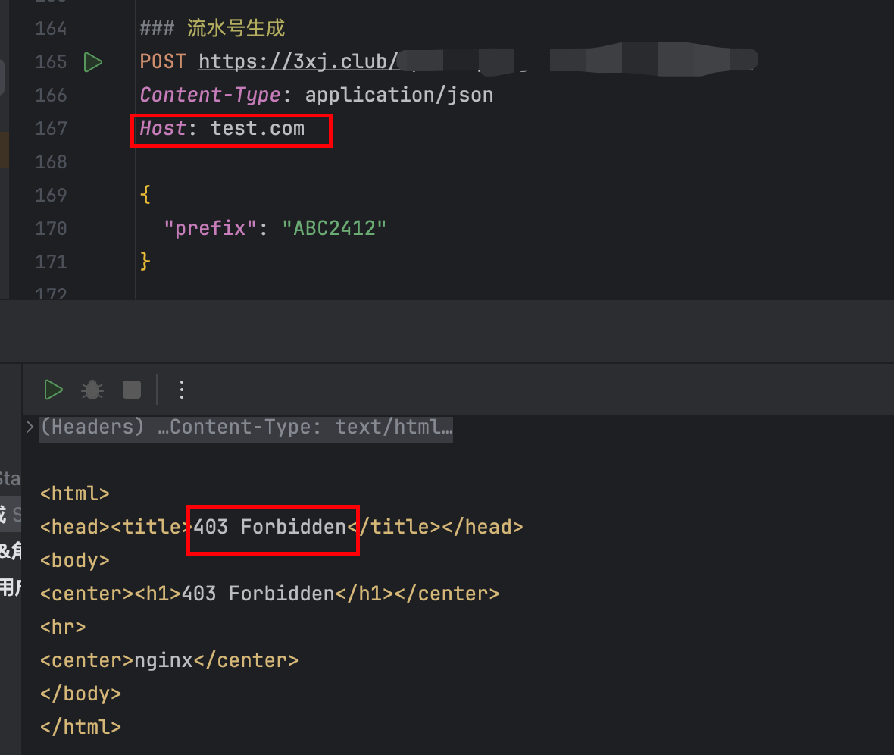
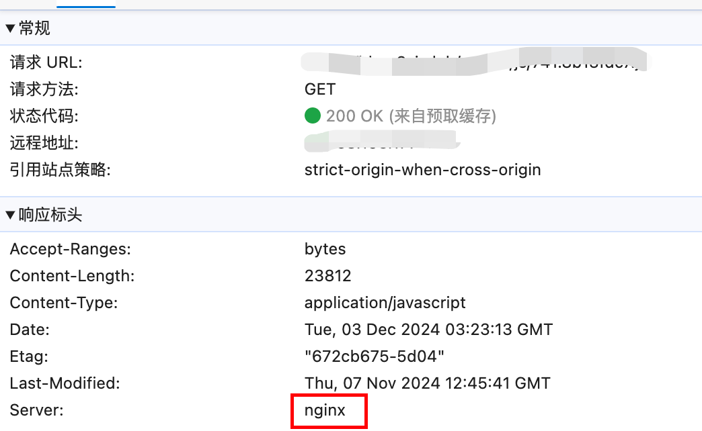

# Nginx配置修复Web漏洞

## Http请求 Host 头攻击漏洞

处理方式：nginx添加如下设置

```nginx
server {
  listen      80;
  listen      443 ssl;
  server_name 3xj.club www.3xj.club;
  
  if ($host != 'www.3xj.club') {
    return 403;
  }
}
```

或者

```nginx
    map $host $allowed_host {
        default 0;
        3xj.club 1;
        www.3xj.club 1;
    }

    server {
        listen      80;
        listen      443 ssl;
        server_name 3xj.club www.3xj.club;

        if ($allowed_host = 0) {
            return 403;
        }
		}
```

修复结果：




## Nginx版本暴露

处理方式：添加 server_tokens off 配置

```nginx
http {
    include       mime.types;
    default_type  application/octet-stream;
  	server_tokens off;
}
```



