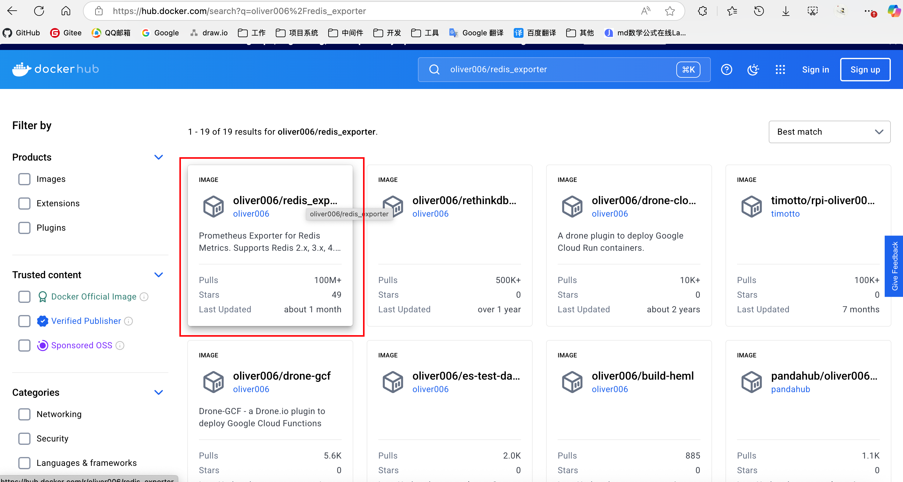
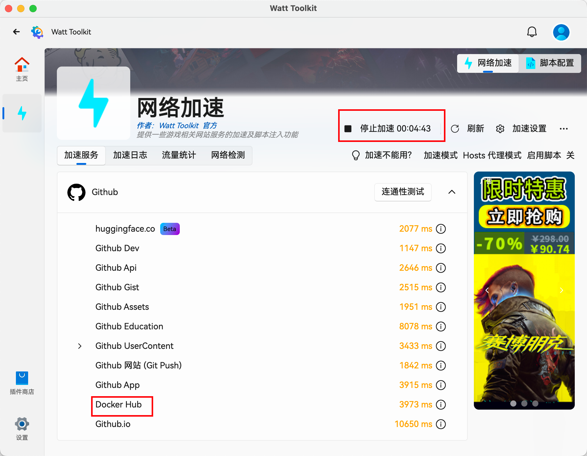
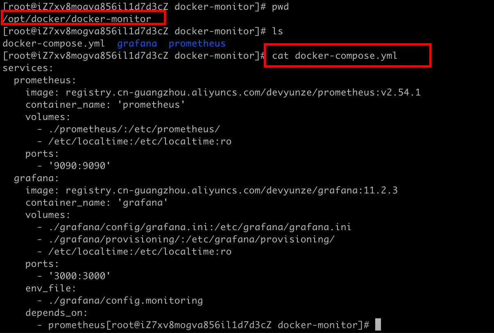
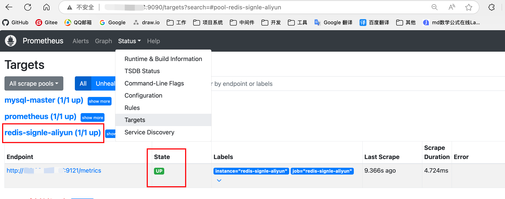
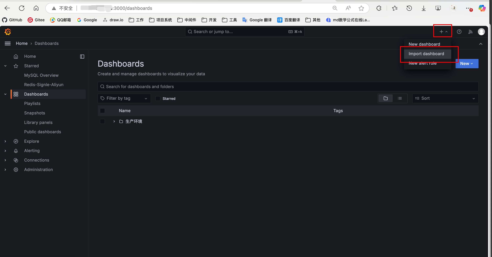
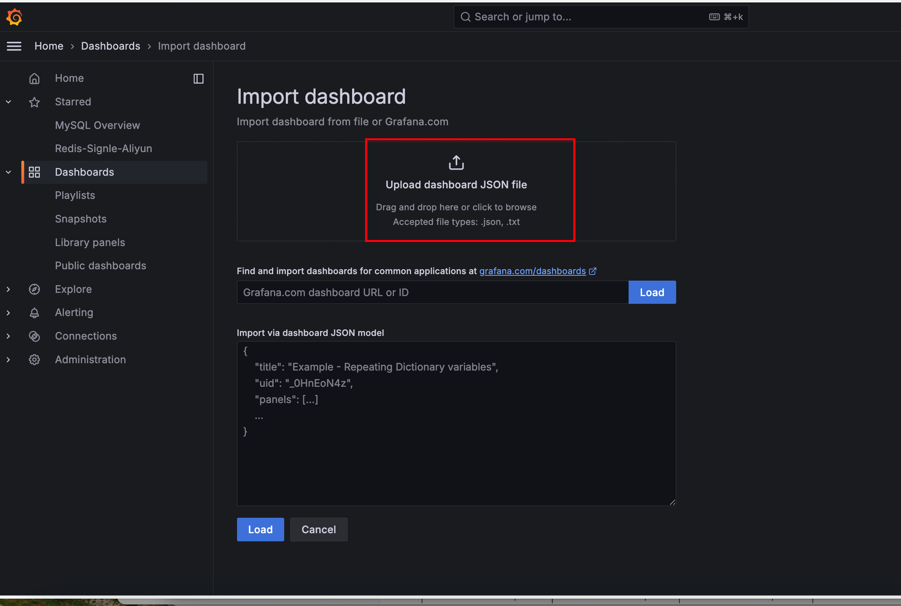
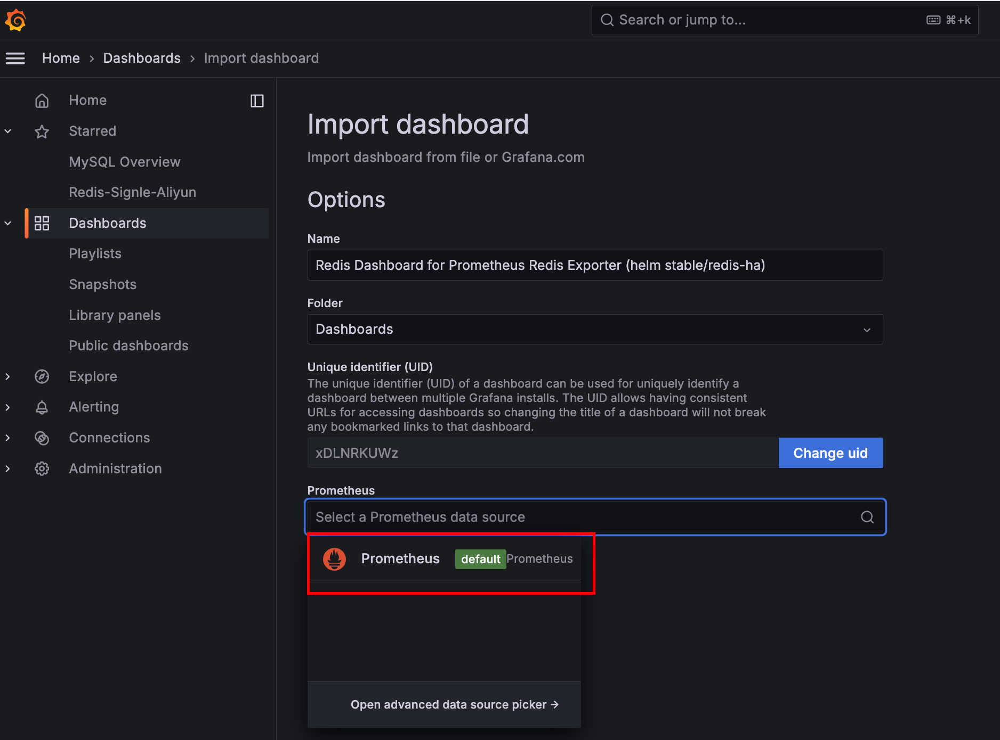
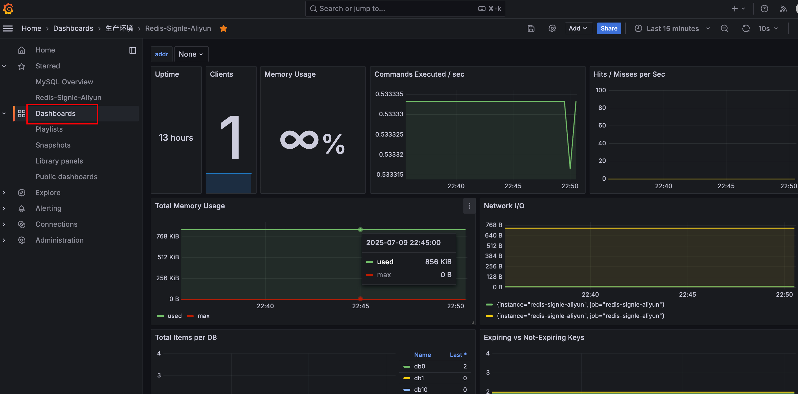

在已经部署配置好Grafana+Prometheus的基础上进行redis-exporter的部署，以实现redis实例接入Grafana+Prometheus监控体系。

<!-- more -->

## 准备工作

前置文章《 [自动化性能监控系统安装部署](343.自动化性能监控系统安装部署.md) 》《 [Docker无法拉取镜像文件解决](322.Docker无法拉取镜像文件解决.md) 》

准备好reids-exporter的镜像，本文使用的是oliver006/redis_exporter:v1.64.1。



Docker Hub无法访问的可以下载Steam++，官网地址https://steampp.net/



开始加速之后就可以访问了Docker Hub和GitHub了。

将镜像上传到自己的阿里云镜像仓库（操作方式在《 [Docker无法拉取镜像文件解决](322.Docker无法拉取镜像文件解决.md) 》里有详细说明）

## 部署 redis-exporter 数据抓取工具

然后调整docker的编排脚本docker-compose.yml，在里面添加下面配置中的 `redis-exporter-aliyun` 部分。

```yaml
services:
  redis:
    image: registry.cn-guangzhou.aliyuncs.com/devyunze/redis:6.2.16
    container_name: 'redis'
    command: --requirepass "1234567"
    ports:
      - '6379:6379'
      
	redis-exporter-aliyun:
    image: registry.cn-guangzhou.aliyuncs.com/devyunze/redis_exporter:v1.64.1
    container_name: redis-exporter-aliyun
    environment: 
      - REDIS_ADDR=redis://192.168.0.10:6379
      - REDIS_PASSWORD=1234567
    volumes:
      - /etc/localtime:/etc/localtime
    ports:
      - '9121:9121'
```


使用命令创建并启动redis-exporter-aliyun容器

> 注意：需要在docker-compose.yml同级目录下执行如下命令

```shell
docker-compose up -d redis-exporter-aliyun
```


## 调整普罗米修斯配置获取redis-exporter抓取数据

调整普罗米修斯Prometheus的配置文件prometheus.yml，添加job_name为 `redis-signle-aliyun` 的配置。

```yaml
global:
  scrape_interval: 15s  # 数据抓取间隔

scrape_configs: 
  - job_name: 'prometheus'
    static_configs: 
      - targets: ['localhost:9090']

  - job_name: 'redis-signle-aliyun'
    static_configs:
      - targets: ['192.168.0.10:9121']
        labels:
          instance: redis-signle-aliyun
```


让Prometheus重新加载配置文件

前往Prometheus的编排文件所在地方



执行命令

```shell
docker-compose kill -s SIGHUP prometheus
```

或执行重启命令（两个命令都可以，执行一个即可）

```shell
docker-compose restart prometheus
```


访问Prometheus，看到redis的状态为state即可。




## 配置Grafana可视化监控界面

登录Grafana，去配置redis的可视化脚本





redis的dashboard可视化界面的json文件下载地址https://blog.gaohan.asia/a/json/redis-dashboard.json

然后数据源选择配置好的Prometheus。



最后就可以在Dashboard菜单里看到redis的监控信息了。

