VuePress 是一个以 Markdown 为中心的静态网站生成器，在这个静态网站里提供了本地内容搜索和 `Algolia DocSearch` 两种内容搜索工具。

本地内容搜索由 [@vuepress-plume/plugin-search](https://github.com/pengzhanbo/vuepress-theme-plume/tree/main/plugins/plugin-search) 插件提供支持

 `Algolia DocSearch` 由 [Algolia DocSearch](https://docsearch.algolia.com/) 提供支持的网站内容搜索插件。

本文介绍如何申请与在 `VuePress` 里配置 `DocSearch` 。

<!-- more -->

## 登录algolia

[点击跳转到登录页](https://dashboard.algolia.com/users/sign_in)

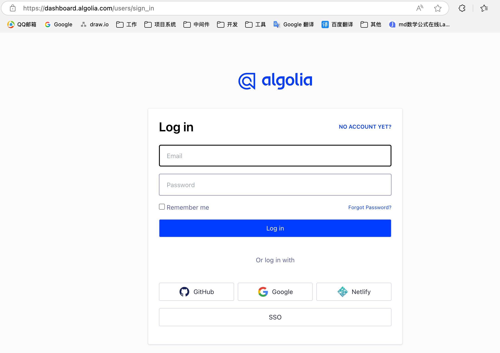


## 创建应用

登录成功后创建应用

https://dashboard.algolia.com/account/application/new/configure

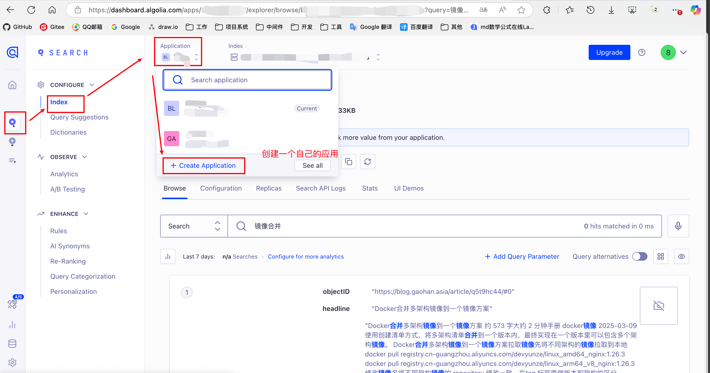


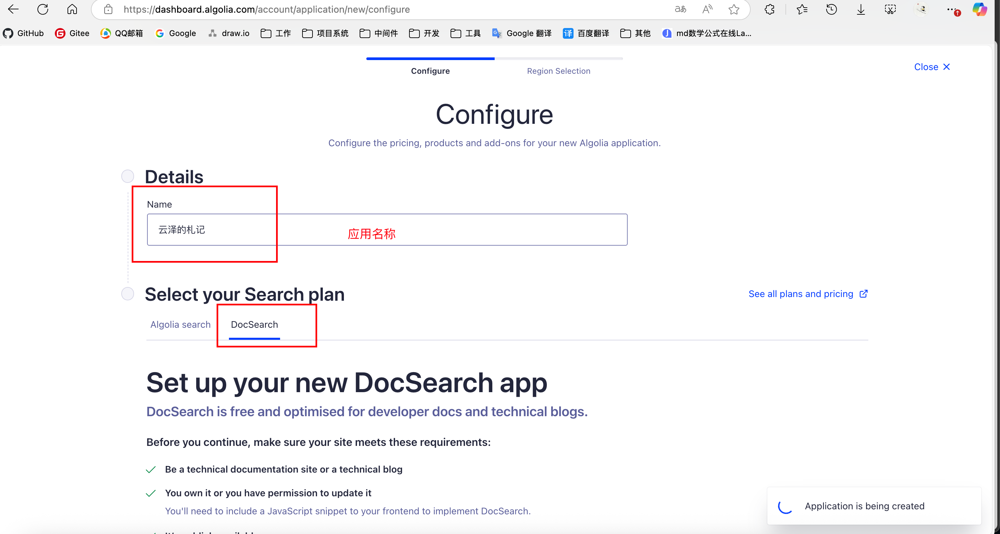

会要求确认网站域名，出现下面的Domain approved即可

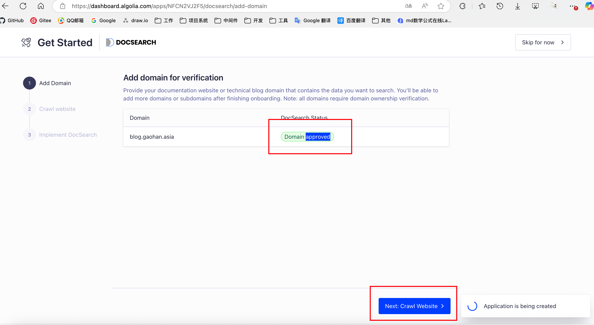


接下来的配置直接跳过，点击右上角的 `Skip for now` 按钮


## 配置秘钥


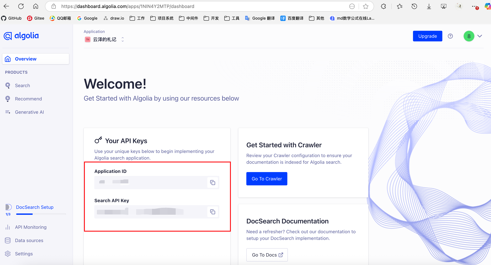


配置docsearch提供的 `appId` 和 `appKey` , 其中 `indexName` 索引名称自己先自定义命名一个（[后续配置会要用到这个indexName](#point_indexName)）。

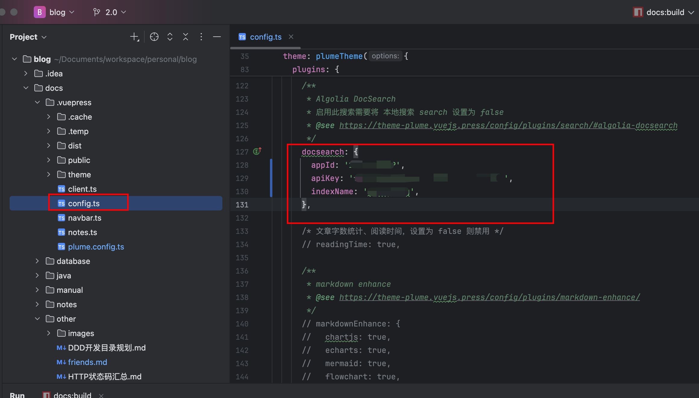


## 域名认证

点击verify now，进行域名认证

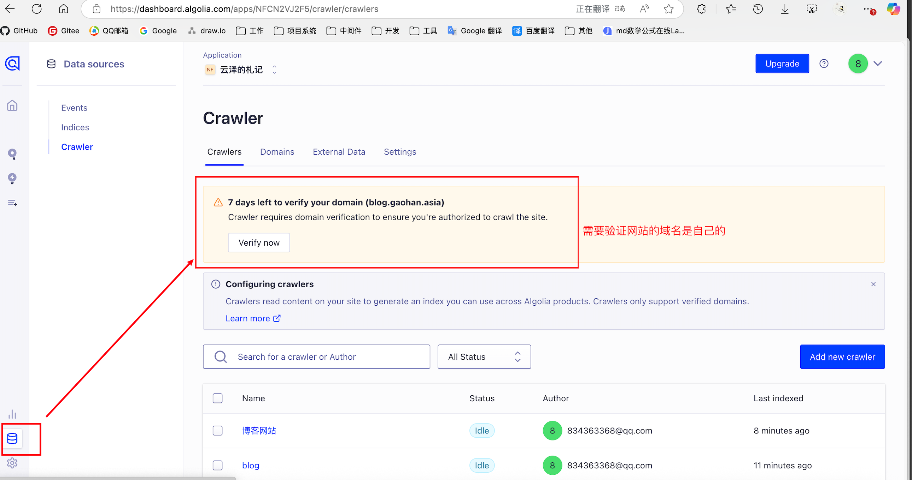


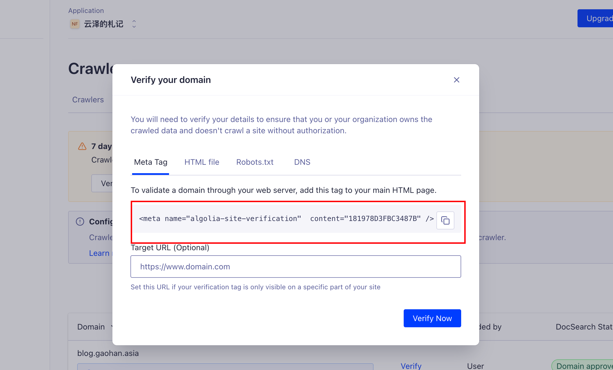

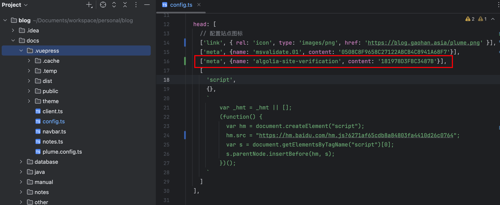

打包部署到服务器


然后回到docsearch的页面，进行验证域名

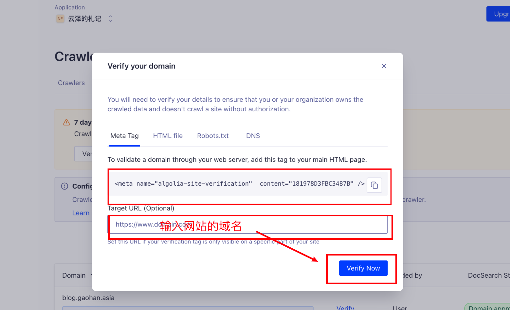

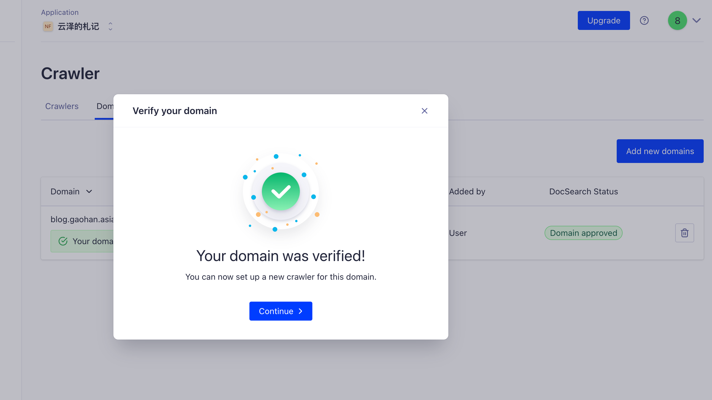

域名验证成功。


## 创建爬虫程序

开始创建爬虫程序

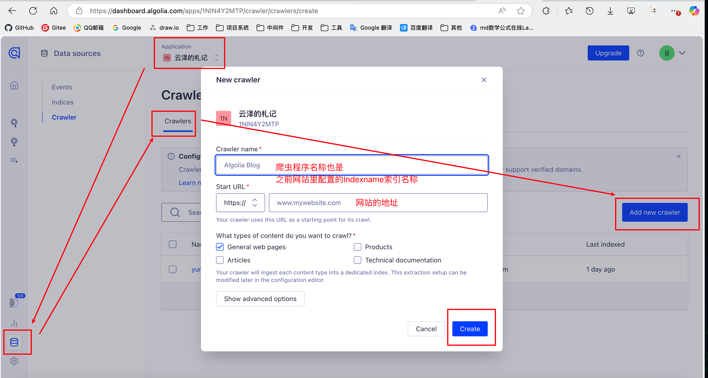


然后配置爬虫脚本

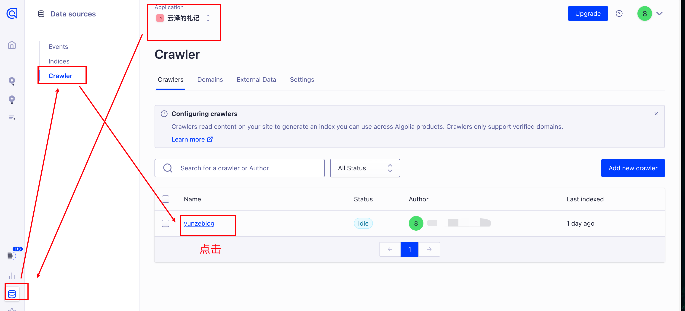


## 配置爬虫脚本

<span id='point_indexName'>配置操作图如下</span>

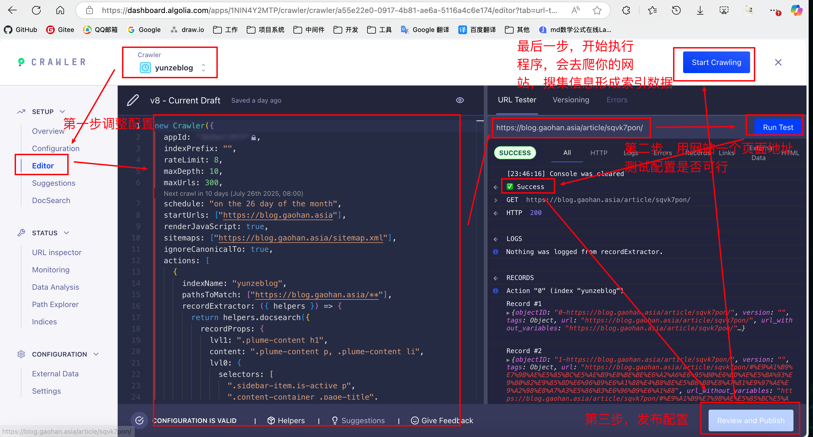


脚本里的 `appId` 和 `apiKey` 不要动，原先是什么就保留原样即可，千万不要改动。

```ts
new Crawler({
  appId: "xxxxxxx",
  apiKey: "xxxxxxxxxxxxxxxxxxxx",
  indexPrefix: "",
  rateLimit: 8,
  maxDepth: 10,
  maxUrls: 300,
  schedule: "on the 26 day of the month",
  startUrls: ["https://blog.gaohan.asia"],
  renderJavaScript: true,
  sitemaps: ["https://blog.gaohan.asia/sitemap.xml"],
  ignoreCanonicalTo: true,
  actions: [
    {
      indexName: "yunzeblog",
      pathsToMatch: ["https://blog.gaohan.asia/**"],
      recordExtractor: ({ helpers }) => {
        return helpers.docsearch({
          recordProps: {
            lvl1: ".plume-content h1",
            content: ".plume-content p, .plume-content li",
            lvl0: {
              selectors: [
                ".sidebar-item.is-active p",
                ".content-container .page-title",
              ],
              defaultValue: "Documentation",
            },
            lvl2: ".plume-content h2",
            lvl3: ".plume-content h3",
            lvl4: ".plume-content h4",
            lvl5: ".plume-content h5",
            lang: "",
            tags: {
              defaultValue: ["v2"],
            },
          },
          aggregateContent: true,
          recordVersion: "v3",
        });
      },
    },
  ],
  safetyChecks: { beforeIndexPublishing: { maxLostRecordsPercentage: 30 } },
  initialIndexSettings: {
    yunzeblog: {
      attributesForFaceting: ["type", "lang", "language", "version"],
      attributesToRetrieve: [
        "hierarchy",
        "content",
        "anchor",
        "url",
        "url_without_anchor",
        "type",
      ],
      attributesToHighlight: ["hierarchy", "content"],
      attributesToSnippet: ["content:10"],
      camelCaseAttributes: ["hierarchy", "content"],
      searchableAttributes: [
        "unordered(hierarchy_radio_camel.lvl0)",
        "unordered(hierarchy_radio.lvl0)",
        "unordered(hierarchy_radio_camel.lvl1)",
        "unordered(hierarchy_radio.lvl1)",
        "unordered(hierarchy_radio_camel.lvl2)",
        "unordered(hierarchy_radio.lvl2)",
        "unordered(hierarchy_radio_camel.lvl3)",
        "unordered(hierarchy_radio.lvl3)",
        "unordered(hierarchy_radio_camel.lvl4)",
        "unordered(hierarchy_radio.lvl4)",
        "unordered(hierarchy_radio_camel.lvl5)",
        "unordered(hierarchy_radio.lvl5)",
        "unordered(hierarchy_radio_camel.lvl6)",
        "unordered(hierarchy_radio.lvl6)",
        "unordered(hierarchy_camel.lvl0)",
        "unordered(hierarchy.lvl0)",
        "unordered(hierarchy_camel.lvl1)",
        "unordered(hierarchy.lvl1)",
        "unordered(hierarchy_camel.lvl2)",
        "unordered(hierarchy.lvl2)",
        "unordered(hierarchy_camel.lvl3)",
        "unordered(hierarchy.lvl3)",
        "unordered(hierarchy_camel.lvl4)",
        "unordered(hierarchy.lvl4)",
        "unordered(hierarchy_camel.lvl5)",
        "unordered(hierarchy.lvl5)",
        "unordered(hierarchy_camel.lvl6)",
        "unordered(hierarchy.lvl6)",
        "content",
      ],
      distinct: true,
      attributeForDistinct: "url",
      customRanking: [
        "desc(weight.pageRank)",
        "desc(weight.level)",
        "asc(weight.position)",
      ],
      ranking: [
        "words",
        "filters",
        "typo",
        "attribute",
        "proximity",
        "exact",
        "custom",
      ],
      highlightPreTag: '<span class="algolia-docsearch-suggestion--highlight">',
      highlightPostTag: "</span>",
      minWordSizefor1Typo: 3,
      minWordSizefor2Typos: 7,
      allowTyposOnNumericTokens: false,
      minProximity: 1,
      ignorePlurals: true,
      advancedSyntax: true,
      attributeCriteriaComputedByMinProximity: true,
      removeWordsIfNoResults: "allOptional",
    },
  },
});
```


如果网站用的是 `vuepress` ，那基本上替换一下配置里的域名即可，否则需要根据网站的实际情况，调整下上面配置中的 `recordProps` 配置里各级别 `lvl1` 等的值。


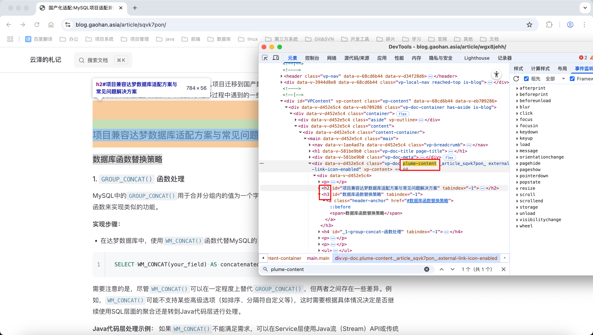


## 检查爬虫搜集的数据

回到首页概览查看信息

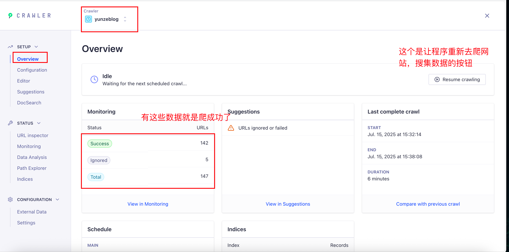

然后关闭页面

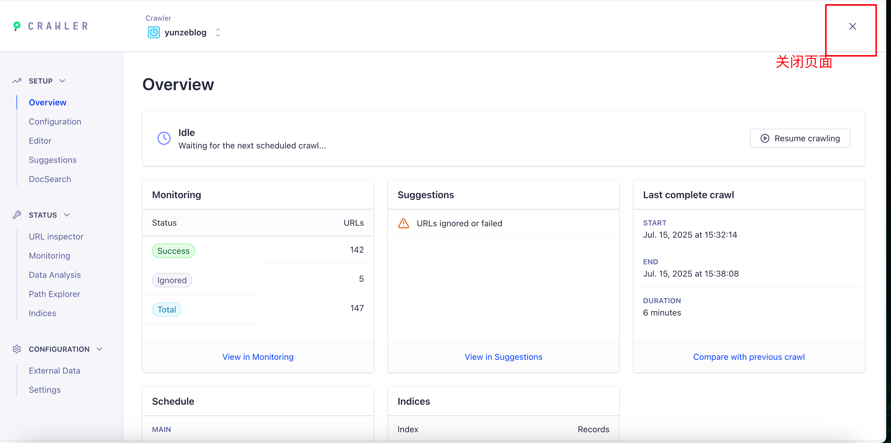


直接在平台上验证下搜索结果（搜索出来的内容都是自己网站的信息）

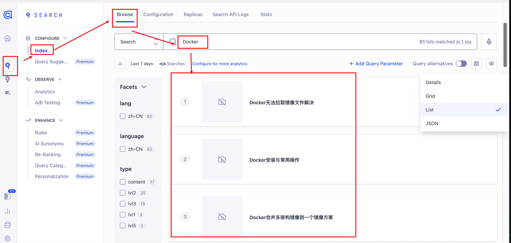

没问题，且 `appId` 和 `appKey` 也配置到自己网站docsearch配置项后，网站打包部署到服务器上即可。


## 成果展示

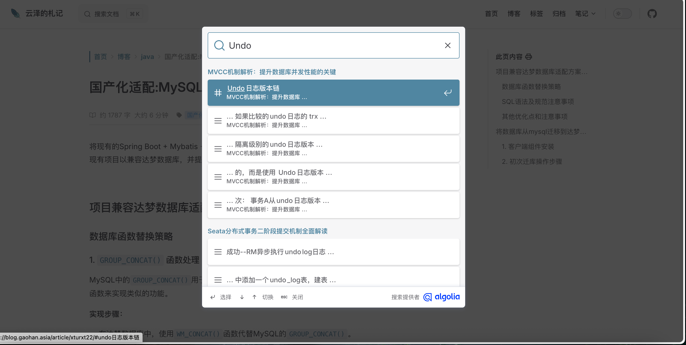