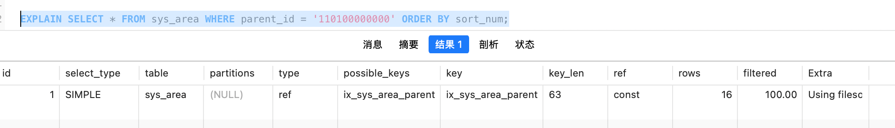
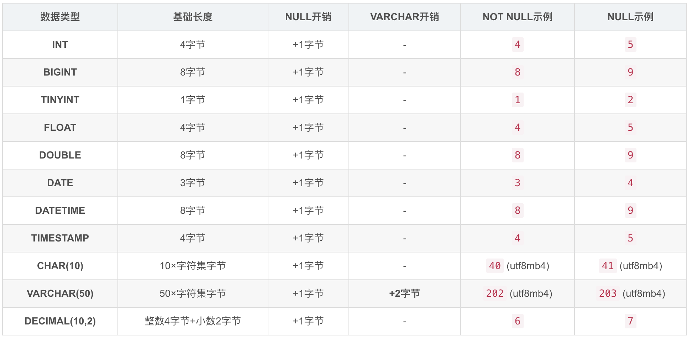
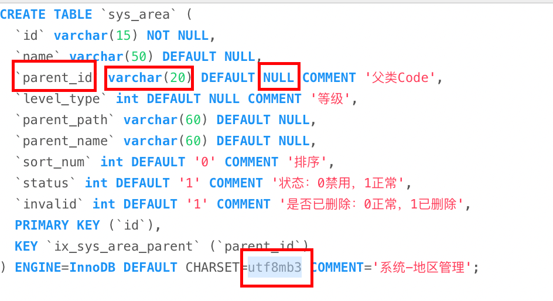
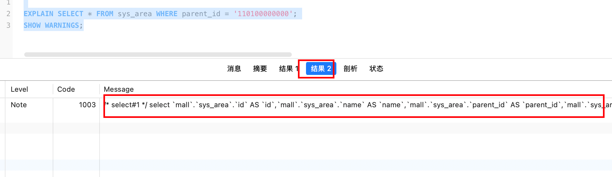

通过在SQL语句的前面添加 `explain` 关键字，可以模拟 `优化器` 执行SQL语句（模拟，而不是执行），可以用来分析查询SQL语句的大概执行计划和可优化性能的点。

执行计划里有个关键数据，表明的了SQL的性能等级。

性能从高到低依次为 system--->const--->eq_ref--->ref--->range--->index--->all

需要确保SQL的性能达到range级别以上，最好达到ref

<!-- more -->

explain结果信息说明。



## id列

id的编号就是MySQL执行SQL语句的顺序，id列值越高，其执行优先级越高，想同的id值，则是从上往下执行。id列值为null的最后执行。


## select_type列表

用于表示查询sql是简单查询，还是复杂查询。

| select_type列表值 | 说明                                                         |
| ----------------- | ------------------------------------------------------------ |
| simple            | 简单查询，不包含子查询和联表查询。                           |
| primary           | 复杂查询中的最外层select语句。                               |
| subquery          | 包含在select中，from前的子查询。                             |
| derived           | 包含在 **from** 子句中的子查询，MySQL会将其结果存放在一个临时表中，也称之为派生表。 |
| union             | 使用union联表查询时的第二个select。                          |


## table列

表示查询语句涉及到的表名。

如果table列的值是 `<select_type列值 + id列值>` 则表示是临时表。


## partitions列

表示该查询是否涉及到分区表。（一般来说都直接分库分表了，不会使用分区表）


## type列

性能高低按从左到右排序，system级别最高，all级别最低

system--->const--->eq_ref--->ref--->range--->index--->all

### system

```sql
select max(id) from table_name;
select min(id) from table_name;
```

像这种使用聚合函数来获取最大值最小值，因为使用的id是有索引的，而索引是有序递增的，所以可以直接获取，不需要查询。

### const

是用于主键索引，或唯一索引进行等值查询时最多只会返回一条数据的情况下。因为结果数量是固定的（最多只有一条），只会读取一次，所以性能非常好。

而 `system` 则是特殊的const，当使用主键查询表，且只有一行数据时，就是 `system` 。性能极高。


### eq_ref

主键等值查询。

在 `join` 连接查询中，**对于来自前一张表的每一行，在当前表中只能找到唯一的一行与之匹配**。通常是通过使用主键或唯一索引进行联表查询。

也就是在多表连接时，**驱动表** 的连接条件是 **被驱动表** 的 **主键或唯一非空索引** 。

例如：

```sql
-- student表中的每一个class_id，在class表中都只能通过主键id找到唯一的一行记录。
SELECT * 
FROM student
JOIN class ON student.class_id = class.id; -- class.id 是班级表的主键
```


### ref

使用二级索引，也就是非主键索引进行等值查询时，因为结果不是唯一的，不确定有多少条数据符合条件，所以性能不如eq_ref，但也是一个比较高效的查询访问类型。

> 使用 **is null** 也会触发该场景。
>
> **冷知识：** 在索引数据结构中，MySQL是将索引里所有为null的数据都集中在一个地方存储的。


### range

索引范围查询（>、<、>=、<=、in、between）。

会使用索引查询一个指定范围的区间数据，效率可以但是不如ref，因为查询得到的结果集可能非常多，所以建议结合分页进行使用。


### index

全索引扫描，会扫描指定索引（二级索引）的所有数据，也就是不包含条件，但是要查询的结果字段在二级索引里都存在（ **覆盖索引** ）。

效率并不高，因为遍历扫描了整个索引树。


### all

全表扫描，也就是扫描整个主键索引（聚集索引）的节点


## possible_key列

表示SQL查询 **可能** 会使用到的索引。


## key列

表示SQL在执行时会选择使用的索引。


## key_len列

`key_len` 列表示 **MySQL 在本次查询中实际使用的索引部分的最大可能长度（单位：字节）** 。

计算参考表

好的，这是为您格式化的 MySQL 常用数据类型在计算索引长度 (`key_len`) 时的开销对照表。

### MySQL 数据类型索引长度 (`key_len`) 计算参考表

假设字符集为 **utf8mb4** (1字符=4字节)，该表展示了各类型在索引中的计算长度。

> 字符集直接影响计算长度：
>
> utf8、utf8mb3是3字节/字符
>
> utf8mb4是4字节/字符




例如：




这个key_len的值是63，parent_id是varchar(20)类型，且可以为null。

则计算方式是

utf8mb3：20 * 3 + 2 + 1 = 63

如果是utf8mb4：20 * 4 + 2 + 1 = 83


## rows列

是MySQL预估的执行该语句会扫描的数据行数。

该值越小越好。


## filtered列

是MySQL预估在进行查询条件where进行数据过滤后，剩余数据行的百分比。

该值越大越好。值越大，则表明where查询条件的效果非常好。

如果filtered为100，则表明所有扫描到的行都是需要的。

如果filtered为10，意味着存储引擎扫描了大量数据，其中90%被where中其他的非索引字段条件过滤了，说明索引设计的有问题。


## extra列

常用值表明的意义如下

| Extra值                      | 说明                                                         |
| ---------------------------- | ------------------------------------------------------------ |
| using index                  | 本次查询使用了索引，并且需要查询的结果字段完全被索引覆盖，不需要进行回表，也就是覆盖索引。 |
| using index condition        | 本次查询使用了索引，但是需要查询的结果字段没有被索引完全覆盖，进行了回表。 |
| using where                  | 本次查询有过滤条件，但是过滤条件不存在索引，结果集也不存在索引。 |
| using temporary              | 表示本次查询使用了临时                                       |
| select tables optimized away | 使用聚合函数获取存在于索引的字段值时，不需要去查表的场景。<br />如max(id)，min(id)，可以直接在索引上获取 |
| using filesort               | 表示本次查询排序使用的是文件排序。没有走索引，性能较低，order by的字段应该加索引。 |


## 覆盖索引

如果查询的结果字段在二级索引里都存在，那么MySQL会优先使用二级索引。

主键索引是聚集索引，叶子节点有完整的数据记录，也就代表着暂用的空间会更多，最终导致查询的扫描数据量会比二级索引（非聚集索引）更大。

例如

```sql
create table student (
  id int primary key,
  name varchar(10),
  age int,
  key `ix_name` (`name`)
);
```

在使用以下命令查询时（没有条件）（如果有条件，则需要根据实际过滤条件来分析），

```sql
select id, name from student;
```

因为结果集只有id和name两个字段，而这两个字段又都在 `ix_name` 二级索引（非聚集索引）中存在，所以无需回表，可以直接返回。

相比较去主键索引里查询要扫描的数据页会更多，所以这种结果集被二级索引覆盖的情况下，会优先选择二级索引。

这种情况就叫覆盖索引。


## SQL常规优化方案

1. 不在索引字段上面做任何操作（包括计算、类型转换、函数操作），会导致索引失效而去进行全表扫描。

2. 使用like进行模糊查询时，尽量不要左模糊，因为不会走索引，模糊查询的值，在索引里是不存在的（从左到右去比较）。

3. 如果业务一定要使用左模糊查询，可以通过控制 select 查询结果字段，都是模糊条件字段所在索引数据结构上字段的方式，使其走索引（不是因为过滤条件去走的所以，而是因为查询结果字段被索引覆盖了，才去走的索引）。

4. 如果是字符串类型字段，且该字段还有索引，则在进行条件查询时，一定要加单引号，否则其不会走索引，因为类型不同，不加单引号是数字，和字符串是不相等的。

   ```sql
   # 错误示范，不走索引
   select * from table_name where name = 1000;
   # 正确示范，走索引
   select * from table_name where name = '1000';
   ```

5. 少用 **'or'** 查询语句，不一定会走索引，可以优化为 **'union all'** 。

6. **'in'** 查询语句，in里面的条件不太多可以，如果太多了可能不会走索引。

7. 范围查询优化，当范围查询，如果范围太大了，MySQL就不会去走索引，会认为全表扫描更好，因为走二级索引，最好还需要去回表查询。这种情况可以考虑将一个大范围拆分为多个小范围条件去查询。


## 扩展

explain可以结合 `show warnings;` 去查看MySQL对执行SQL的优化。（得出的结果SQL不一定能直接执行，只是告知MySQL会对SQL进行哪些优化。）


