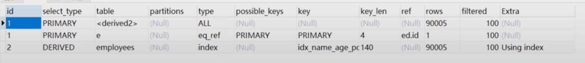

## 索引优化

### 强制索引

在某些情况下，MySQL认为不走索引的效率比索引的效率要高。

例如:

```sql
# 此时name字段基本上就不会走索引，会直接进行全表扫描（扫描聚簇索引）
select * from table_name where name > 'yunze';
```

此时如果非要走索引，可以使用 force index，例如

```sql
select * from table_name force index(ix_索引名称) where name > 'yunze';
```

但是，没必要，查询性能不完全由扫描的行数决定，还有回表次数，综合效率可能还不如直接全表扫描


### in和or和exists

`in` 和 `or` 在数据表数据量比较大的情况下，会走索引，如果数据表的数据量不大，会直接选择全表扫描。

其中 `or` 可以替换为 `union all` 进行优化，走索引查询两次，相比较全表扫描的效率会高很多。


in和exists的优化原则就是小表驱动大表

 `in` 后面的条件尽量不要超过1000条，在1000条内，其性能差距不大。

现在有两个表a和表b，如果此时表a的数据集比表b的大，则使用in的性能优于exists。

```sql
# 由小表b驱动大表a
select * from a where a.id in (select b.id from b);

# 等价于
for (select b.id from b) {
	select * from a where a.id = b.id;
}
```

如果表b的数据集比表a的数据集大，则exists的性能优于in。

```sql
# 先查询数据表a，然后一条一条的用表a的id去表b里进行比对。
select * from a where exists (select 1 from b where a.id = b.id)

# 等价于
for (select a.id from a) {
	select 1 from b where a.id = b.id;
}
```


### like模糊查询优化

使用右模糊 `like 'yun%'` 查询时，一般都会走索引。（左模糊查询和全模糊查询不走索引）

如果非要走左模糊查询，可以考虑新增一列字段，然后将结果值倒排存储，这样在需要用到左模糊查询时，可以使用右模糊查询这个结果值倒排存储的字段。


#### 索引下推

现在有个联合索引 ndex(a, b, c)，此时执行了如下sql

```sql
select * from table where a like 'yun%' and b = 10 and c = 'dev';
```

按照最左前缀原则，是只走a字段索引的，因为a不是等值查询，所以根据字段a过滤得到的结果集里字段b和c都是无序的，不符合走索引的原则。

但是在MySQL5.6之后引入了索引下推优化功能，可以在索引遍历字段a的过程中，对索引中包含的所有字段先做判断，过滤掉不符合字段b和字段c条件的记录之后再回表，这样可以有效的减少回表次数。

索引下推会减少回表次数，对于innodb引擎的表索引下推只能用于二级索引，innodb的主键索引（聚簇索引）树叶子节点上保存的是全行数据，所以这个时候索引下推并不会起到减少查询全行数据的效果。


### 分页查询优化

name有索引

```sql
select * from employees order by name limit 90000, 5
```

虽然name有索引，但是因为limit分页是从1开始扫描的，所以MySQL认为数据量太大，就不走索引了，直接全表扫描（也就是扫描主键索引）。

可优化为

```sql
select e.* from employees e inner join (select id from employees order by name limit 90000, 5) ed on e.id = ed.id;
```

执行计划如下



name的排序走了索引，然后因为limit 5所以 `<derived2>` 只有5条数据，所以 `type` 列为 `ALL` 是没有关系的。

select e语句则是直接使用主键id与select employees的结果id进行关联查询，性能也是很高的，`type` 达到了`eq_ref` 级别。


### JOIN联表查询优化

```sql
select * from t1 inner join t2 on t1.a = t2.a;
```

t1表10000数据，t2表100数据。

#### **案例一**

如果字段a都有索引，则磁盘IO次数的计算方式为

从t2表拿一行数据，就去t1表里面查询IO一次，汇总就是t2表进行了100次磁盘IO，t1表因为也有索引，所以在缓存里查询了100次索引key，最后在磁盘里也进行了100次磁盘IO，总共就是200次磁盘IO。

#### **案例二**

如果字段a都没有索引，则磁盘IO次数的计算方式为

从t2表里获取到这100条数据，进行了100次磁盘IO。将这100条数据放到 join buffer 里面去，因为表t1的字段a也没有索引，无法使用索引key去和t2进行比对，就是需要进行全表扫描。于是将t1表的10000条数据一条一条的拿到 join buffer 里去和t2表字段a进行比较


mysql的表关联有两种常见的算法

#### 嵌套循环连接算法

一次一行循环地从第一张表也就是驱动表中读取行，在这行数据中获取到关联字段，根据关联字段在另一张表（被驱动表）里取出满足条件的行，然后取出两张表的结果合集。

> left join 是左边的表是驱动表，right join 则是右边的表为驱动表。
>
> 而inner join则是不固定的，一般是哪个表小，则由这个表进行驱动。

上面的案例一就是嵌套循环连接算法。


#### 基于块的嵌套循环连接算法	

上面的案例二则是基于块的嵌套循环连接算法。

将驱动表数据读取到 **join_buffer** 中，然后扫描被驱动的表，将被驱动的表里的数据一条一条的拿出来和 join_buffer 里的数据进行比对。如果 join_buffer 不足以存放驱动表索引数据，则会进行 **分批次拿取** ，一次拿一批，然后比较完之后再拿另一批，但是这样就会导致一下情况

驱动表a有1000条数据，被驱动表b有10000条数据，join_buffer里一次只能存放500条表b的数据，则进行IO的次数计算为：

total = 0;（磁盘IO次数）

第一次获取表a的500调数据到join_buffer（total + 500），被驱动表b的10000条数据一条一条的拿出来和join_buffer里表a数据比较（total + 10000），第一次比较完成后，清空join_buffer，再将表a剩余的500条数据拿到join_buffer里（total + 500），然后再将被驱动表b的10000条数据重新拿出来一条一条的和join_buffer里表a数据进行比较（total + 10000）；综合下来就是 **total =  500 + 10000 + 500 + 10000 =  21000**

结论：如果join_buffer空间不足，采取了分段法（分批次拿取驱动表数据到join_buffer），就会重复去扫描被驱动表。所以尽量控制驱动表的数据集大小，或适当调整join_buffer大小。

### count查询优化

count(*)、count(1)、count(id)、count(name)，如果name字段有索引，则他们的性能差不多，MySQL的优化器会对其进行优化。

其中count(id)，并不一定是扫描的聚簇索引，如果存在二级索引，则使用的是二级索引，因为聚簇索引的叶子节点有完整的数据集，所以他的一个数据页可存储的数据要相对于二级索引要少，性能自然也就没有使用二级索引要好。


### order by 和 group by优化

group by 里面默认会有一次 order by 。

尽量不用having，可以在where里进行限制。

对于order by 和 group by 的优化只有一点，就是使用索引列进行排序和分组。

需注意

```sql
# index(a, b, c)
# 这种情况下，针对字段b的排序可能不会走索引，因为针对字段a的过滤是区间范围查询，数据量可能会很大，所以MySQL可能不会对字段a走索引，字段b的排序也就不符合最左前缀原则了。
select * from table where a > 1 and b = 'yunze' and c = 'dev' order by b;
```


### using filesort

#### 单路排序

直接将所有数据弄到 sort buffer 内存里去进行排序，排完序就完了，结果可直接使用。（占用的空间虽然大一点，但是结果可直接使用）

#### 双路排序

仅将聚集索引（主键索引）里的id和排序字段弄到sort buffer里去进行排序，排完序没完，还需要重新根据id回表去获取具体的详细数据。相对于单路索引占用 sort buffer 空间较小。


>如果排序的数据量超过了sort buffer的大小（sort buffer默认大小为1M），则会在磁盘里创建临时文件去进行排序。


有个系统变量max_length_for_sort_data（默认1024字节）

如果数据表的 **字段的总长度小于** max_length_for_sort_data，那么就使用单路排序。

如果数据表的 **字段的总长度大于** max_length_for_sort_data，那么就使用双路排序。


## 索引设计原则

1. 代码先行，索引后上

   等主体业务功能开发完毕之后再把涉及到的sql拿出来分析之后再设计创建对应的索引，这样创建的索引命中会更精准

2. 联合索引尽量覆盖条件（特别是尽量覆盖order by、group by）

3. 不在小基数字段上建索引

   例如性别字段，只有男、女两种值，在一个大数据表里无法使用的二分查找，没有太大意义。

   只有值比较多的字段才能发挥出B+树的优势。

4. 长字符串可以采用前缀索引

   例如name字段为varchar(255)，长度为255字符, 则可以使用KEY index(name(20), age)只取其最前面的20个字符进行索引的构建。前20个字符串可以过滤出大多数的数据结果。

   缩减长度后，一个索引页可以存储的索引key就更多，查询效率也就更高。

   缺点：无法满足order by排序。

5. where与order by冲突时，优先满足where去走索引

6. 可以关注MySQL的slow.log慢sql查询日志，针对这些慢sql查询做特定的索引优化


> 开启慢SQL查询日志会影响数据性能，可以在从节点去开启。


## 扩展

### trace工具

可查看MySQL对SQL的执行计划选择情况


开启trace命令

```sql
set session optimizer_trace="enabled=on",end_markers_in_json=on;
```

使用方式

```sql
select * from employees where name > 'a' order by position;
select * from information_schema.OPTIMIZER_TRACE;
```


开启trace工具会影响mysql性能，所以只能临时使用。

常用分析参数如下

**rows_estimation:** 预估表的访问成本

**index_only:** 是否使用覆盖索引

**rows:** 是索引扫描行数

**cost:** 是索引使用成本（值越大成本越高）


