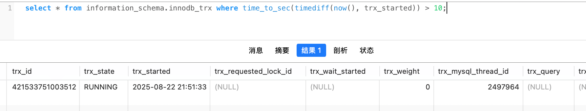

一组数据操作，要么全部成功，要么全部失败，目的是实现数据的一致性。

​																----事务

事务的隔离级别从高到低排序如下（高并发性能也是）

未提交读--->读已提交--->可重复读--->串行读

<!-- more -->


## 事务的ACID底层原理

事务的四大特性：原子性、一致性、隔离性、持久性

详细说明可参考《 [事务的ACID特性(4个特征)](../../../database/106.事务的ACID特性(4个特征).md) 》


## 并发场景下事务处理存在的问题

>  想学习了解事务的隔离级别，就需要先知道并发场景下事务会出现哪些问题，什么样的隔离级别解决了什么样的问题。

### 脏读

事务A更新了id为1的数据，但是还没有提交，此时事务B读取到了id为1的数据（被事务A更新后的数据），然后做了一系列的业务操作，但是最终事务A却回滚了对id为1数据的更新。

**总结：事务B读取到事务A已经更新但未提交的数据，并做了业务操作后，事务A回滚了更新数据，导致了数据一致性问题。**


### 脏写

事务A查询id为1的数据，余额为10。然后事务B中途插入进来给id为1的数据余额加10，并提交了事务，此时余额变成了20。然后事务A也开始了自己的业务逻辑，代码里将刚才查询的余额10（事务A获取余额时，事务B还没提交事务），扣减5，余额5，最后提交事务。

这样就导致事务B操作的余额数据，被事务A给覆盖掉了，这就是脏写。

**总结：事务A最后更新的更新覆盖了事务B所操作的更新。**


### 不可重复读


### 幻读

事务A第一次查询id为1的数据，此时数据库没有id为1的数据。然后事务B向数据库插入了一条id为1的数据，此时事务A用之前相同的条件再次去查询id为1的数据，就会查询到id为1的数据，得到结果和第一次不同，这就是幻读。

**案例**

| 时间线 | 事务A                                                        | 事务B                                                        | 说明                                                         |
| :----- | :----------------------------------------------------------- | :----------------------------------------------------------- | :----------------------------------------------------------- |
| 1      | `START TRANSACTION;`                                         |                                                              | 事务A开始。                                                  |
| 2      | `SELECT * FROM users WHERE age > 22;` <br>**结果： (2, 李四, 25)** |                                                              | **第一次查询**。基于事务开始时的快照读，返回1条记录。        |
| 3      |                                                              | `START TRANSACTION;`<br>`INSERT INTO users (name, age) VALUES ('王五', 30);`<br>`COMMIT;` | **事务B插入一条age=30的记录（满足age>22）并提交。** <br />这条新数据对于其他事务是立即可见的（已提交）。 |
| 4      | `SELECT * FROM users WHERE age > 22;` <br>**结果： (2, 李四, 25)** |                                                              | **第二次快照读** 。MVCC机制保证了可重复读，读取的是事务开始时的快照，**看不到事务B新提交的“王五”**。此时**没有幻读**。 |
| 5      | `UPDATE users SET name = ‘测试’ WHERE age > 22;` <br>`Query OK, 2 rows affected` |                                                              | **关键步骤！** 事务A执行了一个 **当前读** 的UPDATE操作。<br />这个操作会看到事务B提交的最新数据（即“王五”这条记录）。它发现有两行（李四和王五）满足条件，于是更新了**两行**。 |
| 6      | `SELECT * FROM users WHERE age > 22;` <br>**结果：<br>(2, ‘测试’, 25)<br>(3, ‘测试’, 30)** |                                                              | **第三次查询**。事务A再次查询。<br />由于上一步的UPDATE操作已经**更新了这条新出现的幻影行**，并且这个修改是属于事务A自身的，对自身总是可见的。<br />所以，这次查询 **看到了两条记录** ，这就是幻读。 |
| 7      | `COMMIT;`                                                    |                                                              | 提交事务。                                                   |

---


**总结：事务A读取到了事务B提交的新增数据，不符合事务的隔离性。**


## 事务的四大隔离级别

### 1.未提交读(Read Uncommitted)

允许脏读，也就是可能读取到其他事务中更新了，但是还没有提交的数据。

如果将读取到的未提交数据应用在业务逻辑中，而其他事务又回滚（rollback）了这个未提交的数据，那对系统来说就是个灾难。所以一般不适用该事务隔离级别。

### 2.读已提交(Read Committed)

也叫不可重复读。

只能读取到已经提交的数据。

### 3.可重复读(Repeated Read)

在同一个事务内，同一查询语句经过多次执行，得到的结果都会和事务第一次指定的查询结果保持一致，即使在这期间其他的事务对数据进行了修改（除非在本事务里也有进行一次update操作。（实现方式为MVCC《 [MVCC机制解析](../../../database/104.MVCC机制解析：提升数据库并发性能的关键.md) 》）

在SQL标准中，这个隔离级别解决了不可重复读问题，但是还会存在幻读情况，但是InnoDB为了解决幻读引入的一种锁机制，叫间隙锁（参考 《[MySQL有间隙锁](../../../database/102.MySQL有哪些锁.md#间隙锁（Gap-Lock）)》 ）。

> select操作是快照读（读的是MVCC日志版本链里的历史版本数据）
>
> insert、update、delete是当前读（读取的数据是最新已提交数据）（同时会更新MVCC里的Read View一致性视图，所以在同一事务里，如果执行了insert、update、delete操作，则其后的select操作读取到的数据会是本次操作后的新数据。）
>
> 注意：所有update、delete操作都有行锁。

### 4.串行读(Serializable)

完全串行化的读，每次读数据都需要获得表级共享锁，读写相互都会阻塞。是一种性能很低的隔离级别。


### 隔离级别的选择

先排除未提交读和串行读。

要求并发、和高性能场景使用读已提交，例如淘宝、饿了么这种直面用户的系统。

要求能获取到同一时间维度下，不变的数据，如拥有大量报表，后台数据管理系统之类的可以使用可重复读。

案例如下 《[同一方法下多个查询同一时间（同一时刻）维度数据问题](#查询操作方法需要加事务吗？)》


### 总结

| 隔离级别 | 脏读   | 幻读          | 不可重复读 |
| -------- | ------ | ------------- | ---------- |
| 读未提交 | 存在   | 存在          | 存在       |
| 读已提交 | 不存在 | 存在          | 存在       |
| 可重复读 | 不存在 | [存在](#幻读) | 不存在     |
| 串行读   | 不存在 | 不存在        | 不存在     |


## 锁

### 读锁（共享锁）

多个事务可以同时对同一资源添加共享锁，进行资源数据读取，但是不允许其他事务进行修改。

默认查询是不加锁的，可以手动使用如下命令进行加锁

```sql
select * from table_name lock in share mode;
```


### 写锁（排它锁）

一个资源被加了排它锁，就不能再被其他事务加排它锁或共享锁。

update、insert、delete都会加锁（排它锁）。

如果select操作想加排它锁，可使用如下命令

```sql
select * from table_name for update;
```


## 事务的优化

### 大事务的影响

- 回滚需要的时间长。

- undolog日志急剧膨胀（这一个事务会生成大量的undo log日志）。

- 容易导致死锁。

- 大事务会锁定过多的数据，容易造成大量的阻塞和锁超时。

- 大事务会长时间占用数据库连接，在并发场景下，连接池资源容易被耗尽。


### 事务的优化

- 将查询等数据准备操作放到事务外

- 事务中避免远程调用，远程调用要设置超时，防止事务等待时间太久

- 事务中避免一次性处理太多数据，可以拆分成多个事务分次处理

- 更新等涉及加锁的操作尽可能放在事务靠后的位置（例如insert和update虽然都会加锁，但是因为insert是给新数据加的锁，基本上不会影响其他事务，update就不一样，加锁的资源，可能也有其他事务在等待访问）


## 常见问题

### 查询操作方法需要加事务吗？

当一个方法里存在多个查询时，如果数据库事务隔离级别是可重复读，则建议添加事务，使用 `@Transaction(readOnly=true)` ，因为 **可重复读的特性是，一次事务操作里，多次select的数据是不变的（除非在本事务里进行了更新操作）** 。

如果不加事务，则达不到这个效果，例如

此时有两条数据，想要知道在 **同一时刻的时间前提下** ，张三和李四的余额谁多

| id   | 名称name | 余额balance |
| ---- | -------- | ----------- |
| 1    | 张三     | 100         |
| 2    | 李四     | 200         |

于是 **事务A** 先执行了

```sql
# 张三余额为100，此时此刻李四的余额应该是200
select balance from table_name where id = 1;
```

然后当 **事务A** 在准备查询李四的余额时，另一个 **事务B** 更新了李四的余额

```sql
# 更新后李四的余额是300
update table_name set balance = balance + 100 where id = 2;
```

于是此时 **事务A** 执行的SQL结果为

```sql
# 查询到的李四的余额为300
select balance from table_name where id = 2;
```

此时事务A获取到的结果集就是（张三：100）、（李四：300）

但事务A想要的结果却是（张三：100）、（李四：200）

所以最终的比较是不符合预期的，也不符合给数据库设置的可重复读事务隔离级别特性。

所以建议在这类似的场景下添加 `@Transaction(readOnly=true)` 注解，就是给本次事务添加读锁。


### 大事务查询与处理方式？

```sql
# 查询超过10秒的事务
select * from information_schema.innodb_trx where time_to_sec(timediff(now(), trx_started)) > 10;

# 释放锁，trx_mysql_thread_id可以从INNODB_TRX表里查看到
kill trx_mysql_thread_id
```



