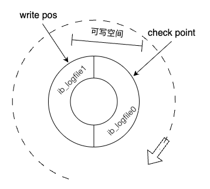
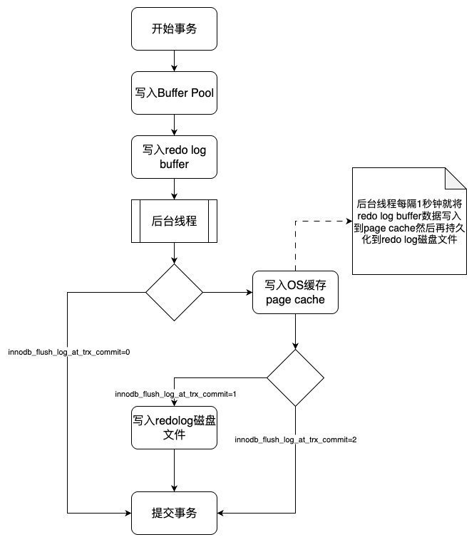

MySQL分为两层，一个Server层和存储引擎层。

Server层主要包括连接器、分析器、优化器、执行器。所有的访问连接、内置函数、存储过程、触发器、视图等功能服务都是有Server层提供。

存储引擎是负责数据层的数据存储和提取。架构模式是插件式的，主要常用的存储引擎有Innodb、MyISAM、Memory。其中Innodb最为常用，支持事务（MVCC + undolog）、行锁（提高并发）、崩溃恢复（redolog）。

<!-- more -->


## Innodb存储引擎的执行流程如下


> 补充
>
> - redo日志里记录的是物理数据，记录的是在哪个数据页做了什么修改（就是将哪个字段改成了什么）。
>
> - binlog日志里记录的是具体的更新操作SQL脚本。


## redolog日志

### redolog日志理解

**主要职责：** 服务崩溃数据恢复。

**redolog日志被设计为首尾相连的环形缓冲区。**

就是MySQL预先在磁盘里划分出一片空间出来，专门用于redolog日志循环写，默认是有两个redolog日志文件（ib_logfile0、和ib_logfile1）。

写redolog日志永远都是在文件的末尾追加，而往ibd文件写，是随机写的，因为写ibd里，不同表的物理磁盘地址是不同的（硬盘的磁道不同），效率就不如redolog的顺序最加写。


### redolog日志核心参数

#### innodb_log_buffer_size

通过设置 `innodb_log_buffer_size` 参数值，可以控制 `redo log buffer` 大小，默认为16M（一般无需调整），最大设置为4096M，最小设置为1M。

查看命令

```sql
show variables like '%innodb_log_buffer_size%';
```


#### innodb_log_group_home_dir

设置redo log文件存储位置参数

查看命令

```sql
show variables like '%innodb_log_group_home_dir%';
```


#### innodb_log_files_in_group

设置redo log文件的个数，默认为2，最大为100。

查看命令

```sql
show variables like '%innodb_log_files_in_group%';
```


#### innodb_log_file_size

设置单个redo log文件大小，默认值为48M。(默认即可，无需调整)

查看命令

```sql
show variables like '%innodb_log_file_size%';
```


### redolog磁盘写入分析

redolog磁盘写入，是循环顺序写入。

redolog默认是有两个文件的，这两个文件是怎么协同工作的呢？

如下图所示



两个文件一起组成了一个循环体，然后由 `write pos` 记录当前写到的位置（磁盘物理位置），由 `check point` 记录当前需要清理数据的位置（磁盘物理位置）。而 `write pos` 到 `check point` 之间的空间就是可以写入数据的地方。

如果 `check point` 被 `write pos` 追上了，那么就代表着redolog日志写满了，此时就会停下来，不再执行更新操作，先清理一些记录腾出一些空间出来。


并且redolog日志除了拥有顺序写入的特性外，还有三种写入策略

由innodb_flush_log_at_trx_commit参数控制，该参数使用默认即可。

**设置为0（不建议）：**（不建议）表示每次事务提交时都只是把 redo log 留在 redo log buffer 中，数据库宕机可能会丢失数据。

**设置为1（默认）**：每次事务提交时都将 redo log 直接持久化到磁盘，数据最安全，不会因为数据库宕机丢失数据，但是效率稍微差一点。

**设置为2（不建议）**：表示每次事务提交时都只是把 redo log 写到操作系统的缓存page cache里，这种情况如果数据库宕机是不会丢失数据的，但是操作系统如果宕机了，page cache里的数据还没来得及写入磁盘文件的话就
会丢失数据。





## binlog日志

**主要职责：**主从数据复制、数据恢复。

### binlog日志配置

```properties
# log‐bin设置binlog的存放位置，可以是绝对路径，也可以是相对路径，这里写的相对路径，则binlog文件默认会放在data数据目录下
log‐bin=mysql‐binlog
# Server Id是数据库服务器id，随便写一个数都可以，这个id用来在mysql集群环境中标记唯一mysql服务器，集群环境中每台mysql服务器的id不能一样，不加启动会报错
server‐id=1
# 其他配置
expire_logs_days = 15 # 执行自动删除binlog日志文件的天数， 默认为0， 表示不自动删除
max_binlog_size = 200M # 单个binlog日志文件的大小限制，默认为 1GB
```


### binlog磁盘写入机制

由 `sync_binlog` 参数控制，默认值为0，了解其默认机制即可。

MySQL默认是只write写入到page cache里面，然后再调用OS操作系统的fsync函数，由操作去写入磁盘的。因为中间插入了一层page cache，所以，如果日志写入到了pagecache里面，但是还没写入到磁盘里的时候，操作系统出了问题，宕机了，就会导致这部分日志数据丢失。


### 常用命令

- 重新生成binlog日志文件命令

  ```sql
  flush logs;
  ```

  

- 删除binlog日志命令

  ```sql
  # 删除当前的binlog文件
  reset master;
  
  # 删除指定日志文件之前的所有日志文件，下面这个是删除6之前的所有日志文件，当前这个文件不删除
  purge master logs to 'mysql‐binlog.000006';
  
  # 删除指定日期前的日志索引中binlog日志文件
  purge master logs before '2025‐08‐23 14:00:00';
  ```

  

- 查看binlog日志文件

  用mysql自带的命令工具 **mysqlbinlog** 查看binlog日志内容

  ```sql
  # 查看bin‐log二进制文件（命令行方式，不用登录mysql）
  mysqlbinlog ‐‐no‐defaults ‐v ‐‐base64‐output=decode‐rows D:/dev/mysql‐5.7.25‐winx64/data/mysql‐binlog.000007
  
  # 查看bin‐log二进制文件（带查询条件）
  mysqlbinlog ‐‐no‐defaults ‐v ‐‐base64‐output=decode‐rows D:/dev/mysql‐5.7.25‐winx64/data/mysql‐binlog.000007 start‐datetime="2023‐01‐21 00:00:00" stop‐datetime="2023‐02‐01 00:00:00" start‐position="5000" stop‐position="20000"
  ```

  

### binlog日志文件恢复数据案例

用binlog日志文件恢复数据其实就是回放执行之前记录在binlog文件里的sql，举一个数据恢复的例子

```sql
# 先执行刷新日志的命令生成一个新的binlog文件mysql‐binlog.000008，后面我们的修改操作日志都会记录在最新的这个文件里
flush logs;
# 执行两条插入语句
INSERT INTO `test`.`account` (`id`, `name`, `balance`) VALUES ('4', 'yunze', '666');
INSERT INTO `test`.`account` (`id`, `name`, `balance`) VALUES ('5', 'yunze1', '888');
# 假设现在误操作执行了一条删除语句把刚新增的两条数据删掉了
delete from account where id > 3;
```

现在需要恢复被删除的两条数据，先查看binlog日志文件

```sql
SET @@SESSION.GTID_NEXT= 'ANONYMOUS'/*!*/;
# at 219
#230127 23:32:24 server id 1 end_log_pos 291 CRC32 0x4528234f Query thread_id=5 exec_time=0 error_code=0
SET TIMESTAMP=1674833544/*!*/;
SET @@session.pseudo_thread_id=5/*!*/;
SET @@session.foreign_key_checks=1, @@session.sql_auto_is_null=0, @@session.unique_checks=1, @@session.autocommit=1/*!*/;
SET @@session.sql_mode=1342177280/*!*/;
SET @@session.auto_increment_increment=1, @@session.auto_increment_offset=1/*!*/;
/*!\C utf8 *//*!*/;
SET @@session.character_set_client=33,@@session.collation_connection=33,@@session.collation_server=33/*!*/;
SET @@session.lc_time_names=0/*!*/;
SET @@session.collation_database=DEFAULT/*!*/;
BEGIN
/*!*/;
# at 291
#230127 23:32:24 server id 1 end_log_pos 345 CRC32 0x7482741d Table_map: `test`.`account` mapped to number 99
# at 345
#230127 23:32:24 server id 1 end_log_pos 396 CRC32 0x5e443cf0 Write_rows: table id 99 flags: STMT_END_F
### INSERT INTO `test`.`account`
### SET
### @1=4
### @2='yunze'
### @3=666
# at 396
#230127 23:32:24 server id 1 end_log_pos 427 CRC32 0x8a0d8a3c Xid = 56
COMMIT/*!*/;
# at 427
#230127 23:32:40 server id 1 end_log_pos 492 CRC32 0x5261a37e Anonymous_GTID last_committed=1 sequence_number=2 rbr_only=yes
/*!50718 SET TRANSACTION ISOLATION LEVEL READ COMMITTED*//*!*/;
SET @@SESSION.GTID_NEXT= 'ANONYMOUS'/*!*/;
# at 492
#230127 23:32:40 server id 1 end_log_pos 564 CRC32 0x01086643 Query thread_id=5 exec_time=0 error_code=0
SET TIMESTAMP=1674833560/*!*/;
BEGIN
/*!*/;
# at 564
#230127 23:32:40 server id 1 end_log_pos 618 CRC32 0xc26b6719 Table_map: `test`.`account` mapped to number 99
# at 618
#230127 23:32:40 server id 1 end_log_pos 670 CRC32 0x8e272176 Write_rows: table id 99 flags: STMT_END_F
### INSERT INTO `test`.`account`
### SET
### @1=5
### @2='yunze1'
### @3=888
# at 670
#230127 23:32:40 server id 1 end_log_pos 701 CRC32 0xb5e63d00 Xid = 58
COMMIT/*!*/;
# at 701
#230127 23:34:23 server id 1 end_log_pos 766 CRC32 0xa0844501 Anonymous_GTID last_committed=2 sequence_number=3 rbr_only=yes
/*!50718 SET TRANSACTION ISOLATION LEVEL READ COMMITTED*//*!*/;
SET @@SESSION.GTID_NEXT= 'ANONYMOUS'/*!*/;
# at 766
```


找到两条插入数据的sql，每条sql的上下都有 **BEGIN** 和 **COMMIT** ，我们找到第一条sql **BEGIN** 前面的文件位置标识 **at** 的值219(这是文件的位置标识)，再找到第二条sql COMMIT后面的文件位置标识 **at** 的值701。

可以根据文件位置标识来恢复数据，执行如下sql：

```sql
# 根据at标识进行数据恢复
mysqlbinlog ‐‐no‐defaults ‐‐start‐position=219 ‐‐stop‐position=701 ‐‐database=test D:/dev/mysql‐5.7.25‐winx64/data/mysql‐binlog.000009 | mysql ‐uroot ‐p123456 ‐v 数据库名

# 根据时间来恢复数据的命令，找到第一条sql BEGIN前面的时间戳标记 SETTIMESTAMP=1674833544，再找到第二条sql COMMIT后面的时间戳标记 SET TIMESTAMP=1674833663，转成datetime格式
mysqlbinlog ‐‐no‐defaults ‐‐start‐datetime="2023‐1‐27 23:32:24" ‐‐stop‐datetime="2023‐1‐27 23:34:23" ‐‐database=test D:/dev/mysql‐5.7.25‐winx64/data/mysql‐binlog.000009 | mysql ‐uroot ‐p123456 ‐v 数据库名
```

验证删除的数据是否恢复。

> 注意数据备份设置。
>
> 例如：一天一备份，然后binlog日志保留15天。
>
> 就算期间备份出了问题，也可以由binlog日志恢复。

## undolog日志

事务回滚，用于MVCC的日志版本《 [MVCC机制解析](../../../database/104.MVCC机制解析：提升数据库并发性能的关键.md) 》


## 数据库备份

### 备份命令如下

```cmd
# 备份整个数据库
mysqldump ‐u root 数据库名>备份文件名; 

#备份指定数据库的指定数据表
mysqldump ‐u root 数据库名 表名字>备份文件名;
```

恢复备份数据命令如下

```cmd
# 恢复整个数据库，test为数据库名称，需要自己先手动去创建一个名叫test的数据库
mysql ‐u root test < 备份文件名
```

