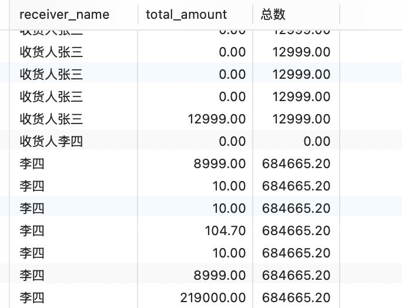
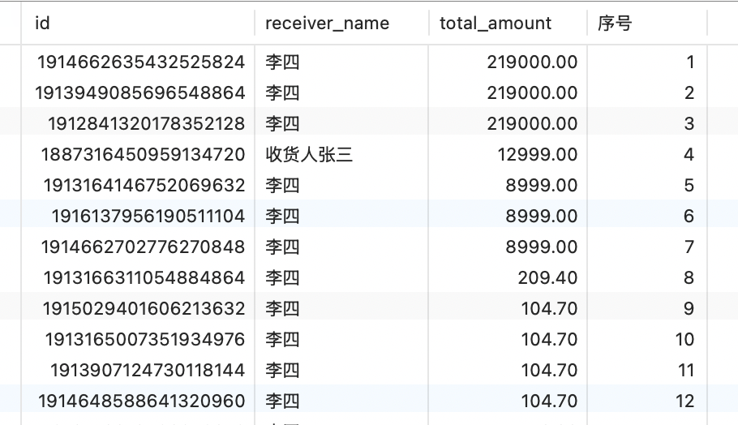

## MySQL Server系统参数说明

MySQL Server系统参数官网地址

https://dev.mysql.com/doc/refman/8.0/en/server-system-variables.html#sysvar_max_connections

### 最大连接数

建议初始配置为500。

```properties
max_connections=3000
```

指每秒请求数，也就是QPS。连接数过高，吞吐量不一定会提高，反而可能占用更多的系统资源。

> 一个连接最少占用内存是256K，最大是64M，如果一个连接的请求数据超过64MB（比如排序），就
> 会申请临时空间，放到硬盘上。
>
> 如果3000个用户同时连上mysql，最小需要内存3000 * 256KB=750M，最大需要内存3000 * 64MB=192G。


设置 `max_connections` 时，还需要考虑给 `innodb_buffer_pool_size` 预留足够的资源。

例如：32G的MySQL服务器，需要预留60%~80%的空间给 `innodb_buffer_pool_size` ，取其中间值大概为24G，所以留给 `max_connections` 和操作系统的内存为8个G，假设操作系统等其他服务共用了4G，则剩余可分配内存为4G。


### 允许用户连接的最大数量

max_connections - max_user_connections的数量就是预留给DBA维护使用。

```properties
max_user_connections=2980
```


### 连接空闲等待时间

指业务服务通过jdbc连接mysql进行操作完毕后，空闲300秒后断开，默认是28800，单位秒，即8个小时。

```properties
wait_timeout=300
```


### 排序任务线程缓冲区大小

每个需要排序的线程分配该大小的一个缓冲区。增加该值可以加速ORDER BY 或 GROUP BY操作。

```properties
sort_buffer_size=4M
```

>并不是越大越好，由于是connection级的参数，过大的设置 + 高并发可能会耗尽系统的内存资源。
>
>例如：500个连接将会消耗500 * sort_buffer_size(4M)=2G。


### 表关联缓存区大小

和sort_buffer_size一样，该参数对应的分配内存也是每个连接独享。增加该值可以加速 join 联表查询。

```properties
join_buffer_size=4M
```


### innodb存储引擎buffer pool缓存大小

一般为物理内存的60%-70%。该内存的大小直接反应数据库的性能。

```properties
innodb_buffer_pool_size=24G
```


## MySQL8新特性

### 索引字段降序排序

```sql
create index ix_table on table_name (name, age desc);
```


### group by不再隐式排序

mysql 8.0之后对于group by 字段不再进行隐式排序，如需要排序，必须显式加上order by 子句


### 增加隐藏索引（有用）

使用 invisible 关键字在创建表或者进行表变更中设置索引为隐藏索引。

索引隐藏只是不可见，但是数据库后台还是会继续维护隐藏索引。

在查询时优化器不再使用该索引，即使用force index，优化器也不会使用该索引。

如果觉得某个索引没用了，但是删除后发现这个索引在某些时候还是有用的，于是又得把这个索引加回来，当数据表数据量很大时，就会很麻烦，加新索引期间会影响到现有系统。此时，就可以用到隐藏索引，先将索引设置为隐藏索引，等到真的确认索引没用了再去删除。

> 主键不能设置为 invisible


#### 设置索引为隐藏索引

```sql
alter table table_name alter index ix_table_name_index_name invisible;
```


#### 隐藏索引设置可见

```sql
alter table table_name alter index ix_table_name_index_name visible;
```


### 新增函数索引

MySQL8.0.13之前如果查询条件使用了函数，则不会走索引，而8.0.13版本之后，可以在索引中使用函数(表达式)的值。
函数索引基于虚拟列功能实现，在MySQL中相当于新增了一个列，这个列会根据你的函数来进行计算结果，然后使用函数索引的时候就会用这个计算后的列作为索引。

```sql
create index func_ix_table_name on table_name((UPPER(field_name)))
```


### select for update跳过锁等待

在MySQL5.7之前，如果使用select ... fro update，如果获取不到锁，就会一直等待，知道超时。

而MySQl8之后添加了 `nowait` ，`skip locked` 语法，如果获取不到锁，

**nowait：** 直接报错返回。

```sql
select * from table_name where field_name = 2 for update nowait;
```


**skip locked：** 跳过锁定的数据，返回没有被锁定的数据。

```sql
select * from table_name where field_name = 2 for update skip locked;
```


### 窗口函数: 也称分析函数

在聚合函数后面加上 **over()** 就变成窗口函数了，在括号里可以加上 **partition by** 等分组关键字指定如何分组。

案例

```sql
SELECT receiver_name, total_amount
, SUM(total_amount) over(PARTITION by receiver_name) as 总数
FROM oms_order;
```

根据receiver_name进行分组，统计计算各自total_amount的总数




#### 序号函数ROW_NUMBER()

```sql
SELECT id, receiver_name, total_amount, ROW_NUMBER() over(order by total_amount DESC) as 序号 from oms_order
```

