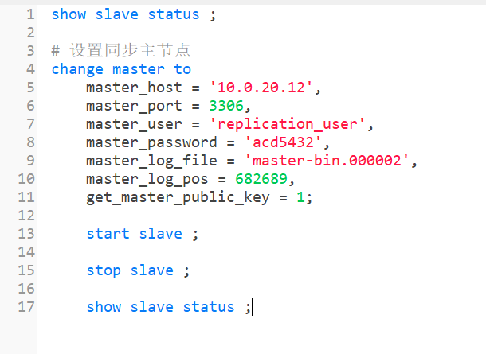
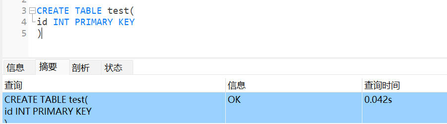

MySQL服务的主从架构是通过binlog日志文件来实现的。使用MySQL做读写分离配置时，就必须基于主从架构来搭建，主节点用来写入数据，从节点用来读取数据。

1. 在主服务节点上开启binlog日志，用来记录每一步数据库的操作。
2. 然后在从服务节点上，就会有一个IO线程，负责跟主服务建立一个TCP连接，用来请求主服务，获取最新的binlog日志。
3. 主服务节点上会有一个IO dump线程，专门负责讲binlog日志传输给从节点服务。
4. 接着从节点服务的IO线程会把读取到的binlog日志数据写入自己的relay日志文件中。
5. 然后从节点服务上另外一个线程会读取relay日志里的内容，进行操作重演，达到数据还原的目的。

<!-- more -->


## 复制数据同步类型

在 MySQL 8.0中，除了内置的异步复制之外，还支持半同步复制。默认情况下，MySQL 采用异步复制的方式。

### 异步复制

异步复制是主库往binlog日志写记录，从库从binlog复制数据到relay中继日志是两个线程，异步的，互不等待。

>异步复制可能存在主从延迟，如果主节点宕机，可能会丢数据。


### 半步同步复制

- 异步复制是主节点在完成binlog日志写记录之后，还需要等待至少一个从节点完成数据同步的响应之后（或超时），才会响应请求。

- 而从节点只有在写入 relay-log 并完成刷盘之后，才会向主节点响应。
- 当从节点响应超时时，主节点会将同步机制退化为异步复制。在至少一个从节点恢复，并完成数据追赶后，主节点会将同步机制恢复为半同步复制。

重要参数

**rpl_semi_sync_master_wait_slave_count：** 等待数据复制到几个从节点再返回。这个数量配置的越
大，丢数据的风险越小，但是集群的性能和可用性就越差。（8.0.26之后改为
rpl_semi_sync_source_wait_for_replica_count）

**rpl_semi_sync_master_wait_point：**这个参数控制主库执行事务的线程，是在提交事务之前（AFTER_SYNC）等待复制，还是在提交事务之后（AFTER_COMMIT）等待复制。默认是 AFTER_SYNC，也就是先等待复制，再提交事务，这样就不会丢数据。（8.0.26之后改为rpl_semi_sync_source_wait_point）


## 方案一：基于binlog日志复制事件主从复制方式

### 先安装单机版mysql数据库

操作流程： [MySQL数据库安装部署](../../../database/107.MySQL数据库安装部署.md) 

### 主节点

#### master主节点服务的my.cnf配置

```
# For advice on how to change settings please see
# http://dev.mysql.com/doc/refman/8.0/en/server-configuration-defaults.html

[mysqld]
# 主库需要和从库不一致
server-id=47
# 开启binlog日志
log_bin=master-bin
log_bin-index=master-bin.index
# 设置服务连接端口
port=3306
# 跳过域名解析，只接受客户端使用ip地址进行认证
skip-name-resolve
#
# Remove leading # and set to the amount of RAM for the most important data
# cache in MySQL. Start at 70% of total RAM for dedicated server, else 10%.
# innodb_buffer_pool_size = 128M
innodb_buffer_pool_size = 1024M
#
# Remove the leading "# " to disable binary logging
# Binary logging captures changes between backups and is enabled by
# default. It's default setting is log_bin=binlog
# disable_log_bin
#
# Remove leading # to set options mainly useful for reporting servers.
# The server defaults are faster for transactions and fast SELECTs.
# Adjust sizes as needed, experiment to find the optimal values.
# join_buffer_size = 128M
# sort_buffer_size = 2M
# read_rnd_buffer_size = 2M
join_buffer_size = 256KB
sort_buffer_size = 512KB
read_rnd_buffer_size = 256KB
#
# Remove leading # to revert to previous value for default_authentication_plugin,
# this will increase compatibility with older clients. For background, see:
# https://dev.mysql.com/doc/refman/8.0/en/server-system-variables.html#sysvar_default_authentication_plugin
# default-authentication-plugin=mysql_native_password

datadir=/var/lib/mysql
socket=/var/lib/mysql/mysql.sock

log-error=/var/log/mysqld.log
pid-file=/var/run/mysqld/mysqld.pid


# 允许最大连接数
max_connections=200
# 允许连接失败的次数。这是为了防止有人从该主机试图攻击数据库系统
max_connect_errors=10
# 服务端使用的字符集默认为UTF8
character-set-server=utf8

```


#### 启动主节点的mysql服务

启动服务命令

```shell
service mysqld restart
```

重启服务命令

```shell
service mysqld start
```

查看服务状态

```shell
service mysqld status
```


#### master 主节点相关命令

```sql
# 查看主节点信息
show master status ;

# 创建指定用户
create user 'replication_user'@'%' identified by 'acd5432';

# 授予指定用户复制所有数据库和表的相关操作（一般用于主从复制）
grant replication slave on *.* to 'replication_user'@'%';

# 刷新权限以确保立即生效
flush privileges ;
```


### 从节点

#### slave从节点服务的my.cnf配置

```cnf
[mysqld]
#主库和从库要不一致
server-id=48
# 打开MySQL中继日志
relay-log-index=slave-relay-bin.index
relay-log=slave-relay-bin
# 打开从服务二进制日志
log-bin=mysql-bin
#
log-slave-updates=1
#
port=3306
#
# Remove leading # and set to the amount of RAM for the most important data
# cache in MySQL. Start at 70% of total RAM for dedicated server, else 10%.
# innodb_buffer_pool_size = 128M
innodb_buffer_pool_size = 512M
#
# Remove the leading "# " to disable binary logging
# Binary logging captures changes between backups and is enabled by
# default. It's default setting is log_bin=binlog
# disable_log_bin
#
# Remove leading # to set options mainly useful for reporting servers.
# The server defaults are faster for transactions and fast SELECTs.
# Adjust sizes as needed, experiment to find the optimal values.
# join_buffer_size = 128M
# sort_buffer_size = 2M
# read_rnd_buffer_size = 2M
join_buffer_size = 256KB
sort_buffer_size = 512KB
read_rnd_buffer_size = 256KB
#
# Remove leading # to revert to previous value for default_authentication_plugin,
# this will increase compatibility with older clients. For background, see:
# https://dev.mysql.com/doc/refman/8.0/en/server-system-variables.html#sysvar_default_authentication_plugin
# default-authentication-plugin=mysql_native_password

datadir=/var/lib/mysql
socket=/var/lib/mysql/mysql.sock

log-error=/var/log/mysqld.log
pid-file=/var/run/mysqld/mysqld.pid


# 允许最大连接数
max_connections=200
# # 允许连接失败的次数。这是为了防止有人从该主机试图攻击数据库系统
max_connect_errors=10
# # 服务端使用的字符集默认为UTF8
character-set-server=utf8
```


#### 启动从节点的mysql服务

启动服务命令

```shell
service mysqld restart
```

重启服务命令

```shell
service mysqld start
```

查看服务状态

```shell
service mysqld status
```


#### slave 从节点相关命令

**<font style='color:red'>注意事项：</font>**

> 下面命令中的 `change master` 指令中需要指定的master_log_file和master_log_pos必须和上面master主节点中使用 `show master status` 命令查到的保持一致。


```sql
# 设置同步主节点
change master to
    master_host = '10.0.20.12',
    master_port = 3306,
    master_user = 'replication_user',
    master_password = 'acd5432',
    master_log_file = 'master-bin.000002',
    master_log_pos = 6580,
    get_master_public_key = 1;
    
# 开启slave从节点
start slave ;

# 关闭从节点
stop slave ;

# 查看从节点的主从同步状态
show slave status ;
```



### 主从集群搭建完毕

#### 验证主从集群

在master主节点进行数据操作，会同步更新到从节点。

##### 测试1

在主节点创建一个表



在从节点查看表


##### 测试2

在主节点新增数据


在从节点查看数据


#### 注意事项

主从集群不能在从节点进行数据操作，从节点的数据是不会反向同步到主节点的，所以一般以从节点作为 `读库` ，主节点作为 `写库` ,这就是常说的读写分离。


### 集群扩容

现在已经存在了master主节点，且此时master主节点已经有了很多数据，此时再想给这个master主节点加上一个slave从节点，会有如下问题，之前数据是无法通过binlog来恢复的，这时候加新的slave节点时，需要在从节点执行 `change master` 命令前，额外增加一个数据复制操作，需要将master主节点当前的数据全部手动同步到slave节点。（最好停止所有应用服务再去操作，防止手动数据同步期间还有新的数据入库）

手动同步数据操作方式如下

**在master主节点导出需要同步的数据库数据**

```sql
mysqldump -u root -p 数据库名称 > 数据库名称_backup.sql
```

**在slave从节点执行master主节点导出的脚本**

```sql
mysql -u root -p 数据库名称 < 数据库名称_backup.sql
```

将历史的业务数据导入到slave从节点之后，从节点就可以再继续按照上文的步骤执行 `change master` 等命令了。


### 全库同步和部分同步

上文目前的配置是slave从节点是会同步master主节点的全库，在实际环境中可能只需要同步master主节点的其中一个或数个库

操作方式如下：

先在masterr主节点的mysql的 `my.cnf`（默认地址：/etc/my.cnf） 里加上如下配置

```cnf
# 设置只同步库名为dbName1和dbName2的库 
binlog-do-db=dbName1
binlog-do-db=dbName2
```

然后在slave从节点的mysql的 `my.cnf`（默认地址：/etc/my.cnf） 里加上如下配置

```cnf
replicate-do-db=dbName1
replicate-do-db=dbName2
```

> 如果masterr主节点和slave从节点的库名不相同，可在slave从节点的mysql的 `my.cnf` 添加如下配置
>
> replicate­-rewrite­-db=dbName > dbName1
>
> 注意：该在MySQL的新版本中已经被废弃，在MySQL 5.7及以后的版本中，使用这个选项可能会收到警告，并且在未来的MySQL版本中可能会被移除。所以最好保持主从数据库的库名一致。

如果不是 dbName1 库的所有表数据都同步，只需要需要同步指定的数据表，则可以在slave从节点的mysql的 `my.cnf` 配置文件中加上如下配置

```cnf
# 如果没有指定则默认是全部表同步的（下面配置只同步dbName1库的tableName1和tableName2两个表）
replicate-wild-do-table=dbName1.tableName1
replicate-wild-do-table=dbName1.tableName2
```


## 方案二：基于全局事务标识符(GTID)源-副本复制模式

Replication（复制）使来自一个MySQL数据库服务器（称为源（Source））的数据能够复制到一个或多个 MySQL 服务器（称为副本（Replica））。

GTID是一个基于原始mysql服务器生成的一个已经被成功执行的全局事务ID，它由服务器ID以及事务
ID组合而成。

一个GTID在一个服务器上只执行一次，避免重复执行导致数据混乱或者主从不一致。

在传统的replica端，binlog是不用开启的，但是 **在GTID中replica端的binlog是必须开启** 的，目的是记录执行过的GTID（强制）。

GTID表示为一对坐标，由冒号(:)分隔，如下所示:

```sql
GTID = source_id:transaction_id
```

其中 `source_id` 即源服务器唯一的 `server_uuid` 。

`transaction_id` 是一个序列号，由事务在源（主节点）上提交的顺序决定。序列号的上限是有符号64位整数（2^63-1）


GTID存储在mysql数据库中名为gtid_executed的表中。


### GTID的优势

1. 更简单的实现故障转移，不用以前那样在需要找位点（log_file 和 log_pos）。

2. 更简单的搭建主从复制。

3. 比传统的复制更加安全。

4. GTID 是连续的没有空洞的，保证数据的一致性，零丢失。


### GTID 同步方案和位点同步的方案区别

- 位点同步方案是通过人工在从库上指定哪个位点，主库就发哪个位点，不做日志的完整性判断。
-  GTID 方案是通过主库来自动计算位点的，不需要人工去设置位点，对运维人员友好。


## 自动清理binlog日志

在实际环境中binlog日志是很大，为防止大量占用磁盘资源，可以在master主节点的 `my.cnf` 加上如下配置

```cnf
# 设置只保留7天的二进制日志
expire-logs-days=7
```


