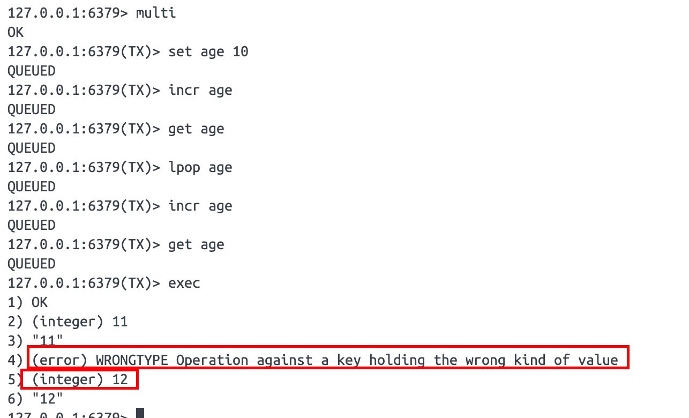
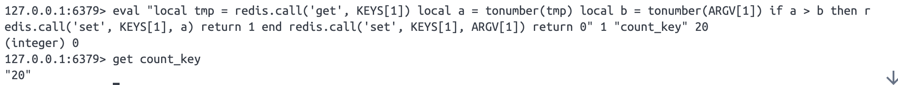

## Redis保持原子性操作方式

### 事务

```bash
# 开启事务
multi
# 命令1
set age 10
# 命令2
incr age
# 命令3
get age
# 执行（提交事务）
exec
```

redis的事务和mysql的事务不一样，redis的事务不保证原子性，只保证各个原子操作是一起执行的，中间不会被其他事务加塞，但是不保证这些原子操作一起成功或一起失败。



由上图可以看到，就算 `lpop age` 命令执行失败了，也不会影响到后续的命令执行。

而且开启事务后，执行的命令返回的都是 `QUEUED` ，表示的这些操作只是排好了队，但是还没执行，只有在发送了 `exec` 命令后，所有命令才会一起按循序执行。


### pipeline管道

将多个指令打包一起发送给Redis服务端，减少了执行每个指令都会与服务端进行网络交互的时间。但是pipeline不具备原子性，虽然命令是一起打包发送给服务端的，但是并不能保证期间不被其他的操作命令加塞。

而且pipeline在执⾏过程中，会阻塞当前客户端。

适合在非热点时间将大批量不复杂的数据快速写入到Redis中。

案例：

command.txt

```bash
set count 1
incr count
incr count
set age 10
incr age
incr age
```

redis执行命令

```bash
cat command.txt | redis-cli -a 123456pwd --pipe
```


### lua脚本

>  lua脚本在线调试网站： https://wiki.luatos.com/index.html

lua语言是单线程模式的，所以在redis中执行lua脚本天然就是原子性的。

eval执行lua脚本

```bash
eval "return {KEYS[1],KEYS[2],ARGV[1],ARGV[2]}" 2 key1 key2 param1 param2
```

第三个参数为从第三个参数往后多少个参数是Redis的键名参数，剩余的就是附加参数。

在lua脚本中，可以使用redis.call函数来调用Redis的命令。

例如

```bash
set count_key 10

eval "local tmp = redis.call('get', KEYS[1]) local a = tonumber(tmp) local b = tonumber(ARGV[1]) if a > b then redis.call('set', KEYS[1], a) return 1 end redis.call('set', KEYS[1], ARGV[1]) return 0" 1 "count_key" 20
```




## redis使用单线程为主的原因总结

2小时05分左右

redis没有完全不考虑多线程，将flush all，AOF等耗时的操作放到多线程上，更利于发挥多线程的优势。

redis经过验证性能瓶颈不是在CPU上面，而是在内存、网络。只用单核性能已经足够高了（在数据结构方面做了很多优化）。所以redis综合考虑还是坚持了以单线程为主的线程模型。


