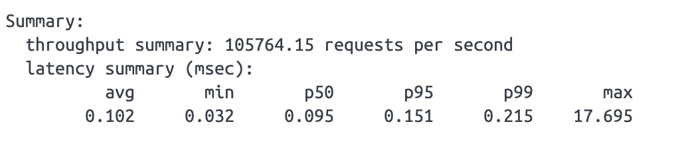

## 压测

压测命令

```bash
# 20个线程，100W个请求，测试redis的set指令(写数据)
redis-benchmark -a foobared -t set -n 1000000 -c 20
```

> 可使用redis-benchmark --help指令查看更多参数




## Redis的数据持久化

redis的数据持久方案有四种，分别是无持久化、 RDB 、 AOF 、RDB + AOF。

生产环境建议使用 RDB + AOF 两种结合一起使用。

### 无持久化

不进行数据持久化，完全将Redis当做缓存使用。

### RDB

按照一定的时间间隔来进行所有数据备份。

#### 优点

RDB文件非常紧凑，适合定期备份数据，适合灾难恢复。

RDB备份时性能非常快，对主线程的性能几乎没有影响。主线程只需要启动一个负责数据备份的子线程即可。对主线程的IO性能几乎没有影响。

与AOF相比，RDB在进行大数据量重启时会快很多。

如果需要迁移数据，可直接使用复制rdb文件给到另一台redis服务。

#### 缺点

无法实时备份，会有数据丢失的可能。


#### 配置

开启：

```properties
rdbcompression yes   # 开启RDB文件压缩（默认）
# 或
rdbcompression no    # 关闭RDB文件压缩
```


持久化策略：

```properties
save <seconds> <keys-changed>
```

seconds：时间窗口（秒）

keys-changed：在时间窗口内发生改变的键的数量。

**含义：** 如果在 `<seconds>` 秒内，至少有 `<keys-changed>` 个键发生了变化（新增、修改、删除），Redis 就会自动触发一次 BGSAVE 操作，创建数据快照。


案例：

只要满足其中任意一个条件，就会触发备份。

```properties
save 900 1    # 在900秒（15分钟）内，如果至少有1个键发生变化，则触发保存
save 300 10   # 在300秒（5分钟）内，如果至少有10个键发生变化，则触发保存
save 60 10000 # 在60秒（1分钟）内，如果至少有10000个键发生变化，则触发保存
```


### AOF

记录每次写操作的命令，可通过重放的的方式进行数据恢复。

#### 优点

AOF持久化更安全，默认每秒进行一次AOF写入，就算服务崩溃也只会丢失1秒的数据。

不会出现记录不完整的情况，即使因为一些特殊的原因造成了 aof 的文件记录不完整，也可以使用 `redis-check-aof` 工具进行修复。

AOF记录操作的方式简单易懂，可手动删除日志文件里不要的操作语句（误操作的语句，例如操作了flushall）。

#### 缺点

aof文件太大。（当然Redis会自动切换新的日志文件）

aof备份性能不如RDB。


开启：

```properties
# 开启AOF持久化模式
appendonly yes

# 指定AOF文件名（默认即可）
appendfilename "appendonly.aof"

# 设置fsync同步策略（推荐每秒同步，在安全与性能间取得平衡）
appendfsync everysec
```


### RDB + AOF

进行数据备份的同时，记录写操作。

既保证了数据安全，又保证了快速恢复和备份的效率。

```properties
####################### SNAPSHOTTING (RDB) ############################
# 启用RDB快照
save 900 1         # 15分钟内至少1个键变更则触发
save 300 10        # 5分钟内至少10个键变更则触发
save 60 10000      # 1分钟内至少10000个键变更则触发

stop-writes-on-bgsave-error yes # BGSAVE出错时停止接收写请求，是一种保护机制
rdbcompression yes              # 开启RDB文件压缩，节省空间
rdbchecksum yes                 # 对RDB文件进行校验，增加数据可靠性
dbfilename dump.rdb             # RDB文件名
dir ./                          # RDB和AOF文件保存目录（通常需要改为持久化卷）

####################### APPEND ONLY MODE (AOF) ########################
# 启用AOF持久化
appendonly yes                  # 最关键：开启AOF功能
appendfilename "appendonly.aof" # AOF文件名

# AOF fsync策略 (推荐everysec)
appendfsync everysec            # 在安全与性能间取得最佳平衡

# AOF重写配置
no-appendfsync-on-rewrite no    # 重写时不阻塞fsync
auto-aof-rewrite-percentage 100 # 文件大小增长100%后触发重写
auto-aof-rewrite-min-size 64mb  # AOF文件至少达到64MB才触发重写

aof-load-truncated yes          # 如果AOF文件尾部损坏，仍加载 truncated 的数据
```


#### 数据恢复流程

当Redis重启时，它会按以下顺序优先恢复数据：

> **优先加载 AOF 文件** ->  **加载 RDB 文件**

因为AOF文件通常包含更完整的最新数据（直到宕机前最后一秒的命令）。RDB文件可能只是几分钟前的一个快照。


## 多节点

### 主从

解决了数据安全性问题。（主节点崩溃，还有从节点复制的数据）

主节点负责写，从节点负责读（从节点无法写）（机制和mysql的主从类似）。

搭建方式：《 [Redis的主从架构配置](../../../database/122.Redis的主从架构配置.md) 》

如果在搭建主从时，从节点已经有了数据会怎么样呢？

答：主从同步完成后，从节点的数据被主节点覆盖。


缺点：主节点挂了之后，需要认为介入操作切换主节点。（哨兵就是将优化掉了需要人为介入）


### 哨兵

解决了服务安全问题。（主节点异常，哨兵集群会从从节点中选出新的主节点）

搭建方式：《  [Redis的哨兵架构配置](../../../database/123.Redis的哨兵架构配置.md) 》

#### 选举操作流程

1. sentinel集群会选举一个sentinel服务节点为leader（将由这个leader负责向所有的redis节点发送命令，协调整个故障切换过程）。

2. 在剩余的健康的从节点中，选举出新的master

   - 首先检查是否有提前配置的优先节点：各个服务节点的redis.conf中的 `replica-priority` 配置最低
     的从节点。这个配置的默认值是100。如果大家的配置都一样，就进入下一个检查规则。
   - 然后检查复制偏移量offset最大的从节点。也就是找同步数据最快的slave节点。因为他的数据是
     最全的。如果大家的offset还是一样的，就进入下一个规则。
   - 最后按照slave的RunID字典顺序最小的节点。

3. 切换新的主节点

   leader给新的主节点执行 `slave of no one` 操作，正式将其提升为主节点，再给其他从节点发送 `slave of` 指令，让其他的slave节点成为新master节点的从节点。

4. 如果旧的主节点恢复了，leader会让他降为新的从节点，从新的master节点上同步数据，然后恢复工作。


缺点： 

所有节点都存储 全量数据，每个从节点都是主节点的完整副本，资源浪费。

扩展性方面，哨兵的性能和容量受限于单台机器的上限。

客户端需要频繁切换master。


### 集群

同时解决了数据安全性问题和服务安全问题。

搭建方式：《  [Redis的集群搭建配置](../../../database/124.Redis的集群搭建配置.md) 》

Redis集群是多主多从。

Redis集群设置16384个哈希槽。每个key会通过CRC16校验后，对16384取模，来决定放到哪个槽。集群的每个节点负责一部分的hash槽。

集群主节点选举原理 《  [Redis的集群的选举原理分析](../../../database/124.Redis的集群搭建配置.md#集群的选举原理分析) 》
