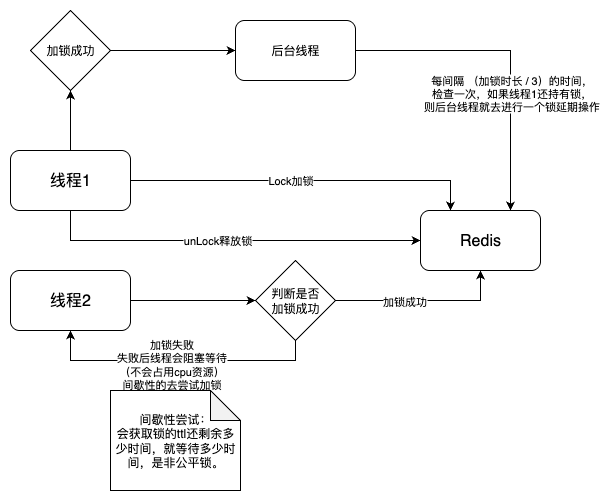

## 分布式锁

### 简单加锁方式

将lock_1设置为1则是加锁。

```java
// 先判断是否已经存在锁lock_1
redisTemplate.hasKey("lock_1");
// 不存在锁lock_1，则加上锁
redisTemplate.boundValueOps("lock_1").set("1");  
```

这是极简锁，这样会存在问题，判断是否存在锁和加锁是两个命令，存在原子性问题，如果线程1和线程2，同时执行判断是否存在锁，并都通过了判断，此时就会出现两个线程都持有锁的问题。


解决方案，使用redis的 `setnx` 命令

```java
// 加锁
redisTemplate.boundValueOps("lock_1").setIfAbsent("1");
// 释放锁
redisTemplate.delete("lock_1");
```

将lock_1设置为1则是加锁，使用setIfAbsent，对应的是redis的 `setnx` 命令，只有在 key 不存在时才能设置 key 的值。

还存在个问题，加锁后如果在执行业务代码过程中，出现了异常，没有执行释放锁命令，造成了死锁怎么办？


解决方案，使用try finally

```java
try {
  // 业务代码
} finally {
  // 释放锁
	redisTemplate.delete("lock_1");
}
```

但是如果不是异常，而是服务宕机，还是会不执行释放锁命令。


解决方案，给锁设置失效时间。

```java
// 加锁10秒
redisTemplate.boundValueOps("lock_1").setIfAbsent("1", 10, TimeUnit.SECONDS);
```

设置失效时间后，又会引出新的问题，锁超时了怎么办？

会导致线程1还没执行完，锁超时自动释放，然后线程2就可以正常获取到锁，然后进行业务操作，这就存在并发问题。

并且，如果线程2在进行业务操作时，线程1执行完了，然后执行释放锁命令，此时线程1释放的是线程2的锁，这样线程3就又可以获取到锁了，如此循环会造成并发事故。


释放其他线程持有锁问题解决方案，给锁设置标识，每个线程只能释放自己持有的锁。

```java
String uuid =  UUID.randomUUID().toString();
redisTemplate.boundValueOps("lock_1").setIfAbsent(uuid, 10, TimeUnit.SECONDS);
try {
  // 业务代码
} finally {
  	// 判断标识操作(判断是否是本线程持有的锁)
    if (uuid.equals(redisTemplate.boundValueOps("lock_1").get())) {
        redisTemplate.delete("lock_1");
    }  
}
```

这样还存在个问题，判断标识操作和删除操作是分两步执行的，如果刚好通过判断标识操作（还没执行删除锁操作），然后锁到期了，自动释放了锁，再由其他线程持久了锁，那么就存在新线程持有的锁被上个线程执行的delete操作删除锁。


解决方案，使用lua脚本，lua脚本具有原子性。

```java
String uuid =  UUID.randomUUID().toString();
redisTemplate.boundValueOps("lock_1").setIfAbsent(uuid, 10, TimeUnit.SECONDS);
try {
  // 业务代码
} finally {
		String luaScript = "local currentValue = redis.call('GET', KEYS[1]) " +
                "if not currentValue then return 0 end " +
                "if tostring(currentValue) == tostring(ARGV[1]) then " +
                "redis.call('DEL', KEYS[1]) " +
                "return 1 " +
                "end " +
                "return 0";
  	DefaultRedisScript<Integer> script = new DefaultRedisScript<>();
		script.setScriptText(luaScript);
		script.setResultType(Integer.class);
		redisTemplate.execute(script, Collections.singletonList("local_1"), uuid);
}
```


线程1还没执行完，锁超时自动释放问题解决方案，锁延期策略。

手搓代码实现不困难，可直接使用 `Redisson` 。


## Redisson



线程1在释放锁时，会通过redis的stream数据类型发布一条消息，然后其他想尝试持有该锁的线程会监听这个channel（可理解为队列）的消息，接收到消息后，线程会苏醒，会去尝试获取锁。


使用方式

```java
@Resource
private Redisson redisson;

public void test() {
		RLock rLock = redisson.getLock("lock_1");
    rLock.lock(10, TimeUnit.SECONDS);
		try {
				// 业务代码
		} finally {
        rLock.unlock();
    }
}
```

