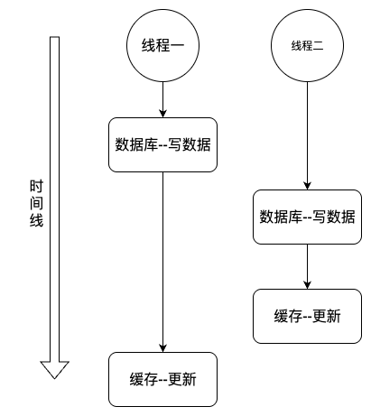
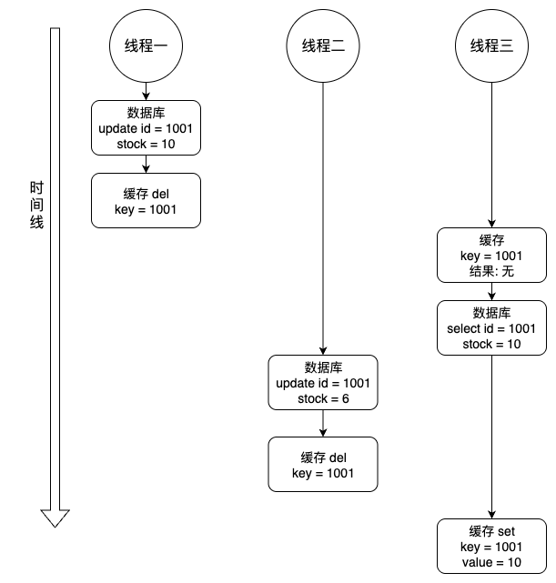

## 缓存、数据双写一致性问题

### 双写不一致



### 读写不一致




### 优化方案

《 [Redis缓存与数据库数据一致性问题](../../../database/125.Redis缓存与数据库数据一致性问题.md) 》

如果不能容忍缓存数据不一致，可以通过加 **分布式读写锁** 保证并发读写或写写的时候按顺序排好队，读读的
时候相当于无锁。（比较推荐）


## Redis过期键清除策略

### 被动删除

当读/写一个已经过期的key时，会触发惰性删除策略，会直接删除掉这个过期key。

### 主动删除

惰性删除策略无法保证冷数据被及时删掉，所以Redis会定期主动淘汰一批已过期的key。

### 触发主动清理策略

当内存超过maxmemory限定时，会触发主动清理策略。

内存主动淘汰策略如下

#### 针对设置了过期时间的key做处理：

- volatile-ttl：在筛选时，会针对设置了过期时间的键值对，根据过期时间的先后进行删
  除，越早过期的越先被删除。

- volatile-random：就像它的名称一样，在设置了过期时间的键值对中，进行随机删除。

- volatile-lru：会使用 LRU 算法筛选设置了过期时间的键值对删除。

- volatile-lfu：会使用 LFU 算法筛选设置了过期时间的键值对删除。

#### 针对所有的key做处理：

- allkeys-random：从所有键值对中随机选择并删除数据。

- allkeys-lru：使用 LRU 算法在所有数据中进行筛选删除。

- allkeys-lfu：使用 LFU 算法在所有数据中进行筛选删除。

#### 不处理：

- noeviction：不会剔除任何数据，拒绝所有写入操作并返回客户端错误信息"(error)
  OOM comm

> **缓存淘汰算法**
>
> **LRU 算法**（Least Recently Used，最近最少使用）：
>
> 淘汰很久没被访问过的数据，以最近一次访问时间作为参考。
>
> **LFU 算法**（Least Frequently Used，最不经常使用）：
>
> 淘汰最近一段时间被访问次数最少的数据，以次数作为参考。


> 当Redis运行在主从模式时，只有主结点才会执行过期删除策略，然后把删除操作”del key”同步到从结点删除数据。


### 配置方式

```properties
# 设置最大内存，例如 4GB
maxmemory 4gb

# 选择驱逐策略，例如 volatile-lru
maxmemory-policy volatile-lru

# （可选）设置LRU/LFU算法的采样精度
maxmemory-samples 10
```


## bigkey的危害

> 1. **字符串类型：**它的big体现在单个value值很大，一般认为超过10KB就是bigkey。
> 2. **非字符串类型：**哈希、列表、集合、有序集合，它们的big体现在元素个数太多，一般不要超过5000。


### 危害

导致redis阻塞：redis的核心读写是单线程操作的，bigkey会阻塞后续排队的请求。

导致网络的阻塞：如果一个bigkey是1MB，则每秒1000个客户端请求，就每秒产生了1000MB的流量，但是千兆网卡(按照字节算是128MB/s)根本处理不过来。

过期删除时阻塞redis：当bigkey到期后删除时，会阻塞redis其他操作。


### 优化

list类型可拆分为list1、list2...listN。

控制一个hash不要存过多field，可拆分为多个hash缓存key。

hash获取元素时，如果是bigkey，可以考虑使用 `hmget` ，只取需要的元素字段，而不是使用 `hgetall` 。

控制key的生命周期。


## 布隆过滤器

>  **布隆过滤器里没有的，则数据里一定没有，布隆过滤器里有的，数据库里不一定有。**

对于恶意攻击，向服务器请求大量不存在的数据造成的缓存穿透，还可以用布隆过滤器先做一次过滤，对于不
存在的数据布隆过滤器一般都能够过滤掉，不让请求再往后端发送。

在初始化布隆过滤器时，将所有数据存入布隆过滤器里。

布隆过滤器由 **bit数组** 组成，代码维护较为复杂（新增数据时，需要同时在布隆过滤器上标记，且布隆过滤器不支持删除数据，只能重新初始化数据）， 但是缓存空间占用很少。


```java
// 初始化布隆过滤器
RBloomFilter<String> bloomFilter = redisson.getBloomFilter("nameList");
// 初始化布隆过滤器：预计元素为100000000L,误差率为3%
bloomFilter.tryInit(100000000L,0.03);
// 往布隆过滤器里标记key
bloomFilter.put("user:10001");


// 从布隆过滤器里判断下key是否存在
Boolean exist = bloomFilter.contains(key);
```

