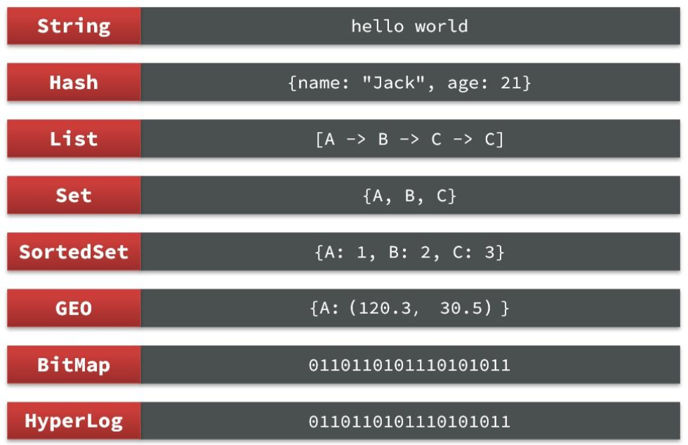

## Redis常用类型复习

常用类型数据案例

其中Zset（SortedSet）有序集合的底层数据结构，是当数据较少时使用的是hashtable + ziplist压缩列表，当数据较多时，使用的是hashtable + skiplist跳表。

使用ziplist还是skiplist受到元素的个数和元素的大小影响。

## JDhotKey架构分析

多级缓存，在MySQL + Redis的基础上，还增加了一层本地缓存Caffeine。

JDhotKey分为这么几个角色

业务服务端（客户端）、worker（服务端，热key分析，向客户端推送热key）、ETCO集群（服务注册的角色）

worker服务端根据在 JDhotKey 的 dashboard 里配置的规则，使用滑动窗口统计分析出热key，然后将热key推送给客户端，客户端就会将这个热key对应的数据缓存到本地缓存。