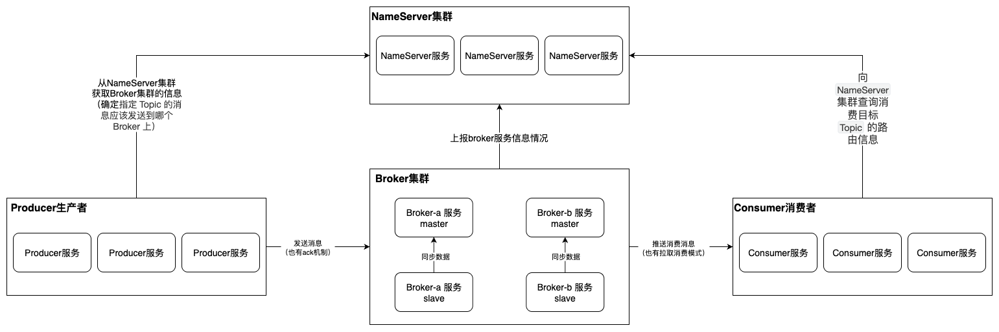

## MQ消息队列的主要3个用途

### 异步

提高系统的响应速度和吞吐量，发送消息后，无需持续等待消息消费。

例如：快递员送快递，只需要将快递放到驿站即可，无需一直等待客户过来拿快递，既能让快递员有更多时间送其他的快递，还能让客户在有时间的时候再去拿快递，无需一直等待耗费时间等快递员专门给自己送。

### 解耦

将一个复杂的系统进行解耦，减少服务之间的依赖，提高系统整体的稳定性和可扩展性。

例如：订单服务生成订单，还需要去请求库存服务、物流服务、消息服务。有了MQ之后，订单服务生成了订单之后，只需要发送一条消息，然后库存服务、物流服务、消息服务等监听这个消息即可，将整个系统进行了解耦。并且消息消费者的增加，对消息生产者是没有任何影响的。

### 削峰

RocketMQ 单机即可支持每秒十万级的消息处理能力。他可以将海量请求先接收下来，至于处理，可以慢慢来。

使后端服务不再直接面对海量请求，而是按照**自己最大的、能承受的处理能力**，匀速地从 RocketMQ 中拉取消息进行处理。

## MQ产品比对

| 产品     | 优点                                           | 缺点                         | 适合场景             |
| -------- | ---------------------------------------------- | ---------------------------- | -------------------- |
| Kafka    | 吞吐量非常大                                   | 会丢数据、功能单一           | 日志分析、大数据采集 |
| RabbitMQ | 可靠性高、功能全面                             | 吞吐量较低，使用的erlang语言 | 小规模服务调用       |
| RocketMQ | 高吞吐、高性能、高可用、功能全面，Java语言开发 | 服务加载比较慢               | 全场景               |

> 在阿里内部，RocketMQ集群每天处理的请求数超过5万亿次，天生就为金融互联网而生。

官网地址：http://rocketmq.apache.org

## RocketMQ的核心服务

RocketMQ由5个核心服务组成。

### NameServer（服务发现与路由中心）

**轻量级的发现与路由中心**，类似于 Nacos或ZooKeeper，但更简单、无状态。

1. **服务注册**：所有 Broker 启动时都会向所有的 NameServer 注册自己的信息（主题、队列、地址等）。
2. **路由管理**：为生产者和消费者提供最新的路由信息。客户端（Producer/Consumer）会从 NameServer 查询指定 Topic 的消息应该发送到哪个 Broker 上。

> **总结：** NameServer 就像一个“电话簿”或“路由器”，告诉客户端应该联系谁。

### Broker（代理服务）

**消息存储和传输的核心服务**。

**核心职责**：

1. **消息存储**：负责将生产者发送的消息持久化地存储到磁盘上。
2. **消息投递**：负责将消息推送给消费者（Push模式）或等待消费者来拉取（Pull模式）。
3. **高可用保证**：通过主从架构实现数据冗余。Master 负责处理读写请求，Slave 从 Master 同步数据，在 Master 宕机时提供读服务（并可自动切换为 Master）。

> **总结：** Broker 就像“邮局”的“分拣中心”和“仓库”，负责接收、存储和分发邮件（消息）。

### Producer（消息生产者）

**消息的发送方，业务的发起端**。是一个**客户端**，是集成在业务应用程序中的。

**核心职责**：

1. 创建消息。
2. 向 `NameServer` 查询目标 `Topic` 的路由信息。
3. 根据负载均衡策略，将消息发送到正确的 Broker 队列中。

> **总结：** Producer 就像“寄信人”，把写好的信（消息）投递到邮局（Broker）。

### Consumer（消息消费者）

**消息的接收和处理方，业务的消费端**。同样是一个**客户端**，也是集成在业务应用程序中的。

**核心职责**：

1. 向 `NameServer` 查询目标 `Topic` 的路由信息。
2. 从正确的 `Broker` 上拉取（Pull）或接收推送（Push）的消息。
3. 执行具体的业务逻辑处理消息（如：创建订单、发送短信等）。
4. 向 `Broker` 返回消费成功（ACK）或失败的状态。

> **总结：**Consumer 就像“收信人”，从邮局（Broker）取走属于自己的信（消息）并阅读处理。

### Dashboard（可视化管理服务）

整个MQ集群的可视化界面与运维管理界面。

**核心职责：**

1. **集群状态监控：** 可以查看到所有 NameServer、Broker（Master/Slave）的在线状态、版本信息等。

2. **主题（Topic）与消费组（Consumer Group）管理：**
   - 创建、删除、查询 Topic
   - 查看 Topic 的队列数量、消息堆积情况
   - 创建、删除、查询消费组
   - 监控每个消费组的消息消费情况、消费者客户端连接信息
3.  **消息追踪：** 可以根据 `Message ID` 或 `Message Key` 查询消息的轨迹，确认消息是否被发送成功，是被谁消费的，消费是否成功？有利于排查线上问题。
4. **消息查询**：可以直接查看队列中的消息内容。
5. **运维：** 手动触发消息消费位点重置（比如堆积了大量消息，想从最新位点开始消费）。

## 总结

