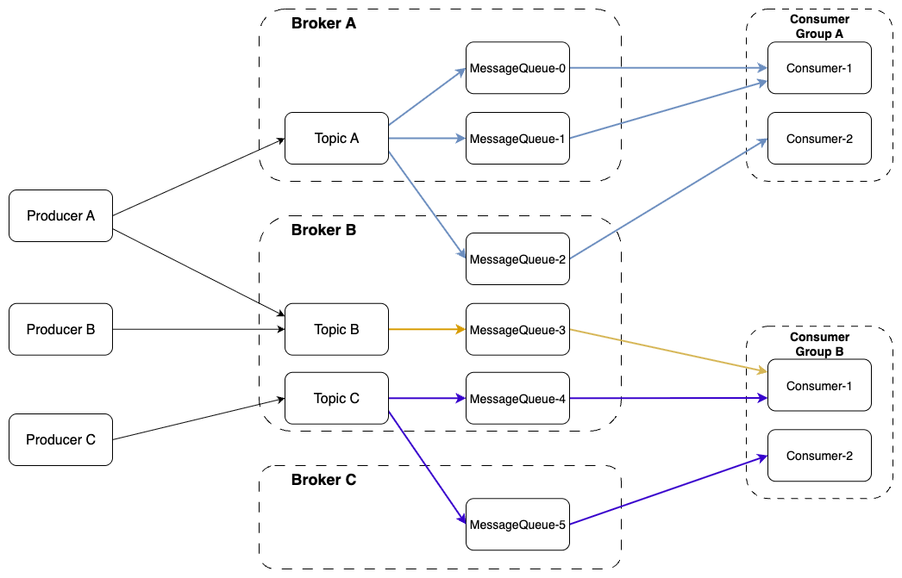

消息模型分为如下几个概念

生产者（Producer）发送指定主题的消息（Topic），消息存放在MessageQueue里。然后消息由监听了 Topic 主题的消费者去消费处理。


消费者组是什么？

**消费者组** 是一类**行为完全相同**的消费者的集合。这些消费者共同合作来消费同一个Topic下的消息。


Topic是逻辑概念

Message Queue是物理概念

一个 Topic 可以关联多个 MessageQueue ，而一个MessageQueue不能关联多个Topic。

一个 Topic 的多个Message Queue**不会被创建在同一个Broker上**。RocketMQ会自动将同一个Topic的Queue**均匀分布**到集群中的多个Broker上。


一个Consumer实例可以同时消费两个或多个Topic的消息

代码案例

```java
DefaultMQPushConsumer consumer = new DefaultMQPushConsumer("Consumer_Group_Name");
// 订阅第一个Topic，使用Tag过滤
consumer.subscribe("OrderTopic", "*"); // "*" 表示消费所有Tag的消息
// 订阅第二个Topic，可以指定更详细的Tag
consumer.subscribe("PaymentTopic", "SUCCESS || FAILED");

consumer.registerMessageListener(new MessageListenerConcurrently() {
    @Override
    public ConsumeConcurrentlyStatus consumeMessage(List<MessageExt> msgs, ConsumeConcurrentlyContext context) {
        for (MessageExt msg : msgs) {
            // 在消息体中可以通过 getTopic() 方法来判断消息来自哪个Topic
            String topic = msg.getTopic();
            switch(topic) {
                case "OrderTopic":
                    // 处理订单业务逻辑
                    System.out.println("收到订单消息: " + new String(msg.getBody()));
                    break;
                case "PaymentTopic":
                    // 处理支付业务逻辑
                    System.out.println("收到支付消息: " + new String(msg.getBody()));
                    break;
                default:
                    break;
            }
        }
        return ConsumeConcurrentlyStatus.CONSUME_SUCCESS;
    }
});

consumer.start();
```


