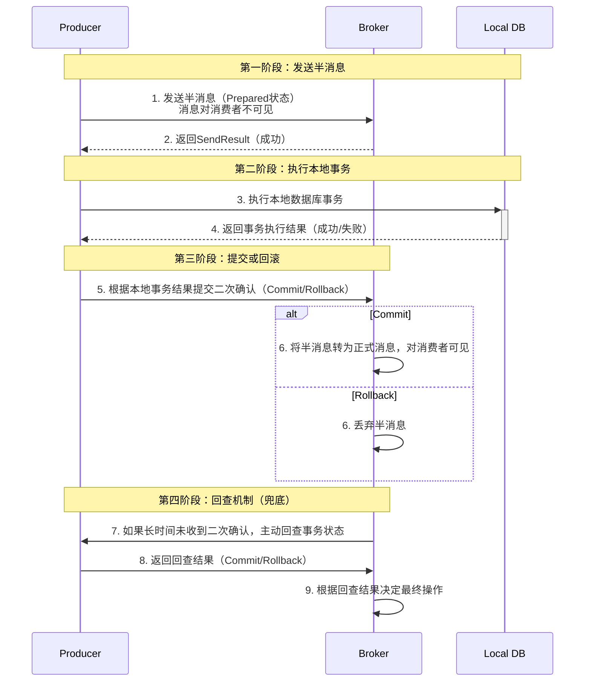

## 1. 广播消息

### 核心概念
- **定义**  ：一条消息被 **同一个消费者组（Consumer Group）下的所有消费者实例** 各消费一次。
- **对比集群模式**  ：
  - **集群模式 (CLUSTERING)**  ：默认模式。一条消息只会被组内的**某一个**消费者消费。用于负载均衡。
  - **广播模式 (BROADCASTING)**  ：一条消息会被组内的 **每一个消费者** 消费。用于通知所有节点。

### 工作原理
- Broker 将消息发送给订阅了该Topic的消费者组。
- 消费者组内的每个实例都会收到这条消息的副本，并独立处理。
- 消费进度（Offset）调整为在 **每个消费者实例本地** 存储（集群模式下消息的消费进度是有Broker进行维护的），因为每个实例的进度可能不同。

### 配置方式
```java
DefaultMQPushConsumer consumer = new DefaultMQPushConsumer("GROUP_NAME");
// 设置为广播模式 MessageModel.BROADCASTING
consumer.setMessageModel(MessageModel.BROADCASTING);
consumer.subscribe("TOPIC_NAME", "*");
```

### 应用场景
- **刷新本地缓存**  ：当配置信息更新时，通知所有服务节点刷新其本地缓存。
- **触发全局操作**  ：如“全体服务器下线维护”的通知。
- **日志记录**  ：所有节点都需要记录同一条操作日志用于审计。


## 2. 过滤消息

### 核心概念
- **定义**  ：消费者根据一定的条件（**Tag** 或 **SQL92属性**）来订阅自己感兴趣的消息，由 Broker 进行初步的过滤。（SQL语句会上传给Broker，然后由Broker进行数据过滤）

### 过滤方式
1.  **Tag 过滤**
    
    - **语法**  ：简单字符串匹配。支持 `||` (或) 操作符。
    - **示例**  ：`consumer.subscribe("TopicTest", "TagA || TagC");`

2.  **SQL92 过滤**
    - **语法**  ：通过消息的消费者所设置的SQL过滤条件，由Broker进行消息筛选，然后将消息发送给消费者。
    
    - **示例**  ：
        
        ```java
        // 生产者：设置属性
        Message msg = new Message("TopicTest", "TagA", "Hello World".getBytes());
        msg.putUserProperty("a", "10");
        msg.putUserProperty("b", "2");
        // 消费者：SQL过滤
        consumer.subscribe("TopicTest", MessageSelector.bySql("a > 5 AND b < 10"));
        ```

### 应用场景
- **Tag过滤**  ：通用场景，如将消息分为“下单”、“支付”、“退款”等类型（同一类，但是不同状态的场景），消费者按需订阅。
- **SQL过滤**  ：复杂场景，如消费金额大于100元的订单消息，或者特定业务编号的消息。


## 3. 顺序消息机制

### 核心概念
- **定义**  ：保证消息在 **同一个MessageQueue队列** 内被**顺序生产**和 **顺序消费**。（如果要全局顺序，那就只能让所有消息一个队列里生产和消费）
- **重要限制**  ：顺序性不是全局的，而是针对 **`Sharding Key`** (如订单ID) 的。不同订单的消息之间是并行的。

### 工作原理
1.  **顺序发送**  ：
    
    - 生产者使用 `MessageQueueSelector` 将**同一组**消息（如同一个订单ID的消息）发送到**同一个 MessageQueue**。
    ```java
    SendResult sendResult = producer.send(msg, new MessageQueueSelector() {
        @Override
        public MessageQueue select(List<MessageQueue> mqs, Message msg, Object arg) {
            // arg 通常是订单ID、用户ID等Sharding Key
            Integer id = (Integer) arg;
            // 可以保证相同Key总是选到同一个队列
            int index = id % mqs.size(); 
            return mqs.get(index);
        }
    }, orderId); // 传入Sharding Key
    ```
    
2.  **顺序消费**  ：
    - 消费者使用 `MessageListenerOrderly` 监听器。
    - Broker 会将**一个 Queue** 的消息**锁住**，每次只分配给**消费者组内的一个消费者实例**处理。
    - 该消费者会串行地消费这个 Queue 上的所有消息。
    - 如果某条消息消费失败，会不断重试，**阻塞**该队列后续所有消息的处理。

### 应用场景
- **订单状态流**  ：创建订单 -> 订单付款 -> 订单发货，这些消息必须按顺序处理。
- **数据实时同步**  ：先增后改，必须先处理“增”再处理“改”。

### 注意事项
- **性能代价**  ：牺牲了并行性。一个 Queue 只能被一个消费者线程处理，如果大量消息的 Key 集中在某个 Queue，会成为性能瓶颈。


## 4. 延迟消息

### 核心概念
- **定义**  ：消息被生产者发送到 Broker 后，不会立即被消费者消费，而是需要**等待一段指定的时间**后才会被投递。

### 工作原理
- RocketMQ 不支持任意时间的延迟，而是预设了 **18 个固定的延迟级别**。
- **原理**  ：Broker 内部有相应的延迟主题（`SCHEDULE_TOPIC_XXXX`）和定时器。消息先被存入指定延迟级别的队列，时间到后，再被投递到真实的目标Topic。

### 配置与使用
1.  **设置延迟级别**（在消息发送时设置）：
    ```java
    Message message = new Message("TopicTest", "TagA", "Hello RocketMQ".getBytes());
    // 设置延迟级别为3，对应延迟10s
    message.setDelayTimeLevel(3);
    producer.send(message);
    ```

    > **默认延迟级别**  ：
    >
    > ```
    > // 级别1 -> 1秒，级别2 -> 5秒，级别3 -> 10秒，...，级别18 -> 2小时
    > 1s, 5s, 10s, 30s, 1m, 2m, 3m, 4m, 5m, 6m, 7m, 8m, 9m, 10m, 20m, 30m, 1h, 2h
    > ```

2. **指定消息发送时间**

   ```java
   Message message = new Message("TopicTest", ("Hello scheduled message " + i).getBytes(StandardCharsets.UTF_8));
   // 指定10秒之后的时间点
   message.setDeliverTimeMs(System.currentTimeMillis() + 10_000L);
   ```

### 应用场景

- **定时任务**  ：如订单下单后30分钟未支付，自动触发取消逻辑。
- **重试策略**  ：消费失败后，延迟一段时间再进行重试（优于立即重试）。


## 5. 批量消息

### 核心概念
- **定义**  ：将**多条小消息**合并成一个**批量消息**一次性发送给 Broker，以减少网络调用次数，显著提升吞吐量。

### 使用方法
```java
String topic = "BatchTest";
List<Message> messages = new ArrayList<>();
messages.add(new Message(topic, "TagA", "OrderId001:Create".getBytes()));
messages.add(new Message(topic, "TagA", "OrderId002:Create".getBytes()));
messages.add(new Message(topic, "TagA", "OrderId003:Create".getBytes()));

// 使用producer.send()方法发送一个集合
SendResult sr = producer.send(messages);
```

### 最佳实践
- **拆分批量**  ：如果一批消息总大小可能超过 `4MB`（默认最大消息大小），必须自行拆分成多个小于4MB的批次，否则会发送失败。
- **性能权衡**  ：批量发送会增加单次调用的延迟（因为要攒批），但极大提高了吞吐量。适合日志收集等对实时性要求不高的场景。

### 应用场景
- **日志传输**  ：将大量日志消息批量发送到消息队列。
- **数据同步**  ：同步数据库变更记录时，按批次同步。


## 6. 事务消息

### 核心概念
- **定义**  ：用于解决**消息发送**与**本地事务执行**的**最终一致性**问题。确保本地事务成功执行后，消息一定能被投递；本地事务失败，消息会被丢弃。

### 两阶段提交流程



### 关键机制
- **事务回查**  ：如果生产者宕机或网络问题导致Broker未收到二次确认（Commit/Rollback），Broker会主动回调生产者的一个接口来查询事务的最终状态。生产者需要实现 `TransactionListener` 接口来处理回查。

### 代码结构
```java
// 1. 创建事务生产者
TransactionMQProducer producer = new TransactionMQProducer("group_name");
// 2. 设置事务监听器（核心）
producer.setTransactionListener(new TransactionListener() {
    @Override
    public LocalTransactionState executeLocalTransaction(Message msg, Object arg) {
        // 执行本地事务，返回UNKNOW/COMMIT_MESSAGE/ROLLBACK_MESSAGE
        return LocalTransactionState.UNKNOW;
    }

    @Override
    public LocalTransactionState checkLocalTransaction(MessageExt msg) {
        // Broker回查事务状态，返回COMMIT_MESSAGE/ROLLBACK_MESSAGE
        return LocalTransactionState.COMMIT_MESSAGE;
    }
});
// 3. 发送事务消息
TransactionSendResult sendResult = producer.sendMessageInTransaction(msg, null);
```

### 应用场景
- **分布式事务**  ：最经典的场景是“下单扣库存”，需要保证扣减本地数据库库存和发送“扣减成功”消息这两个操作的一致性。
- **最终一致性场景**  ：所有需要保证本地操作和后续通知最终一致的业务流。

### 注意事项
- **消息消费可能重复**  ：事务消息保证的是消息一定投递，但消费端可能收到重复消息（如提交Commit后网络闪断，Broker未收到响应会触发回查再次Commit），因此消费者需要做好 **幂等处理**。