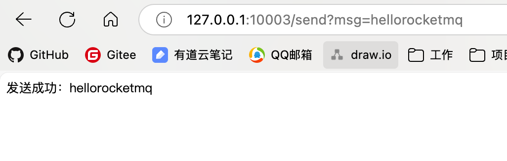
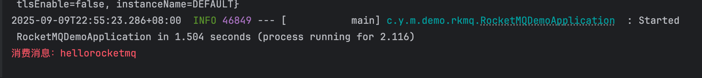
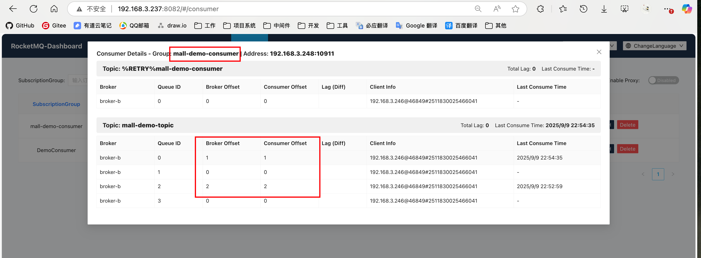

组件版本

| 组件                         | 版本    | 备注                           |
| ---------------------------- | ------- | ------------------------------ |
| jdk                          | 17.0.15 | 环境版本                       |
| spring-boot-dependencies     | 3.4.7   | SpringBoot版本                 |
| rocketmq-spring-boot-starter | 2.3.4   | SpringBoot封装集成RocketMQ版本 |
| rocketmq-client              | 5.3.0   | RocketMQ客户端版本             |


核心依赖如下

```xml
				<dependency>
            <groupId>org.springframework.boot</groupId>
            <artifactId>spring-boot-starter-web</artifactId>
        </dependency>

        <dependency>
            <groupId>org.apache.rocketmq</groupId>
            <artifactId>rocketmq-spring-boot-starter</artifactId>
						<version>2.3.4</version>
            <exclusions>
                <exclusion>
                    <groupId>org.apache.rocketmq</groupId>
                    <artifactId>rocketmq-client</artifactId>
                </exclusion>
            </exclusions>
        </dependency>

        <dependency>
            <groupId>org.apache.rocketmq</groupId>
            <artifactId>rocketmq-client</artifactId>
          	<version>5.3.0</version>
        </dependency>
```


配置信息如下

```yaml
server:
  port: 10003

rocketmq:
	# nameserver服务地址
  name-server: 192.168.3.237:9876
  # 生产者组
  producer:
    group: mall-demo-producer
  # 消费者组
  consumer:
    group: mall-demo-consumer
```


启动类

```java
package com.yz.mall.demo.rkmq;

import org.springframework.boot.SpringApplication;
import org.springframework.boot.autoconfigure.SpringBootApplication;

/**
 * @author yunze
 * @since 2025/9/7 14:00
 */
@SpringBootApplication
public class RocketMQDemoApplication {

    public static void main(String[] args) {
        SpringApplication.run(RocketMQDemoApplication.class, args);
    }
}
```


生产者

```java
package com.yz.mall.demo.rkmq;

import jakarta.annotation.Resource;
import org.apache.rocketmq.spring.core.RocketMQTemplate;
import org.springframework.stereotype.Component;


/**
 * @author yunze
 * @since 2025/9/9 21:45
 */
@Component
public class MallProducer {

    @Resource
    private RocketMQTemplate rocketMQTemplate;

    public void send(String msg) {
        rocketMQTemplate.convertAndSend("mall-demo-topic", msg);
    }
    
}
```


消费者

```java
package com.yz.mall.demo.rkmq;

import org.apache.rocketmq.spring.annotation.RocketMQMessageListener;
import org.apache.rocketmq.spring.core.RocketMQListener;
import org.springframework.stereotype.Component;

/**
 * @author yunze
 * @since 2025/9/9 22:49
 */
@Component
@RocketMQMessageListener(topic = "mall-demo-topic", consumerGroup = "mall-demo-consumer")
public class MallConsumer implements RocketMQListener<String> {

    @Override
    public void onMessage(String s) {
        System.err.println("消费消息：" + s);
    }
}

```


测试接口

```java
package com.yz.mall.demo.rkmq;

import org.springframework.web.bind.annotation.RequestMapping;
import org.springframework.web.bind.annotation.RestController;

/**
 * @author yunze
 * @since 2025/9/9 21:48
 */
@RequestMapping
@RestController
public class DemoController {

    private final MallProducer mallProducer;

    public DemoController(MallProducer mallProducer) {
        this.mallProducer = mallProducer;
    }

    @RequestMapping("/send")
    public String send(String msg) {
        mallProducer.send(msg);
        return "发送成功：" + msg;
    }
}

```


测试结果







消费者消费情况




注意事项

如果在同一个服务里想用多个消费者消费同一个 Topic 的的消息，则需要将其设置为不同的消费者组。否则会导致当前服务不再消费这个 Topic 的消息。

