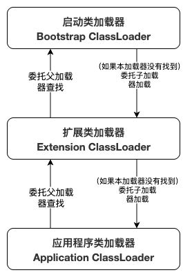
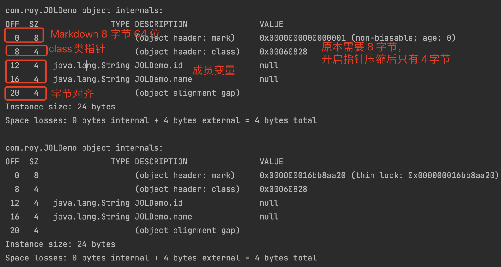

## 字节码指令

invokestatic调用静态方法（static 方法）。

invokevirtual调用对象的实例方法，根据对象的实际类型进行分派（虚拟方法分派），受到父类方法重载的影响。

invokeinterface调用接口方法，在运行时会搜索一个实现了这个接口方法的对象，找到合适的方法进行调用。

invokespecial指令⽤于调⽤⼀些需要特殊处理的实例⽅法，包括实例初始化⽅法私有⽅法(statis {xxxx})和⽗类⽅法（spuer.xxx）


## 类加载

### 类加载器（ClassLoader）

类加载器负责在**运行时**将Java类（`.class`文件中的字节码）加载到JVM内存中（非堆区，MetaSpace元空间）。

加载过的类会进行缓存。


类加载器主要做三件事：

1. **加载**：查找并导入二进制字节流（`.class`文件）。
2. **链接**：
   - **验证**：确保被加载的类是正确的、符合JVM规范的，不会危害JVM的安全。
   - **准备**：为类的**静态变量**分配内存并 **设置默认初始值** （零值或空字符串）。（ **此时还是半初始化状态** ）（如果该变量有标记 `final` ，则表示永远不会变，在初始化是JVM会直接将设置的值赋值给变量，不会再默认的初始值）（目的是占内存）
   - **解析**：将类中的符号引用转换为直接引用。（因为在 "准备" 步骤之前，类是还没有内存地址的，所以是符号引用，有了内存地址后，类间的调用，就是直接指向内存地址了，变成了直接引用）
3. **初始化**：执行类的初始化代码（即静态代码块 `static {}` 和静态变量的显式赋值）。


> 类的初始化和对象的初始化要区分清楚。
>
> 对象的初始化，是执行构造方法。
>
> 类的初始化，是执行 `static {}` 和 `静态变量的显式赋值` 。
>
> 


总结：就是将磁盘上的`.class`文件“搬”到 JVM 里，并转换成JVM能够识别和使用的数据结构。


### 双亲委派机制

**核心：** 向上委托查找，向下委托加载。

JVM采用了 **双亲委派模型** 的层次结构来组织类加载器。主要有以下三类：

#### 1. 启动类加载器（Bootstrap ClassLoader）

- **角色**：最高级别的类加载器，是JVM自身的一部分（由C++实现）。
- **职责**：负责加载Java的核心类库，如 `%JAVA_HOME%/lib` 目录下的 `rt.jar`、`resources.jar` 等。这些是Java运行的基础（例如 `java.lang.*` 包下的类）。
- **特点**：它是所有其他类加载器的“父”加载器。它无法被Java程序直接引用。

#### 2. 扩展类加载器（Extension ClassLoader）

- **角色**：由Java语言实现（`sun.misc.Launcher$ExtClassLoader`）。
- **职责**：负责加载Java的扩展库，通常是 `%JAVA_HOME%/lib/ext` 目录下的jar包，或者由 `java.ext.dirs` 系统变量指定的路径下的类库。
- **特点**：它的父加载器是Bootstrap ClassLoader。

#### 3. 应用程序类加载器（Application ClassLoader）

- **角色**：同样由Java实现（`sun.misc.Launcher$AppClassLoader`）。
- **职责**：负责加载**用户类路径（ClassPath）** 上指定的类库。我们自己编写的Java类以及项目依赖的第三方jar包，基本上都是由它来加载的。
- **特点**：它是程序中默认的类加载器。它的父加载器是Extension ClassLoader。


#### 工作流程

1. 当一个类加载器收到类加载请求时，它**首先不会自己去尝试加载**。
2. 它会将这个请求**委派给父类加载器**去完成。
3. 每一层的类加载器都会如此向上委派，直到传送到顶层的Bootstrap ClassLoader。
4. 只有当**父类加载器反馈自己无法完成这个加载请求**（因为在它的搜索范围中没有找到所需的类）时，子加载器才会尝试自己去加载。





### 沙箱保护机制

要保护JDK内部的核⼼类不会被应⽤覆盖。

不允许其他类加载器加载 `java.` 的类。


## 类和对象的关系

class类加载后就放到了MetaSpace元空间（非堆区）（加载到类加载器里面后基本上就用不到了），new出来的对象存放在堆里面（对象需要进行频繁调用）。


### class在metaspace的样子

添加依赖

```xml
<dependency>
    <groupId>org.openjdk.jol</groupId>
    <artifactId>jol-core</artifactId>
    <version>0.17</version>
</dependency>
```


实现代码

```java
public class JOLDemo {
    private String id;
    private String name;
		
  	public static void main(String[] args) {
				JOLDemo o = new JOLDemo();
				System.out.println(ClassLayout.parseInstance(o).toPrintable());
				synchronized (o){
						System.out.println(ClassLayout.parseInstance(o).toPrintable());
				}
		}
}
```


运行结果




加锁操作的是class的header: mark


#### 分配内存

指针碰撞（默认用指针碰撞）：如果java堆中的内存是绝对规整的（一个对象的内存区域接着一个内存区域这样），所有用过的内存放到一边，空闲的内存放到另一边，中间放着一个指针作为分界点的指示器，那所分配的内存就仅仅是吧指针向空闲区域挪动一段与对象大小相等的距离。

空闲列表：如果java堆中的内存并不是规整的，已使用的内存的空闲的内存相互交错，那就没办法简单的进行指针碰撞了，虚拟机就必须维护一个列表，记录上哪些内存是可用的，在分配的时候从列表中找到一块足够大的空间划分给对象实例，并更新列表上的记录；


**对象头（Object Header）：**

1. Mark Word标记字段（32位占4字节，64位占8字节）：用于存储运行时的数据：哈希值、GC分代年龄、锁状态标识、线程持有锁、偏向线程ID、偏向时间戳
2. Klass Pointer类型指针（开启压缩占4字节，关闭压缩占8个字节）
3. 数组长度（4个字节，只有数组对象才有）


**对象的指针压缩：** 对象头里的Kclass Pointer类型指针和对象（Object、String等）默认开启压缩是占用4个字节，关闭压缩之后占8个字节，如果不开启指针压缩，对象全部放到堆里，同等大小下堆里能存放的对象要少很多（大概1.5倍），也越容易触发gc；（JDK1.6以后默认开启指针压缩）


**对齐填充：** 对于大部分处理器，对象以8个字节整数倍来对齐填充都是最高效的存取方式。
