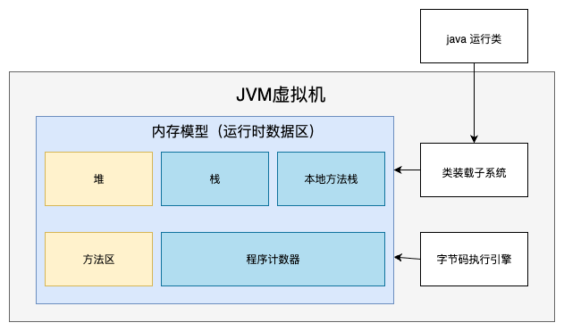
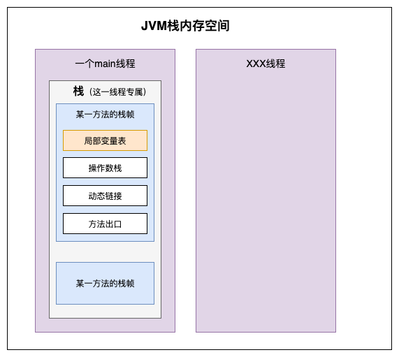
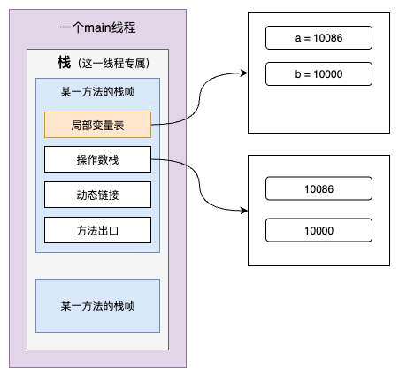
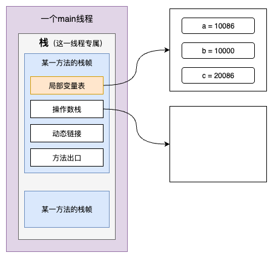
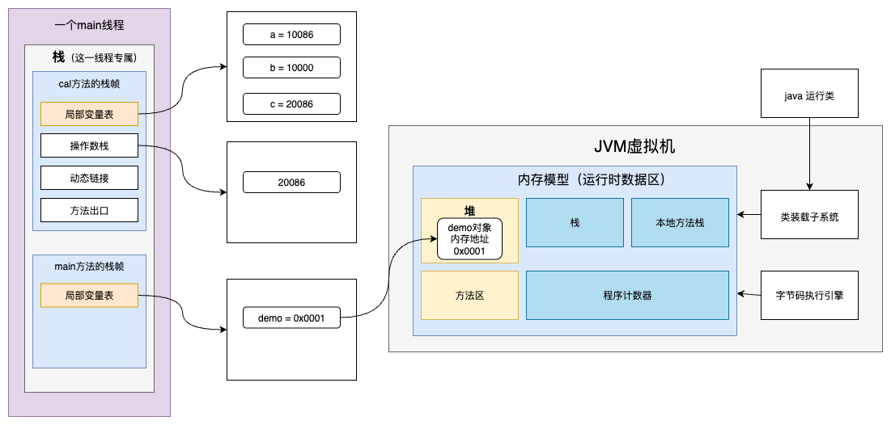

## JVM内存模型



其中堆和方法区是所有线程共享的。

栈、本地方法栈、程序计数器是每个线程都有的。


## 栈

只要开始一个线程，就会在 **JVM虚拟机的栈内存空间 ** 里开辟一个小空间，专门用于存这个线程的局部变量等。




线程栈空间里，还会给每个执行的方法分配一个栈帧内存空间，在这个内存空间里，会存储这个方法的局部变量。


栈的数据结构是先进后出，后进先出。契合代码的调用执行顺序，后调用的代码是先执行的。执行完之后，释放内存空间，就对应着栈数据结构的出栈操作，就契合了后进先出。


### 局部变量表

局部变量表类似于数组结构。

用于存放方法的局部变量。（顺便解决了变量的作用范围）


### 程序计数器

每个线程都有一个程序计数器，记录当前线程执行到的代码位置。

每次执行都是需要CPU资源的，而在本线程执行的中途，CPU资源被其他线程占用了，那么等下次执行本线程代码时，从哪里执行呢？不能重头重新执行，需要从上次中止的代码地址继续往下执行，程序计数器就是用来记录执行到的代码行数，每执行一行代码， 字节码执行引擎就会去更新程序计数器记录的数据。


### 操作数栈

在程序运行中，要进行操作计算的临时运行空间。

```java
public static void main(String[] args) {
  	int a = 10086;
  	int b = 10000;
  	int c = a + b;
  	System.out.println("c：" + c);
}
```



如上图，在进行 `a + b` 运算时，会将a和b变量的值放入 `操作数栈` ，然后计算的结果20086，也会先临时存放在操作数栈里，有因为计算结果是赋值给变量c，则会在 `局部变量表` 里给变量c分配一个内存空间，然后将计算结果20086从操作数栈进行出栈，赋值给变量c（如下图）。



 


### 动态链接

将符号引用转为直接引用。

将代码的符号调用转为内存地址调用。

方法名对应的内存地址就是存放在 **动态链接** 里。


### 方法出口

记录调用方法后，在方法执行完，回到本方法后，继续从哪一行代码执行。

如下示例代码，在执行demo.cal()方法的时候，就将cal方法执行完后要继续执行的代码位置，存放在了 **方法出口** 。

```java
public static void main(String[] args) {
  	int a = 10086;
  	int b = 10000;
  	Demo demo = new Demo();
  	int c = demo.cal(a, b);
  	System.out.println("c：" + c);
}

publuc class Demo {
  	public int cal(int a, int b) {
				int c = a + b;
      	return c;
    }
}
```


## 堆

这段代码里的new的Demo对象，demo变量名是存放在 **main方法栈帧的局部变量表** 里的，实际的Demo对象是存放在 **堆内存** 里，然后demo变量记录的是Demo对象在堆内存里的地址。

```java
public static void main(String[] args) {
  	Demo demo = new Demo();
  	int c = demo.cal();
  	System.out.println("c：" + c);
}

publuc class Demo {
  	public int cal(int a, int b) {
				int a = 10086;
  			int b = 10000;
				int c = a + b;
      	return c;
    }
}
```




## 方法区

主要用于常量（在**编译期**就确定的各种字面量和符号引用）、静态变量、类信息。

### 常量

- **字面量**：文本字符串（`String`）、被声明为`final`的常量值。
- **符号引用**：类和接口的全限定名、字段的名称和描述符、方法的名称和描述符。

### 静态变量

被 `static` 修饰的变量， **静态变量的引用** ，例如 `static MyClass obj = new MyClass();` 

那么对象实例本身是存储在**堆**中的，而对这个对象的静态引用 `obj` 是存储在方法区的。

### 类信息

- **类型信息**：类的全限定名、它的直接父类的全限定名、类的类型（是普通类还是接口）、类的访问修饰符（`public`, `abstract`, `final`等）。
- **方法的元数据**：方法名、方法的返回类型、参数数量和类型、方法的访问修饰符、方法的字节码、异常表等。
- **字段的元数据**：字段名、字段类型、字段的访问修饰符。


## 本地方法栈

是C语言实现的方法专属使用的内存空间


## 调优

主要目的是减少full gc的次数和每次STW（stop the world）的时间。

STW期间，系统不可用。
