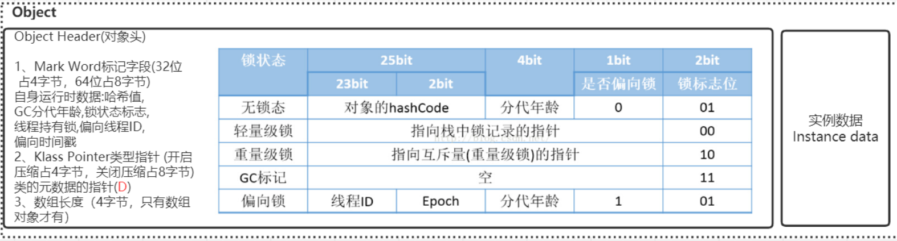
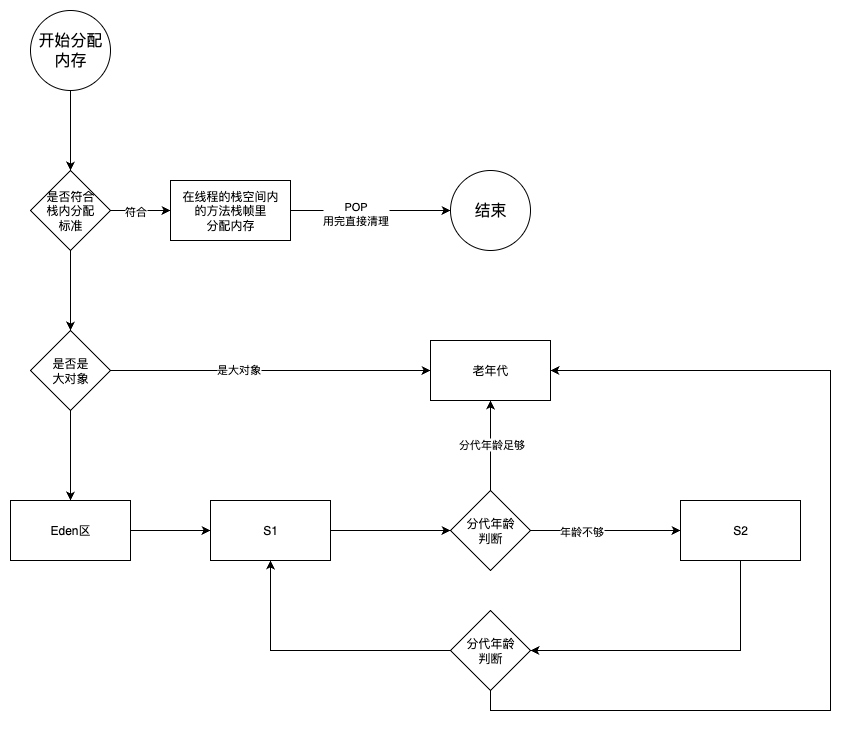
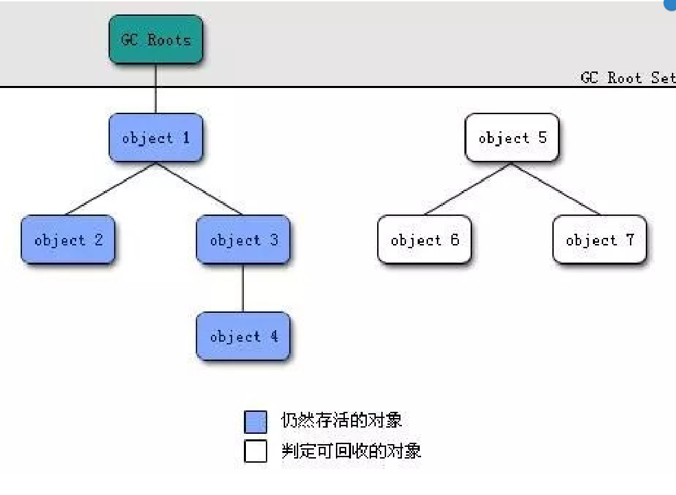

## 对象的创建流程

类加载检查-->加载类-->分配内存-->初始化-->设置对象头-->执行init方法

### 类加载检查

JVM收到new的指令时，去检查 **类文件常量池** 里的 **符号引用** ，<u>如果这个对象有引用其他的对象，就会先暂停本对象的创建，先去创建引用的对象</u> （如果这个引用对象的类还没有被加载、解析、初始化，就需要先执行类加载过程）。

关于常量池的概念可参考《  [JVM 中的常量池到底在哪儿](../../../java/210.JVM 中的常量池到底在哪儿.md)  》

### 1. 加载类

使用类加载器将class文件加载到方法区里。

### 2. 分配内存

在 **类加载检查** 通过后，虚拟机会为新生的对象分配内存。

对象所需内存的大小在类加载完成后便可以确定，为对象分配空间的任务等同于把一块确定大小的内存从Java堆中划分出来。

> 一般情况下对象是存放在堆里面的。
>
> 特定情况下对象也会存放在栈空间里，如果对象较小，且线程的方法栈空间也足够。具体可查看《对象的逃逸分析》

内存的分配方法有以下两种：指针碰撞（默认）和空间列表。

#### 指针碰撞（默认）

如果Java堆中内存是绝对规整的， **所有用过的内存都放在一边，空闲的内存放在另一边，中间放着一个指针作为分界点的指示器** ，那所分配内存就仅仅是把那个指针向空闲空间那边挪动一段与对象大小相等的距离。

#### 空间列表

如果Java堆中的内存并不是规整的，已使用的内存和空 闲的内存相互交错，那就没有办法简单地进行指针碰撞了， **虚拟机就必须维护一个列表，记录上哪些内存块是可用的，在分配的时候从列表中找到一块足够大的空间划分给对象实例，并更新列表上的记录** 。

#### 并发分配内存问题

采用 **CAS（无锁的原子操作）** 加 **失败重试** 的方式保证更新操作的原子性来对分配内存空间的动作进行同步处理

**举个例子**

```
AtomicInteger count = new AtomicInteger(0);

// CAS 操作：期望 count 是 0，如果是，就设为 1
count.compareAndSet(0, 1);
```

- 线程1读取 `count = 0`，期望用 CAS 将其改为 1。
- 线程2也读取 `count = 0`，也想改为 1。
- 假设线程1先执行 CAS：
  - 内存值 == 预期值（0 == 0）→ 更新为 1，成功。
- 线程2再执行：
  - 内存值是 1，但预期值是 0 → 不相等 → 更新失败。
- 线程2可以选择重试（循环 CAS）。


### 3. 初始化

内存分配完成后，虚拟机需要将分配到的内存空间都初始化为零值。（不是代码里赋的值）

这一操作让对象的实例字段在Java代码中可以不赋初始值就直接使用，程序能访问到这些字段的数据类型所对应的零值。

### 4. 设置对象头

初始化零值之后，虚拟机还要对对象进行必要的设置，这个对象是哪个类的实例、如何才能找到类的元数据信息、对象的哈希码、对象的GC分代年龄、锁标识等信息。这些信息存放在对象的对象头Object Header之中。



### 5. 执行 `<init>()` 方法

执行 `<init>方法` ，即对象按照程序员实现代码的逻辑进行初始化。

就是为属性赋值，和执行构造方法。


## 对象头与指针压缩

启用指针压缩(默认开启): `-XX:+UseCompressedOops`

禁止指针压缩:­ `-XX:­UseCompressedOops`

在64位平台的HotSpot中使用32位(4字节)指针，内存使用会多出1.5倍左右，使用较大指针在主内存和缓存之间移动数据，占用较大宽带，同时GC也会承受较大压力。

**指针压缩目的就是节约内存，为了在相同的堆内存空间里可以存放更多的对象。**

压缩后是4个字节，没有压缩是8个字节。


## 对象内存的分配



正常理解下，对象都是在堆上进行分配内存空间的，当对象没有被引用的时候，是依靠GC进行回收内存，而当对象的数量比较多的时候，会给GC带来较大的压力，间接影响了应用的性能。

JVM就通过  `逃逸分析` **确定该对象不会被外部方法访问** ， 就可以将该对象 **在栈上分配内存** 。

该对象所占用的内存空间就会随着栈帧出栈而销毁，就减轻了垃圾回收的压力。


### 对象逃逸分析

就是分析对象动态作用域，当一个对象在方法中被定义后，它可能被外部方法所引用，例如作为调用参
数传递到其他地方中。

过开启逃逸分析参数：`-XX:+DoEscapeAnalysis`

关闭逃逸分析参数：`-XX:-DoEscapeAnalysis`


例子：

```java
public User test1() {
  User user = new User();
  user.setId(1001);
  user.setName("zhangsan");
  return user;
}
```


```java
public void test2() {
  User user = new User();
  user.setId(1001);
  user.setName("zhangsan");
}
```


上面两端代码中，test1里的user对象有返回给其他地方使用，所以就说明这个user对象逃出了test1方法的作用域，只能分配到堆空间里。

test2中的user对象的作用域仅限于test2方法里，所以可以将这个user对象分配到test2方法的栈帧空间里，会随着test2方法执行完毕而清理。

减少gc压力，线程栈空间用完就直接清理了（jdk7以后默认开启）。


### 标量替换

如果确定了该对象不会被外部访问，但是栈空间不足怎么办呢？

JVM会将这个对象里的成员变量，分解为若干被这个方法使用的成员变量所代替（如int，long等基本数据类型以及reference类型的成员变量），这些代替的成员变量在栈帧或寄存器上分配空间。这个操作就叫 **标量替换** 。

开启标量替换参数（JDK7之后默认开启）：`-XX:+EliminateAllocations` 


## 对象在Eden区分配

一般情况下，对象都是在新生代中 **Eden 区** 分配。当 Eden 区没有足够空间进行分配时，虚拟机会发起一次 **Minor GC** 。

**Minor GC** 和 **Full GC** 有什么不同呢？
**Minor GC/Young GC：** 指发生新生代的的垃圾收集动作，Minor GC非常频繁，回收速度一般也比较快。
**Major GC/Full GC：** 一般会回收老年代 ，年轻代，方法区的垃圾，Major GC的速度一般会比Minor GC的慢
10倍以上。


> Eden与Survivor区默认8:1:1
>
> 新生代的对象都是朝生夕死的，存活时间很短，让eden区尽量的大，survivor区够用即可。
>
> eden区够大，发生Young GC的次数就少，朝生夕死的新生代对象，进入survivor区的对象不会多，所以survivor区不用很大，够用即可。


### 大对象直接进入老年代

大对象就是需要大量连续内存空间的对象（比如：字符串、数组）。

JVM参数 `-XX:PretenureSizeThreshold` 可以设置大对象的大小，如果对象超过设置大小会直接进入老年代，不会进入年轻代，这个参数只在 **Serial** 和 **ParNew** 两个收集器下有效。
比如设置JVM参数：`-XX:PretenureSizeThreshold=2000000 -XX:+UseSerialGC` （单位是字节） ，再执行下面的程序会发现大对象直接进了老年代。

```java
public static void main(String[] args) throws InterruptedException {
	byte[] allocation1, allocation2, allocation3, allocation4, allocation5, allocation6;
  allocation1 = new byte[60000*1024];

  allocation2 = new byte[8000*1024];

  allocation3 = new byte[1000*1024];
  allocation4 = new byte[1000*1024];
  allocation5 = new byte[1000*1024];
  allocation6 = new byte[1000*1024];
}
```


为什么要这样呢？

避免为大对象分配内存时的复制操作而降低效率。从eden区复制到survivor区，然后在survivor的两个区一直复制过来复制过去，积攒分代年龄，这样效率很低。


### 对象内存回收

堆中几乎放着所有的对象实例，对堆垃圾回收前的第一步，需要去判断哪些对象，已经不再被任何途径区引用。

#### 引用计数法

给对象中添加一个引用计数器，每当有一个地方引用它，计数器就加1；当引用失效，计数器就减1；任何时候计数器为0的对象就是不可能再被使用的。

**简单高效，但是没用，不好解决对象之间相互循环引用的问题。**


#### 可达性分析算法

将 **GC Roots** 对象作为起点，从这些节点开始向下搜索引用的对象，找到的对象都标记为非垃圾对象，其余未标记的对象都是垃圾对象。

GC Roots根节点：线程栈的本地变量、静态变量、本地方法栈的变量等等。


