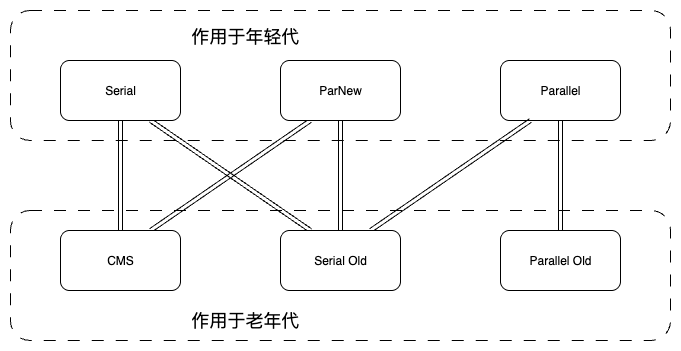
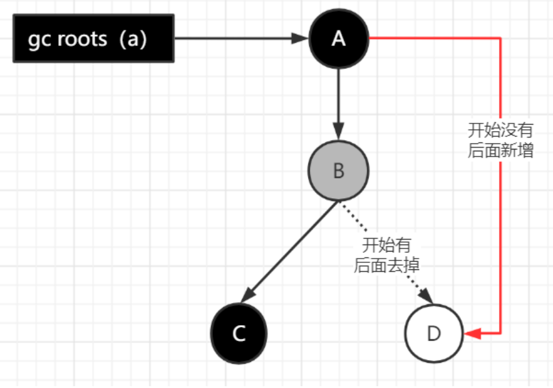
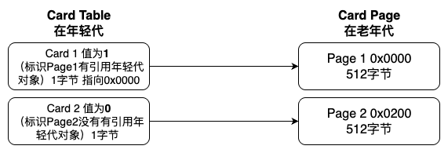
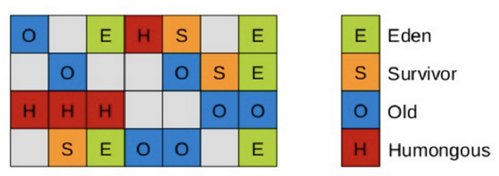

## 垃圾收集算法

### 分代收集理论

当前虚拟机的垃圾收集都采用分代收集算法，根据对象存活周期的不同将内存分为几块。

java堆分为新生代和老年代，可以根据各个年代的特点选择合适的垃圾收集算法。

> 新生代的特点是 "朝生夕死"。
>
> 老年代的特点是 "长生久居"。


### 标记-复制算法

将内存分为大小相同的两块，每次使用其中的一块。当这一块的内存使用完后，就将还存活的对象复制到另一块去，然后再把使用的空间一次清理掉。

缺点浪费空间，会浪费一半的空间，所以老年代不用。

### 标记-清除算法

标记存活的对象， 统一回收所有未被标记的对象。

比较简单，但是会存在两个明显的问题：

1. 会产生大量的不连续内存碎片
2. 要标记的对象太多，效率不高

### 标记-整理算法

根据老年代的特点特出的一种标记算法，标记过程仍然与 “标记-清除” 算法一样，但后续步骤不是直接对可回收对象回收，而是让所有存活的对象向一端移动，然后直接清理掉端边界以外的内存。避免产生内存碎片。


## 垃圾回收器



连线的代表可以组合使用。

### Serial

单线程收集器，它只会使用一条垃圾收集线程去完成垃圾收集工作。

**新生代采用复制算法，老年代采用标记-整理算法。**

启用配置

```bash
-XX:+UseSerialGC -XX:+UseSerialOldGC
```

简单而高效，Serial收集器由于没有线程切换的开销，可以获得极致的单线程收集效率。

Serial Old收集器是Serial收集器的老年代版本，当下其主要作用是作为CMS收集器的后备方案。

（当CMS出现 "concurrent mode failure" 时，就会进入 STW ，停止一切任务，使用Serial Old收集器进行垃圾回收）


### Parallel

相当于是Serial收集器的多线程版本，默认的收集线程数跟cpu核数相同。

Parallel Scavenge收集器关注点是吞吐量（高效率的利用CPU），就是在一个时间段内，CPU用在业务代码上的时间尽可能的多，所以在执行垃圾收集的时候，希望用所有的CPU资源去尽可能快的完成垃圾收集（长期小痛不如短期大痛一下）。

Parallel适合2~3g左右小内存项目使用，STW时间较长。

在现参与系统里进行一次fullgc，一般耗时1.5秒左右，多的时候大概花了4秒左右。

**新生代采用复制算法，老年代采用标记-整理算法。**

启用配置

```bash
-XX:+UseParallelGC -XX:+UseParallelOldGC
```


### ParNew

**作用于新生代，采用复制算法**，跟Parallel收集器类似，但它可以和CMS收集器配合使用。

除了Serial收集器外，只有它能与CMS收集器配合工作，而Serial收集器又是单线程的，所以当下的首要组合就是 ParNew + CMS 的组合。

操作配置

```bash
-XX:+UseParNewGC
```


### CMS

是一种以获取最短回收停顿时间为目标的收集器，实现了让垃圾收集线程与用户线程（基本上）同时工作。


STW的总时间并没有变短（可能更长），而是将他拆分成了很多段，多次小STW，使用户的感知变小。

Parallel关注的是吞吐量，高效利用所有CPU资源，在一瞬间清理所有垃圾。

而CMS关注的是用户的体验，将减少用户感知时间，延长垃圾收集的整体流程时间。

操作配置

```bash
-XX:+UseConcMarkSweepGC
```


CMS的垃圾收集分为四个步骤：

1. **初始标记：**  暂停所有的其他线程(STW)，并记录下gc roots直接能引用的对象，速度很快。
2. **并发标记：**  并发标记阶段就是从GC Roots的直接关联对象开始遍历整个对象图的过程， 这个过程耗时较长但是不需要停顿用户线程， 可以与垃圾收集线程一起并发运行。因为用户程序继续运行，可能会有导致已经标记过的对象状态发生改变。
3. **重新标记：**  重新标记阶段就是为了修正并发标记期间因为用户程序继续运行而导致标记产生变动的那一部分对象的标记记录(主要是处理漏标问题)（**在标记后，又新引用的对象，这个对象没有被标记，如果不处理，会被垃圾回收掉，但是这个对象实际是有使用的**），这个阶段的停顿时间一般会比初始标记阶段的时间稍长，远远比并发标记阶段时间短。主要用到 **三色标记** 里的 **增量更新算法** (见下面详解)做重新标记。（**重新标记时会STW**）
4. **并发清理：** 开启用户线程，同时GC线程开始对未标记的区域做清扫。这个阶段如果有新增对象会被标记为黑色不做任何处理(见下面三色标记算法详解)。
5. **并发重置：** 重置本次GC过程中的标记数据。


存在的问题：

在 **并发标记** 和 **并发清理** 阶段又产生了垃圾，这种叫 **浮动垃圾** ，需要等到下一次gc清理。

会和业务服务抢CPU资源。

使用的 **标记-清除算法** 会导致收集结束时产生大量空间碎片。通过参数 `-XX:+UseCMSCompactAtFullCollection` 可以让jvm在执行完标记清除后再做整理。

因为CMS的垃圾回收，是一边在执行垃圾回收，一边运行业务系统的，所以可能存在，进行垃圾回收时，运行的业务系统又新增了一个对象，此时又没有足够的内存存放，就会再次触发full gc，也就是 **"concurrent mode failure"** ，此时会进入stop theworld，用serial old垃圾收集器来回收。


#### CMS的相关核心参数

> 只要年轻代参数设置合理，老年代CMS的参数设置基本都可以用默认值，

| 参数                               | 作用                                                         |
| ---------------------------------- | ------------------------------------------------------------ |
| -XX:+UseConcMarkSweepGC            | 启用cms                                                      |
| -XX:ConcGCThreads                  | 并发的GC线程数（默认CPU核数）                                |
| -XX:+UseCMSCompactAtFullCollection | FullGC之后做压缩整理（减少碎片）（**一般会配置**）           |
| -XX:CMSFullGCsBeforeCompaction     | 多少次FullGC之后压缩一次，默认是0，代表每次FullGC后都会压缩一次 |
| -XX:CMSInitiatingOccupancyFraction | 当老年代使用达到该比例时就会触发FullGC（默认是92，这是百分比）（**一般会配置**） |
| -XX:+UseCMSInitiatingOccupancyOnly | 只使用设定的回收阈值(-XX:CMSInitiatingOccupancyFraction设定的值)，如果不指定，JVM仅在第一次使用设定值，后续则会自动调整（**一般会配置**） |
| -XX:+CMSScavengeBeforeRemark       | 在CMS GC前启动一次minor gc，降低CMS GC标记阶段(也会对年轻代一起做标记，如果在minor gc就干掉了很多对垃圾对象，标记阶段就会减少一些标记时间)时的开销，<u>一般CMS的GC耗时 80%都在标记阶段</u> （ **一般会配置**） |
| -XX:+CMSParallellnitialMarkEnabled | 表示在初始标记时多线程执行，缩短STW（默认开启，可不配）      |
| -XX:+CMSParallelRemarkEnabled      | 在重新标记的时候多线程执行，缩短STW（默认开启，可不配）      |


## 三色标记

在 **并发标记** 的过程中，因为标记期间应用线程还在继续跑，对象间的引用可能发生变化，多标和漏标的情况就有可能发生。漏标的问题主要引入了三色标记算法来解决。

### 三色说明

#### 黑色

表示对象已经被垃圾收集器访问过， 且 **这个对象的所有引用都已经扫描过**。 

黑色的对象代表已经扫描过， 它是安全存活的， 如果有其他对象引用指向了黑色对象， 无须重新扫描一遍。 

**黑色对象不可能直接（不经过灰色对象） 指向某个白色对象。**

#### 灰色

表示对象已经被垃圾收集器访问过， 但这个对象上 **至少存在一个引用还没有被扫描过**。

#### 白色

表示对象尚未被垃圾收集器访问过。 

显然在可达性分析刚刚开始的阶段， 所有的对象都是白色的， 若在分析结束的阶段，仍然是白色的对象， 即代表不可达，是垃圾对象，需要被回收。

```java
public class ThreeColorRemark {

    public static void main(String[] args) {
        A a = new A();
        //开始做并发标记
        D d = a.b.d; // 1.读
        a.b.d = null; // 2.写
        // 3.写
        a.d = d;
    }
}

class A {
    B b = new B();
    D d = null;
}

class B {
  C c = new C();
  D d = new D();
}

class C {}

class D {}
```



### 多标-浮动垃圾

本应该回收但是没有回收到的内存（本轮GC不会回收这部分内存），被称之为 **浮动垃圾** 。

针对 **并发标记** (还有并发清理)开始后产生的新对象，通常的做法是直接**全部当成黑色**，下一轮去回收，基本没啥影响。

### 漏标-读写屏障

漏标会导致被引用的对象被当成垃圾误删除，这是严重bug，必须解决，有两种解决方案： **增量更新**（Incremental Update） 和**原始快照**（Snapshot At The Beginning，SATB） 。

#### 增量更新

就是当黑色对象插入新的指向白色对象的引用关系时， 就将这个新插入的引用记录下来， 等并发扫描结束之后， 再将这些记录过的引用关系中的黑色对象为根， 重新扫描一次。

可以简化理解为，**黑色对象一旦新插入了指向白色对象的引用之后， 它就变回灰色对象了。在重新标记时还会重新去扫描。**

#### 原始快照

当灰色对象要删除指向白色对象的引用关系时， 就**将这个要删除的引用记录下来**， 在重新标记时，会将这些记录的对象全部标记为 **黑色对象 **，成为浮动垃圾，等下一轮gc时候重新扫描清理。


> 总结：增量更新关心的是新增引用对象，原始快照关心的是删除引用对象（并发标记阶段，如果黑色对象新增了个白色引用对象，且这个白色引用对象是新new的，也不用担心会漏标，这个新new的对象会被记录到**临时登记簿** ，这个临时登记簿 **用于临时记录新创建对象引用的缓冲区** 。然后会在最终标记阶段标记新对象）。
>
> 无论增量更新里的记录新插入的引用记录，还是原始快照里删除对象的引用记录，虚拟机的记录操作都是通过写屏障实现的。


## 记忆集与卡表

主要解决跨代引用的对象扫描问题。

在新生代做 GCRoots 可达性扫描过程中可能会碰到跨代引用的对象，这种如果又去对老年代再去扫描效率太低了。

为此，在新生代可以引入 **记录集（Remember Set）** 的数据结构（记录从非收集区到收集区的指针集合），避免把整个老年代加入GCRoots扫描范围。

记录集就是记录了所有老年代引用年轻代的对象。


> 卡表就是记录集，卡表是记录集的一个实现。类似与卡表是HashMap，记录集是Map的关系。


老年代是按照512个字节一页分为了一个一个的小格子（卡页Card Page），只要其中一个小格子有引用年轻代的对象，就会将其标记在年轻代里的 **卡表Card Table** （卡表除了记录老年代的各个卡页是否有引用年轻代的对象，还会记录引用了年轻代对象的卡页的地址）。




一个卡页中可包含多个对象，只要有一个对象的字段存在跨代指针，其对应的卡表的元素标识就变成1，表示该元素变脏，否则为0。GC时，只要筛选年轻代本收集区的卡表中标记为 **1** 的元素加入GCRoots里。


### 跨代引用场景案例

```java
// 这个CacheManager是单例，长期存活于老年代
@Service
public class CacheManager {
    private Map<String, Object> cache = new HashMap<>(); // Map在老年代

    public void put(String key, Object value) {
        cache.put(key, value); // 产生了跨代引用：老年代的Map引用了新放入的对象
    }
}

// 在某个业务方法中
public void someMethod() {
    MyData data = new MyData(); // 新创建的对象，在新生代
    cacheManager.put("key", data); // 瞬间产生跨代引用！
}
```


## 扩展垃圾回收器

### G1

#### 概念说明

推荐项目使用8G以上内存使用，小内存服务的性能可能不如 ParNew + CMS的组合，因为G1的回收机制更复杂。

G1的分区方式有很大的区别，不是只分为Eden + Survivor（2个区域）+ Old 4个内存区域。

而是 **将Java堆划分为多个大小相等的独立区域（Region），化整为零，每一个独立区域初始默认为空白，JVM最多可以有2048个Region。** 



#### 区域划分

G1默认年轻代对堆内存的占比是5%，就是初始会将5%的 Region 设置为 Eden区（年轻代中的Eden和Survivor对应的region也跟之前一样，默认8:1:1）。

一个Region可能之前是年轻代，但如果Region进行了垃圾回收，之后可能又会变成老年代，也就是说Region的区域功能可能会动态变化。


> 一般Region大小等于堆大小除以2048，比如堆大小为4096M，则Region大小为2M，也可以用参数" **-**
> **XX:G1HeapRegionSize** "手动指定Region大小，但是不推荐设置，推荐默认即可。


G1多了大对象（Humongous内存区域）的处理，一个大对象超过了一个Region大小的50%，就会被放入Humongous中，而且一个大对象如果太大，可能会横跨多个Region来存放。

Humongous区专门存放短期巨型对象，不用直接进老年代，可以节约老年代的空间，避免因为老年代空间不够的GC开销。

G1很多垃圾对象都不会回收。

#### GC过程

> **有计划地 ** 选择部分Region进行回收，避免了一次性回收整个堆。
>
> 在一次回收中，可以同时回收年轻代的Region和部分老年代的Region（而CMS是年轻代和老年代是分开回收的）。

##### 1. 初始标记（initial mark，STW）

暂停所有的其他线程，并记录下gc roots直接能引用的对象，速度很快；

##### 2. 并发标记（Concurrent Marking）

同CMS的并发标记

##### 3. 最终标记（Remark，STW）

同CMS的重新标记

##### 4. 筛选回收（Cleanup，STW）

筛选回收阶段首先对各个Region的回收价值和成本进行排序，根据用户所期望的GC停顿时间（可以用JVM参数 -XX:MaxGCPauseMillis指定）来制定回收计划，比如说老年代此时有1000个Region都满了，但是因为根据预期停顿时间，本次垃圾回收可能只能停顿200毫秒，那么通过之前回收成本计算得知，可能回收其中800个Region刚好需要200ms，那么就只会回收800个Region（Collection Set，要回收的集合），尽量把GC导致的停顿时间控制在我们指定的范围内。

这个阶段其实也可以做到与用户程序一起并发执行，但是因为只回收一部分Region，时间是用户可控制的，而且停顿用户线程将大幅提高收集效率。

不管是年轻代或是老年代，回收算法主要用的是 **复制算法** ，将一个region中的存活对象复制到另一个region中，这种不会像CMS那样回收完因为有很多内存碎片还需要整理一次，G1采用复制算法回收几乎不会有太多内存碎片。(注意：CMS回收阶段是跟用户线程一起并发执行的，G1因为内部实现太复杂暂时没实现并发回收，不过到了Shenandoah就实现了并发收集，Shenandoah可以看成是G1的升级版本)

G1收集器在后台维护了一个优先列表，每次根据允许的收集时间，优先选择回收价值最大的Region。(**这是它名字Garbage-First的由来**) 

（比如一个Region花200ms能回收10M垃圾，另外一个Region花50ms能回收20M垃圾，在回收时间有限情况下，G1优先选择后面这个Region回收）


#### G1的特点

- 并行与并发
- 分代收集（同样存在分代年龄，年龄达到，同样会从eden复制survivor，然后从survivor复制到old）
- 空间整合（整体是标记-整理算法，局部是复制算法）
- 可预测的停顿（STW的停顿时间是可预测的，不会太长）


#### 一个生动的比喻

- **CMS**：像一个清洁工，平时只快速清扫地面上的落叶（日常回收），但不清理大件垃圾。时间长了，角落堆满了杂物（内存碎片），最终不得不进行一次大扫除（Full GC），耗时极长。
- **G1**：像一个智能仓库管理员。他把仓库分成很多小格子（Region）。他有一个全局地图（并发标记），知道哪些格子最空、最乱（可回收价值最高）。他每次只整理几个最乱的格子，把里面有用的东西（存活对象）整齐地搬到空格子里，然后清空旧格子。这样，他总能保持仓库整体有序，且每次整理的时间（停顿）都可控。


### ZGC

推荐更大内存使用（内存TB级别）


## 常见问题

为什么G1使用的是 **原始快照（SATB）** ，而CMS用的是 **增量更新** ？

SATB相对增量更新效率会高，因为不需要在重新标记阶段再次深度扫描被删除引用对象，是直接将其标记为黑色对象，等下一次gc时进行清理。

G1的对象都位于不同的 **region** ，如果使用的是增量更新，需要进行深度扫描，代价会比CMS要高很多，需要去扫描所有的 **old region** 的 记忆集卡表，而这些old region是一块一块分散存储的，CMS的老年代区域是一整块，深度扫描要相对方便一些。


