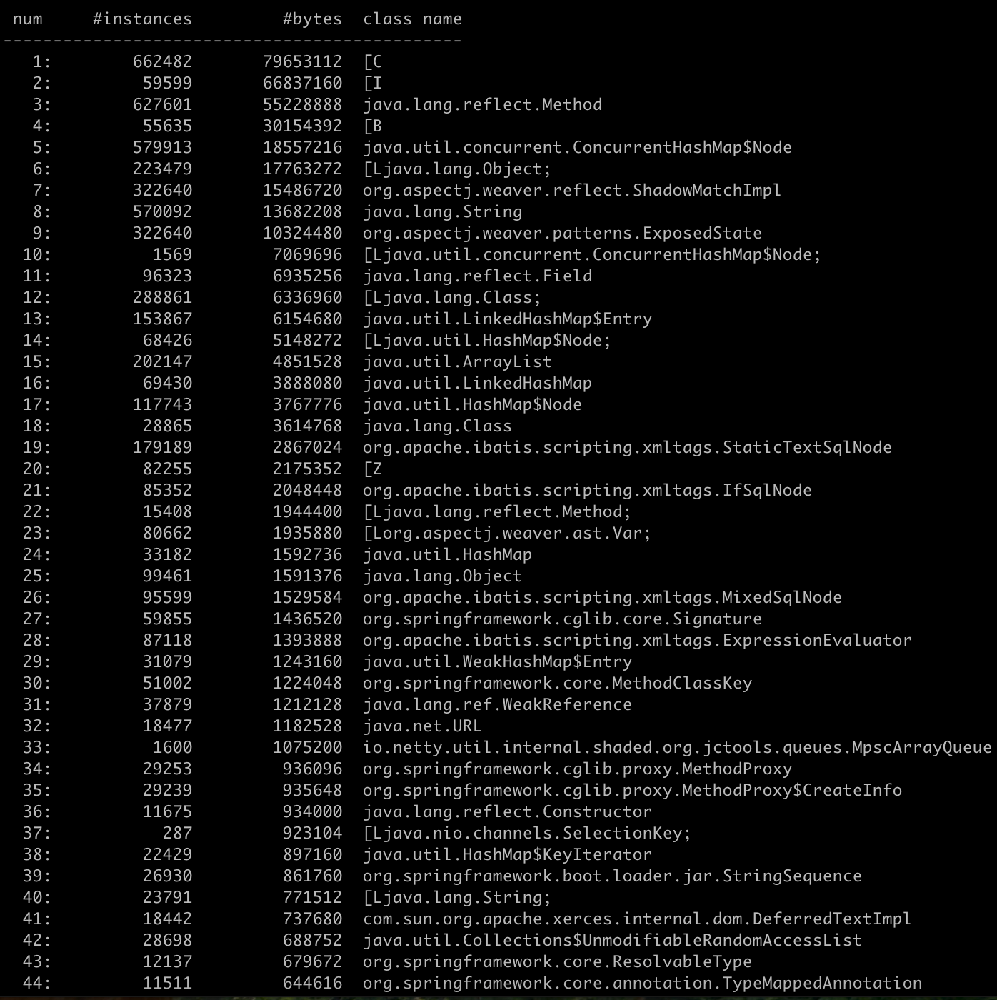
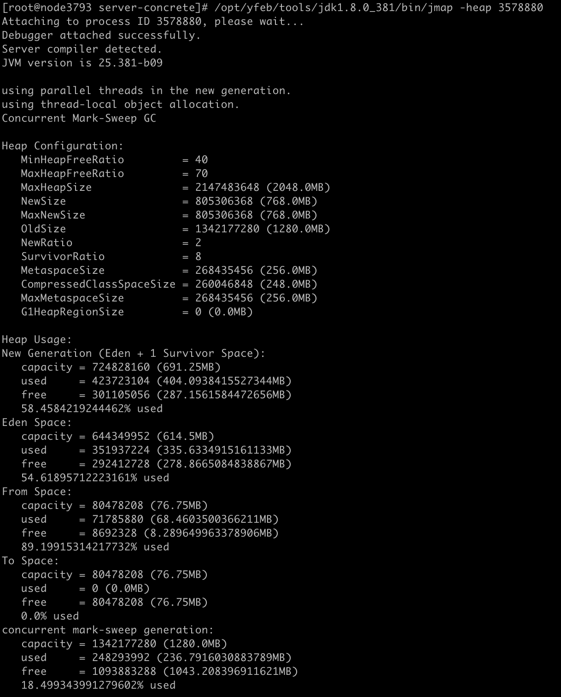
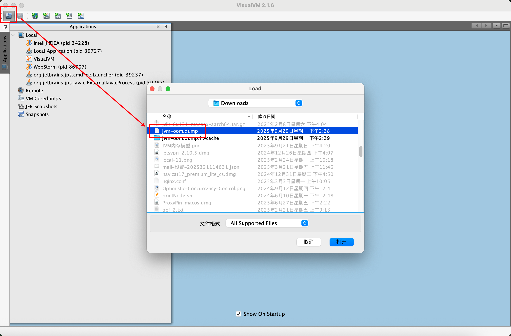
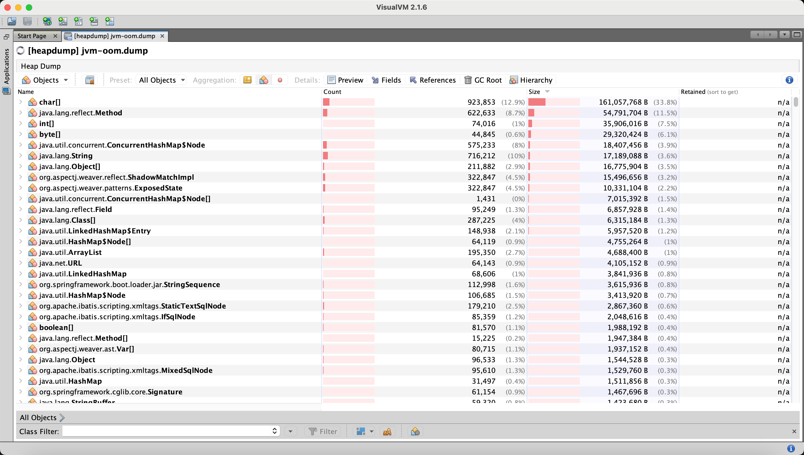
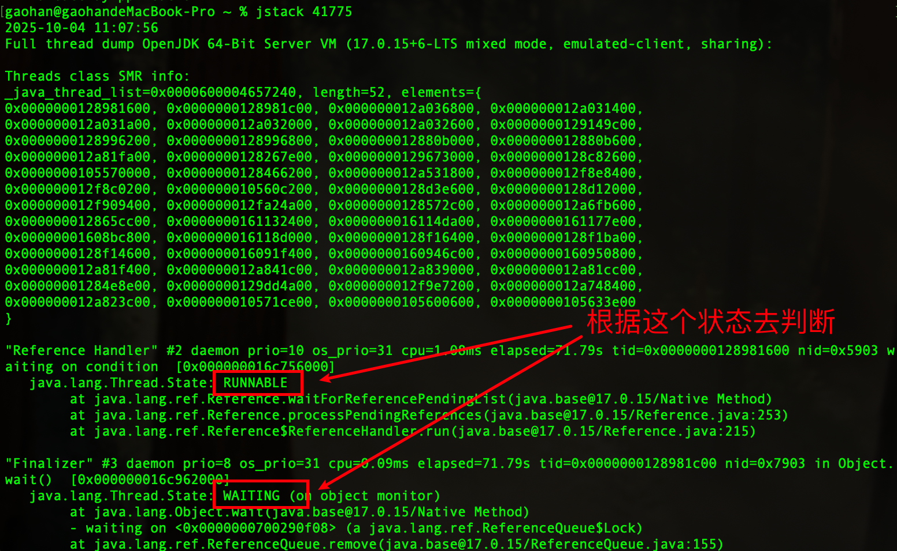
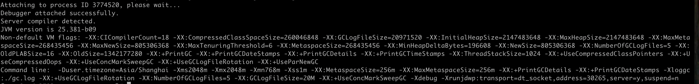
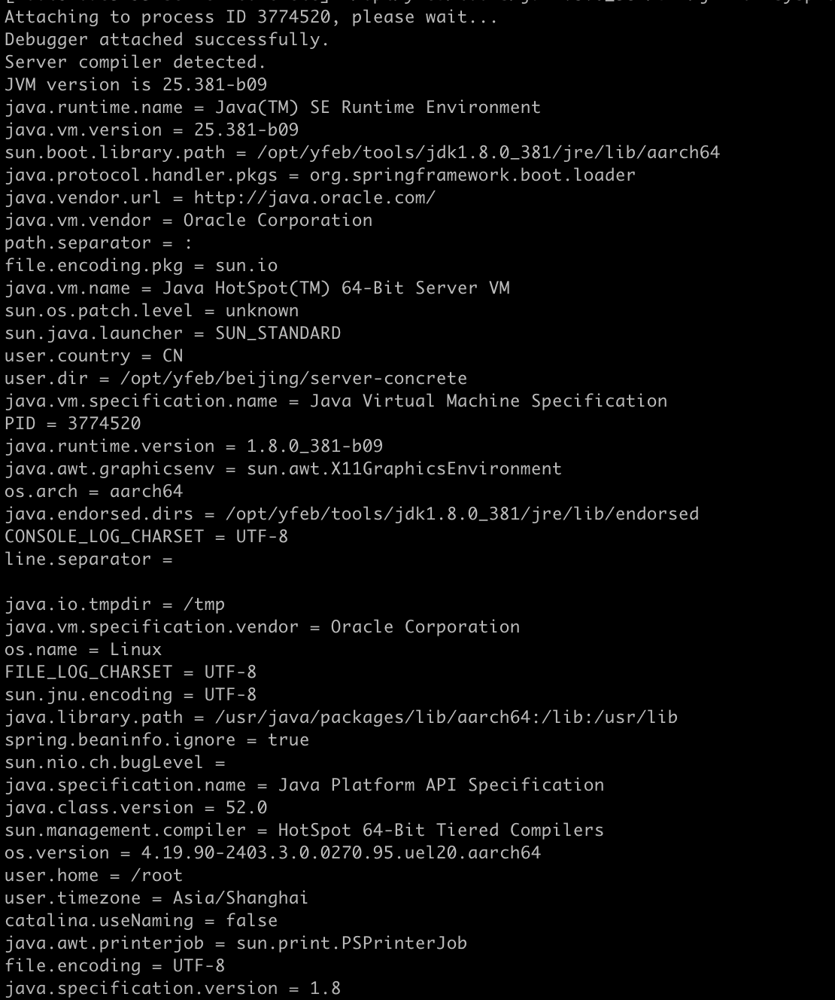
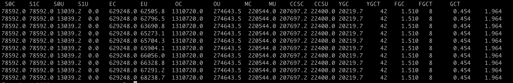

## Jmap

### 1. 查看内存里对象实例信息

可以用来查看内存信息，实例个数以及占用内存大小。

```bash
# 先使用jps命令查询出应用的进程ID
# 然后使用jmap查看内存信息
jmap -histo <PID> > ./memory-log.txt
```



展示数据说明

1. num（序号）

2. instances（实例数量）

3. bytes（占用空间大小）

4. class name（类名称）

   [C 是一个 char 数组

   [S 是一个 short 数组

   [[I 是一个 int 数组

   [[B 是一个 byte 数组

   [[I 是一个 int 二位数组


### 2. 查看堆内存信息

```bash
jmap -heap <PID>
```




参数解读

#### 堆内存配置信息 Heap Configuration

| 参数                     | 值       | 说明                           |
| ------------------------ | -------- | ------------------------------ |
| `MaxHeapSize`            | 2048.0MB | 堆最大 2GB                     |
| `NewSize` / `MaxNewSize` | 768.0MB  | 年轻代固定大小（-Xmn768m）     |
| `OldSize`                | 1280.0MB | 老年代大小                     |
| `NewRatio`               | 2        | 老年代 : 年轻代 = 2:1          |
| `SurvivorRatio`          | 8        | Eden : From : To = 8:1:1       |
| `MaxMetaspaceSize`       | 256.0MB  | 元空间最大 256MB（已设置限制） |

#### 堆内存使用情况 Heap Usage

##### 年轻代+首尔区 

New Generation (Eden + 1 Survivor Space)

- **总容量** 为 691.25 MB
- **已使用** 为 404.09 MB（**58.5%**）
- **Eden 区使用率** 为 54.6%
- **From Survivor 使用率** 为 89.2%
- **To Survivor** 为 空

##### 老年代

CMS垃圾收集器 concurrent mark-sweep generation

- **总容量**：1280.0 MB
- **已使用**：236.79 MB（**18.5%**）


### 3. 堆内存dump

dump文件是什么？

简单来说，Dump 文件是 JVM 在特定时刻的“内存快照”或“事故现场黑匣子记录”。

它完整地保存了当时 JVM 堆内存中所有对象的信息。

#### 手动dump命令

```bash
jmap -dump:format=b,file=jvm-oom.dump <PID>
```


#### 出现oom自动dump

设置堆内存溢出时自动导出dump文件（内存很大的时候，可能会导不出来），保存系统出现异常时的现场

```bash
‐XX:+HeapDumpOnOutOfMemoryError ‐XX:HeapDumpPath=./jvm-oom.dump
```


这个dump文件加载到 visualVM 工具里可以看内存里类的实例数和大小。






一般按照count和size排序后，找到的第一个自己开发应用的对象，也就找到了出现内存泄漏的问题所在。


## Jstack

可以用 jstack 加进程id查找死锁

```bash
jstack <PID>
```



| 状态                | 含义             | 常见原因与排查方向                                           |
| :------------------ | :--------------- | :----------------------------------------------------------- |
| **`RUNNABLE`**      | 可运行或正在运行 | CPU密集型任务、IO等待（可能）、自旋                          |
| **`TIMED_WAITING`** | 有限时间等待     | Sleep调用、带超时的锁等待、IO操作（带超时）                  |
| **`WAITING`**       | 无限时间等待     | 无超时的  `wait()` ,  `join()` ,  `LockSupport.park()` ，可能表示资源未就绪或协调问题 |
| **`BLOCKED`**       | 等待进入同步区   | 激烈的锁竞争，是 **性能瓶颈和潜在死锁** 的典型标志           |

### 找出占用cpu最高的线程堆栈信息

1. 使用命令 `top -p <pid>` ，显示你的java进程的内存情况，pid是应用的java进程号

2. 按大写的H，获取每个线程的内存情况
3. 找到内存和cpu占用最高的线程PID
4. 将这个PID转为十六进制得到 0xa32f，此为线程id的十六进制表示
5. 执行 `jstack 19663 | grep -A 10 a32f`，得到线程堆栈信息中 a32f 这个线程所在行的后面10行，从堆栈中可以发现导致cpu飙高的调用方法
6. 查看对应的堆栈信息找出可能存在问题的代码


## Jinfo

可以查看正在运行的Java应用程序的扩展参数

```bash
jinfo -flags <PID>
```



查看java系统参数

```bash
jinfo -sysprops <PID>
```




## Jstat

jstat命令可以查看堆内存各部分的使用量，以及加载类的数量。

命令的格式如下：

```bash
jstat [-命令选项] [vmid] [间隔时间(毫秒)] [查询次数]
```

例

```bash
# 每间隔5000毫秒，查询一次信息，共查询10次
jstat -gc 3774520 5000 10
```



### JVM 内存与GC监控指标

| 缩写     | 全称                             | 含义                                    | 单位   |
| :------- | :------------------------------- | :-------------------------------------- | :----- |
| **S0C**  | Survivor 0 Capacity              | 第一个幸存区（From Survivor）的总容量   | KB     |
| **S1C**  | Survivor 1 Capacity              | 第二个幸存区（To Survivor）的总容量     | KB     |
| **S0U**  | Survivor 0 Used                  | 第一个幸存区（From Survivor）的已使用量 | KB     |
| **S1U**  | Survivor 1 Used                  | 第二个幸存区（To Survivor）的已使用量   | KB     |
| **EC**   | Eden Capacity                    | 伊甸园区（Eden）的总容量                | KB     |
| **EU**   | Eden Used                        | 伊甸园区（Eden）的已使用量              | KB     |
| **OC**   | Old Capacity                     | 老年代（Old Generation）的总容量        | KB     |
| **OU**   | Old Used                         | 老年代（Old Generation）的已使用量      | KB     |
| **MC**   | Metaspace Capacity               | 方法区（元空间）的总容量                | KB     |
| **MU**   | Metaspace Used                   | 方法区（元空间）的已使用量              | KB     |
| **CCSC** | Compressed Class Space Capacity  | 压缩类空间的总容量                      | KB     |
| **CCSU** | Compressed Class Space Used      | 压缩类空间的已使用量                    | KB     |
| **YGC**  | Young Generation Collections     | 年轻代垃圾回收发生的次数                | 次     |
| **YGCT** | Young Generation Collection Time | 年轻代垃圾回收消耗的总时间              | 秒 (s) |
| **FGC**  | Full GC Collections              | **Full GC** 发生的次数                  | 次     |
| **FGCT** | Full GC Collection Time          | **Full GC** 消耗的总时间                | 秒 (s) |
| **GCT**  | Total Garbage Collection Time    | 垃圾回收消耗的总时间（YGCT + FGCT）     | 秒 (s) |


1.  **FGC 的真正含义**：
    `FGC` / `FGCT` 指标通常指的是 **Full GC** 的次数和时间，而不仅仅是“老年代GC”。
    *   **Full GC** 会回收整个堆，包括**年轻代**、**老年代**，通常还包括**方法区（元空间）**。
    *   而专门针对老年代的回收（例如 CMS 的并发回收）通常不统计在 `FGC` 内。
    *   因此，**`FGC` 是需要极力避免的，因为它会导致长时间的 STW（Stop-The-World）停顿。**

2.  **指标解读技巧**：
    *   **内存健康度**：关注各区域的 `Used` 与 `Capacity` 的比值。例如，如果 `OU` 持续很高，接近 `OC`，可能预示老年代即将被填满，会触发 Full GC。
    *   **GC 效率**：
        *   **YGC 频率**：`EU` 增长越快，`YGC` 频率越高。
        *   **平均 YGC 耗时**：`YGCT / YGC`。如果这个值突然变长，可能意味着有问题。
        *   **Full GC 情况**：**`FGC` 次数不应持续增长**。如果 `FGC` 很频繁且 `FGCT` 很长，是严重的性能警报。


## 调优实战

### 关注如下几个指标

#### 1. 年轻代对象增长的速率

可以通过执行命令 `jstat -gc pid 1000 10`  (每隔1秒执行1次命令，共执行10次)，通过观察EU(eden区的使用)来估算每秒eden大概新增多少对象。

#### 2. Young GC触发频率和耗时

关注Young GC大概多久触发一次，Young GC的平均耗时可以通过 `YGCT / YGC` 公式算出，根据结果我们大概就能知道系统大概多久会因为Young GC的执行而卡顿多久。

#### 3. 每次Young GC后有多少对象存活进入老年代

可以关注每次young gc后，老年代区域内存使用情况增长率。

#### 4. Full GC的触发频率和耗时

知道了老年代对象的增长速率就可以推算出Full GC的触发频率了，Full GC的每次耗时可以用公式 FGCT/FGC 计算得出。

### 优化思路

尽量让每次Young GC后的存活对象小于Survivor区域的50%，都留存在年轻代里。尽量别让对象进入老年
代。尽量减少Full GC的频率，避免频繁Full GC对JVM性能的影响。
