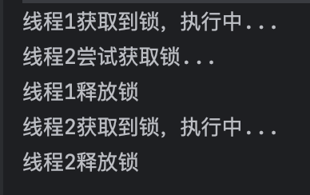
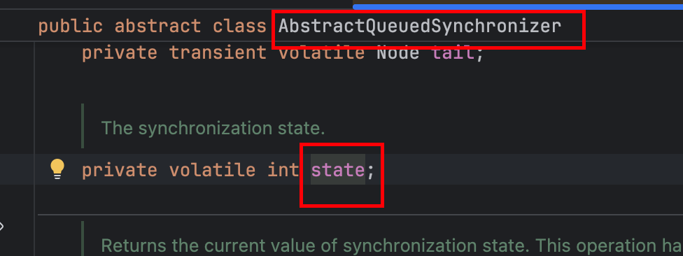

## AQS是什么？

AQS 全称是 `AbstractQueuedSynchronizer `，是 Java 并发包（ `java.util.concurrent` ）中的一个**抽象同步框架**。是一个标准，提供了一套标准化的模板方法（如获取 / 释放资源的流程），让开发者无需重复设计同步机制，只需专注于具体资源的竞争逻辑（如锁的获取条件）。

为各种锁（如 `ReentrantLock`）和同步器（如 `CountDownLatch`、`Semaphore`）提供了统一的底层实现骨架。

CAS 是 AQS 实现无锁化并发控制的基础，确保操作的原子性。

## AQS解决了什么问题？

主要解决 **多线程竞争共享资源时的 "秩序" 和 "效率" 问题** ：

- 没有 AQS 时，开发者需要自己处理线程排队、唤醒、状态同步等细节，容易出错（比如死锁、线程饥饿）。
- AQS 帮我们做好了这些底层工作，让竞争失败的线程有序排队（避免混乱）、高效阻塞 / 唤醒（减少 CPU 浪费）、安全管理同步状态（保证线程可见性）。
- 最终目标是让多线程能 "有规矩地" 访问共享资源，既保证线程安全，又兼顾性能。

## AQS 的核心原理是什么？

用一句话概括：**"一个状态变量 + 一个等待队列 + 两种模式"**。

- **一个状态变量（state）** ，用 `volatile int state` 表示资源的同步状态（比如：`state=1` 表示锁被占用，`state=0` 表示空闲）。通过 CAS 操作原子性地修改这个状态，实现资源竞争。
- **一个等待队列（CLH 队列）** ，当线程竞争资源失败时，会被包装成 Node 节点，加入这个 FIFO 双向队列，然后阻塞等待。当资源释放时，队列头部的线程会被唤醒，重新竞争资源。
- **两种工作模式**
  - 独占模式，同一时间只有一个线程能获取资源（如 `ReentrantLock`）。
  - 共享模式，多个线程可同时获取资源（如 `Semaphore` 允许多个线程同时通过）。


## 代码案例

### 代码

SimpleSync

```java
package com.yz.base.aqs;

import java.util.concurrent.locks.AbstractQueuedSynchronizer;
import java.util.concurrent.locks.Condition;

/**
 * 自定义同步器
 *
 * @author yunze
 * @since 2025/10/9 00:34
 */
public class SimpleSync extends AbstractQueuedSynchronizer {

    // 尝试获取锁（独占模式）
    @Override
    protected boolean tryAcquire(int arg) {
        // 使用CAS尝试将state从0改为1
        if (compareAndSetState(0, 1)) {
            // 成功获取锁，记录当前线程
            setExclusiveOwnerThread(Thread.currentThread());
            return true;
        }
        return false;
    }

    // 尝试释放锁（独占模式）
    @Override
    protected boolean tryRelease(int arg) {
        // 只有持有锁的线程才能释放
        if (Thread.currentThread() != getExclusiveOwnerThread()) {
            throw new IllegalMonitorStateException();
        }
        // 释放锁，重置状态
        setExclusiveOwnerThread(null);
        setState(0);
        return true;
    }

    // 判断是否持有锁
    protected boolean isLocked() {
        return getState() == 1;
    }

    // 提供创建条件对象的方法（直接使用AQS的内部实现）
    Condition newCondition() {
        return new ConditionObject();
    }
}

```


SimpleLock

```java
package com.yz.base.aqs;

import java.util.concurrent.TimeUnit;
import java.util.concurrent.locks.Condition;
import java.util.concurrent.locks.Lock;

/**
 * @author yunze
 * @since 2025/10/9 00:35
 */
public class SimpleLock implements Lock {

    // 同步器实例，实际的锁逻辑由它实现
    private final SimpleSync sync = new SimpleSync();

    @Override
    public void lock() {
        // 调用AQS的acquire方法，会触发tryAcquire
        sync.acquire(1);
    }

    @Override
    public void unlock() {
        // 调用AQS的release方法，会触发tryRelease
        sync.release(1);
    }

    // 其他方法简化实现
    @Override
    public boolean tryLock() {
        return sync.tryAcquire(1);
    }

    @Override
    public void lockInterruptibly() throws InterruptedException {
        sync.acquireInterruptibly(1);
    }

    @Override
    public boolean tryLock(long time, TimeUnit unit)
            throws InterruptedException {
        return sync.tryAcquireNanos(1, unit.toNanos(time));
    }

    @Override
    public Condition newCondition() {
        return sync.newCondition();
    }

    // 测试方法
    public static void main(String[] args) {
        SimpleLock lock = new SimpleLock();

        // 线程1获取锁
        new Thread(() -> {
            lock.lock();
            try {
                System.out.println("线程1获取到锁，执行中...");
                Thread.sleep(2000);
            } catch (InterruptedException e) {
                e.printStackTrace();
            } finally {
                System.out.println("线程1释放锁");
                lock.unlock();
            }
        }).start();

        // 线程2尝试获取锁
        new Thread(() -> {
            System.out.println("线程2尝试获取锁...");
            lock.lock();
            try {
                System.out.println("线程2获取到锁，执行中...");
            } finally {
                System.out.println("线程2释放锁");
                lock.unlock();
            }
        }).start();
    }
}
```


### 运行结果



### 实现原理

- `SimpleSync` 继承了 `AbstractQueuedSynchronizer`（AQS）

- 重写了 `tryAcquire` 和 `tryRelease` 方法，定义了锁的获取和释放规则

- 使用 `state` 变量（0 表示未锁定，1 表示已锁定）作为同步状态（state变量是 `AbstractQueuedSynchronizer` 类里提供的）

  

### 工作流程

- 线程 1 调用 `lock()` 时，AQS 会调用 `tryAcquire` 尝试用 CAS 将 state 从 0 改为 1
- 成功后线程 1 获得锁，执行任务
- 此时线程 2 尝试获取锁会失败，被加入 CLH 等待队列并阻塞
- 线程 1 执行完调用 `unlock()` 释放锁，AQS 会唤醒队列中的线程 2
- 线程 2 被唤醒后再次尝试获取锁，成功后执行任务