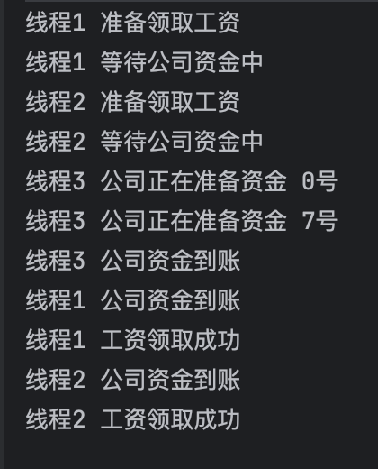

## wait和notify方法是做什么的？

wait和notify是 **线程之间进行协作** 的基础机制，是 `Object` 类的原生方法。

### wait()

让当前线程进入等待状态，并 **释放对象锁** ，直到其他线程调用 `notify()` 将其唤醒。

`wait()` 方法必须在 `synchronized` 同步代码块中进行调佣。

```java
Object obj = new Object();
synchronized (obj) {
    obj.wait(); // 释放锁，线程等待
  	System.out.println("线程唤醒，并持有到对象锁后，从 wait() 之后继续执行");
}
```


### notify()

 **随机唤醒 ** 一个正在等待该对象锁的线程。

同样必须在 `synchronized` 同步代码块中调用。

> 注意：调用 `notify()` 后，**不会立即释放锁**，要等当前 `synchronized` 块执行完才释放。

```java
Object obj = new Object();
synchronized (obj) {
    obj.notify(); // 唤醒一个等待的线程
}
```

被唤醒的线程需要重新竞争锁才能继续执行。


### notifyAll()

**唤醒所有** 正在等待该对象锁的线程。

多个线程在等待同一个条件，且都可能需要被唤醒。

```java
Object obj = new Object();
synchronized (obj) {
    obj.notifyAll(); // 唤醒所有等待线程
}
```


## 解决了什么问题？

> 核心应用场景是 **线程间的条件协作**，即一个线程的执行，需要等待另一个线程满足某个特定条件。
>
> 例如：消费者和生产者的关系，消费者需要等待生产者去往 **消息队列** 里放消息，才可以去消费消息。
>
> 例如：员工向公司领取工资，只有 **公司账户** 有资金时，员工才可以领取到工资。
>
> 上面两个案例中消息队列、公司账户，就是一个消费者和生产者共享，员工与公司共享的一个条件，当条件不符合时，服务提供线程就没办法继续正常运行。
>
> 它们是多线程编程中最基础的 “信号机制”。

如下面代码中线程1和线程2的执行，就是都需要等待 `AtomicBoolean flag` 为 `true` ，只有线程3将 `AtomicBoolean flag` 设置为 `true` 之后才可以继续往下执行。

但是请注意，线程1和线程2的代码里的 `flag.get()` 资源判断都是在循环里的，但是在运行打印的结果里却没有重复的打印 “线程X 等待公司资金中”，而是在线程被唤醒后，直接打印了 “线程X 公司资金到账” 。

这说明执行了 `wait()` 方法后，该线程进入了 **等待状态** ，没有继续执行，且在被线程3调用 `notifyAll()` 方法唤醒后，是直接从 `wait()` 方法之后继续执行的。

并且注意，线程1和线程2同时被线程3唤醒后，是先执行完线程1的任务，再去执行线程2的任务，执行线程1任务途中没有切换去执行线程2的任务，是同步的执行，说明在线程唤醒后，依旧需要去竞争持有 **对象锁** 。

```java
package com.yz.base;

import java.util.Random;
import java.util.concurrent.atomic.AtomicBoolean;

/**
 * @author yunze
 * @since 2025/10/8 19:52
 */
public class WaitAndNotifyDemo {

    public static void main(String[] args) {
        Object obj = new Object();

        // 公司资金是否到账
        AtomicBoolean flag = new AtomicBoolean(false);

        new Thread(() -> {
            synchronized (obj) {
                System.out.println("线程1 准备领取工资");
                while (!flag.get()) {
                    // 只有当flag为true时（资金到账），线程1才继续往下执行，否则循环等待
                    System.out.println("线程1 等待公司资金中");
                    try {
                        obj.wait();
                        System.out.println("线程1 公司资金到账");
                    } catch (InterruptedException e) {
                        throw new RuntimeException(e);
                    }
                }
                System.out.println("线程1 工资领取成功");
            }
        }).start();

        new Thread(() -> {
            synchronized (obj) {
                System.out.println("线程2 准备领取工资");
                while (!flag.get()) {
                    // 只有当flag为true时（资金到账），线程2才继续往下执行，否则循环等待
                    System.out.println("线程2 等待公司资金中");
                    try {
                        obj.wait();
                        System.out.println("线程2 公司资金到账");
                    } catch (InterruptedException e) {
                        throw new RuntimeException(e);
                    }
                }
                System.out.println("线程2 工资领取成功");
            }
        }).start();

        new Thread(() -> {
            synchronized (obj) {
                int day = 0;

                // 只有1号公司的资金才到账
                while (day != 1) {
                    System.out.println("线程3 公司正在准备资金 " + day + "号");
                    // 生成一个1~9的随机整数
                    day = new Random().nextInt(9) + 1;
                }

                flag.set(true);
                obj.notifyAll();
                System.out.println("线程3 公司资金到账");
            }
        }).start();
    }
}
```


运行结果




## 有什么注意事项？

1.  `wait()` 、 `notify()`  、`notifyAll()` 都需要在同步代码块 `synchronized` 里调用。
2. 被唤醒的线程需要重新竞争锁才能继续执行。
3. 调用 `notify()` 、`notifyAll()` 后，**不会立即释放锁**，要等当前 `synchronized` 块执行完才释放。


## 为什么 wait 和 notify 方法要在同步块中调用？

1. **互斥性：** 多线程环境下，我们希望在同一时刻只有一个线程能够执行 wait()、notify() 或 notifyAll() 方法。使用同步块（synchronized）提供了这种互斥性，避免多线程并发修改的问题。
2. **上下文切换：** 当一个线程调用 wait() 时，它会暂时放弃执行权并释放对象的锁。如果不在同步块内调用 wait()，线程可能在不合适的时机被唤醒，导致混乱。同步块内的 wait() 确保线程在正确的上下文中被唤醒，可以继续执行并获取锁。
3. **安全性：** 如果不在同步块内使用 wait()、notify() 或 notifyAll()，多个线程可能同时访问和修改同一个共享对象的状态，可能引发竞态条件，导致程序行为不确定。同步块（synchronized）可以确保对这些方法的访问是原子的，避免了潜在的并发问题。
   简而言之，将 wait() 和 notify() 方法包裹在同步块内，有助于确保线程间的协同和同步工作正确，避免了多线程问题，提高了程序的可靠性和安全性。