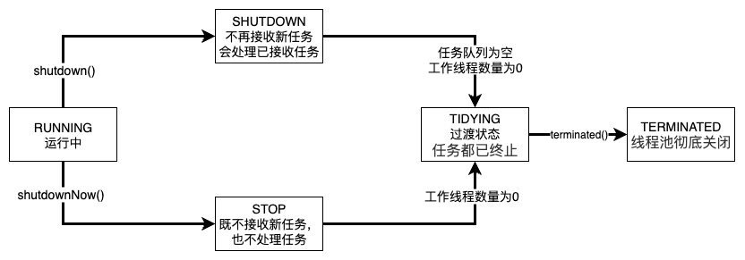

核心线程数 = CPU核数 × (1 + IO等待时间 / CPU时间)

最大线程数，在核心线程数的基础上加一点点做缓冲即可。

工作队列（workQueue），只需要缓冲1~3秒的突发QPS流量即可，其余的请求应该触发线程池的拒绝策略

<!-- more -->

## Executors

### 代码案例

```java
public class ThreadPoolDemo {
    public static void main(String[] args) {
        PayTask task1 = new PayTask();
        PayTask task2 = new PayTask();
        PayTask task3 = new PayTask();

        ExecutorService executorService = Executors.newSingleThreadExecutor();
        executorService.submit(task1);
        executorService.submit(task2);
        executorService.submit(task3);
    }
}

public class PayTask implements Runnable {

    @Override
    public void run() {
        System.out.println(Thread.currentThread().getName() + " 开始执行支付任务...");
    }
}

```


运行结果，是同一个线程执行的任务。


Executors提供了各种线程池类型创建的静态方法，

如常见的newFixedThreadPool、newSingleThreadExecutor、newCachedThreadPool、newSingleThreadScheduledExecutor。

---

### 线程池核心参数与注意事项

| 线程池方法                             | 核心线程数          | 最大线程数          | 工作队列                          | 重要注意事项                                                 |
| :------------------------------------- | :------------------ | :------------------ | :-------------------------------- | :----------------------------------------------------------- |
| **`newFixedThreadPool`**               | **固定 (nThreads)** | **固定 (同核心数)** | `LinkedBlockingQueue` (无界)      | **【内存泄漏风险】**：由于使用无界队列，如果任务提交速度持续高于处理速度，可能导致队列无限增长，最终引发 `OutOfMemoryError`。 |
| **`newSingleThreadExecutor`**          | **1**               | **1**               | `LinkedBlockingQueue` (无界)      | **【内存泄漏风险】**：同 `FixedThreadPool`，因使用无界队列。 如果唯一的线程因异常终止，会创建一个新线程继续执行。 |
| **`newCachedThreadPool`**              | **0**               | `Integer.MAX_VALUE` | `SynchronousQueue` (直接传递)     | **【资源耗尽风险】**：由于最大线程数几乎是无限的，在任务提交非常频繁且执行时间较长时，可能创建大量线程，耗尽 CPU 和内存资源。 |
| **`newSingleThreadScheduledExecutor`** | **1**               | **1**               | `DelayedWorkQueue` (无界延迟队列) | 1. **【内存泄漏风险】**：无界队列。<br>2. 长任务会延迟后续周期任务。 |
| **`newScheduledThreadPool`**           | **核心池可指定**    | `Integer.MAX_VALUE` | `DelayedWorkQueue` (无界延迟队列) | **【内存泄漏风险】**：无界队列。                             |

---

### 线程池特点与应用场景

| 线程池方法                             | 特点                                                         | 应用场景                                                     |
| :------------------------------------- | :----------------------------------------------------------- | :----------------------------------------------------------- |
| **`newFixedThreadPool`**               | 1. 线程数固定，控制最大并发。<br>2. 超出的任务在无界队列中等待。<br>3. 线程空闲也不会被回收。 | 适用于**负载较重**、需要**限制线程数量**以控制资源消耗的场景。如 Web 服务器处理请求、稳定的周期性任务。 |
| **`newSingleThreadExecutor`**          | 1. 保证所有任务**顺序执行**。<br>2. 不存在线程同步问题。<br>3. 唯一的线程。 | 适用于需要**保证任务顺序执行**的场景。如日志打印、事务性操作、需要单例执行的任务。 |
| **`newCachedThreadPool`**              | 1. **弹性扩容**：有任务就创建新线程。<br>2. **自动回收**：线程空闲60秒后终止。<br>3. 响应速度快。 | 适用于执行**大量短生命周期**的**异步任务**。如 HTTP 请求处理、频繁的轻量级计算。 |
| **`newSingleThreadScheduledExecutor`** | 1. 在单线程基础上，增加了**定时**和**周期性**执行任务的能力。<br>2. 保证所有任务按顺序执行。 | 适用于需要**单线程**且**定时/周期**执行任务的场景。如后台守护任务、顺序的定时数据同步、心跳检测。 |
| **`newScheduledThreadPool`**           | 1. 多线程的定时/周期任务线程池。<br>2. 可并行执行多个定时任务，效率更高。 | 适用于需要**多个线程**执行**定时或周期性**任务的场景。如多路定时数据采集、并行周期性检查。 |

### 核心总结与最佳实践

1.  **风险警示**：`Executors` 提供的这几种快捷工厂方法（除 `newWorkStealingPool` 外）大多使用**无界队列**或**无界线程数**，在生产环境中使用需极其谨慎，容易导致资源耗尽。
2.  **推荐做法**：对于生产环境，**推荐使用 `ThreadPoolExecutor` 构造函数来手动创建线程池**。这样可以明确指定核心参数（核心线程数、最大线程数、队列类型及容量、拒绝策略等），实现更精细的资源控制和更健壮的服务。
3.  **选择依据**：选择线程池类型的核心在于分析你的任务特性：
    *   **任务量是否稳定？** -> 稳定用 `Fixed`，不稳定用 `Cached`（但要控制风险）。
    *   **是否需要顺序执行？** -> 是，用 `SingleThread`。
    *   **是否需要定时/周期？** -> 是，用 `Scheduled`。


## ThreadPoolExecutor

### 代码案例

```java
package com.yz.base.threadPool;

import java.util.concurrent.*;

/**
 * @author yunze
 * @since 2025/10/10 12:33
 */
public class ThreadPoolDemo2 {
    public static void main(String[] args) {
        // 拒绝策略
        RejectedExecutionHandler policy = new ThreadPoolExecutor.CallerRunsPolicy();
        // 等待队列
        ArrayBlockingQueue<Runnable> queue = new ArrayBlockingQueue<>(5);
        // 核心线程数
        int corePoolSize = 3;
        // 最大线程数
        int maximumPoolSize = 5;
        // 线程存活时间
        long keepAliveTime = 10;
        
        ThreadPoolExecutor executorService = new ThreadPoolExecutor(
                corePoolSize,
                maximumPoolSize,
                keepAliveTime,
                TimeUnit.SECONDS,
                queue,
                policy
        );

        for (int i = 0; i < 9; i++) {
            // executorService.execute(new PayTask());
            executorService.execute(() -> {
                try {
                    Thread.sleep(2000);
                } catch (InterruptedException e) {
                    throw new RuntimeException(e);
                }
                System.out.println("线程池执行任务：" + Thread.currentThread().getName());
            });
        }
    }
}

```

运行结果


提交一个Runnable时，不管当前线程池中的线程是否空闲，只要数量小于核心线程数就会创建新线程。


好的，这是为您整理的线程池核心参数表格。

### 线程池核心参数详解

| 参数名                | 说明                       | 补充说明/工作逻辑                                            |
| :-------------------- | :------------------------- | :----------------------------------------------------------- |
| **`corePoolSize`**    | 核心线程数                 | 线程池初始化时默认没有线程，任务来临时才开始创建。即使线程空闲，也会保留在池中。 |
| **`maximumPoolSize`** | 最大线程数                 | 核心线程已满 **且** 工作队列已满时，才会创建非核心线程，且总数不能超过此值。 |
| **`keepAliveTime`**   | 非核心线程空闲存活时间     | 非核心线程空闲时间超过此值会被终止回收。当 `corePoolSize` = `maximumPoolSize` 时，此参数无效。 |
| **`unit`**            | `keepAliveTime` 的时间单位 | 如 `TimeUnit.SECONDS`、`TimeUnit.MILLISECONDS`。             |
| **`workQueue`**       | 任务队列                   | 用于保存等待执行的任务。当工作线程数 >= `corePoolSize` 时，新任务会进入此队列。 |
| **`threadFactory`**   | 线程工厂                   | 用于创建新线程。默认使用 `Executors.defaultThreadFactory()`。可自定义以实现线程命名、优先级等。 |
| **`handler`**         | 拒绝策略                   | 当线程池已关闭，或 `workQueue` 和 `maximumPoolSize` 都已满时，对新任务采取的处理策略。 |

---

### 工作队列 (`workQueue`) 类型对比

| 队列类型                                  | 特点                                                         | 可能产生的问题                                               |
| :---------------------------------------- | :----------------------------------------------------------- | :----------------------------------------------------------- |
| **`ArrayBlockingQueue`**<br/>(有界队列)   | 队列长度固定。队列满后，会创建非核心线程，若线程数已达上限则触发拒绝策略。 | 需要合理设置队列大小，否则容易触发拒绝策略。                 |
| **`LinkedBlockingQueue`**<br/>(无界队列)  | 队列长度理论无限（容量为 `Integer.MAX_VALUE`）。任务处理跟不上创建速度时，队列会持续增长。 | 可能导致内存占用过多，最终引发 **OutOfMemoryError (OOM)**。  |
| **`SynchronousQueue`**<br/>(同步移交队列) | 不存储任务，队列长度为0。每个插入操作必须等待另一个线程的移除操作。 | 任务无法缓冲，若无空闲线程接收则会立即尝试创建新线程，易触及最大线程数上限。 |

---

### 拒绝策略 (`handler`) 对比

| 拒绝策略                     | 行为                                                         | 适用场景                                                     |
| :--------------------------- | :----------------------------------------------------------- | :----------------------------------------------------------- |
| **`AbortPolicy`**<br/>(默认) | 抛出 **`RejectedExecutionException`** 异常，中断任务提交。   | 需要明确感知任务被拒绝的场景，便于快速失败和问题排查。       |
| **`CallerRunsPolicy`**       | 让**提交任务的主线程**自己来执行该任务。                     | 一种温和的负反馈机制，让提交方也承担压力，从而自然降低提交速度。 |
| **`DiscardOldestPolicy`**    | **丢弃队列中存在最久**的任务，然后重新尝试提交当前任务。     | 允许丢弃旧任务以尝试执行新任务，但可能丢失重要历史任务。     |
| **`DiscardPolicy`**          | 直接**丢弃**新提交的任务，**不抛出任何异常**。               | 允许无声丢失任务的场景，风险在于问题被掩盖。                 |
| **自定义策略**               | 实现 `RejectedExecutionHandler` 接口，根据业务需求自定义（如记录日志、持久化任务等）。 | 需要更复杂或特定拒绝逻辑的高阶场景。                         |


## 线程池的工作流程


## 线程池的状态

### 线程池生命周期状态转换

| 状态转换                          | 触发条件                                                     | 说明与细节                                                   |
| :-------------------------------- | :----------------------------------------------------------- | :----------------------------------------------------------- |
| **RUNNING -> SHUTDOWN**           | 手动调用 `shutdown()` 方法触发。                             | 1. 这是**优雅关闭**的起点。<br>2. 线程池对象被 GC 时，会在 `finalize()` 方法中调用 `shutdown()`，但**不推荐**依赖此行为。 |
| **(RUNNING or SHUTDOWN) -> STOP** | 手动调用 `shutdownNow()` 方法触发。                          | 1. 这是**强制关闭**的起点。<br>2. 如果先调用 `shutdown()` 紧接着调用 `shutdownNow()`，就会发生 **SHUTDOWN -> STOP** 的转换。 |
| **SHUTDOWN -> TIDYING**           | **任务队列为空** **并且** **线程池中工作线程数为0** 时自动转换。 | 这是优雅关闭的清理准备阶段，表示所有已提交的任务都已执行完毕。 |
| **STOP -> TIDYING**               | **线程池中工作线程数为0** 时自动转换。                       | 进入此状态**不要求任务队列为空**，因为 `shutdownNow()` 会尝试中断 worker 并清空队列，队列中可能还有未处理的任务。 |
| **TIDYING -> TERMINATED**         | `terminated()` 钩子方法执行完毕后自动转换。                  | 1. 这是线程池的**最终状态**。<br>2. 开发者可以重写 `terminated()` 方法，在线程池完全结束前执行自定义的清理或日志记录操作。 |

---

### 核心状态说明

- **RUNNING**：能接收新任务，并能处理已提交的任务。
- **SHUTDOWN**：**不再接收新任务**，但会处理完**工作队列中已存在**的任务。
- **STOP**：**不再接收新任务**，也**不再处理队列中的任务**，并会尝试**中断所有正在执行的任务**。
- **TIDYING**：过渡状态，所有任务都已终止，工作线程数为0。即将执行 `terminated()` 钩子。
- **TERMINATED**：`terminated()` 方法已执行完毕，线程池彻底关闭。

### 示意图




## 线程池调优注意事项

workQueue工作队列不适合设置过大，否则，工作队列不放满，就不会去创建非核心线程，任务的处理速度就快不起来，会一直慢吞吞的处理。 所以需要根据任务的产生数量和线程处理任务的效率，综合评估工作队列的大小。