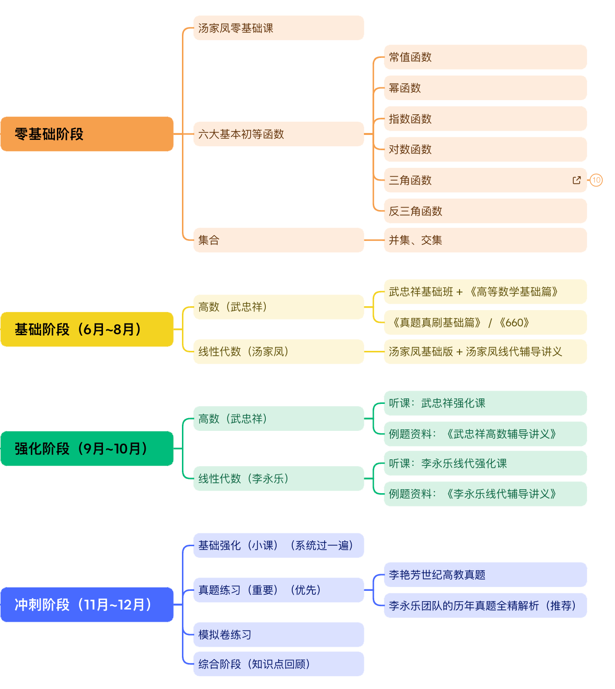

## 零基础

- 三角函数

- 反三角函数

- 集合

## 基础阶段

1. 高数（武忠祥）
   - 武忠祥基础班 + 《高等数学基础篇》
   - 《真题真刷基础篇》 / 《660》

2. 线性代数（汤家凤）
   - 汤家凤基础版 + 汤家凤线代辅导讲义

## 强化阶段

1. 高数（武忠祥）
   - 听课：武忠祥强化课
   - 例题资料：《武忠祥高数辅导讲义》

2. 线性代数（李永乐）
   - 听课：李永乐线代强化课
   - 例题资料：《李永乐线代辅导讲义》

## 冲刺阶段

1. 基础强化（小课）（系统过一遍）

2. 真题练习（重要）（优先）
   - 李永乐团队的历年真题全精解析（推荐）

3. 模拟卷练习

4. 综合阶段（知识点回顾）

