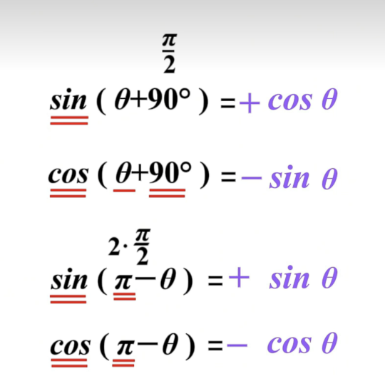

### 正弦和余弦加法公式的推导

正弦和余弦的加法公式是三角学中最核心的恒等式之一，其标准形式为：
$$
\sin(\alpha + \beta) = \sin \alpha \cos \beta + \cos \alpha \sin \beta
$$

$$
\cos(\alpha + \beta) = \cos \alpha \cos \beta - \sin \alpha \sin \beta
$$

以下是几种经典的推导方法：

---

#### **方法一：几何法（单位圆与旋转）**
**核心思想**：通过单位圆中角度的几何关系推导。

1. **构造图形**：
   
   - 在单位圆上，设点 \( P \) 对应角度 ( $\alpha$ )，点 \( Q \) 对应角度 \( $\alpha + \beta$ \)。
   - 点 \( P \) 的坐标为  $(\cos \alpha, \sin \alpha)$ ，点 \( Q \) 的坐标为 $(\cos(\alpha + \beta), \sin(\alpha + \beta))$。
   
2. **旋转角度 $ \beta $**：
   
   - 将向量 \( OP \) 旋转角度 $( \beta )$ 得到向量 \( OQ \)。
   
   - 旋转后的坐标变换公式为：
     $$
     \begin{cases}
     \cos(\alpha + \beta) = \cos \alpha \cos \beta - \sin \alpha \sin \beta, \\
     \sin(\alpha + \beta) = \sin \alpha \cos \beta + \cos \alpha \sin \beta.
     \end{cases}
     $$
     
   - 这直接给出了余弦和正弦的加法公式。

**几何直观**：旋转矩阵的乘法对应角度相加的三角函数值。

---

#### **方法二：欧拉公式（复数法）**
**核心思想**：利用复指数函数的性质。

1. **欧拉公式**：
   $$
   e^{i\theta} = \cos \theta + i \sin \theta
   $$
2. **指数相加**：
   $$
   e^{i(\alpha + \beta)} = e^{i\alpha} \cdot e^{i\beta}
   $$
   展开后：
   $$
   \cos(\alpha + \beta) + i \sin(\alpha + \beta) = (\cos \alpha + i \sin \alpha)(\cos \beta + i \sin \beta)
   $$
3. **展开乘法**：
   $$
   = \cos \alpha \cos \beta - \sin \alpha \sin \beta + i (\sin \alpha \cos \beta + \cos \alpha \sin \beta)
   $$
4. **实部与虚部分离**：
   - 实部对应余弦公式：$\cos(\alpha + \beta) = \cos \alpha \cos \beta - \sin \alpha \sin \beta$。
   - 虚部对应正弦公式：$\sin(\alpha + \beta) = \sin \alpha \cos \beta + \cos \alpha \sin \beta$。

**优势**：简洁且无需几何构造，适用于复数领域。

