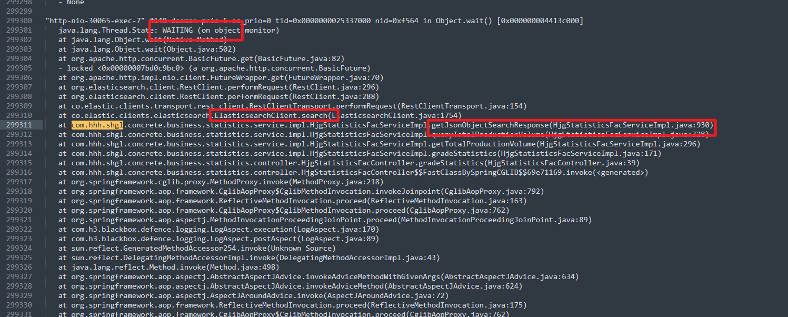
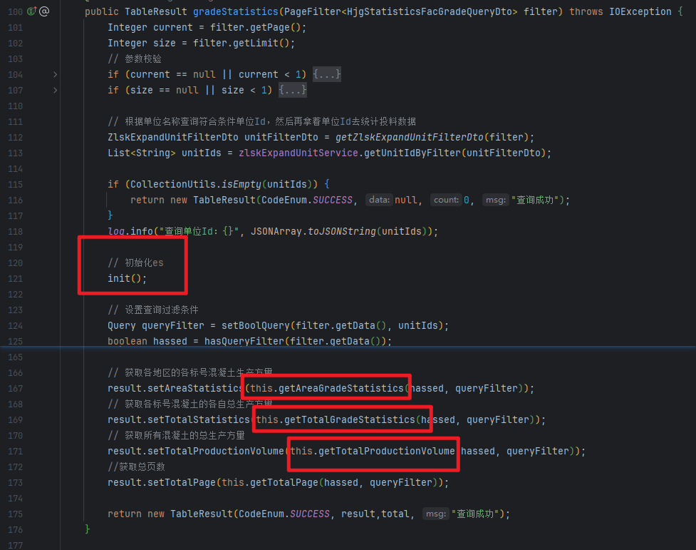
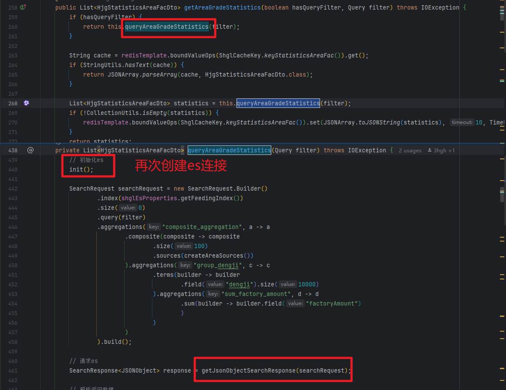
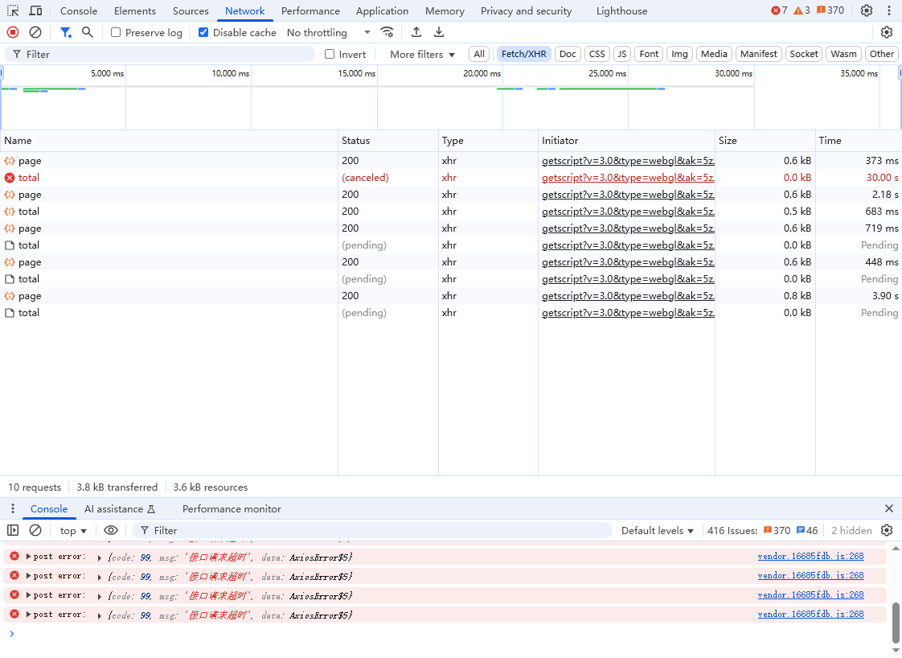
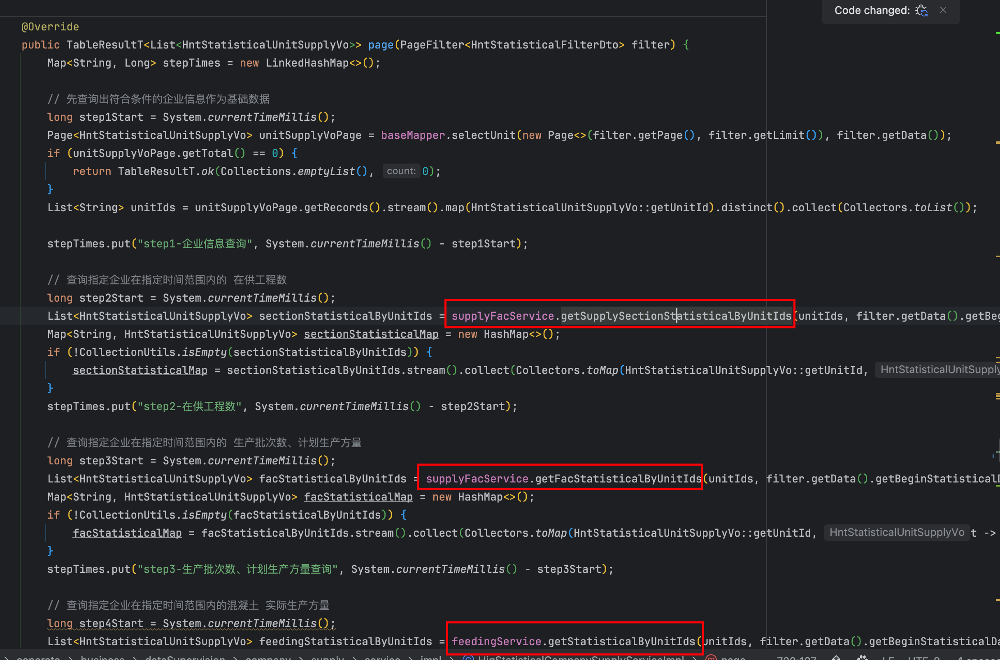
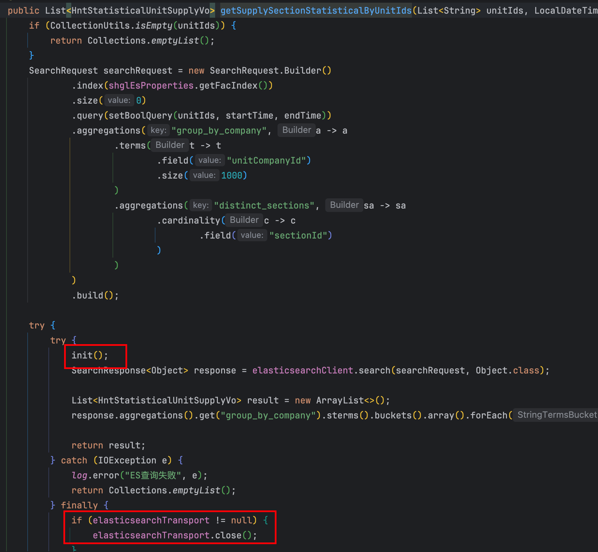

线上曾出现 Gateway 返回 500/502，堆与数据库未见异常，jstack 显示大量线程在等待 ES 连接。根因多为 ES 客户端使用不当（连接占用/释放不对称、频繁新建与关闭客户端）。通过 ElasticsearchClientManager 以单例 ElasticsearchClient、统一连接池与启动预热，业务统一经 getClient 访问 ES，收敛连接耗尽与接口延迟抖动。

<!-- more -->

## 一、背景与现象

线上曾出现：**业务服务在部分时段不可达或响应极慢**，经 **Gateway** 转发后，前端收到 **HTTP 500 / 502** 等错误。

初步容易联想到 JVM 堆栈、数据库连接、网关超时等常见问题；本次案例中，在**堆内存与 GC、MySQL 内存与连接数、业务服务常规连接数**等指标均未见明显异常、且对相关参数做过优化后，**500 / 502 仍间歇出现**。

一度怀疑是否存在**死锁**等并发问题；通过 **`jstack` 导出线程快照** 后发现：大量业务线程处于 **等待 Elasticsearch（ES）底层连接资源** 的状态，与「网关超时 / 502」在时间线上吻合。

---

## 二、根因归纳

### 2.1 连接使用与释放不对称（资源耗尽）

排查业务代码后发现：在访问 ES 时，**单次请求路径上可能占用多条底层 HTTP 连接**，但**实际只正确归还 / 释放了其中一部分**，长期运行后导致 **连接池或底层套接字资源被耗尽**。后续请求全部在池上阻塞等待，表现为：

- 接口线程长时间 `WAITING`，堆栈指向 ES 客户端或 HTTP 连接获取；
- 上游 Gateway 等待下游超时 → **502**；或应用层异常未妥善处理 → **500**。

### 2.2 接口响应时间不稳定

每次请求若都经历「**新建客户端 → 建连 → 请求 → 关闭**」或错误地多次借用连接，会带来：

- 建连与 TLS（若启用）握手开销；
- 连接池竞争与等待时间波动；

因此**同一接口 P99 延迟抖动大**，与「仅堆/DB 正常」的表象并存。

多次请求时，有几率超时失败。

每一个service请求，都各自创建了一个ElasticsearchClient。

### 2.3 频繁创建与销毁 `ElasticsearchClient` / `RestClient`

若在多个 Service 或每次调用里 **重复 `new ElasticsearchClient` / `new RestClient`**：

- 每个实例自带 **独立的 HTTP 连接池**（例如各自 `MaxConnTotal`），**总连接数按实例数成倍放大**，易打满 ES 或本机文件描述符；
- **创建过程较重**（客户端、连接池、线程等初始化），高并发下 CPU 与锁竞争上升；
- 与「单例 + 连接复用」相比，**资源开销与故障面都显著增大**。

---

## 三、解决方案：`ElasticsearchClientManager` 设计说明

### 3.1 目标

- **全进程共享一个 `ElasticsearchClient`**，对应 **一个 `RestClient` 与一个连接池**，避免重复创建与多池叠加。
- **启动预热**：避免首个业务请求才初始化客户端导致的**首包慢**。
- **显式连接池上限**：控制对单节点的总连接与单路由连接，便于与 ES 集群能力对齐。

### 3.2 核心行为摘要

| 能力 | 说明 |
|------|------|
| Spring `@Component` | 由容器管理单例，业务侧注入后调用 `getClient()`。 |
| `volatile` + 双重检查锁 | 保证多线程下只初始化一个客户端，且未初始化完成前不会错误发布引用。 |
| `@PostConstruct warmUp()` | 启动时调用 `getClient()`，预建客户端与连接池。 |
| `RestClient` 连接池 | `setMaxConnTotal(50)`、`setMaxConnPerRoute(10)`，按需复用连接。 |
| Keep-Alive | 约 5 分钟，减少短连接频繁握手。 |
| 认证 | 若配置了 `spring.elasticsearch` 用户名密码，则注入 `CredentialsProvider`。 |

### 3.3 与「多线程、多连接」的关系说明

- **多个线程同时调用 `getClient()`**：得到的是 **同一个** `ElasticsearchClient` 实例，**共享同一连接池**；并发请求会占用池中的多条连接（受 `MaxConnPerRoute` / `MaxConnTotal` 限制），而不是每个线程各建一套客户端。
- **正确用法**：业务代码应 **只通过 `ElasticsearchClientManager#getClient()`** 获取客户端执行查询/索引，**不要在 Service 里自行 `new` 客户端**。

### 3.4 配置依赖

- `spring.elasticsearch.uris`：**必填**（至少一个 URI），否则 `getClient()` 会抛出 `IllegalStateException`。
- 用户名/密码：可选，与 `ElasticsearchProperties` 一致。

---

## 四、落地与规范建议

1. **统一入口**：所有 ES 访问经 `ElasticsearchClientManager#getClient()`，禁止在业务中散落 `new RestClient` / `new ElasticsearchClient`。
2. **排查历史问题代码**：重点看是否在 try-with-resources 或 finally 中 **误关闭仍被其它请求复用的客户端**；是否在一条调用链上 **多次创建 transport/client**。
3. **容量与监控**：结合 `MaxConnTotal` / `MaxConnPerRoute` 观察 ES 端连接数、应用线程 `WAITING` 堆栈；必要时再调池大小或 ES 节点规格。
4. **问题复现辅助**：再次出现响应变慢时，优先 **`jstack` + ES 连接指标**，与本次结论交叉验证。

---

## 五、小结

- **现象**：Gateway 500/502，而堆、MySQL、常规连接数「看起来正常」。
- **关键线索**：`jstack` 显示线程在等待 **ES 连接**。
- **根因方向**：**连接泄漏或错误使用**（一次请求多占少还）、**频繁创建/销毁客户端**导致池与 FD 压力、响应时间不稳定。
- **治理手段**：通过 **`ElasticsearchClientManager` 单例客户端 + 统一连接池 + 启动预热**，收敛资源使用路径，并与规范化的调用方式配合，从根本上降低耗尽连接与无谓建连的风险。
