<!-- more -->

# 并发基础知识

## 进程和线程的区别

### 进程

- 每一个进程都拥有自己独立的内存空间等系统资源。
- 进程与进程之间是相互独立的，都有自己的虚拟地址空间，一个进程出现问题崩溃，不会影响到其他的进程。
- 进程与进程之间的通信比较复杂，一般是直接通过http协议进行通信。（同一台机器的多个进程之间，也可以使用IPC进行通信，没必要了解，知道即可）
- 多进程适用于需要高度隔离的应用，例如不同的应用程序或服务。


### 线程

- 线程能被CPU调度独立运行的最小单位，但是线程是依赖于进程而存在的。
- 一个进程可以有多个线程，但是一个线程必须有一个父进程。
- 线程可以与同属一个父进程下的其他线程，共享父进程所拥有的资源（例如内存）（例如多线程时，各个线程都可以访问到同一个共享的变量数据）。
- 线程的上下文切换成本要比进程的上下文切换消耗成本要比进程小很多，因为线程之间的地址空间是相同，是共享的。
- 多线程适用于需要高效地利用多核处理器的情况，或者在单个应用内部实现并发任务的情况。


## CPU核心数与线程数的关系

现在的CPU都是多核的，而一个CPU核心在同一时刻只能运行一个线程。

CPU的内核数量和可以同时运行的线程数量是1:1的关系，也就是说，一般的8核CPU，在同一时刻可以同时运行8个线程去执行任务。（因特尔的CPU还有逻辑处理器的概念，一个CPU核心对应的是两个逻辑处理器，所以，它的核心数与线程数是1:2的关系）

在Java代码里可以通过如下代码获取到当前机器的核心数（逻辑处理器数）。

```java
int i = Runtime.getRuntime().availableProcessors();
```


## 上下文切换

### 上下文基础概念

现在一个1核的机器上有多个应用在运行，这一个应用就是一个进程，但是CPU是1核的，一次只能运行1个进程的任务，怎么同时去运行多个应用呢？

这就是 **上下文切换** 的用途，这个1核的cpu在运行一段时间的进程1（应用1）之后，停止运行进程1，转而切换到运行进程2（进程2），就这么来回切换运行，就实现了一个单核CPU可以同时去运行多个应用进程。

切换到另一个进程时，例如进程1切换到进程2时，是需要先拿到进程2上一次执行到的代码地址，以及任务的运行状态，恢复进程2的任务，使其能在原基础上去继续执行。否则就是重新去执行线程2的任务了，那这个进程切换也就没有了意义。



### 上下文是什么？

上下文包括了程序执行时的系统所有状态信息，例如：

程序计数器（PC）：用于存放下一个要执行的指令的执行地址。

寄存器：包括了CPU运算器里的数据缓冲寄存器（用于暂时存放内存的指令或数据，主要作用于内存、外部设备与CPU之间的数据传输中转站）、状态条件寄存器（用于保存指令运行结果的条件码内容）等。（寄存器概念了解即可）

堆栈指针：记录当前进程使用的堆栈地址。

内存页表：用于内存虚拟地址到磁盘物理地址的转换。

以及其他相关的系统资源和状态信息。


### 上下文切换过程

1. **保存当前任务的上下文**：操作系统会将当前正在运行的任务的上下文信息保存到内存中。这包括程序计数器、寄存器状态、堆栈指针等。
2. **选择下一个任务**：根据调度算法（如优先级调度、时间片轮转等），操作系统会选择下一个要运行的任务。
3. **恢复新任务的上下文**：操作系统从内存中加载选中的任务的上下文信息，设置程序计数器、寄存器、堆栈指针等，使得CPU可以从上次中断的地方继续执行。
4. **开始执行新任务**：CPU开始执行新的任务，直到下一个上下文切换发生。


### 上下文切换的原因

出现上下文切换时，可能是如下几种原因导致：

- **时间片到期：** 在时间片轮转调度中，每个任务被分配一个固定的时间片，时间片用完后，操作系统会强制进行上下文切换。
- **I/O操作：** 当一个任务需要等待I/O操作完成时，操作系统会将其挂起并切换到其他就绪的任务。
- **优先级变化：** 如果有一个更高优先级的任务变得可运行，操作系统可能会中断当前任务，切换到高优先级的任务。
- **中断处理：** 当硬件中断发生时，操作系统需要暂停当前任务，处理中断事件，然后再恢复执行。


### 上下文切换的开销

上下文切换虽然提高了系统的并发性和响应性，但也带来了额外的开销，保存和恢复上下文需要消耗大量的CPU时间，一次上下文切换大概需要5000~20000个时钟周期，而一个简单的指令执行也只需要十来个时钟周期。


### 怎么减少上下文切换？

- 尽量合并小任务，减少任务的数量，尽量不要让 **线程** 数量超过CPU的 **逻辑处理器数** 。

- 选择合适的调度算法，以减少不必要的上下文切换。


## 并发和并行

### 并行

一个两核的CPU，在同一时刻，同时去运行两个线程不同的任务，叫并行。

### 并发

一个单核的CPU，同时去处理多个线程任务（线程轮流使用CPU）的方法叫并发。

在第1秒钟执行线程1的任务，在2秒钟切换去执行线程2的任务，然后在第三秒钟又切换回执行线程1的任务，这种在由单核交替执行多个线程任务的方式就叫串行。

在微观上是串行的（微观上同一时刻是只会去运行一个线程的任务），但是在宏观上是并行的。


